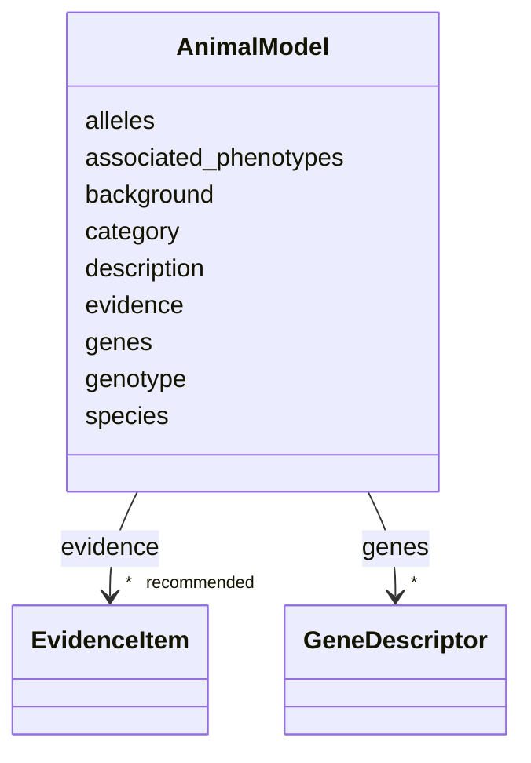

# Class: AnimalModel 


URI: [dismech:class/AnimalModel](https://w3id.org/monarch-initiative/dismech/class/AnimalModel)





<!-- no inheritance hierarchy -->


## Slots

| Name | Cardinality and Range | Description | Inheritance |
| ---  | --- | --- | --- |
| [species](../slots/species.md) | 0..1 <br/> [String](../types/String.md) |  | direct |
| [genotype](../slots/genotype.md) | 0..1 <br/> [String](../types/String.md) |  | direct |
| [background](../slots/background.md) | 0..1 <br/> [String](../types/String.md) |  | direct |
| [genes](../slots/genes.md) | * <br/> [GeneDescriptor](../classes/GeneDescriptor.md) |  | direct |
| [category](../slots/category.md) | 0..1 <br/> [String](../types/String.md) |  | direct |
| [alleles](../slots/alleles.md) | * <br/> [String](../types/String.md) |  | direct |
| [description](../slots/description.md) | 0..1 <br/> [String](../types/String.md) |  | direct |
| [associated_phenotypes](../slots/associated_phenotypes.md) | * <br/> [String](../types/String.md) |  | direct |
| [evidence](../slots/evidence.md) | * _recommended_ <br/> [EvidenceItem](../classes/EvidenceItem.md) |  | direct |


## Usages

| used by | used in | type | used |
| ---  | --- | --- | --- |
| [Disease](../classes/Disease.md) | [animal_models](../slots/animal_models.md) | range | [AnimalModel](../classes/AnimalModel.md) |


## Identifier and Mapping Information


### Schema Source


* from schema: https://w3id.org/monarch-initiative/dismech


## Mappings

| Mapping Type | Mapped Value |
| ---  | ---  |
| self | dismech:AnimalModel |
| native | dismech:AnimalModel |


## LinkML Source

<!-- TODO: investigate https://stackoverflow.com/questions/37606292/how-to-create-tabbed-code-blocks-in-mkdocs-or-sphinx -->

### Direct

<details>
```yaml
name: AnimalModel
from_schema: https://w3id.org/monarch-initiative/dismech
slots:
- species
- genotype
- background
- genes
- category
- alleles
- description
- associated_phenotypes
- evidence

```
</details>

### Induced

<details>
```yaml
name: AnimalModel
from_schema: https://w3id.org/monarch-initiative/dismech
attributes:
  species:
    name: species
    examples:
    - value: Human
    from_schema: https://w3id.org/monarch-initiative/dismech
    rank: 1000
    alias: species
    owner: AnimalModel
    domain_of:
    - AnimalModel
    range: string
  genotype:
    name: genotype
    examples:
    - value: HLA-DQ2
    from_schema: https://w3id.org/monarch-initiative/dismech
    rank: 1000
    alias: genotype
    owner: AnimalModel
    domain_of:
    - AnimalModel
    range: string
  background:
    name: background
    from_schema: https://w3id.org/monarch-initiative/dismech
    rank: 1000
    alias: background
    owner: AnimalModel
    domain_of:
    - AnimalModel
    range: string
  genes:
    name: genes
    examples:
    - value: '[{preferred_term: HLA-DQ2}, {preferred_term: INS}]'
    from_schema: https://w3id.org/monarch-initiative/dismech
    rank: 1000
    alias: genes
    owner: AnimalModel
    domain_of:
    - GeneticContext
    - Dataset
    - Subtype
    - Pathophysiology
    - AnimalModel
    range: GeneDescriptor
    multivalued: true
    inlined: true
    inlined_as_list: true
  category:
    name: category
    examples:
    - value: Hematologic
    from_schema: https://w3id.org/monarch-initiative/dismech
    rank: 1000
    alias: category
    owner: AnimalModel
    domain_of:
    - Phenotype
    - Disease
    - AnimalModel
    range: string
  alleles:
    name: alleles
    from_schema: https://w3id.org/monarch-initiative/dismech
    rank: 1000
    alias: alleles
    owner: AnimalModel
    domain_of:
    - AnimalModel
    range: string
    multivalued: true
  description:
    name: description
    from_schema: https://w3id.org/monarch-initiative/dismech
    rank: 1000
    alias: description
    owner: AnimalModel
    domain_of:
    - Descriptor
    - GeneticContext
    - Dataset
    - ClinicalTrial
    - ComputationalModel
    - ModelVariable
    - DifferentialDiagnosis
    - Subtype
    - CausalEdge
    - TreatmentMechanismTarget
    - ProteinStructure
    - EpidemiologyInfo
    - Pathophysiology
    - Phenotype
    - HistopathologyFinding
    - Environmental
    - Disease
    - Stage
    - AgentLifeCycle
    - AgentLifeCycleStage
    - AnimalModel
    - Treatment
    - InfectiousAgent
    - Transmission
    - Assay
    - Diagnosis
    - Inheritance
    - Variant
    - FunctionalEffect
    - Mechanism
    - ModelingConsideration
    - Definition
    - CriteriaSet
    - ConditionDescriptor
    - GOEnrichment
    - ComorbidityHypothesis
    - UpstreamConditionHypothesis
    - MechanisticHypothesis
    range: string
  associated_phenotypes:
    name: associated_phenotypes
    examples:
    - value: '[''Celiac Disease'', ''Type 1 Diabetes'', ''Autoimmune Thyroid Disease'']'
    from_schema: https://w3id.org/monarch-initiative/dismech
    rank: 1000
    alias: associated_phenotypes
    owner: AnimalModel
    domain_of:
    - AnimalModel
    range: string
    multivalued: true
  evidence:
    name: evidence
    from_schema: https://w3id.org/monarch-initiative/dismech
    rank: 1000
    alias: evidence
    owner: AnimalModel
    domain_of:
    - PhenotypeContext
    - Dataset
    - ClinicalTrial
    - ComputationalModel
    - DifferentialDiagnosis
    - Subtype
    - CausalEdge
    - TreatmentMechanismTarget
    - Finding
    - Prevalence
    - ProgressionInfo
    - EpidemiologyInfo
    - Pathophysiology
    - Phenotype
    - Biochemical
    - HistopathologyFinding
    - Genetic
    - Environmental
    - Stage
    - AgentLifeCycle
    - AgentLifeCycleStage
    - AnimalModel
    - Treatment
    - InfectiousAgent
    - Transmission
    - Diagnosis
    - Inheritance
    - Variant
    - ModelingConsideration
    - ClassificationAssignment
    - Definition
    - CriteriaSet
    - AssociationSignal
    - AssociationStatistics
    - ComorbidityHypothesis
    - UpstreamConditionHypothesis
    - MechanisticHypothesis
    range: EvidenceItem
    recommended: true
    multivalued: true
    inlined: true
    inlined_as_list: true

```
</details>