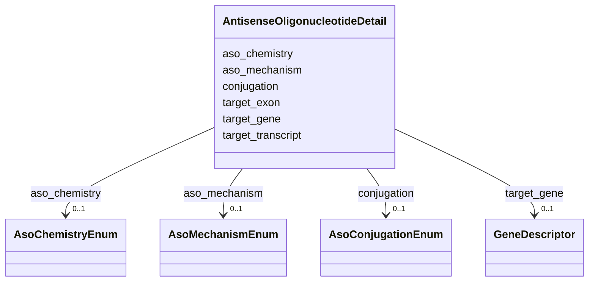

# Class: AntisenseOligonucleotideDetail 


_Structured attributes specific to an antisense oligonucleotide (ASO) treatment: its molecular mechanism, RNA target, splice exon (for splice-switching ASOs), backbone chemistry, and targeting conjugate. Attach via the aso_details slot on a Treatment whose therapeutic_modality is ANTISENSE_OLIGONUCLEOTIDE._


URI: [dismech:class/AntisenseOligonucleotideDetail](https://w3id.org/monarch-initiative/dismech/class/AntisenseOligonucleotideDetail)





<!-- no inheritance hierarchy -->

## Slots

| Name | Cardinality and Range | Description | Inheritance |
| ---  | --- | --- | --- |
| [aso_mechanism](../slots/aso_mechanism.md) | 0..1 <br/> [AsoMechanismEnum](../enums/AsoMechanismEnum.md) | Molecular mechanism of action of an antisense oligonucleotide | direct |
| [target_gene](../slots/target_gene.md) | 0..1 <br/> [GeneDescriptor](../classes/GeneDescriptor.md) | The gene whose transcript an antisense oligonucleotide targets (bindable to H... | direct |
| [target_transcript](../slots/target_transcript.md) | 0..1 <br/> [String](../types/String.md) | The specific transcript, pre-mRNA element, or sequence motif targeted by an a... | direct |
| [target_exon](../slots/target_exon.md) | 0..1 <br/> [String](../types/String.md) | The exon (or exons) modulated by a splice-switching antisense oligonucleotide... | direct |
| [aso_chemistry](../slots/aso_chemistry.md) | 0..1 <br/> [AsoChemistryEnum](../enums/AsoChemistryEnum.md) | Backbone / sugar chemistry of an antisense oligonucleotide | direct |
| [conjugation](../slots/conjugation.md) | 0..1 <br/> [AsoConjugationEnum](../enums/AsoConjugationEnum.md) | Targeting ligand or conjugate attached to an antisense oligonucleotide | direct |


## Usages

| used by | used in | type | used |
| ---  | --- | --- | --- |
| [Treatment](../classes/Treatment.md) | [aso_details](../slots/aso_details.md) | range | [AntisenseOligonucleotideDetail](../classes/AntisenseOligonucleotideDetail.md) |


## Identifier and Mapping Information


### Schema Source


* from schema: https://w3id.org/monarch-initiative/dismech


## Mappings

| Mapping Type | Mapped Value |
| ---  | ---  |
| self | dismech:AntisenseOligonucleotideDetail |
| native | dismech:AntisenseOligonucleotideDetail |


## LinkML Source

<!-- TODO: investigate https://stackoverflow.com/questions/37606292/how-to-create-tabbed-code-blocks-in-mkdocs-or-sphinx -->

### Direct

<details>
```yaml
name: AntisenseOligonucleotideDetail
description: 'Structured attributes specific to an antisense oligonucleotide (ASO)
  treatment: its molecular mechanism, RNA target, splice exon (for splice-switching
  ASOs), backbone chemistry, and targeting conjugate. Attach via the aso_details slot
  on a Treatment whose therapeutic_modality is ANTISENSE_OLIGONUCLEOTIDE.'
from_schema: https://w3id.org/monarch-initiative/dismech
slots:
- aso_mechanism
- target_gene
- target_transcript
- target_exon
- aso_chemistry
- conjugation

```
</details>

### Induced

<details>
```yaml
name: AntisenseOligonucleotideDetail
description: 'Structured attributes specific to an antisense oligonucleotide (ASO)
  treatment: its molecular mechanism, RNA target, splice exon (for splice-switching
  ASOs), backbone chemistry, and targeting conjugate. Attach via the aso_details slot
  on a Treatment whose therapeutic_modality is ANTISENSE_OLIGONUCLEOTIDE.'
from_schema: https://w3id.org/monarch-initiative/dismech
attributes:
  aso_mechanism:
    name: aso_mechanism
    description: Molecular mechanism of action of an antisense oligonucleotide
    from_schema: https://w3id.org/monarch-initiative/dismech
    rank: 1000
    alias: aso_mechanism
    owner: AntisenseOligonucleotideDetail
    domain_of:
    - AntisenseOligonucleotideDetail
    range: AsoMechanismEnum
  target_gene:
    name: target_gene
    description: The gene whose transcript an antisense oligonucleotide targets (bindable
      to HGNC).
    from_schema: https://w3id.org/monarch-initiative/dismech
    rank: 1000
    alias: target_gene
    owner: AntisenseOligonucleotideDetail
    domain_of:
    - AntisenseOligonucleotideDetail
    range: GeneDescriptor
    inlined: true
  target_transcript:
    name: target_transcript
    description: The specific transcript, pre-mRNA element, or sequence motif targeted
      by an antisense oligonucleotide (e.g., a RefSeq/Ensembl transcript ID, "SMN2
      ISS-N1", or "APOB mRNA").
    from_schema: https://w3id.org/monarch-initiative/dismech
    rank: 1000
    alias: target_transcript
    owner: AntisenseOligonucleotideDetail
    domain_of:
    - AntisenseOligonucleotideDetail
    range: string
  target_exon:
    name: target_exon
    description: The exon (or exons) modulated by a splice-switching antisense oligonucleotide,
      expressed in human-readable form (e.g., "exon 51", "exon 7").
    from_schema: https://w3id.org/monarch-initiative/dismech
    rank: 1000
    alias: target_exon
    owner: AntisenseOligonucleotideDetail
    domain_of:
    - AntisenseOligonucleotideDetail
    range: string
  aso_chemistry:
    name: aso_chemistry
    description: Backbone / sugar chemistry of an antisense oligonucleotide
    from_schema: https://w3id.org/monarch-initiative/dismech
    rank: 1000
    alias: aso_chemistry
    owner: AntisenseOligonucleotideDetail
    domain_of:
    - AntisenseOligonucleotideDetail
    range: AsoChemistryEnum
  conjugation:
    name: conjugation
    description: Targeting ligand or conjugate attached to an antisense oligonucleotide
    from_schema: https://w3id.org/monarch-initiative/dismech
    rank: 1000
    alias: conjugation
    owner: AntisenseOligonucleotideDetail
    domain_of:
    - AntisenseOligonucleotideDetail
    range: AsoConjugationEnum

```
</details>