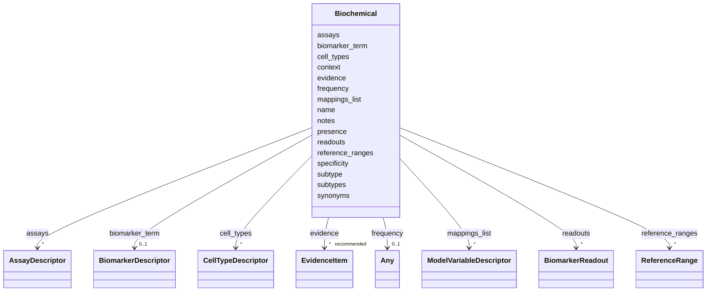

# Class: Biochemical 


URI: [dismech:class/Biochemical](https://w3id.org/monarch-initiative/dismech/class/Biochemical)





<!-- no inheritance hierarchy -->

## Slots

| Name | Cardinality and Range | Description | Inheritance |
| ---  | --- | --- | --- |
| [name](../slots/name.md) | 1 <br/> [String](../types/String.md) |  | direct |
| [biomarker_term](../slots/biomarker_term.md) | 0..1 <br/> [BiomarkerDescriptor](../classes/BiomarkerDescriptor.md) | Ontology term for a biomarker (from NCIT) | direct |
| [presence](../slots/presence.md) | 0..1 <br/> [String](../types/String.md) |  | direct |
| [readouts](../slots/readouts.md) | * <br/> [BiomarkerReadout](../classes/BiomarkerReadout.md) | Links this biomarker to disease pathograph nodes that it measures, reflects, ... | direct |
| [reference_ranges](../slots/reference_ranges.md) | * <br/> [ReferenceRange](../classes/ReferenceRange.md) | Clinical laboratory reference intervals for this biomarker, keyed by LOINC co... | direct |
| [evidence](../slots/evidence.md) | * _recommended_ <br/> [EvidenceItem](../classes/EvidenceItem.md) |  | direct |
| [specificity](../slots/specificity.md) | 0..1 <br/> [String](../types/String.md) |  | direct |
| [frequency](../slots/frequency.md) | 0..1 <br/> [Any](../classes/Any.md)&nbsp;or&nbsp;<br />[FrequencyEnum](../enums/FrequencyEnum.md)&nbsp;or&nbsp;<br />[FrequencyQuantity](../types/FrequencyQuantity.md) |  | direct |
| [notes](../slots/notes.md) | 0..1 <br/> [String](../types/String.md) |  | direct |
| [context](../slots/context.md) | 0..1 <br/> [String](../types/String.md) |  | direct |
| [subtype](../slots/subtype.md) | 0..1 <br/> [String](../types/String.md) |  | direct |
| [subtypes](../slots/subtypes.md) | * <br/> [String](../types/String.md) | Names of subtypes (foreign keys to this disease's `has_subtypes[] | direct |
| [cell_types](../slots/cell_types.md) | * <br/> [CellTypeDescriptor](../classes/CellTypeDescriptor.md) |  | direct |
| [assays](../slots/assays.md) | * <br/> [AssayDescriptor](../classes/AssayDescriptor.md) |  | direct |
| [mappings_list](../slots/mappings_list.md) | * <br/> [ModelVariableDescriptor](../classes/ModelVariableDescriptor.md) | Ontology term mappings for a model variable (LOINC, CHEBI, HP, etc | direct |
| [synonyms](../slots/synonyms.md) | * <br/> [String](../types/String.md) |  | direct |


## Usages

| used by | used in | type | used |
| ---  | --- | --- | --- |
| [Disease](../classes/Disease.md) | [biochemical](../slots/biochemical.md) | range | [Biochemical](../classes/Biochemical.md) |


## Identifier and Mapping Information


### Schema Source


* from schema: https://w3id.org/monarch-initiative/dismech


## Mappings

| Mapping Type | Mapped Value |
| ---  | ---  |
| self | dismech:Biochemical |
| native | dismech:Biochemical |


## LinkML Source

<!-- TODO: investigate https://stackoverflow.com/questions/37606292/how-to-create-tabbed-code-blocks-in-mkdocs-or-sphinx -->

### Direct

<details>
```yaml
name: Biochemical
from_schema: https://w3id.org/monarch-initiative/dismech
slots:
- name
- biomarker_term
- presence
- readouts
- reference_ranges
- evidence
- specificity
- frequency
- notes
- context
- subtype
- subtypes
- cell_types
- assays
- mappings_list
- synonyms

```
</details>

### Induced

<details>
```yaml
name: Biochemical
from_schema: https://w3id.org/monarch-initiative/dismech
attributes:
  name:
    name: name
    examples:
    - value: Adolescent Nephronophthisis
    from_schema: https://w3id.org/monarch-initiative/dismech
    rank: 1000
    identifier: true
    alias: name
    owner: Biochemical
    domain_of:
    - ExperimentalModel
    - Experiment
    - ExperimentalPerturbation
    - ExperimentalReadout
    - ExperimentalControl
    - ClinicalTrial
    - ComputationalModel
    - ModelVariable
    - SeverityTier
    - DifferentialDiagnosis
    - Subtype
    - ReferenceRangeBand
    - SurrogateEndpointCollection
    - ExternalAssertion
    - EpidemiologyInfo
    - Pathophysiology
    - Phenotype
    - Biochemical
    - HistopathologyFinding
    - Genetic
    - Environmental
    - Disease
    - Stage
    - AgentLifeCycleStage
    - Treatment
    - InfectiousAgent
    - Transmission
    - Assay
    - Diagnosis
    - Inheritance
    - Variant
    - Mechanism
    - ModelingConsideration
    - Definition
    - CriteriaSet
    - ComorbidityAssociation
    - Grouping
    range: string
    required: true
  biomarker_term:
    name: biomarker_term
    description: Ontology term for a biomarker (from NCIT)
    comments:
    - Use NCIT terms for biomarkers (proteins, genes, fusion products)
    - NCIT:C16342 (Biomarker) is the root class for validation
    from_schema: https://w3id.org/monarch-initiative/dismech
    rank: 1000
    alias: biomarker_term
    owner: Biochemical
    domain_of:
    - ExperimentalReadout
    - Biochemical
    range: BiomarkerDescriptor
    inlined: true
  presence:
    name: presence
    examples:
    - value: Positive
    from_schema: https://w3id.org/monarch-initiative/dismech
    rank: 1000
    alias: presence
    owner: Biochemical
    domain_of:
    - Biochemical
    - Genetic
    - Environmental
    - Diagnosis
    range: string
  readouts:
    name: readouts
    description: Links this biomarker to disease pathograph nodes that it measures,
      reflects, predicts, or pharmacodynamically reports on. The target should be
      a named pathograph node, typically a pathophysiology mechanism.
    comments:
    - Target names should match pathophysiology or phenotype entry names in the same
      disease file
    - Readout links are observational/associative, not causal disease-progression
      edges
    - Use evidence on the readout link when the biomarker-to-mechanism mapping is
      distinct from the biomarker's own evidence
    from_schema: https://w3id.org/monarch-initiative/dismech
    rank: 1000
    alias: readouts
    owner: Biochemical
    domain_of:
    - Experiment
    - Biochemical
    range: BiomarkerReadout
    multivalued: true
    inlined: true
    inlined_as_list: true
  reference_ranges:
    name: reference_ranges
    description: Clinical laboratory reference intervals for this biomarker, keyed
      by LOINC code with population qualifier and UCUM units.
    from_schema: https://w3id.org/monarch-initiative/dismech
    rank: 1000
    alias: reference_ranges
    owner: Biochemical
    domain_of:
    - Biochemical
    range: ReferenceRange
    multivalued: true
    inlined: true
    inlined_as_list: true
  evidence:
    name: evidence
    from_schema: https://w3id.org/monarch-initiative/dismech
    rank: 1000
    alias: evidence
    owner: Biochemical
    domain_of:
    - PhenotypeContext
    - Dataset
    - ExperimentalModel
    - Experiment
    - ExperimentalPerturbation
    - ExperimentalReadout
    - ExperimentalControl
    - ClinicalTrial
    - ComputationalModel
    - DifferentialDiagnosis
    - Subtype
    - CausalEdge
    - TreatmentMechanismTarget
    - ModelMechanismLink
    - BiomarkerReadout
    - ReferenceRange
    - SurrogateEndpoint
    - ExternalAssertion
    - Finding
    - Prevalence
    - ProgressionInfo
    - EpidemiologyInfo
    - Pathophysiology
    - Phenotype
    - Biochemical
    - HistopathologyFinding
    - Genetic
    - Environmental
    - Stage
    - AgentLifeCycle
    - AgentLifeCycleStage
    - AnimalModel
    - Treatment
    - InfectiousAgent
    - Transmission
    - Diagnosis
    - Inheritance
    - Variant
    - ModelingConsideration
    - ClassificationAssignment
    - Definition
    - CriteriaSet
    - AssociationSignal
    - AssociationStatistics
    - ComorbidityHypothesis
    - UpstreamConditionHypothesis
    - MechanisticHypothesis
    - Discussion
    - GroupingCriteria
    - GroupingMember
    - DifferentiatingMechanism
    range: EvidenceItem
    recommended: true
    multivalued: true
    inlined: true
    inlined_as_list: true
  specificity:
    name: specificity
    examples:
    - value: High
    from_schema: https://w3id.org/monarch-initiative/dismech
    rank: 1000
    alias: specificity
    owner: Biochemical
    domain_of:
    - Biochemical
    range: string
  frequency:
    name: frequency
    examples:
    - value: Occasional
    from_schema: https://w3id.org/monarch-initiative/dismech
    rank: 1000
    alias: frequency
    owner: Biochemical
    domain_of:
    - PhenotypeContext
    - Pathophysiology
    - Phenotype
    - Biochemical
    - HistopathologyFinding
    - Genetic
    range: Any
    any_of:
    - range: FrequencyEnum
    - range: FrequencyQuantity
  notes:
    name: notes
    examples:
    - value: Contagious stage where symptoms appear and the bacteria can be spread
        to others.
    from_schema: https://w3id.org/monarch-initiative/dismech
    rank: 1000
    alias: notes
    owner: Biochemical
    domain_of:
    - GeneticContext
    - OnsetDescriptor
    - PhenotypeContext
    - Dataset
    - ExperimentalModel
    - Experiment
    - ExperimentalPerturbation
    - ExperimentalReadout
    - ExperimentalControl
    - ClinicalTrial
    - ComputationalModel
    - ModelVariable
    - DifferentialDiagnosis
    - ReferenceRange
    - SurrogateEndpoint
    - SurrogateEndpointCollection
    - ExternalAssertion
    - TrackedIssue
    - Prevalence
    - ProgressionInfo
    - EpidemiologyInfo
    - Pathophysiology
    - Phenotype
    - Biochemical
    - HistopathologyFinding
    - Genetic
    - Environmental
    - Disease
    - Stage
    - AgentLifeCycle
    - AgentLifeCycleStage
    - Treatment
    - Transmission
    - Diagnosis
    - ClassificationAssignment
    - Definition
    - CriteriaSet
    - TermMapping
    - MappingConsistency
    - ComorbidityAssociation
    - AssociationSignal
    - AssociationMetric
    - AssociationStatistics
    - MechanisticHypothesis
    - Discussion
    - Grouping
    - GroupingCriteria
    - GroupingMember
    - DifferentiatingMechanism
    range: string
  context:
    name: context
    examples:
    - value: Pregnancy
    from_schema: https://w3id.org/monarch-initiative/dismech
    rank: 1000
    alias: context
    owner: Biochemical
    domain_of:
    - Phenotype
    - Biochemical
    - HistopathologyFinding
    - Stage
    - AgentLifeCycle
    - AgentLifeCycleStage
    - Treatment
    range: string
  subtype:
    name: subtype
    examples:
    - value: Eyelid Myoclonia with Absences
    from_schema: https://w3id.org/monarch-initiative/dismech
    rank: 1000
    alias: subtype
    owner: Biochemical
    domain_of:
    - PhenotypeContext
    - Prevalence
    - ProgressionInfo
    - Phenotype
    - Biochemical
    - HistopathologyFinding
    - Genetic
    range: string
  subtypes:
    name: subtypes
    description: Names of subtypes (foreign keys to this disease's `has_subtypes[].name`)
      associated with a phenotype, biochemical finding, pathophysiology node, or other
      subtyped entry. Use this multivalued form when an item is characteristic of
      more than one subtype with overlapping features. For single-subtype associations,
      the scalar `subtype` slot may still be used.
    examples:
    - value: '[''DENV-1'', ''DENV-2'', ''DENV-3'', ''DENV-4'']'
    - value: '[''Type 1'', ''Type 2'']'
    from_schema: https://w3id.org/monarch-initiative/dismech
    rank: 1000
    alias: subtypes
    owner: Biochemical
    domain_of:
    - Pathophysiology
    - Phenotype
    - Biochemical
    range: string
    multivalued: true
  cell_types:
    name: cell_types
    examples:
    - value: '[{preferred_term: Macrophage}, {preferred_term: T Cell}]'
    from_schema: https://w3id.org/monarch-initiative/dismech
    rank: 1000
    alias: cell_types
    owner: Biochemical
    domain_of:
    - ExperimentalModel
    - Pathophysiology
    - Biochemical
    range: CellTypeDescriptor
    multivalued: true
    inlined: true
    inlined_as_list: true
  assays:
    name: assays
    examples:
    - value: '[{preferred_term: Elevated Blood Glucose}]'
    from_schema: https://w3id.org/monarch-initiative/dismech
    rank: 1000
    alias: assays
    owner: Biochemical
    domain_of:
    - Experiment
    - ExperimentalReadout
    - Pathophysiology
    - Biochemical
    range: AssayDescriptor
    multivalued: true
    inlined: true
    inlined_as_list: true
  mappings_list:
    name: mappings_list
    description: Ontology term mappings for a model variable (LOINC, CHEBI, HP, etc.)
    from_schema: https://w3id.org/monarch-initiative/dismech
    rank: 1000
    alias: mappings_list
    owner: Biochemical
    domain_of:
    - ModelVariable
    - Biochemical
    range: ModelVariableDescriptor
    multivalued: true
    inlined: true
    inlined_as_list: true
  synonyms:
    name: synonyms
    examples:
    - value: '[''CYFRA 21-1'']'
    from_schema: https://w3id.org/monarch-initiative/dismech
    rank: 1000
    alias: synonyms
    owner: Biochemical
    domain_of:
    - Pathophysiology
    - Biochemical
    - Environmental
    - Disease
    - Variant
    range: string
    multivalued: true

```
</details>