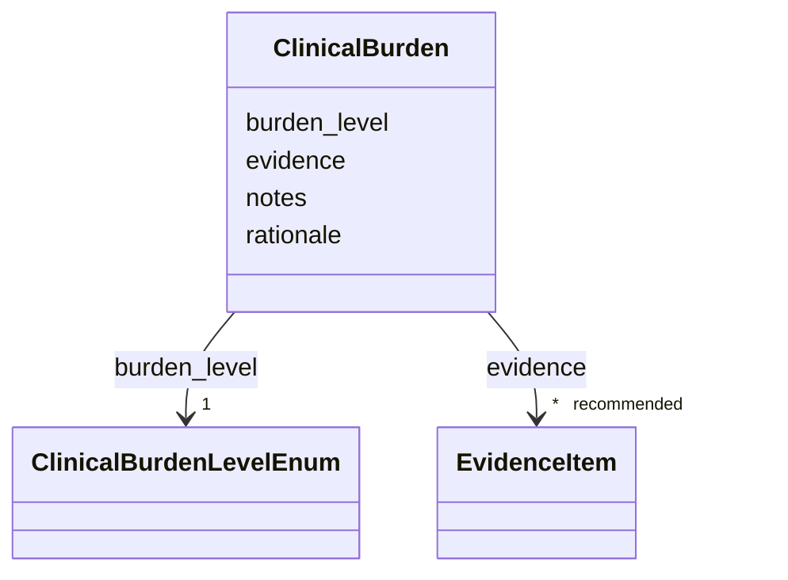

# Class: ClinicalBurden 


_Disease-level assessment of the typical clinical burden imposed by a disease. This captures the overall burden of the disease concept and is distinct from severity annotations on individual phenotypes._


URI: [dismech:class/ClinicalBurden](https://w3id.org/monarch-initiative/dismech/class/ClinicalBurden)





<!-- no inheritance hierarchy -->

## Slots

| Name | Cardinality and Range | Description | Inheritance |
| ---  | --- | --- | --- |
| [burden_level](../slots/burden_level.md) | 1 <br/> [ClinicalBurdenLevelEnum](../enums/ClinicalBurdenLevelEnum.md) | Coarse disease-level clinical burden category | direct |
| [rationale](../slots/rationale.md) | 0..1 _recommended_ <br/> [String](../types/String.md) | Curator rationale for assigning this burden level, including what aspects of ... | direct |
| [evidence](../slots/evidence.md) | * _recommended_ <br/> [EvidenceItem](../classes/EvidenceItem.md) | Evidence supporting the disease-level clinical burden assessment | direct |
| [notes](../slots/notes.md) | 0..1 <br/> [String](../types/String.md) |  | direct |


## Usages

| used by | used in | type | used |
| ---  | --- | --- | --- |
| [Disease](../classes/Disease.md) | [clinical_burden](../slots/clinical_burden.md) | range | [ClinicalBurden](../classes/ClinicalBurden.md) |


## Identifier and Mapping Information


### Schema Source


* from schema: https://w3id.org/monarch-initiative/dismech


## Mappings

| Mapping Type | Mapped Value |
| ---  | ---  |
| self | dismech:ClinicalBurden |
| native | dismech:ClinicalBurden |


## LinkML Source

<!-- TODO: investigate https://stackoverflow.com/questions/37606292/how-to-create-tabbed-code-blocks-in-mkdocs-or-sphinx -->

### Direct

<details>
```yaml
name: ClinicalBurden
description: Disease-level assessment of the typical clinical burden imposed by a
  disease. This captures the overall burden of the disease concept and is distinct
  from severity annotations on individual phenotypes.
from_schema: https://w3id.org/monarch-initiative/dismech
slots:
- burden_level
- rationale
- evidence
- notes
slot_usage:
  burden_level:
    name: burden_level
    required: true
  rationale:
    name: rationale
    description: Curator rationale for assigning this burden level, including what
      aspects of functional impact, morbidity, duration, management burden, or long-term
      consequence drive the assessment.
    recommended: true
  evidence:
    name: evidence
    description: Evidence supporting the disease-level clinical burden assessment.
      Prefer sources that describe typical course, functional impact, morbidity, mortality,
      or management burden.
    recommended: true

```
</details>

### Induced

<details>
```yaml
name: ClinicalBurden
description: Disease-level assessment of the typical clinical burden imposed by a
  disease. This captures the overall burden of the disease concept and is distinct
  from severity annotations on individual phenotypes.
from_schema: https://w3id.org/monarch-initiative/dismech
slot_usage:
  burden_level:
    name: burden_level
    required: true
  rationale:
    name: rationale
    description: Curator rationale for assigning this burden level, including what
      aspects of functional impact, morbidity, duration, management burden, or long-term
      consequence drive the assessment.
    recommended: true
  evidence:
    name: evidence
    description: Evidence supporting the disease-level clinical burden assessment.
      Prefer sources that describe typical course, functional impact, morbidity, mortality,
      or management burden.
    recommended: true
attributes:
  burden_level:
    name: burden_level
    description: Coarse disease-level clinical burden category
    from_schema: https://w3id.org/monarch-initiative/dismech
    rank: 1000
    alias: burden_level
    owner: ClinicalBurden
    domain_of:
    - ClinicalBurden
    range: ClinicalBurdenLevelEnum
    required: true
  rationale:
    name: rationale
    description: Curator rationale for assigning this burden level, including what
      aspects of functional impact, morbidity, duration, management burden, or long-term
      consequence drive the assessment.
    from_schema: https://w3id.org/monarch-initiative/dismech
    rank: 1000
    alias: rationale
    owner: ClinicalBurden
    domain_of:
    - ClinicalBurden
    - AlgorithmValidationStatus
    - Discussion
    range: string
    recommended: true
  evidence:
    name: evidence
    description: Evidence supporting the disease-level clinical burden assessment.
      Prefer sources that describe typical course, functional impact, morbidity, mortality,
      or management burden.
    from_schema: https://w3id.org/monarch-initiative/dismech
    rank: 1000
    alias: evidence
    owner: ClinicalBurden
    domain_of:
    - PhenotypeContext
    - Dataset
    - ExperimentalModel
    - Experiment
    - ExperimentalPerturbation
    - ExperimentalReadout
    - ExperimentalControl
    - ClinicalTrial
    - ComputationalModel
    - DifferentialDiagnosis
    - Subtype
    - CausalEdge
    - TreatmentMechanismTarget
    - ModelMechanismLink
    - BiomarkerReadout
    - PhenotypeReadout
    - ReferenceRange
    - SurrogateEndpoint
    - ExternalAssertion
    - Finding
    - Prevalence
    - GeneCaseFraction
    - ProgressionInfo
    - ClinicalBurden
    - EpidemiologyInfo
    - Pathophysiology
    - Phenotype
    - Biochemical
    - HistopathologyFinding
    - ImagingFinding
    - Genetic
    - Environmental
    - Stage
    - AgentLifeCycle
    - AgentLifeCycleStage
    - AnimalModel
    - Treatment
    - InfectiousAgent
    - Transmission
    - Diagnosis
    - Inheritance
    - Variant
    - ModelingConsideration
    - ClassificationAssignment
    - Definition
    - AlgorithmValidationStatus
    - CriteriaSet
    - AssociationSignal
    - AssociationStatistics
    - ComorbidityHypothesis
    - UpstreamConditionHypothesis
    - MechanisticHypothesis
    - Discussion
    - GroupingCriteria
    - GroupingMember
    - DifferentiatingMechanism
    range: EvidenceItem
    recommended: true
    multivalued: true
    inlined: true
    inlined_as_list: true
  notes:
    name: notes
    examples:
    - value: Contagious stage where symptoms appear and the bacteria can be spread
        to others.
    from_schema: https://w3id.org/monarch-initiative/dismech
    rank: 1000
    alias: notes
    owner: ClinicalBurden
    domain_of:
    - GeneticContext
    - OnsetDescriptor
    - PhenotypeContext
    - Dataset
    - ExperimentalModel
    - Experiment
    - ExperimentalPerturbation
    - ExperimentalReadout
    - ExperimentalControl
    - ClinicalTrial
    - ComputationalModel
    - ModelVariable
    - DifferentialDiagnosis
    - ReferenceRange
    - SurrogateEndpoint
    - SurrogateEndpointCollection
    - ExternalAssertion
    - TrackedIssue
    - Prevalence
    - GeneCaseFraction
    - ProgressionInfo
    - ClinicalBurden
    - EpidemiologyInfo
    - Pathophysiology
    - Phenotype
    - Biochemical
    - HistopathologyFinding
    - ImagingFinding
    - Genetic
    - Environmental
    - Disease
    - Stage
    - AgentLifeCycle
    - AgentLifeCycleStage
    - Treatment
    - Transmission
    - Diagnosis
    - ClassificationAssignment
    - Definition
    - CriteriaSet
    - TermMapping
    - MappingConsistency
    - ComorbidityAssociation
    - AssociationSignal
    - AssociationMetric
    - AssociationStatistics
    - MechanisticHypothesis
    - Discussion
    - Grouping
    - GroupingCriteria
    - GroupingMember
    - DifferentiatingMechanism
    range: string

```
</details>