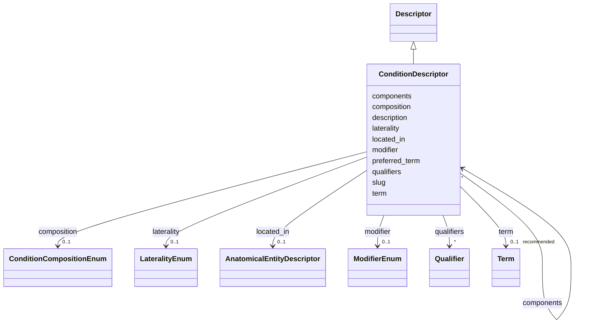

# Class: ConditionDescriptor 


_A descriptor for a condition or disease, optionally bound to MONDO. External coding identifiers (ICD-10, OMOP, SNOMED, etc.) are captured on association signals._


URI: [dismech:class/ConditionDescriptor](https://w3id.org/monarch-initiative/dismech/class/ConditionDescriptor)





## Inheritance
* [Descriptor](../classes/Descriptor.md)
    * **ConditionDescriptor**


## Slots

| Name | Cardinality and Range | Description | Inheritance |
| ---  | --- | --- | --- |
| [slug](../slots/slug.md) | 0..1 <br/> [String](../types/String.md) | Use for leaf conditions; omit when using composition/components | direct |
| [preferred_term](../slots/preferred_term.md) | 0..1 <br/> [String](../types/String.md) | The preferred human-readable term for this descriptor | direct |
| [description](../slots/description.md) | 0..1 <br/> [String](../types/String.md) | A description of the descriptor | direct |
| [term](../slots/term.md) | 0..1 _recommended_ <br/> [Term](../classes/Term.md) | Optional MONDO disease term reference | direct |
| [composition](../slots/composition.md) | 0..1 <br/> [ConditionCompositionEnum](../enums/ConditionCompositionEnum.md) | Composition type for a composite condition descriptor | direct |
| [components](../slots/components.md) | * <br/> [ConditionDescriptor](../classes/ConditionDescriptor.md) | Component conditions that make up a composite descriptor | direct |
| [modifier](../slots/modifier.md) | 0..1 <br/> [ModifierEnum](../enums/ModifierEnum.md) | Directional or qualitative modifier for a descriptor (e | [Descriptor](../classes/Descriptor.md) |
| [located_in](../slots/located_in.md) | 0..1 <br/> [AnatomicalEntityDescriptor](../classes/AnatomicalEntityDescriptor.md) | Anatomical location where this entity/process occurs or procedure is performe... | [Descriptor](../classes/Descriptor.md) |
| [laterality](../slots/laterality.md) | 0..1 <br/> [LateralityEnum](../enums/LateralityEnum.md) | Laterality qualifier (left, right, or bilateral) | [Descriptor](../classes/Descriptor.md) |
| [qualifiers](../slots/qualifiers.md) | * <br/> [Qualifier](../classes/Qualifier.md) | List of predicate-value pairs for formal post-composition | [Descriptor](../classes/Descriptor.md) |


## Usages

| used by | used in | type | used |
| ---  | --- | --- | --- |
| [ConditionDescriptor](../classes/ConditionDescriptor.md) | [components](../slots/components.md) | range | [ConditionDescriptor](../classes/ConditionDescriptor.md) |
| [ComorbidityAssociation](../classes/ComorbidityAssociation.md) | [disease_a](../slots/disease_a.md) | range | [ConditionDescriptor](../classes/ConditionDescriptor.md) |
| [ComorbidityAssociation](../classes/ComorbidityAssociation.md) | [disease_b](../slots/disease_b.md) | range | [ConditionDescriptor](../classes/ConditionDescriptor.md) |
| [UpstreamConditionHypothesis](../classes/UpstreamConditionHypothesis.md) | [upstream_disorder](../slots/upstream_disorder.md) | range | [ConditionDescriptor](../classes/ConditionDescriptor.md) |


## Identifier and Mapping Information


### Schema Source


* from schema: https://w3id.org/monarch-initiative/dismech


## Mappings

| Mapping Type | Mapped Value |
| ---  | ---  |
| self | dismech:ConditionDescriptor |
| native | dismech:ConditionDescriptor |


## LinkML Source

<!-- TODO: investigate https://stackoverflow.com/questions/37606292/how-to-create-tabbed-code-blocks-in-mkdocs-or-sphinx -->

### Direct

<details>
```yaml
name: ConditionDescriptor
description: A descriptor for a condition or disease, optionally bound to MONDO. External
  coding identifiers (ICD-10, OMOP, SNOMED, etc.) are captured on association signals.
from_schema: https://w3id.org/monarch-initiative/dismech
is_a: Descriptor
slots:
- slug
- preferred_term
- description
- term
- composition
- components
slot_usage:
  slug:
    name: slug
    description: Use for leaf conditions; omit when using composition/components
    required: false
  term:
    name: term
    description: Optional MONDO disease term reference
    bindings:
    - range: DiseaseTerm
      obligation_level: OPTIONAL
      binds_value_of: id
  preferred_term:
    name: preferred_term
    required: false

```
</details>

### Induced

<details>
```yaml
name: ConditionDescriptor
description: A descriptor for a condition or disease, optionally bound to MONDO. External
  coding identifiers (ICD-10, OMOP, SNOMED, etc.) are captured on association signals.
from_schema: https://w3id.org/monarch-initiative/dismech
is_a: Descriptor
slot_usage:
  slug:
    name: slug
    description: Use for leaf conditions; omit when using composition/components
    required: false
  term:
    name: term
    description: Optional MONDO disease term reference
    bindings:
    - range: DiseaseTerm
      obligation_level: OPTIONAL
      binds_value_of: id
  preferred_term:
    name: preferred_term
    required: false
attributes:
  slug:
    name: slug
    description: Use for leaf conditions; omit when using composition/components
    from_schema: https://w3id.org/monarch-initiative/dismech
    rank: 1000
    alias: slug
    owner: ConditionDescriptor
    domain_of:
    - ConditionDescriptor
    range: string
    required: false
  preferred_term:
    name: preferred_term
    description: The preferred human-readable term for this descriptor. This may be
      more specific or nuanced than the linked ontology term label when the ontology
      does not fully capture the desired granularity. Note that postcomposition using
      the modifier slot may be appropriate for capturing the semantics of the preferred
      term.
    from_schema: https://w3id.org/monarch-initiative/dismech
    rank: 1000
    alias: preferred_term
    owner: ConditionDescriptor
    domain_of:
    - Descriptor
    - ConditionDescriptor
    range: string
    required: false
  description:
    name: description
    description: A description of the descriptor. This may typically be redundant
      with the `term` object, but the description is more human-readable and may be
      used to communicate nuances not captured by the rigid standardization of the
      term object.
    from_schema: https://w3id.org/monarch-initiative/dismech
    rank: 1000
    alias: description
    owner: ConditionDescriptor
    domain_of:
    - Descriptor
    - GeneticContext
    - Dataset
    - ClinicalTrial
    - ComputationalModel
    - ModelVariable
    - DifferentialDiagnosis
    - Subtype
    - CausalEdge
    - TreatmentMechanismTarget
    - ProteinStructure
    - EpidemiologyInfo
    - Pathophysiology
    - Phenotype
    - HistopathologyFinding
    - Environmental
    - Disease
    - Stage
    - AgentLifeCycle
    - AgentLifeCycleStage
    - AnimalModel
    - Treatment
    - InfectiousAgent
    - Transmission
    - Assay
    - Diagnosis
    - Inheritance
    - Variant
    - FunctionalEffect
    - Mechanism
    - ModelingConsideration
    - Definition
    - CriteriaSet
    - ConditionDescriptor
    - GOEnrichment
    - ComorbidityHypothesis
    - UpstreamConditionHypothesis
    - MechanisticHypothesis
    range: string
    recommended: false
  term:
    name: term
    description: Optional MONDO disease term reference
    from_schema: https://w3id.org/monarch-initiative/dismech
    rank: 1000
    alias: term
    owner: ConditionDescriptor
    domain_of:
    - Descriptor
    - TermMapping
    - ConditionDescriptor
    - GOEnrichmentTerm
    range: Term
    bindings:
    - range: DiseaseTerm
      obligation_level: OPTIONAL
      binds_value_of: id
    recommended: true
    inlined: true
  composition:
    name: composition
    description: Composition type for a composite condition descriptor
    from_schema: https://w3id.org/monarch-initiative/dismech
    rank: 1000
    alias: composition
    owner: ConditionDescriptor
    domain_of:
    - ConditionDescriptor
    range: ConditionCompositionEnum
  components:
    name: components
    description: Component conditions that make up a composite descriptor
    from_schema: https://w3id.org/monarch-initiative/dismech
    rank: 1000
    alias: components
    owner: ConditionDescriptor
    domain_of:
    - ConditionDescriptor
    range: ConditionDescriptor
    multivalued: true
    inlined: true
    inlined_as_list: true
  modifier:
    name: modifier
    description: Directional or qualitative modifier for a descriptor (e.g., increased,
      decreased, abnormal)
    from_schema: https://w3id.org/monarch-initiative/dismech
    rank: 1000
    alias: modifier
    owner: ConditionDescriptor
    domain_of:
    - Descriptor
    range: ModifierEnum
  located_in:
    name: located_in
    description: Anatomical location where this entity/process occurs or procedure
      is performed
    from_schema: https://w3id.org/monarch-initiative/dismech
    rank: 1000
    alias: located_in
    owner: ConditionDescriptor
    domain_of:
    - Descriptor
    range: AnatomicalEntityDescriptor
    inlined: true
  laterality:
    name: laterality
    description: Laterality qualifier (left, right, or bilateral)
    from_schema: https://w3id.org/monarch-initiative/dismech
    rank: 1000
    alias: laterality
    owner: ConditionDescriptor
    domain_of:
    - Descriptor
    range: LateralityEnum
  qualifiers:
    name: qualifiers
    description: List of predicate-value pairs for formal post-composition. Allows
      OWL-like expressivity with controlled predicates (e.g., RO relations) and values.
    deprecated: Prefer explicit slots like located_in and laterality instead of generic
      qualifiers
    from_schema: https://w3id.org/monarch-initiative/dismech
    rank: 1000
    alias: qualifiers
    owner: ConditionDescriptor
    domain_of:
    - Descriptor
    range: Qualifier
    multivalued: true
    inlined: true
    inlined_as_list: true

```
</details>