# Class: Descriptor 


_Base class for structured descriptors that allow a preferred term, optional description, optional ontology term binding, and post-composition via modifier, located_in, laterality, spatial_extent, onset, temporality, clinical_course, and severity slots._


* __NOTE__: this is an abstract class and should not be instantiated directly


URI: [dismech:class/Descriptor](https://w3id.org/monarch-initiative/dismech/class/Descriptor)

```mermaid
 classDiagram
    class Descriptor
    click Descriptor href "../../classes/Descriptor/"
      Descriptor <|-- CellTypeDescriptor
        click CellTypeDescriptor href "../../classes/CellTypeDescriptor/"
      Descriptor <|-- BiologicalProcessDescriptor
        click BiologicalProcessDescriptor href "../../classes/BiologicalProcessDescriptor/"
      Descriptor <|-- MolecularFunctionDescriptor
        click MolecularFunctionDescriptor href "../../classes/MolecularFunctionDescriptor/"
      Descriptor <|-- AnatomicalEntityDescriptor
        click AnatomicalEntityDescriptor href "../../classes/AnatomicalEntityDescriptor/"
      Descriptor <|-- ChemicalEntityDescriptor
        click ChemicalEntityDescriptor href "../../classes/ChemicalEntityDescriptor/"
      Descriptor <|-- GeneDescriptor
        click GeneDescriptor href "../../classes/GeneDescriptor/"
      Descriptor <|-- CellularComponentDescriptor
        click CellularComponentDescriptor href "../../classes/CellularComponentDescriptor/"
      Descriptor <|-- ProteinComplexDescriptor
        click ProteinComplexDescriptor href "../../classes/ProteinComplexDescriptor/"
      Descriptor <|-- AssayDescriptor
        click AssayDescriptor href "../../classes/AssayDescriptor/"
      Descriptor <|-- TriggerDescriptor
        click TriggerDescriptor href "../../classes/TriggerDescriptor/"
      Descriptor <|-- DiseaseDescriptor
        click DiseaseDescriptor href "../../classes/DiseaseDescriptor/"
      Descriptor <|-- SubtypeDescriptor
        click SubtypeDescriptor href "../../classes/SubtypeDescriptor/"
      Descriptor <|-- BiomarkerDescriptor
        click BiomarkerDescriptor href "../../classes/BiomarkerDescriptor/"
      Descriptor <|-- GeneProductDescriptor
        click GeneProductDescriptor href "../../classes/GeneProductDescriptor/"
      Descriptor <|-- HistopathologyFindingDescriptor
        click HistopathologyFindingDescriptor href "../../classes/HistopathologyFindingDescriptor/"
      Descriptor <|-- LifeCycleStageDescriptor
        click LifeCycleStageDescriptor href "../../classes/LifeCycleStageDescriptor/"
      Descriptor <|-- PhenotypeDescriptor
        click PhenotypeDescriptor href "../../classes/PhenotypeDescriptor/"
      Descriptor <|-- InheritanceDescriptor
        click InheritanceDescriptor href "../../classes/InheritanceDescriptor/"
      Descriptor <|-- TreatmentDescriptor
        click TreatmentDescriptor href "../../classes/TreatmentDescriptor/"
      Descriptor <|-- RegimenDescriptor
        click RegimenDescriptor href "../../classes/RegimenDescriptor/"
      Descriptor <|-- ExposureDescriptor
        click ExposureDescriptor href "../../classes/ExposureDescriptor/"
      Descriptor <|-- EnvironmentDescriptor
        click EnvironmentDescriptor href "../../classes/EnvironmentDescriptor/"
      Descriptor <|-- FoodDescriptor
        click FoodDescriptor href "../../classes/FoodDescriptor/"
      Descriptor <|-- OrganismDescriptor
        click OrganismDescriptor href "../../classes/OrganismDescriptor/"
      Descriptor <|-- SampleTypeDescriptor
        click SampleTypeDescriptor href "../../classes/SampleTypeDescriptor/"
      Descriptor <|-- ModelVariableDescriptor
        click ModelVariableDescriptor href "../../classes/ModelVariableDescriptor/"
      Descriptor <|-- CriteriaItem
        click CriteriaItem href "../../classes/CriteriaItem/"
      Descriptor <|-- ConditionDescriptor
        click ConditionDescriptor href "../../classes/ConditionDescriptor/"
      
      Descriptor : clinical_course
        
          
    
        
        
        Descriptor --> "0..1" ClinicalCourseEnum : clinical_course
        click ClinicalCourseEnum href "../../enums/ClinicalCourseEnum/"
    

        
      Descriptor : description
        
      Descriptor : laterality
        
          
    
        
        
        Descriptor --> "0..1" LateralityEnum : laterality
        click LateralityEnum href "../../enums/LateralityEnum/"
    

        
      Descriptor : located_in
        
          
    
        
        
        Descriptor --> "0..1" AnatomicalEntityDescriptor : located_in
        click AnatomicalEntityDescriptor href "../../classes/AnatomicalEntityDescriptor/"
    

        
      Descriptor : modifier
        
          
    
        
        
        Descriptor --> "0..1" ModifierEnum : modifier
        click ModifierEnum href "../../enums/ModifierEnum/"
    

        
      Descriptor : onset
        
          
    
        
        
        Descriptor --> "0..1" OnsetDescriptor : onset
        click OnsetDescriptor href "../../classes/OnsetDescriptor/"
    

        
      Descriptor : preferred_term
        
      Descriptor : qualifiers
        
          
    
        
        
        Descriptor --> "*" Qualifier : qualifiers
        click Qualifier href "../../classes/Qualifier/"
    

        
      Descriptor : severity
        
          
    
        
        
        Descriptor --> "0..1" Any : severity
        click Any href "../../classes/Any/"
    

        
      Descriptor : spatial_extent
        
          
    
        
        
        Descriptor --> "0..1" SpatialExtentEnum : spatial_extent
        click SpatialExtentEnum href "../../enums/SpatialExtentEnum/"
    

        
      Descriptor : temporality
        
          
    
        
        
        Descriptor --> "0..1" TemporalityEnum : temporality
        click TemporalityEnum href "../../enums/TemporalityEnum/"
    

        
      Descriptor : term
        
          
    
        
        
        Descriptor --> "0..1 _recommended_" Term : term
        click Term href "../../classes/Term/"
    

        
      
```





## Inheritance
* **Descriptor**
    * [CellTypeDescriptor](../classes/CellTypeDescriptor.md)
    * [BiologicalProcessDescriptor](../classes/BiologicalProcessDescriptor.md)
    * [MolecularFunctionDescriptor](../classes/MolecularFunctionDescriptor.md)
    * [AnatomicalEntityDescriptor](../classes/AnatomicalEntityDescriptor.md)
    * [ChemicalEntityDescriptor](../classes/ChemicalEntityDescriptor.md)
    * [GeneDescriptor](../classes/GeneDescriptor.md)
    * [CellularComponentDescriptor](../classes/CellularComponentDescriptor.md)
    * [ProteinComplexDescriptor](../classes/ProteinComplexDescriptor.md)
    * [AssayDescriptor](../classes/AssayDescriptor.md)
    * [TriggerDescriptor](../classes/TriggerDescriptor.md)
    * [DiseaseDescriptor](../classes/DiseaseDescriptor.md)
    * [SubtypeDescriptor](../classes/SubtypeDescriptor.md)
    * [BiomarkerDescriptor](../classes/BiomarkerDescriptor.md)
    * [GeneProductDescriptor](../classes/GeneProductDescriptor.md)
    * [HistopathologyFindingDescriptor](../classes/HistopathologyFindingDescriptor.md)
    * [LifeCycleStageDescriptor](../classes/LifeCycleStageDescriptor.md)
    * [PhenotypeDescriptor](../classes/PhenotypeDescriptor.md)
    * [InheritanceDescriptor](../classes/InheritanceDescriptor.md)
    * [TreatmentDescriptor](../classes/TreatmentDescriptor.md)
    * [RegimenDescriptor](../classes/RegimenDescriptor.md)
    * [ExposureDescriptor](../classes/ExposureDescriptor.md)
    * [EnvironmentDescriptor](../classes/EnvironmentDescriptor.md)
    * [FoodDescriptor](../classes/FoodDescriptor.md)
    * [OrganismDescriptor](../classes/OrganismDescriptor.md)
    * [SampleTypeDescriptor](../classes/SampleTypeDescriptor.md)
    * [ModelVariableDescriptor](../classes/ModelVariableDescriptor.md)
    * [CriteriaItem](../classes/CriteriaItem.md)
    * [ConditionDescriptor](../classes/ConditionDescriptor.md)


## Slots

| Name | Cardinality and Range | Description | Inheritance |
| ---  | --- | --- | --- |
| [preferred_term](../slots/preferred_term.md) | 1 <br/> [String](../types/String.md) | The preferred human-readable term for this descriptor | direct |
| [description](../slots/description.md) | 0..1 <br/> [String](../types/String.md) | A description of the descriptor | direct |
| [term](../slots/term.md) | 0..1 _recommended_ <br/> [Term](../classes/Term.md) | Optional structured ontology term reference | direct |
| [modifier](../slots/modifier.md) | 0..1 <br/> [ModifierEnum](../enums/ModifierEnum.md) | Directional or qualitative modifier for a descriptor (e | direct |
| [located_in](../slots/located_in.md) | 0..1 <br/> [AnatomicalEntityDescriptor](../classes/AnatomicalEntityDescriptor.md) | Anatomical location where this entity/process occurs or procedure is performe... | direct |
| [laterality](../slots/laterality.md) | 0..1 <br/> [LateralityEnum](../enums/LateralityEnum.md) | Laterality qualifier (left, right, or bilateral) | direct |
| [spatial_extent](../slots/spatial_extent.md) | 0..1 <br/> [SpatialExtentEnum](../enums/SpatialExtentEnum.md) | The spatial extent or distribution pattern applicable to this descriptor (e | direct |
| [onset](../slots/onset.md) | 0..1 <br/> [OnsetDescriptor](../classes/OnsetDescriptor.md) | Structured age of onset descriptor | direct |
| [temporality](../slots/temporality.md) | 0..1 <br/> [TemporalityEnum](../enums/TemporalityEnum.md) | Temporal qualifier for this descriptor (e | direct |
| [clinical_course](../slots/clinical_course.md) | 0..1 <br/> [ClinicalCourseEnum](../enums/ClinicalCourseEnum.md) | Clinical course qualifier for this descriptor (e | direct |
| [severity](../slots/severity.md) | 0..1 <br/> [Any](../classes/Any.md)&nbsp;or&nbsp;<br />[String](../types/String.md)&nbsp;or&nbsp;<br />[SeverityQualifierEnum](../enums/SeverityQualifierEnum.md) |  | direct |
| [qualifiers](../slots/qualifiers.md) | * <br/> [Qualifier](../classes/Qualifier.md) | List of predicate-value pairs for formal post-composition | direct |


## Usages

| used by | used in | type | used |
| ---  | --- | --- | --- |
| [Qualifier](../classes/Qualifier.md) | [predicate](../slots/predicate.md) | range | [Descriptor](../classes/Descriptor.md) |
| [Qualifier](../classes/Qualifier.md) | [value](../slots/value.md) | range | [Descriptor](../classes/Descriptor.md) |
| [Experiment](../classes/Experiment.md) | [experiment_type](../slots/experiment_type.md) | range | [Descriptor](../classes/Descriptor.md) |


## Identifier and Mapping Information


### Schema Source


* from schema: https://w3id.org/monarch-initiative/dismech


## Mappings

| Mapping Type | Mapped Value |
| ---  | ---  |
| self | dismech:Descriptor |
| native | dismech:Descriptor |


## LinkML Source

<!-- TODO: investigate https://stackoverflow.com/questions/37606292/how-to-create-tabbed-code-blocks-in-mkdocs-or-sphinx -->

### Direct

<details>
```yaml
name: Descriptor
description: Base class for structured descriptors that allow a preferred term, optional
  description, optional ontology term binding, and post-composition via modifier,
  located_in, laterality, spatial_extent, onset, temporality, clinical_course, and
  severity slots.
from_schema: https://w3id.org/monarch-initiative/dismech
abstract: true
slots:
- preferred_term
- description
- term
- modifier
- located_in
- laterality
- spatial_extent
- onset
- temporality
- clinical_course
- severity
- qualifiers
slot_usage:
  description:
    name: description
    description: A description of the descriptor. This may typically be redundant
      with the `term` object, but the description is more human-readable and may be
      used to communicate nuances not captured by the rigid standardization of the
      term object.
    recommended: false

```
</details>

### Induced

<details>
```yaml
name: Descriptor
description: Base class for structured descriptors that allow a preferred term, optional
  description, optional ontology term binding, and post-composition via modifier,
  located_in, laterality, spatial_extent, onset, temporality, clinical_course, and
  severity slots.
from_schema: https://w3id.org/monarch-initiative/dismech
abstract: true
slot_usage:
  description:
    name: description
    description: A description of the descriptor. This may typically be redundant
      with the `term` object, but the description is more human-readable and may be
      used to communicate nuances not captured by the rigid standardization of the
      term object.
    recommended: false
attributes:
  preferred_term:
    name: preferred_term
    description: The preferred human-readable term for this descriptor. This may be
      more specific or nuanced than the linked ontology term label when the ontology
      does not fully capture the desired granularity. Note that postcomposition using
      the modifier slot may be appropriate for capturing the semantics of the preferred
      term.
    from_schema: https://w3id.org/monarch-initiative/dismech
    rank: 1000
    alias: preferred_term
    owner: Descriptor
    domain_of:
    - Descriptor
    - ConditionDescriptor
    range: string
    required: true
  description:
    name: description
    description: A description of the descriptor. This may typically be redundant
      with the `term` object, but the description is more human-readable and may be
      used to communicate nuances not captured by the rigid standardization of the
      term object.
    from_schema: https://w3id.org/monarch-initiative/dismech
    rank: 1000
    alias: description
    owner: Descriptor
    domain_of:
    - Descriptor
    - DietaryModification
    - GeneticContext
    - Dataset
    - ExperimentalModel
    - Experiment
    - ExperimentalPerturbation
    - ExperimentalReadout
    - ExperimentalControl
    - ClinicalTrial
    - ComputationalModel
    - ModelVariable
    - DifferentialDiagnosis
    - Subtype
    - CausalEdge
    - TreatmentMechanismTarget
    - ModelMechanismLink
    - BiomarkerReadout
    - SurrogateEndpointCollection
    - ProteinStructure
    - ExternalAssertion
    - EpidemiologyInfo
    - Pathophysiology
    - Phenotype
    - HistopathologyFinding
    - Environmental
    - Disease
    - Stage
    - AgentLifeCycle
    - AgentLifeCycleStage
    - AnimalModel
    - Treatment
    - InfectiousAgent
    - Transmission
    - Assay
    - Diagnosis
    - Inheritance
    - Variant
    - FunctionalEffect
    - Mechanism
    - ModelingConsideration
    - Definition
    - CriteriaSet
    - ConditionDescriptor
    - GOEnrichment
    - ComorbidityHypothesis
    - UpstreamConditionHypothesis
    - MechanisticHypothesis
    - Grouping
    - GroupingCriteria
    - LogicalCriterion
    - DifferentiatingMechanism
    range: string
    recommended: false
  term:
    name: term
    description: Optional structured ontology term reference
    from_schema: https://w3id.org/monarch-initiative/dismech
    rank: 1000
    alias: term
    owner: Descriptor
    domain_of:
    - Descriptor
    - TermMapping
    - ConditionDescriptor
    - GOEnrichmentTerm
    range: Term
    recommended: true
    inlined: true
  modifier:
    name: modifier
    description: Directional or qualitative modifier for a descriptor (e.g., increased,
      decreased, abnormal)
    from_schema: https://w3id.org/monarch-initiative/dismech
    rank: 1000
    alias: modifier
    owner: Descriptor
    domain_of:
    - Descriptor
    - DifferentiatingMechanism
    range: ModifierEnum
  located_in:
    name: located_in
    description: Anatomical location where this entity/process occurs or procedure
      is performed
    from_schema: https://w3id.org/monarch-initiative/dismech
    rank: 1000
    alias: located_in
    owner: Descriptor
    domain_of:
    - Descriptor
    range: AnatomicalEntityDescriptor
    inlined: true
  laterality:
    name: laterality
    description: Laterality qualifier (left, right, or bilateral)
    from_schema: https://w3id.org/monarch-initiative/dismech
    rank: 1000
    alias: laterality
    owner: Descriptor
    domain_of:
    - Descriptor
    range: LateralityEnum
  spatial_extent:
    name: spatial_extent
    description: The spatial extent or distribution pattern applicable to this descriptor
      (e.g., focal, diffuse, extensive)
    from_schema: https://w3id.org/monarch-initiative/dismech
    rank: 1000
    alias: spatial_extent
    owner: Descriptor
    domain_of:
    - Descriptor
    range: SpatialExtentEnum
  onset:
    name: onset
    description: Structured age of onset descriptor. Combines an HPO onset category
      with optional quantitative age data (mean, min, max in years) and free-text
      notes.
    from_schema: https://w3id.org/monarch-initiative/dismech
    rank: 1000
    alias: onset
    owner: Descriptor
    domain_of:
    - Descriptor
    - PhenotypeContext
    range: OnsetDescriptor
    inlined: true
  temporality:
    name: temporality
    description: Temporal qualifier for this descriptor (e.g., acute, chronic, recurrent)
    from_schema: https://w3id.org/monarch-initiative/dismech
    rank: 1000
    alias: temporality
    owner: Descriptor
    domain_of:
    - Descriptor
    range: TemporalityEnum
  clinical_course:
    name: clinical_course
    description: Clinical course qualifier for this descriptor (e.g., progressive,
      stable)
    from_schema: https://w3id.org/monarch-initiative/dismech
    rank: 1000
    alias: clinical_course
    owner: Descriptor
    domain_of:
    - Descriptor
    range: ClinicalCourseEnum
  severity:
    name: severity
    examples:
    - value: Severe
    from_schema: https://w3id.org/monarch-initiative/dismech
    rank: 1000
    alias: severity
    owner: Descriptor
    domain_of:
    - Descriptor
    - PhenotypeContext
    - ReferenceRangeBand
    - Phenotype
    range: Any
    any_of:
    - range: SeverityQualifierEnum
    - range: string
  qualifiers:
    name: qualifiers
    description: List of predicate-value pairs for formal post-composition. Allows
      OWL-like expressivity with controlled predicates (e.g., RO relations) and values.
    deprecated: Prefer explicit slots like located_in and laterality instead of generic
      qualifiers
    from_schema: https://w3id.org/monarch-initiative/dismech
    rank: 1000
    alias: qualifiers
    owner: Descriptor
    domain_of:
    - Descriptor
    range: Qualifier
    multivalued: true
    inlined: true
    inlined_as_list: true

```
</details>