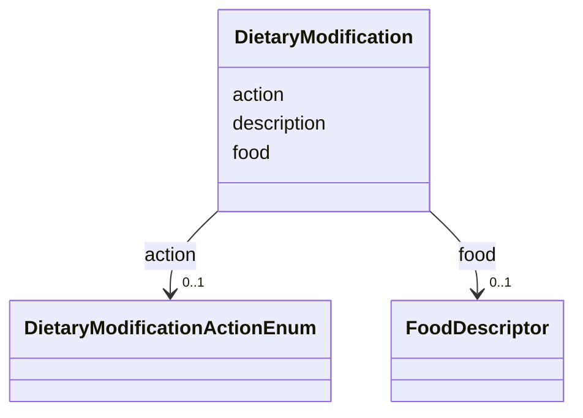

# Class: DietaryModification 


_A structured dietary addition, restriction, avoidance, or substitution used to post-compose a treatment descriptor with FOODON foods or beverages._


URI: [dismech:class/DietaryModification](https://w3id.org/monarch-initiative/dismech/class/DietaryModification)





<!-- no inheritance hierarchy -->

## Slots

| Name | Cardinality and Range | Description | Inheritance |
| ---  | --- | --- | --- |
| [action](../slots/action.md) | 0..1 <br/> [DietaryModificationActionEnum](../enums/DietaryModificationActionEnum.md) | The dietary action being applied | direct |
| [food](../slots/food.md) | 0..1 <br/> [FoodDescriptor](../classes/FoodDescriptor.md) | The FOODON-bound food or beverage targeted by a dietary modification | direct |
| [description](../slots/description.md) | 0..1 <br/> [String](../types/String.md) |  | direct |


## Usages

| used by | used in | type | used |
| ---  | --- | --- | --- |
| [TreatmentDescriptor](../classes/TreatmentDescriptor.md) | [dietary_modifications](../slots/dietary_modifications.md) | range | [DietaryModification](../classes/DietaryModification.md) |


## Comments

* Use for bona fide dietary or nutritional treatments, not to restate harmful exposures outside treatment context
* Represent substitutions as paired AVOID and ADD entries when a single replacement target is insufficient


## Identifier and Mapping Information


### Schema Source


* from schema: https://w3id.org/monarch-initiative/dismech


## Mappings

| Mapping Type | Mapped Value |
| ---  | ---  |
| self | dismech:DietaryModification |
| native | dismech:DietaryModification |


## LinkML Source

<!-- TODO: investigate https://stackoverflow.com/questions/37606292/how-to-create-tabbed-code-blocks-in-mkdocs-or-sphinx -->

### Direct

<details>
```yaml
name: DietaryModification
description: A structured dietary addition, restriction, avoidance, or substitution
  used to post-compose a treatment descriptor with FOODON foods or beverages.
comments:
- Use for bona fide dietary or nutritional treatments, not to restate harmful exposures
  outside treatment context
- Represent substitutions as paired AVOID and ADD entries when a single replacement
  target is insufficient
from_schema: https://w3id.org/monarch-initiative/dismech
slots:
- action
- food
- description

```
</details>

### Induced

<details>
```yaml
name: DietaryModification
description: A structured dietary addition, restriction, avoidance, or substitution
  used to post-compose a treatment descriptor with FOODON foods or beverages.
comments:
- Use for bona fide dietary or nutritional treatments, not to restate harmful exposures
  outside treatment context
- Represent substitutions as paired AVOID and ADD entries when a single replacement
  target is insufficient
from_schema: https://w3id.org/monarch-initiative/dismech
attributes:
  action:
    name: action
    description: The dietary action being applied
    from_schema: https://w3id.org/monarch-initiative/dismech
    rank: 1000
    alias: action
    owner: DietaryModification
    domain_of:
    - DietaryModification
    range: DietaryModificationActionEnum
  food:
    name: food
    description: The FOODON-bound food or beverage targeted by a dietary modification
    from_schema: https://w3id.org/monarch-initiative/dismech
    rank: 1000
    alias: food
    owner: DietaryModification
    domain_of:
    - DietaryModification
    range: FoodDescriptor
    inlined: true
  description:
    name: description
    from_schema: https://w3id.org/monarch-initiative/dismech
    rank: 1000
    alias: description
    owner: DietaryModification
    domain_of:
    - Descriptor
    - DietaryModification
    - GeneticContext
    - Dataset
    - ExperimentalModel
    - Experiment
    - ExperimentalPerturbation
    - ExperimentalReadout
    - ExperimentalControl
    - ClinicalTrial
    - ComputationalModel
    - ModelVariable
    - DifferentialDiagnosis
    - Subtype
    - CausalEdge
    - TreatmentMechanismTarget
    - ModelMechanismLink
    - BiomarkerReadout
    - SurrogateEndpointCollection
    - ProteinStructure
    - ExternalAssertion
    - EpidemiologyInfo
    - Pathophysiology
    - Phenotype
    - HistopathologyFinding
    - Environmental
    - Disease
    - Stage
    - AgentLifeCycle
    - AgentLifeCycleStage
    - AnimalModel
    - Treatment
    - InfectiousAgent
    - Transmission
    - Assay
    - Diagnosis
    - Inheritance
    - Variant
    - FunctionalEffect
    - Mechanism
    - ModelingConsideration
    - Definition
    - CriteriaSet
    - ConditionDescriptor
    - GOEnrichment
    - ComorbidityHypothesis
    - UpstreamConditionHypothesis
    - MechanisticHypothesis
    - Grouping
    - GroupingCriteria
    - LogicalCriterion
    - DifferentiatingMechanism
    range: string

```
</details>