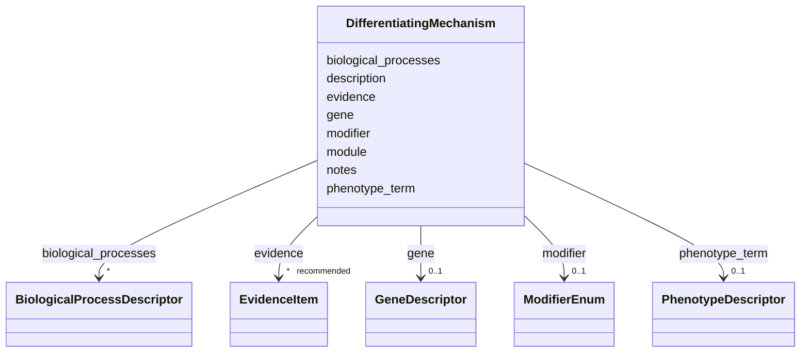

# Class: DifferentiatingMechanism 


_A mechanism or feature that distinguishes a grouping member from its siblings, as prose plus optional structured descriptors (gene, phenotype, biological process, module)._


URI: [dismech:class/DifferentiatingMechanism](https://w3id.org/monarch-initiative/dismech/class/DifferentiatingMechanism)





<!-- no inheritance hierarchy -->

## Slots

| Name | Cardinality and Range | Description | Inheritance |
| ---  | --- | --- | --- |
| [description](../slots/description.md) | 1 <br/> [String](../types/String.md) | Human-readable statement of the differentiating mechanism | direct |
| [gene](../slots/gene.md) | 0..1 <br/> [GeneDescriptor](../classes/GeneDescriptor.md) |  | direct |
| [phenotype_term](../slots/phenotype_term.md) | 0..1 <br/> [PhenotypeDescriptor](../classes/PhenotypeDescriptor.md) | The HP term for this phenotype | direct |
| [biological_processes](../slots/biological_processes.md) | * <br/> [BiologicalProcessDescriptor](../classes/BiologicalProcessDescriptor.md) |  | direct |
| [module](../slots/module.md) | 0..1 <br/> [String](../types/String.md) | Reference to a mechanism module in kb/modules/ (filename stem, without  | direct |
| [modifier](../slots/modifier.md) | 0..1 <br/> [ModifierEnum](../enums/ModifierEnum.md) | Directional or qualitative modifier for a descriptor (e | direct |
| [evidence](../slots/evidence.md) | * _recommended_ <br/> [EvidenceItem](../classes/EvidenceItem.md) |  | direct |
| [notes](../slots/notes.md) | 0..1 <br/> [String](../types/String.md) |  | direct |


## Usages

| used by | used in | type | used |
| ---  | --- | --- | --- |
| [GroupingMember](../classes/GroupingMember.md) | [differentiating_mechanisms](../slots/differentiating_mechanisms.md) | range | [DifferentiatingMechanism](../classes/DifferentiatingMechanism.md) |


## Identifier and Mapping Information


### Schema Source


* from schema: https://w3id.org/monarch-initiative/dismech


## Mappings

| Mapping Type | Mapped Value |
| ---  | ---  |
| self | dismech:DifferentiatingMechanism |
| native | dismech:DifferentiatingMechanism |


## LinkML Source

<!-- TODO: investigate https://stackoverflow.com/questions/37606292/how-to-create-tabbed-code-blocks-in-mkdocs-or-sphinx -->

### Direct

<details>
```yaml
name: DifferentiatingMechanism
description: A mechanism or feature that distinguishes a grouping member from its
  siblings, as prose plus optional structured descriptors (gene, phenotype, biological
  process, module).
from_schema: https://w3id.org/monarch-initiative/dismech
slots:
- description
- gene
- phenotype_term
- biological_processes
- module
- modifier
- evidence
- notes
slot_usage:
  description:
    name: description
    description: Human-readable statement of the differentiating mechanism.
    required: true

```
</details>

### Induced

<details>
```yaml
name: DifferentiatingMechanism
description: A mechanism or feature that distinguishes a grouping member from its
  siblings, as prose plus optional structured descriptors (gene, phenotype, biological
  process, module).
from_schema: https://w3id.org/monarch-initiative/dismech
slot_usage:
  description:
    name: description
    description: Human-readable statement of the differentiating mechanism.
    required: true
attributes:
  description:
    name: description
    description: Human-readable statement of the differentiating mechanism.
    from_schema: https://w3id.org/monarch-initiative/dismech
    rank: 1000
    alias: description
    owner: DifferentiatingMechanism
    domain_of:
    - Descriptor
    - DietaryModification
    - GeneticContext
    - Dataset
    - ExperimentalModel
    - Experiment
    - ExperimentalPerturbation
    - ExperimentalReadout
    - ExperimentalControl
    - ClinicalTrial
    - ComputationalModel
    - ModelVariable
    - DifferentialDiagnosis
    - Subtype
    - CausalEdge
    - TreatmentMechanismTarget
    - ModelMechanismLink
    - BiomarkerReadout
    - SurrogateEndpointCollection
    - ProteinStructure
    - ExternalAssertion
    - EpidemiologyInfo
    - Pathophysiology
    - Phenotype
    - HistopathologyFinding
    - Environmental
    - Disease
    - Stage
    - AgentLifeCycle
    - AgentLifeCycleStage
    - AnimalModel
    - Treatment
    - InfectiousAgent
    - Transmission
    - Assay
    - Diagnosis
    - Inheritance
    - Variant
    - FunctionalEffect
    - Mechanism
    - ModelingConsideration
    - Definition
    - CriteriaSet
    - ConditionDescriptor
    - GOEnrichment
    - ComorbidityHypothesis
    - UpstreamConditionHypothesis
    - MechanisticHypothesis
    - Grouping
    - GroupingCriteria
    - LogicalCriterion
    - DifferentiatingMechanism
    range: string
    required: true
  gene:
    name: gene
    examples:
    - value: '{preferred_term: MEFV}'
    from_schema: https://w3id.org/monarch-initiative/dismech
    rank: 1000
    alias: gene
    owner: DifferentiatingMechanism
    domain_of:
    - GeneticContext
    - ExperimentalPerturbation
    - Pathophysiology
    - Variant
    - LogicalCriterion
    - DifferentiatingMechanism
    range: GeneDescriptor
    inlined: true
  phenotype_term:
    name: phenotype_term
    description: The HP term for this phenotype
    from_schema: https://w3id.org/monarch-initiative/dismech
    rank: 1000
    alias: phenotype_term
    owner: DifferentiatingMechanism
    domain_of:
    - ExperimentalReadout
    - ReferenceRangeBand
    - Phenotype
    - LogicalCriterion
    - DifferentiatingMechanism
    range: PhenotypeDescriptor
    inlined: true
  biological_processes:
    name: biological_processes
    examples:
    - value: '[{preferred_term: TNF-alpha Production}]'
    from_schema: https://w3id.org/monarch-initiative/dismech
    rank: 1000
    alias: biological_processes
    owner: DifferentiatingMechanism
    domain_of:
    - ExperimentalPerturbation
    - ExperimentalReadout
    - Pathophysiology
    - LogicalCriterion
    - DifferentiatingMechanism
    range: BiologicalProcessDescriptor
    multivalued: true
    inlined: true
    inlined_as_list: true
  module:
    name: module
    description: Reference to a mechanism module in kb/modules/ (filename stem, without
      .yaml, optionally with a "#Node Name" anchor). Used by CONFORMS_TO_MODULE criteria
      and by differentiating mechanisms.
    from_schema: https://w3id.org/monarch-initiative/dismech
    rank: 1000
    alias: module
    owner: DifferentiatingMechanism
    domain_of:
    - LogicalCriterion
    - DifferentiatingMechanism
    range: string
  modifier:
    name: modifier
    description: Directional or qualitative modifier for a descriptor (e.g., increased,
      decreased, abnormal)
    from_schema: https://w3id.org/monarch-initiative/dismech
    rank: 1000
    alias: modifier
    owner: DifferentiatingMechanism
    domain_of:
    - Descriptor
    - DifferentiatingMechanism
    range: ModifierEnum
  evidence:
    name: evidence
    from_schema: https://w3id.org/monarch-initiative/dismech
    rank: 1000
    alias: evidence
    owner: DifferentiatingMechanism
    domain_of:
    - PhenotypeContext
    - Dataset
    - ExperimentalModel
    - Experiment
    - ExperimentalPerturbation
    - ExperimentalReadout
    - ExperimentalControl
    - ClinicalTrial
    - ComputationalModel
    - DifferentialDiagnosis
    - Subtype
    - CausalEdge
    - TreatmentMechanismTarget
    - ModelMechanismLink
    - BiomarkerReadout
    - ReferenceRange
    - SurrogateEndpoint
    - ExternalAssertion
    - Finding
    - Prevalence
    - ProgressionInfo
    - EpidemiologyInfo
    - Pathophysiology
    - Phenotype
    - Biochemical
    - HistopathologyFinding
    - Genetic
    - Environmental
    - Stage
    - AgentLifeCycle
    - AgentLifeCycleStage
    - AnimalModel
    - Treatment
    - InfectiousAgent
    - Transmission
    - Diagnosis
    - Inheritance
    - Variant
    - ModelingConsideration
    - ClassificationAssignment
    - Definition
    - CriteriaSet
    - AssociationSignal
    - AssociationStatistics
    - ComorbidityHypothesis
    - UpstreamConditionHypothesis
    - MechanisticHypothesis
    - Discussion
    - GroupingCriteria
    - GroupingMember
    - DifferentiatingMechanism
    range: EvidenceItem
    recommended: true
    multivalued: true
    inlined: true
    inlined_as_list: true
  notes:
    name: notes
    examples:
    - value: Contagious stage where symptoms appear and the bacteria can be spread
        to others.
    from_schema: https://w3id.org/monarch-initiative/dismech
    rank: 1000
    alias: notes
    owner: DifferentiatingMechanism
    domain_of:
    - GeneticContext
    - OnsetDescriptor
    - PhenotypeContext
    - Dataset
    - ExperimentalModel
    - Experiment
    - ExperimentalPerturbation
    - ExperimentalReadout
    - ExperimentalControl
    - ClinicalTrial
    - ComputationalModel
    - ModelVariable
    - DifferentialDiagnosis
    - ReferenceRange
    - SurrogateEndpoint
    - SurrogateEndpointCollection
    - ExternalAssertion
    - TrackedIssue
    - Prevalence
    - ProgressionInfo
    - EpidemiologyInfo
    - Pathophysiology
    - Phenotype
    - Biochemical
    - HistopathologyFinding
    - Genetic
    - Environmental
    - Disease
    - Stage
    - AgentLifeCycle
    - AgentLifeCycleStage
    - Treatment
    - Transmission
    - Diagnosis
    - ClassificationAssignment
    - Definition
    - CriteriaSet
    - TermMapping
    - MappingConsistency
    - ComorbidityAssociation
    - AssociationSignal
    - AssociationMetric
    - AssociationStatistics
    - MechanisticHypothesis
    - Discussion
    - Grouping
    - GroupingCriteria
    - GroupingMember
    - DifferentiatingMechanism
    range: string

```
</details>