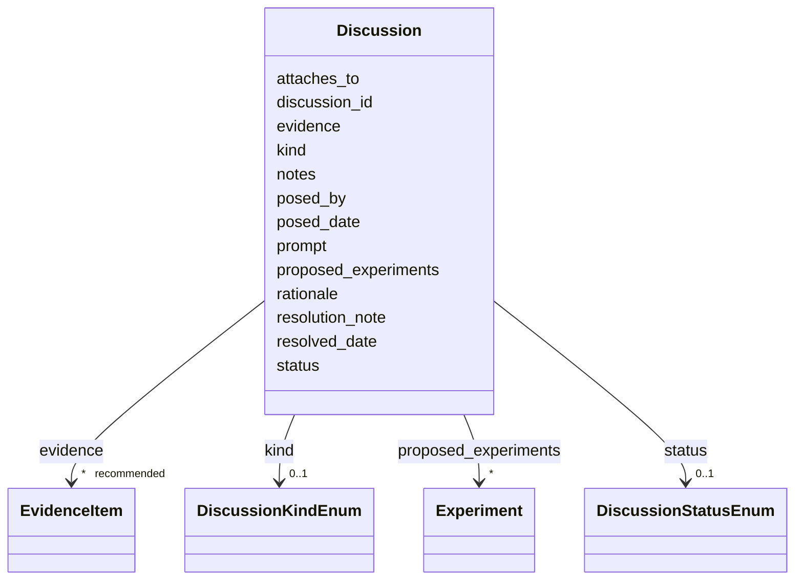

# Class: Discussion 


_A thread-like record of an open question, controversy, curation todo, emerging hypothesis, or interpretation debate attached to a disease entry or sub-object. Discussions capture the *discourse* layer of curation (what is being argued or asked), complementing the structural knowledge-gap layer proposed in monarch-initiative/dismech#2617 (what is missing from the model). External thread links (e.g., Alzforum commentaries, GitHub issues) are not modelled as a separate slot; instead they are cited via the standard `evidence` block using the same EvidenceItem shape as primary literature._


URI: [dismech:class/Discussion](https://w3id.org/monarch-initiative/dismech/class/Discussion)





<!-- no inheritance hierarchy -->

## Slots

| Name | Cardinality and Range | Description | Inheritance |
| ---  | --- | --- | --- |
| [discussion_id](../slots/discussion_id.md) | 1 <br/> [String](../types/String.md) | Stable identifier for a Discussion, used as the target of cross-references | direct |
| [prompt](../slots/prompt.md) | 1 <br/> [String](../types/String.md) | The unresolved question, controversy, or todo articulated by a Discussion | direct |
| [kind](../slots/kind.md) | 0..1 <br/> [DiscussionKindEnum](../enums/DiscussionKindEnum.md) | Categorical type of a Discussion (narrowed via slot_usage to DiscussionKindEn... | direct |
| [status](../slots/status.md) | 0..1 <br/> [DiscussionStatusEnum](../enums/DiscussionStatusEnum.md) | Status or state of a clinical trial or other process | direct |
| [attaches_to](../slots/attaches_to.md) | * <br/> [String](../types/String.md) | Multivalued list of entity references pointing at the disease nodes, gaps, ph... | direct |
| [rationale](../slots/rationale.md) | 0..1 <br/> [String](../types/String.md) | Why this Discussion matters / what hangs on its resolution | direct |
| [proposed_experiments](../slots/proposed_experiments.md) | * <br/> [Experiment](../classes/Experiment.md) | Experiments proposed as ways to resolve this Discussion | direct |
| [evidence](../slots/evidence.md) | * _recommended_ <br/> [EvidenceItem](../classes/EvidenceItem.md) |  | direct |
| [posed_by](../slots/posed_by.md) | 0..1 <br/> [String](../types/String.md) | Optional attribution for who posed a Discussion | direct |
| [posed_date](../slots/posed_date.md) | 0..1 <br/> [Datetime](../types/Datetime.md) | Date the Discussion was first posed (ISO 8601) | direct |
| [resolved_date](../slots/resolved_date.md) | 0..1 <br/> [Datetime](../types/Datetime.md) | Date the Discussion's status moved to RESOLVED (ISO 8601) | direct |
| [resolution_note](../slots/resolution_note.md) | 0..1 <br/> [String](../types/String.md) | Short summary written when a Discussion is marked RESOLVED | direct |
| [notes](../slots/notes.md) | 0..1 <br/> [String](../types/String.md) |  | direct |


## Usages

| used by | used in | type | used |
| ---  | --- | --- | --- |
| [Disease](../classes/Disease.md) | [discussions](../slots/discussions.md) | range | [Discussion](../classes/Discussion.md) |
| [Grouping](../classes/Grouping.md) | [discussions](../slots/discussions.md) | range | [Discussion](../classes/Discussion.md) |


## Identifier and Mapping Information


### Schema Source


* from schema: https://w3id.org/monarch-initiative/dismech


## Mappings

| Mapping Type | Mapped Value |
| ---  | ---  |
| self | dismech:Discussion |
| native | dismech:Discussion |


## LinkML Source

<!-- TODO: investigate https://stackoverflow.com/questions/37606292/how-to-create-tabbed-code-blocks-in-mkdocs-or-sphinx -->

### Direct

<details>
```yaml
name: Discussion
description: A thread-like record of an open question, controversy, curation todo,
  emerging hypothesis, or interpretation debate attached to a disease entry or sub-object.
  Discussions capture the *discourse* layer of curation (what is being argued or asked),
  complementing the structural knowledge-gap layer proposed in monarch-initiative/dismech#2617
  (what is missing from the model). External thread links (e.g., Alzforum commentaries,
  GitHub issues) are not modelled as a separate slot; instead they are cited via the
  standard `evidence` block using the same EvidenceItem shape as primary literature.
from_schema: https://w3id.org/monarch-initiative/dismech
slots:
- discussion_id
- prompt
- kind
- status
- attaches_to
- rationale
- proposed_experiments
- evidence
- posed_by
- posed_date
- resolved_date
- resolution_note
- notes
slot_usage:
  discussion_id:
    name: discussion_id
    required: true
  prompt:
    name: prompt
    required: true
  kind:
    name: kind
    range: DiscussionKindEnum
  status:
    name: status
    range: DiscussionStatusEnum

```
</details>

### Induced

<details>
```yaml
name: Discussion
description: A thread-like record of an open question, controversy, curation todo,
  emerging hypothesis, or interpretation debate attached to a disease entry or sub-object.
  Discussions capture the *discourse* layer of curation (what is being argued or asked),
  complementing the structural knowledge-gap layer proposed in monarch-initiative/dismech#2617
  (what is missing from the model). External thread links (e.g., Alzforum commentaries,
  GitHub issues) are not modelled as a separate slot; instead they are cited via the
  standard `evidence` block using the same EvidenceItem shape as primary literature.
from_schema: https://w3id.org/monarch-initiative/dismech
slot_usage:
  discussion_id:
    name: discussion_id
    required: true
  prompt:
    name: prompt
    required: true
  kind:
    name: kind
    range: DiscussionKindEnum
  status:
    name: status
    range: DiscussionStatusEnum
attributes:
  discussion_id:
    name: discussion_id
    description: Stable identifier for a Discussion, used as the target of cross-references
    from_schema: https://w3id.org/monarch-initiative/dismech
    rank: 1000
    alias: discussion_id
    owner: Discussion
    domain_of:
    - Discussion
    range: string
    required: true
  prompt:
    name: prompt
    description: The unresolved question, controversy, or todo articulated by a Discussion
    from_schema: https://w3id.org/monarch-initiative/dismech
    rank: 1000
    alias: prompt
    owner: Discussion
    domain_of:
    - Discussion
    range: string
    required: true
  kind:
    name: kind
    description: Categorical type of a Discussion (narrowed via slot_usage to DiscussionKindEnum)
    from_schema: https://w3id.org/monarch-initiative/dismech
    rank: 1000
    alias: kind
    owner: Discussion
    domain_of:
    - Discussion
    range: DiscussionKindEnum
  status:
    name: status
    description: Status or state of a clinical trial or other process
    examples:
    - value: Recruiting
    - value: Completed
    - value: Terminated
    from_schema: https://w3id.org/monarch-initiative/dismech
    rank: 1000
    alias: status
    owner: Discussion
    domain_of:
    - ClinicalTrial
    - MechanisticHypothesis
    - Discussion
    range: DiscussionStatusEnum
  attaches_to:
    name: attaches_to
    description: 'Multivalued list of entity references pointing at the disease nodes,
      gaps, phenotypes, or other objects this item is about. Uses a hash-anchor grammar
      consistent with `conforms_to`: `[<file>:]<kind>#<name>`. Examples: `pathophysiology#Amyloid
      Plaque Formation`, `phenotype#Memory Loss`, `Liver_Cirrhosis:pathophysiology#Hepatic
      Stellate Cell Activation`. Range is `string` for now; a custom EntityRef type
      with parser support can be introduced later without breaking existing data.'
    from_schema: https://w3id.org/monarch-initiative/dismech
    rank: 1000
    alias: attaches_to
    owner: Discussion
    domain_of:
    - Discussion
    range: string
    multivalued: true
  rationale:
    name: rationale
    description: Why this Discussion matters / what hangs on its resolution
    from_schema: https://w3id.org/monarch-initiative/dismech
    rank: 1000
    alias: rationale
    owner: Discussion
    domain_of:
    - Discussion
    range: string
  proposed_experiments:
    name: proposed_experiments
    description: 'Experiments proposed as ways to resolve this Discussion. The Experiment
      object is intentionally neutral: whether it is proposed, planned, in progress,
      or reported is determined by its containing context. Here, nesting under a Discussion
      means the experiment is proposed as a response to an open item or knowledge
      gap.'
    from_schema: https://w3id.org/monarch-initiative/dismech
    rank: 1000
    alias: proposed_experiments
    owner: Discussion
    domain_of:
    - Discussion
    range: Experiment
    multivalued: true
    inlined: true
    inlined_as_list: true
  evidence:
    name: evidence
    from_schema: https://w3id.org/monarch-initiative/dismech
    rank: 1000
    alias: evidence
    owner: Discussion
    domain_of:
    - PhenotypeContext
    - Dataset
    - ExperimentalModel
    - Experiment
    - ExperimentalPerturbation
    - ExperimentalReadout
    - ExperimentalControl
    - ClinicalTrial
    - ComputationalModel
    - DifferentialDiagnosis
    - Subtype
    - CausalEdge
    - TreatmentMechanismTarget
    - ModelMechanismLink
    - BiomarkerReadout
    - ReferenceRange
    - SurrogateEndpoint
    - ExternalAssertion
    - Finding
    - Prevalence
    - ProgressionInfo
    - EpidemiologyInfo
    - Pathophysiology
    - Phenotype
    - Biochemical
    - HistopathologyFinding
    - Genetic
    - Environmental
    - Stage
    - AgentLifeCycle
    - AgentLifeCycleStage
    - AnimalModel
    - Treatment
    - InfectiousAgent
    - Transmission
    - Diagnosis
    - Inheritance
    - Variant
    - ModelingConsideration
    - ClassificationAssignment
    - Definition
    - CriteriaSet
    - AssociationSignal
    - AssociationStatistics
    - ComorbidityHypothesis
    - UpstreamConditionHypothesis
    - MechanisticHypothesis
    - Discussion
    - GroupingCriteria
    - GroupingMember
    - DifferentiatingMechanism
    range: EvidenceItem
    recommended: true
    multivalued: true
    inlined: true
    inlined_as_list: true
  posed_by:
    name: posed_by
    description: Optional attribution for who posed a Discussion. ORCID is preferred
      when available (e.g., `ORCID:0000-0002-1825-0097`); a github handle or email
      is acceptable.
    from_schema: https://w3id.org/monarch-initiative/dismech
    rank: 1000
    alias: posed_by
    owner: Discussion
    domain_of:
    - Discussion
    range: string
  posed_date:
    name: posed_date
    description: Date the Discussion was first posed (ISO 8601)
    from_schema: https://w3id.org/monarch-initiative/dismech
    rank: 1000
    alias: posed_date
    owner: Discussion
    domain_of:
    - Discussion
    range: datetime
  resolved_date:
    name: resolved_date
    description: Date the Discussion's status moved to RESOLVED (ISO 8601)
    from_schema: https://w3id.org/monarch-initiative/dismech
    rank: 1000
    alias: resolved_date
    owner: Discussion
    domain_of:
    - Discussion
    range: datetime
  resolution_note:
    name: resolution_note
    description: Short summary written when a Discussion is marked RESOLVED
    from_schema: https://w3id.org/monarch-initiative/dismech
    rank: 1000
    alias: resolution_note
    owner: Discussion
    domain_of:
    - Discussion
    range: string
  notes:
    name: notes
    examples:
    - value: Contagious stage where symptoms appear and the bacteria can be spread
        to others.
    from_schema: https://w3id.org/monarch-initiative/dismech
    rank: 1000
    alias: notes
    owner: Discussion
    domain_of:
    - GeneticContext
    - OnsetDescriptor
    - PhenotypeContext
    - Dataset
    - ExperimentalModel
    - Experiment
    - ExperimentalPerturbation
    - ExperimentalReadout
    - ExperimentalControl
    - ClinicalTrial
    - ComputationalModel
    - ModelVariable
    - DifferentialDiagnosis
    - ReferenceRange
    - SurrogateEndpoint
    - SurrogateEndpointCollection
    - ExternalAssertion
    - TrackedIssue
    - Prevalence
    - ProgressionInfo
    - EpidemiologyInfo
    - Pathophysiology
    - Phenotype
    - Biochemical
    - HistopathologyFinding
    - Genetic
    - Environmental
    - Disease
    - Stage
    - AgentLifeCycle
    - AgentLifeCycleStage
    - Treatment
    - Transmission
    - Diagnosis
    - ClassificationAssignment
    - Definition
    - CriteriaSet
    - TermMapping
    - MappingConsistency
    - ComorbidityAssociation
    - AssociationSignal
    - AssociationMetric
    - AssociationStatistics
    - MechanisticHypothesis
    - Discussion
    - Grouping
    - GroupingCriteria
    - GroupingMember
    - DifferentiatingMechanism
    range: string

```
</details>