# Class: Disease 


URI: [dismech:class/Disease](https://w3id.org/monarch-initiative/dismech/class/Disease)

```mermaid
 classDiagram
    class Disease
    click Disease href "../../classes/Disease/"
      Disease : agent_life_cycle
        
          
    
        
        
        Disease --> "0..1" AgentLifeCycle : agent_life_cycle
        click AgentLifeCycle href "../../classes/AgentLifeCycle/"
    

        
      Disease : animal_models
        
          
    
        
        
        Disease --> "*" AnimalModel : animal_models
        click AnimalModel href "../../classes/AnimalModel/"
    

        
      Disease : biochemical
        
          
    
        
        
        Disease --> "*" Biochemical : biochemical
        click Biochemical href "../../classes/Biochemical/"
    

        
      Disease : categories
        
      Disease : category
        
      Disease : classifications
        
          
    
        
        
        Disease --> "0..1" DiseaseClassifications : classifications
        click DiseaseClassifications href "../../classes/DiseaseClassifications/"
    

        
      Disease : clinical_trials
        
          
    
        
        
        Disease --> "*" ClinicalTrial : clinical_trials
        click ClinicalTrial href "../../classes/ClinicalTrial/"
    

        
      Disease : computational_models
        
          
    
        
        
        Disease --> "*" ComputationalModel : computational_models
        click ComputationalModel href "../../classes/ComputationalModel/"
    

        
      Disease : creation_date
        
      Disease : curation_history
        
          
    
        
        
        Disease --> "*" CurationEvent : curation_history
        click CurationEvent href "../../classes/CurationEvent/"
    

        
      Disease : datasets
        
          
    
        
        
        Disease --> "* _recommended_" Dataset : datasets
        click Dataset href "../../classes/Dataset/"
    

        
      Disease : definitions
        
          
    
        
        
        Disease --> "*" Definition : definitions
        click Definition href "../../classes/Definition/"
    

        
      Disease : description
        
      Disease : diagnosis
        
          
    
        
        
        Disease --> "*" Diagnosis : diagnosis
        click Diagnosis href "../../classes/Diagnosis/"
    

        
      Disease : differential_diagnoses
        
          
    
        
        
        Disease --> "*" DifferentialDiagnosis : differential_diagnoses
        click DifferentialDiagnosis href "../../classes/DifferentialDiagnosis/"
    

        
      Disease : discussions
        
          
    
        
        
        Disease --> "*" Discussion : discussions
        click Discussion href "../../classes/Discussion/"
    

        
      Disease : disease_term
        
          
    
        
        
        Disease --> "0..1" DiseaseDescriptor : disease_term
        click DiseaseDescriptor href "../../classes/DiseaseDescriptor/"
    

        
      Disease : environmental
        
          
    
        
        
        Disease --> "*" Environmental : environmental
        click Environmental href "../../classes/Environmental/"
    

        
      Disease : epidemiology
        
          
    
        
        
        Disease --> "*" EpidemiologyInfo : epidemiology
        click EpidemiologyInfo href "../../classes/EpidemiologyInfo/"
    

        
      Disease : experimental_models
        
          
    
        
        
        Disease --> "*" ExperimentalModel : experimental_models
        click ExperimentalModel href "../../classes/ExperimentalModel/"
    

        
      Disease : external_assertions
        
          
    
        
        
        Disease --> "*" ExternalAssertion : external_assertions
        click ExternalAssertion href "../../classes/ExternalAssertion/"
    

        
      Disease : genetic
        
          
    
        
        
        Disease --> "*" Genetic : genetic
        click Genetic href "../../classes/Genetic/"
    

        
      Disease : has_subtypes
        
          
    
        
        
        Disease --> "*" Subtype : has_subtypes
        click Subtype href "../../classes/Subtype/"
    

        
      Disease : histopathology
        
          
    
        
        
        Disease --> "*" HistopathologyFinding : histopathology
        click HistopathologyFinding href "../../classes/HistopathologyFinding/"
    

        
      Disease : infectious_agent
        
          
    
        
        
        Disease --> "*" InfectiousAgent : infectious_agent
        click InfectiousAgent href "../../classes/InfectiousAgent/"
    

        
      Disease : inheritance
        
          
    
        
        
        Disease --> "*" Inheritance : inheritance
        click Inheritance href "../../classes/Inheritance/"
    

        
      Disease : mappings
        
          
    
        
        
        Disease --> "0..1" DiseaseMappings : mappings
        click DiseaseMappings href "../../classes/DiseaseMappings/"
    

        
      Disease : mechanistic_hypotheses
        
          
    
        
        
        Disease --> "*" MechanisticHypothesis : mechanistic_hypotheses
        click MechanisticHypothesis href "../../classes/MechanisticHypothesis/"
    

        
      Disease : modeling_considerations
        
          
    
        
        
        Disease --> "*" ModelingConsideration : modeling_considerations
        click ModelingConsideration href "../../classes/ModelingConsideration/"
    

        
      Disease : name
        
      Disease : notes
        
      Disease : parents
        
      Disease : pathophysiology
        
          
    
        
        
        Disease --> "*" Pathophysiology : pathophysiology
        click Pathophysiology href "../../classes/Pathophysiology/"
    

        
      Disease : phenotypes
        
          
    
        
        
        Disease --> "*" Phenotype : phenotypes
        click Phenotype href "../../classes/Phenotype/"
    

        
      Disease : prevalence
        
          
    
        
        
        Disease --> "*" Prevalence : prevalence
        click Prevalence href "../../classes/Prevalence/"
    

        
      Disease : progression
        
          
    
        
        
        Disease --> "*" ProgressionInfo : progression
        click ProgressionInfo href "../../classes/ProgressionInfo/"
    

        
      Disease : references
        
          
    
        
        
        Disease --> "*" PublicationReference : references
        click PublicationReference href "../../classes/PublicationReference/"
    

        
      Disease : review_notes
        
      Disease : stages
        
          
    
        
        
        Disease --> "*" Stage : stages
        click Stage href "../../classes/Stage/"
    

        
      Disease : surrogate_endpoints
        
          
    
        
        
        Disease --> "*" SurrogateEndpoint : surrogate_endpoints
        click SurrogateEndpoint href "../../classes/SurrogateEndpoint/"
    

        
      Disease : synonyms
        
      Disease : tracked_issues
        
          
    
        
        
        Disease --> "*" TrackedIssue : tracked_issues
        click TrackedIssue href "../../classes/TrackedIssue/"
    

        
      Disease : transmission
        
          
    
        
        
        Disease --> "*" Transmission : transmission
        click Transmission href "../../classes/Transmission/"
    

        
      Disease : treatments
        
          
    
        
        
        Disease --> "*" Treatment : treatments
        click Treatment href "../../classes/Treatment/"
    

        
      Disease : updated_date
        
      Disease : variants
        
          
    
        
        
        Disease --> "*" Variant : variants
        click Variant href "../../classes/Variant/"
    

        
      
```





<!-- no inheritance hierarchy -->

## Slots

| Name | Cardinality and Range | Description | Inheritance |
| ---  | --- | --- | --- |
| [name](../slots/name.md) | 1 <br/> [String](../types/String.md) | Preferred name for the disease | direct |
| [disease_term](../slots/disease_term.md) | 0..1 <br/> [DiseaseDescriptor](../classes/DiseaseDescriptor.md) | The MONDO disease term for this disease | direct |
| [creation_date](../slots/creation_date.md) | 0..1 _recommended_ <br/> [String](../types/String.md) | Timestamp for initial creation of this disease entry | direct |
| [updated_date](../slots/updated_date.md) | 0..1 <br/> [String](../types/String.md) | Timestamp for the latest substantive update to this disease entry | direct |
| [description](../slots/description.md) | 0..1 <br/> [String](../types/String.md) |  | direct |
| [references](../slots/references.md) | * <br/> [PublicationReference](../classes/PublicationReference.md) | Top-level list of references with their key findings for this disease | direct |
| [category](../slots/category.md) | 0..1 <br/> [String](../types/String.md) |  | direct |
| [parents](../slots/parents.md) | * <br/> [String](../types/String.md) |  | direct |
| [has_subtypes](../slots/has_subtypes.md) | * <br/> [Subtype](../classes/Subtype.md) |  | direct |
| [prevalence](../slots/prevalence.md) | * <br/> [Prevalence](../classes/Prevalence.md) |  | direct |
| [progression](../slots/progression.md) | * <br/> [ProgressionInfo](../classes/ProgressionInfo.md) |  | direct |
| [pathophysiology](../slots/pathophysiology.md) | * <br/> [Pathophysiology](../classes/Pathophysiology.md) |  | direct |
| [mechanistic_hypotheses](../slots/mechanistic_hypotheses.md) | * <br/> [MechanisticHypothesis](../classes/MechanisticHypothesis.md) | Disease-level mechanistic hypotheses that group and annotate causal edges | direct |
| [phenotypes](../slots/phenotypes.md) | * <br/> [Phenotype](../classes/Phenotype.md) |  | direct |
| [histopathology](../slots/histopathology.md) | * <br/> [HistopathologyFinding](../classes/HistopathologyFinding.md) | Histopathologic findings including microscopic morphology, architectural patt... | direct |
| [biochemical](../slots/biochemical.md) | * <br/> [Biochemical](../classes/Biochemical.md) |  | direct |
| [stages](../slots/stages.md) | * <br/> [Stage](../classes/Stage.md) |  | direct |
| [genetic](../slots/genetic.md) | * <br/> [Genetic](../classes/Genetic.md) |  | direct |
| [variants](../slots/variants.md) | * <br/> [Variant](../classes/Variant.md) |  | direct |
| [environmental](../slots/environmental.md) | * <br/> [Environmental](../classes/Environmental.md) |  | direct |
| [treatments](../slots/treatments.md) | * <br/> [Treatment](../classes/Treatment.md) |  | direct |
| [categories](../slots/categories.md) | * <br/> [String](../types/String.md) |  | direct |
| [infectious_agent](../slots/infectious_agent.md) | * <br/> [InfectiousAgent](../classes/InfectiousAgent.md) |  | direct |
| [agent_life_cycle](../slots/agent_life_cycle.md) | 0..1 <br/> [AgentLifeCycle](../classes/AgentLifeCycle.md) |  | direct |
| [transmission](../slots/transmission.md) | * <br/> [Transmission](../classes/Transmission.md) |  | direct |
| [modeling_considerations](../slots/modeling_considerations.md) | * <br/> [ModelingConsideration](../classes/ModelingConsideration.md) |  | direct |
| [epidemiology](../slots/epidemiology.md) | * <br/> [EpidemiologyInfo](../classes/EpidemiologyInfo.md) |  | direct |
| [diagnosis](../slots/diagnosis.md) | * <br/> [Diagnosis](../classes/Diagnosis.md) |  | direct |
| [differential_diagnoses](../slots/differential_diagnoses.md) | * <br/> [DifferentialDiagnosis](../classes/DifferentialDiagnosis.md) | Differential diagnoses - similar diseases that must be ruled out | direct |
| [synonyms](../slots/synonyms.md) | * <br/> [String](../types/String.md) |  | direct |
| [inheritance](../slots/inheritance.md) | * <br/> [Inheritance](../classes/Inheritance.md) |  | direct |
| [animal_models](../slots/animal_models.md) | * <br/> [AnimalModel](../classes/AnimalModel.md) |  | direct |
| [experimental_models](../slots/experimental_models.md) | * <br/> [ExperimentalModel](../classes/ExperimentalModel.md) | Disease-relevant organoids, cell lines, chip systems, cocultures, and related... | direct |
| [datasets](../slots/datasets.md) | * _recommended_ <br/> [Dataset](../classes/Dataset.md) | Publicly available datasets relevant to disease research | direct |
| [clinical_trials](../slots/clinical_trials.md) | * <br/> [ClinicalTrial](../classes/ClinicalTrial.md) | Clinical trials relevant to disease treatment and research | direct |
| [surrogate_endpoints](../slots/surrogate_endpoints.md) | * <br/> [SurrogateEndpoint](../classes/SurrogateEndpoint.md) | Curated surrogate endpoint assertions | direct |
| [computational_models](../slots/computational_models.md) | * <br/> [ComputationalModel](../classes/ComputationalModel.md) | Computational models (metabolic, mechanistic, ML, digital twins) for this dis... | direct |
| [classifications](../slots/classifications.md) | 0..1 <br/> [DiseaseClassifications](../classes/DiseaseClassifications.md) | Classification assignments for this disease from various nosologies | direct |
| [definitions](../slots/definitions.md) | * <br/> [Definition](../classes/Definition.md) | Definitions or diagnostic criteria for this disease | direct |
| [mappings](../slots/mappings.md) | 0..1 <br/> [DiseaseMappings](../classes/DiseaseMappings.md) | External identifier mappings for this disease or subtype (SSSOM-inspired) | direct |
| [external_assertions](../slots/external_assertions.md) | * <br/> [ExternalAssertion](../classes/ExternalAssertion.md) | External curated assertions or registry records relevant to this entity | direct |
| [tracked_issues](../slots/tracked_issues.md) | * <br/> [TrackedIssue](../classes/TrackedIssue.md) | Structured pointers to external tracker issues (e | direct |
| [discussions](../slots/discussions.md) | * <br/> [Discussion](../classes/Discussion.md) | Open or recently-resolved discussion items attached to this entry | direct |
| [notes](../slots/notes.md) | 0..1 <br/> [String](../types/String.md) |  | direct |
| [review_notes](../slots/review_notes.md) | 0..1 <br/> [String](../types/String.md) |  | direct |
| [curation_history](../slots/curation_history.md) | * <br/> [CurationEvent](../classes/CurationEvent.md) | Audit trail of AI-assisted curation events | direct |


## Usages

| used by | used in | type | used |
| ---  | --- | --- | --- |
| [DiseaseCollection](../classes/DiseaseCollection.md) | [diseases](../slots/diseases.md) | range | [Disease](../classes/Disease.md) |


## Identifier and Mapping Information


### Schema Source


* from schema: https://w3id.org/monarch-initiative/dismech


## Mappings

| Mapping Type | Mapped Value |
| ---  | ---  |
| self | dismech:Disease |
| native | dismech:Disease |


## LinkML Source

<!-- TODO: investigate https://stackoverflow.com/questions/37606292/how-to-create-tabbed-code-blocks-in-mkdocs-or-sphinx -->

### Direct

<details>
```yaml
name: Disease
from_schema: https://w3id.org/monarch-initiative/dismech
slots:
- name
- disease_term
- creation_date
- updated_date
- description
- references
- category
- parents
- has_subtypes
- prevalence
- progression
- pathophysiology
- mechanistic_hypotheses
- phenotypes
- histopathology
- biochemical
- stages
- genetic
- variants
- environmental
- treatments
- categories
- infectious_agent
- agent_life_cycle
- transmission
- modeling_considerations
- epidemiology
- diagnosis
- differential_diagnoses
- synonyms
- inheritance
- animal_models
- experimental_models
- datasets
- clinical_trials
- surrogate_endpoints
- computational_models
- classifications
- definitions
- mappings
- external_assertions
- tracked_issues
- discussions
- notes
- review_notes
- curation_history
slot_usage:
  name:
    name: name
    description: Preferred name for the disease
    required: true
  creation_date:
    name: creation_date
    description: Timestamp for initial creation of this disease entry. Keep this stable
      after first set.
  updated_date:
    name: updated_date
    description: Timestamp for the latest substantive update to this disease entry.
      Update this whenever curated content changes.

```
</details>

### Induced

<details>
```yaml
name: Disease
from_schema: https://w3id.org/monarch-initiative/dismech
slot_usage:
  name:
    name: name
    description: Preferred name for the disease
    required: true
  creation_date:
    name: creation_date
    description: Timestamp for initial creation of this disease entry. Keep this stable
      after first set.
  updated_date:
    name: updated_date
    description: Timestamp for the latest substantive update to this disease entry.
      Update this whenever curated content changes.
attributes:
  name:
    name: name
    description: Preferred name for the disease
    examples:
    - value: Adolescent Nephronophthisis
    from_schema: https://w3id.org/monarch-initiative/dismech
    rank: 1000
    identifier: true
    alias: name
    owner: Disease
    domain_of:
    - ExperimentalModel
    - Experiment
    - ExperimentalPerturbation
    - ExperimentalReadout
    - ExperimentalControl
    - ClinicalTrial
    - ComputationalModel
    - ModelVariable
    - SeverityTier
    - DifferentialDiagnosis
    - Subtype
    - ReferenceRangeBand
    - SurrogateEndpointCollection
    - ExternalAssertion
    - EpidemiologyInfo
    - Pathophysiology
    - Phenotype
    - Biochemical
    - HistopathologyFinding
    - Genetic
    - Environmental
    - Disease
    - Stage
    - AgentLifeCycleStage
    - Treatment
    - InfectiousAgent
    - Transmission
    - Assay
    - Diagnosis
    - Inheritance
    - Variant
    - Mechanism
    - ModelingConsideration
    - Definition
    - CriteriaSet
    - ComorbidityAssociation
    - Grouping
    range: string
    required: true
  disease_term:
    name: disease_term
    description: The MONDO disease term for this disease
    from_schema: https://w3id.org/monarch-initiative/dismech
    rank: 1000
    alias: disease_term
    owner: Disease
    domain_of:
    - DifferentialDiagnosis
    - Disease
    - GroupingMember
    range: DiseaseDescriptor
    inlined: true
  creation_date:
    name: creation_date
    description: Timestamp for initial creation of this disease entry. Keep this stable
      after first set.
    from_schema: https://w3id.org/monarch-initiative/dismech
    rank: 1000
    alias: creation_date
    owner: Disease
    domain_of:
    - Disease
    - ComorbidityAssociation
    - Grouping
    range: string
    recommended: true
    pattern: ^\d{4}-\d{2}-\d{2}T\d{2}:\d{2}:\d{2}(?:\.\d+)?(?:Z|[+\-]\d{2}:\d{2})$
  updated_date:
    name: updated_date
    description: Timestamp for the latest substantive update to this disease entry.
      Update this whenever curated content changes.
    deprecated: 'True'
    from_schema: https://w3id.org/monarch-initiative/dismech
    rank: 1000
    alias: updated_date
    owner: Disease
    domain_of:
    - Disease
    - ComorbidityAssociation
    range: string
    recommended: false
    pattern: ^\d{4}-\d{2}-\d{2}T\d{2}:\d{2}:\d{2}(?:\.\d+)?(?:Z|[+\-]\d{2}:\d{2})$
  description:
    name: description
    from_schema: https://w3id.org/monarch-initiative/dismech
    rank: 1000
    alias: description
    owner: Disease
    domain_of:
    - Descriptor
    - DietaryModification
    - GeneticContext
    - Dataset
    - ExperimentalModel
    - Experiment
    - ExperimentalPerturbation
    - ExperimentalReadout
    - ExperimentalControl
    - ClinicalTrial
    - ComputationalModel
    - ModelVariable
    - DifferentialDiagnosis
    - Subtype
    - CausalEdge
    - TreatmentMechanismTarget
    - ModelMechanismLink
    - BiomarkerReadout
    - SurrogateEndpointCollection
    - ProteinStructure
    - ExternalAssertion
    - EpidemiologyInfo
    - Pathophysiology
    - Phenotype
    - HistopathologyFinding
    - Environmental
    - Disease
    - Stage
    - AgentLifeCycle
    - AgentLifeCycleStage
    - AnimalModel
    - Treatment
    - InfectiousAgent
    - Transmission
    - Assay
    - Diagnosis
    - Inheritance
    - Variant
    - FunctionalEffect
    - Mechanism
    - ModelingConsideration
    - Definition
    - CriteriaSet
    - ConditionDescriptor
    - GOEnrichment
    - ComorbidityHypothesis
    - UpstreamConditionHypothesis
    - MechanisticHypothesis
    - Grouping
    - GroupingCriteria
    - LogicalCriterion
    - DifferentiatingMechanism
    range: string
  references:
    name: references
    description: Top-level list of references with their key findings for this disease
    from_schema: https://w3id.org/monarch-initiative/dismech
    rank: 1000
    alias: references
    owner: Disease
    domain_of:
    - Disease
    - Grouping
    range: PublicationReference
    multivalued: true
    inlined: true
    inlined_as_list: true
  category:
    name: category
    examples:
    - value: Hematologic
    from_schema: https://w3id.org/monarch-initiative/dismech
    rank: 1000
    alias: category
    owner: Disease
    domain_of:
    - Phenotype
    - Disease
    - AnimalModel
    range: string
  parents:
    name: parents
    examples:
    - value: '[''Bacterial Infection'']'
    from_schema: https://w3id.org/monarch-initiative/dismech
    rank: 1000
    alias: parents
    owner: Disease
    domain_of:
    - Disease
    range: string
    multivalued: true
  has_subtypes:
    name: has_subtypes
    from_schema: https://w3id.org/monarch-initiative/dismech
    rank: 1000
    alias: has_subtypes
    owner: Disease
    domain_of:
    - Disease
    - InfectiousAgent
    range: Subtype
    multivalued: true
    inlined: true
    inlined_as_list: true
  prevalence:
    name: prevalence
    from_schema: https://w3id.org/monarch-initiative/dismech
    rank: 1000
    alias: prevalence
    owner: Disease
    domain_of:
    - Disease
    range: Prevalence
    multivalued: true
    inlined: true
    inlined_as_list: true
  progression:
    name: progression
    from_schema: https://w3id.org/monarch-initiative/dismech
    rank: 1000
    alias: progression
    owner: Disease
    domain_of:
    - Disease
    range: ProgressionInfo
    multivalued: true
    inlined: true
    inlined_as_list: true
  pathophysiology:
    name: pathophysiology
    from_schema: https://w3id.org/monarch-initiative/dismech
    rank: 1000
    alias: pathophysiology
    owner: Disease
    domain_of:
    - Disease
    - Stage
    - ComorbidityHypothesis
    range: Pathophysiology
    multivalued: true
    inlined: true
    inlined_as_list: true
  mechanistic_hypotheses:
    name: mechanistic_hypotheses
    description: Disease-level mechanistic hypotheses that group and annotate causal
      edges
    from_schema: https://w3id.org/monarch-initiative/dismech
    rank: 1000
    alias: mechanistic_hypotheses
    owner: Disease
    domain_of:
    - Disease
    range: MechanisticHypothesis
    multivalued: true
    inlined: true
    inlined_as_list: true
  phenotypes:
    name: phenotypes
    from_schema: https://w3id.org/monarch-initiative/dismech
    rank: 1000
    alias: phenotypes
    owner: Disease
    domain_of:
    - DifferentialDiagnosis
    - Disease
    - ComorbidityAssociation
    range: Phenotype
    multivalued: true
    inlined: true
    inlined_as_list: true
  histopathology:
    name: histopathology
    description: Histopathologic findings including microscopic morphology, architectural
      patterns, cellular features, growth patterns, and histologic grading.
    comments:
    - Separate from phenotypes as these are tissue-level microscopic observations
    - Use NCIT Morphologic Finding (C35867) or Histologic Grade (C18000) terms
    - '{''For cancer'': ''includes grade, differentiation, growth patterns, necrosis''}'
    - '{''For other diseases'': ''may include architectural changes, cellular infiltrates''}'
    from_schema: https://w3id.org/monarch-initiative/dismech
    rank: 1000
    alias: histopathology
    owner: Disease
    domain_of:
    - Disease
    range: HistopathologyFinding
    multivalued: true
    inlined: true
    inlined_as_list: true
  biochemical:
    name: biochemical
    from_schema: https://w3id.org/monarch-initiative/dismech
    rank: 1000
    alias: biochemical
    owner: Disease
    domain_of:
    - Disease
    range: Biochemical
    multivalued: true
    inlined: true
    inlined_as_list: true
  stages:
    name: stages
    from_schema: https://w3id.org/monarch-initiative/dismech
    rank: 1000
    alias: stages
    owner: Disease
    domain_of:
    - Disease
    range: Stage
    multivalued: true
    inlined: true
    inlined_as_list: true
  genetic:
    name: genetic
    from_schema: https://w3id.org/monarch-initiative/dismech
    rank: 1000
    alias: genetic
    owner: Disease
    domain_of:
    - Disease
    range: Genetic
    multivalued: true
    inlined: true
    inlined_as_list: true
  variants:
    name: variants
    comments:
    - can currently be used at gene or disease level, TODO - decide the best level
    from_schema: https://w3id.org/monarch-initiative/dismech
    rank: 1000
    alias: variants
    owner: Disease
    domain_of:
    - Genetic
    - Disease
    range: Variant
    multivalued: true
    inlined: true
    inlined_as_list: true
  environmental:
    name: environmental
    from_schema: https://w3id.org/monarch-initiative/dismech
    rank: 1000
    alias: environmental
    owner: Disease
    domain_of:
    - Disease
    range: Environmental
    multivalued: true
    inlined: true
    inlined_as_list: true
  treatments:
    name: treatments
    from_schema: https://w3id.org/monarch-initiative/dismech
    rank: 1000
    alias: treatments
    owner: Disease
    domain_of:
    - Disease
    range: Treatment
    multivalued: true
    inlined: true
    inlined_as_list: true
  categories:
    name: categories
    from_schema: https://w3id.org/monarch-initiative/dismech
    rank: 1000
    alias: categories
    owner: Disease
    domain_of:
    - Disease
    range: string
    multivalued: true
  infectious_agent:
    name: infectious_agent
    from_schema: https://w3id.org/monarch-initiative/dismech
    rank: 1000
    alias: infectious_agent
    owner: Disease
    domain_of:
    - Disease
    range: InfectiousAgent
    multivalued: true
    inlined: true
    inlined_as_list: true
  agent_life_cycle:
    name: agent_life_cycle
    from_schema: https://w3id.org/monarch-initiative/dismech
    rank: 1000
    alias: agent_life_cycle
    owner: Disease
    domain_of:
    - Disease
    range: AgentLifeCycle
  transmission:
    name: transmission
    from_schema: https://w3id.org/monarch-initiative/dismech
    rank: 1000
    alias: transmission
    owner: Disease
    domain_of:
    - Disease
    range: Transmission
    multivalued: true
    inlined: true
    inlined_as_list: true
  modeling_considerations:
    name: modeling_considerations
    from_schema: https://w3id.org/monarch-initiative/dismech
    rank: 1000
    alias: modeling_considerations
    owner: Disease
    domain_of:
    - Disease
    range: ModelingConsideration
    multivalued: true
    inlined: true
    inlined_as_list: true
  epidemiology:
    name: epidemiology
    examples:
    - value: '[''Global'']'
    from_schema: https://w3id.org/monarch-initiative/dismech
    rank: 1000
    alias: epidemiology
    owner: Disease
    domain_of:
    - Disease
    range: EpidemiologyInfo
    multivalued: true
    inlined: true
    inlined_as_list: true
  diagnosis:
    name: diagnosis
    from_schema: https://w3id.org/monarch-initiative/dismech
    rank: 1000
    alias: diagnosis
    owner: Disease
    domain_of:
    - Disease
    range: Diagnosis
    multivalued: true
    inlined: true
    inlined_as_list: true
  differential_diagnoses:
    name: differential_diagnoses
    description: Differential diagnoses - similar diseases that must be ruled out
    from_schema: https://w3id.org/monarch-initiative/dismech
    rank: 1000
    alias: differential_diagnoses
    owner: Disease
    domain_of:
    - Disease
    range: DifferentialDiagnosis
    recommended: false
    multivalued: true
    inlined: true
    inlined_as_list: true
  synonyms:
    name: synonyms
    examples:
    - value: '[''CYFRA 21-1'']'
    from_schema: https://w3id.org/monarch-initiative/dismech
    rank: 1000
    alias: synonyms
    owner: Disease
    domain_of:
    - Pathophysiology
    - Biochemical
    - Environmental
    - Disease
    - Variant
    range: string
    multivalued: true
  inheritance:
    name: inheritance
    examples:
    - value: Autosomal Dominant
    from_schema: https://w3id.org/monarch-initiative/dismech
    rank: 1000
    alias: inheritance
    owner: Disease
    domain_of:
    - Subtype
    - Genetic
    - Disease
    range: Inheritance
    multivalued: true
    inlined: true
    inlined_as_list: true
  animal_models:
    name: animal_models
    from_schema: https://w3id.org/monarch-initiative/dismech
    rank: 1000
    alias: animal_models
    owner: Disease
    domain_of:
    - Disease
    range: AnimalModel
    multivalued: true
    inlined: true
    inlined_as_list: true
  experimental_models:
    name: experimental_models
    description: Disease-relevant organoids, cell lines, chip systems, cocultures,
      and related experimental models curated as mechanism or translational resources.
    from_schema: https://w3id.org/monarch-initiative/dismech
    rank: 1000
    alias: experimental_models
    owner: Disease
    domain_of:
    - Disease
    range: ExperimentalModel
    recommended: false
    multivalued: true
    inlined: true
    inlined_as_list: true
  datasets:
    name: datasets
    description: Publicly available datasets relevant to disease research
    from_schema: https://w3id.org/monarch-initiative/dismech
    rank: 1000
    alias: datasets
    owner: Disease
    domain_of:
    - Experiment
    - Disease
    range: Dataset
    recommended: true
    multivalued: true
    inlined: true
    inlined_as_list: true
  clinical_trials:
    name: clinical_trials
    description: Clinical trials relevant to disease treatment and research
    from_schema: https://w3id.org/monarch-initiative/dismech
    rank: 1000
    alias: clinical_trials
    owner: Disease
    domain_of:
    - Disease
    range: ClinicalTrial
    recommended: false
    multivalued: true
    inlined: true
    inlined_as_list: true
  surrogate_endpoints:
    name: surrogate_endpoints
    description: Curated surrogate endpoint assertions
    from_schema: https://w3id.org/monarch-initiative/dismech
    rank: 1000
    alias: surrogate_endpoints
    owner: Disease
    domain_of:
    - SurrogateEndpointCollection
    - Disease
    range: SurrogateEndpoint
    multivalued: true
    inlined: true
    inlined_as_list: true
  computational_models:
    name: computational_models
    description: Computational models (metabolic, mechanistic, ML, digital twins)
      for this disease
    from_schema: https://w3id.org/monarch-initiative/dismech
    rank: 1000
    alias: computational_models
    owner: Disease
    domain_of:
    - Disease
    range: ComputationalModel
    multivalued: true
    inlined: true
    inlined_as_list: true
  classifications:
    name: classifications
    description: Classification assignments for this disease from various nosologies
    from_schema: https://w3id.org/monarch-initiative/dismech
    rank: 1000
    alias: classifications
    owner: Disease
    domain_of:
    - Disease
    range: DiseaseClassifications
    inlined: true
  definitions:
    name: definitions
    description: Definitions or diagnostic criteria for this disease
    from_schema: https://w3id.org/monarch-initiative/dismech
    rank: 1000
    alias: definitions
    owner: Disease
    domain_of:
    - Disease
    range: Definition
    multivalued: true
    inlined: true
    inlined_as_list: true
  mappings:
    name: mappings
    description: External identifier mappings for this disease or subtype (SSSOM-inspired)
    from_schema: https://w3id.org/monarch-initiative/dismech
    rank: 1000
    alias: mappings
    owner: Disease
    domain_of:
    - Subtype
    - Disease
    - Grouping
    range: DiseaseMappings
    inlined: true
  external_assertions:
    name: external_assertions
    description: External curated assertions or registry records relevant to this
      entity
    from_schema: https://w3id.org/monarch-initiative/dismech
    rank: 1000
    alias: external_assertions
    owner: Disease
    domain_of:
    - Disease
    - Variant
    range: ExternalAssertion
    multivalued: true
    inlined: true
    inlined_as_list: true
  tracked_issues:
    name: tracked_issues
    description: Structured pointers to external tracker issues (e.g., GitHub ontology
      term requests, schema follow-ups) that provide curation provenance for this
      entry or nested object. Use this in preference to stashing issue URLs inside
      free-text `notes` fields so they can be validated, rendered, and queried consistently.
    from_schema: https://w3id.org/monarch-initiative/dismech
    rank: 1000
    alias: tracked_issues
    owner: Disease
    domain_of:
    - SurrogateEndpointCollection
    - Disease
    - TermMapping
    range: TrackedIssue
    multivalued: true
    inlined: true
    inlined_as_list: true
  discussions:
    name: discussions
    description: Open or recently-resolved discussion items attached to this entry.
      Each Discussion is a thread-like object with a `prompt`, a `kind` (OPEN_QUESTION,
      KNOWLEDGE_GAP, CONTROVERSY, etc.), a `status`, optional `attaches_to` pointers
      to specific nodes/gaps, an optional `proposed_experiments` block, and an `evidence`
      block reusing the standard EvidenceItem shape for citing primary literature,
      community commentary (e.g., Alzforum), and forum/issue threads.
    from_schema: https://w3id.org/monarch-initiative/dismech
    rank: 1000
    alias: discussions
    owner: Disease
    domain_of:
    - Disease
    - Grouping
    range: Discussion
    multivalued: true
    inlined: true
    inlined_as_list: true
  notes:
    name: notes
    examples:
    - value: Contagious stage where symptoms appear and the bacteria can be spread
        to others.
    from_schema: https://w3id.org/monarch-initiative/dismech
    rank: 1000
    alias: notes
    owner: Disease
    domain_of:
    - GeneticContext
    - OnsetDescriptor
    - PhenotypeContext
    - Dataset
    - ExperimentalModel
    - Experiment
    - ExperimentalPerturbation
    - ExperimentalReadout
    - ExperimentalControl
    - ClinicalTrial
    - ComputationalModel
    - ModelVariable
    - DifferentialDiagnosis
    - ReferenceRange
    - SurrogateEndpoint
    - SurrogateEndpointCollection
    - ExternalAssertion
    - TrackedIssue
    - Prevalence
    - ProgressionInfo
    - EpidemiologyInfo
    - Pathophysiology
    - Phenotype
    - Biochemical
    - HistopathologyFinding
    - Genetic
    - Environmental
    - Disease
    - Stage
    - AgentLifeCycle
    - AgentLifeCycleStage
    - Treatment
    - Transmission
    - Diagnosis
    - ClassificationAssignment
    - Definition
    - CriteriaSet
    - TermMapping
    - MappingConsistency
    - ComorbidityAssociation
    - AssociationSignal
    - AssociationMetric
    - AssociationStatistics
    - MechanisticHypothesis
    - Discussion
    - Grouping
    - GroupingCriteria
    - GroupingMember
    - DifferentiatingMechanism
    range: string
  review_notes:
    name: review_notes
    examples:
    - value: Added an additional clinically relevant subtype.
    from_schema: https://w3id.org/monarch-initiative/dismech
    rank: 1000
    alias: review_notes
    owner: Disease
    domain_of:
    - ClinicalTrial
    - Subtype
    - ProgressionInfo
    - Phenotype
    - Genetic
    - Environmental
    - Disease
    - Stage
    - AgentLifeCycle
    - AgentLifeCycleStage
    - Treatment
    range: string
  curation_history:
    name: curation_history
    description: Audit trail of AI-assisted curation events
    from_schema: https://w3id.org/monarch-initiative/dismech
    rank: 1000
    alias: curation_history
    owner: Disease
    domain_of:
    - Disease
    - Grouping
    range: CurationEvent
    multivalued: true
    inlined: true
    inlined_as_list: true

```
</details>