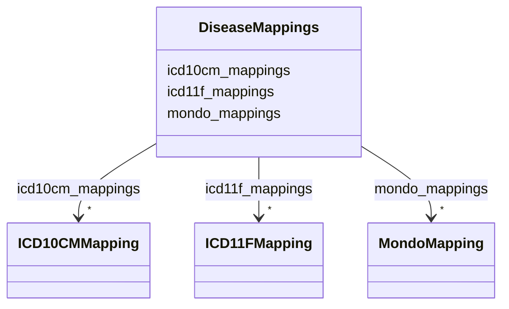

# Class: DiseaseMappings 


_Container for external identifier mappings for a disease_


URI: [dismech:class/DiseaseMappings](https://w3id.org/monarch-initiative/dismech/class/DiseaseMappings)





<!-- no inheritance hierarchy -->


## Slots

| Name | Cardinality and Range | Description | Inheritance |
| ---  | --- | --- | --- |
| [icd10cm_mappings](../slots/icd10cm_mappings.md) | * <br/> [ICD10CMMapping](../classes/ICD10CMMapping.md) | ICD-10-CM code mappings for this disease | direct |
| [icd11f_mappings](../slots/icd11f_mappings.md) | * <br/> [ICD11FMapping](../classes/ICD11FMapping.md) | ICD-11 Foundation code mappings for this disease | direct |
| [mondo_mappings](../slots/mondo_mappings.md) | * <br/> [MondoMapping](../classes/MondoMapping.md) | MONDO disease ontology mappings for this disease | direct |


## Usages

| used by | used in | type | used |
| ---  | --- | --- | --- |
| [Disease](../classes/Disease.md) | [mappings](../slots/mappings.md) | range | [DiseaseMappings](../classes/DiseaseMappings.md) |


## Identifier and Mapping Information


### Schema Source


* from schema: https://w3id.org/monarch-initiative/dismech


## Mappings

| Mapping Type | Mapped Value |
| ---  | ---  |
| self | dismech:DiseaseMappings |
| native | dismech:DiseaseMappings |


## LinkML Source

<!-- TODO: investigate https://stackoverflow.com/questions/37606292/how-to-create-tabbed-code-blocks-in-mkdocs-or-sphinx -->

### Direct

<details>
```yaml
name: DiseaseMappings
description: Container for external identifier mappings for a disease
from_schema: https://w3id.org/monarch-initiative/dismech
slots:
- icd10cm_mappings
- icd11f_mappings
- mondo_mappings

```
</details>

### Induced

<details>
```yaml
name: DiseaseMappings
description: Container for external identifier mappings for a disease
from_schema: https://w3id.org/monarch-initiative/dismech
attributes:
  icd10cm_mappings:
    name: icd10cm_mappings
    description: ICD-10-CM code mappings for this disease
    from_schema: https://w3id.org/monarch-initiative/dismech
    rank: 1000
    alias: icd10cm_mappings
    owner: DiseaseMappings
    domain_of:
    - DiseaseMappings
    range: ICD10CMMapping
    multivalued: true
    inlined: true
    inlined_as_list: true
  icd11f_mappings:
    name: icd11f_mappings
    description: ICD-11 Foundation code mappings for this disease
    from_schema: https://w3id.org/monarch-initiative/dismech
    rank: 1000
    alias: icd11f_mappings
    owner: DiseaseMappings
    domain_of:
    - DiseaseMappings
    range: ICD11FMapping
    multivalued: true
    inlined: true
    inlined_as_list: true
  mondo_mappings:
    name: mondo_mappings
    description: MONDO disease ontology mappings for this disease
    from_schema: https://w3id.org/monarch-initiative/dismech
    rank: 1000
    alias: mondo_mappings
    owner: DiseaseMappings
    domain_of:
    - DiseaseMappings
    range: MondoMapping
    multivalued: true
    inlined: true
    inlined_as_list: true

```
</details>