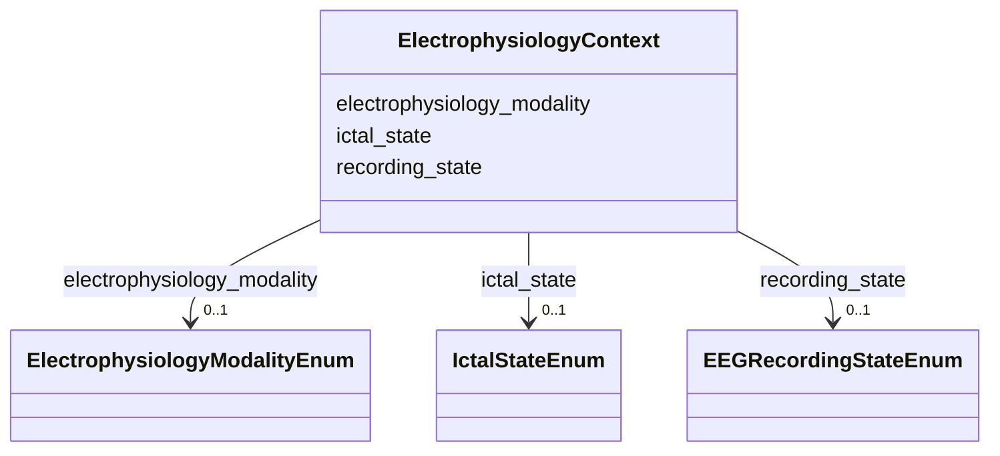

# Class: ElectrophysiologyContext 


_An optional post-composition sidecar on a Phenotype, carrying the electrophysiologic axes that a flat HP phenotype term cannot express: the modality it was recorded on, whether it is ictal/interictal/postictal, and the behavioural/activation recording state. Used ONLY on phenotypes whose phenotype_term is an electrophysiologic finding (the HP EEG/EMG/EKG abnormality subtrees, e.g. descendants of HP:0002353). Deliberately NOT a separate finding class: because electrophysiologic findings are already HP phenotypes, they live in `phenotypes` and this block only post-composes them, exactly as temporality/clinical_course/severity/onset do elsewhere._


URI: [dismech:class/ElectrophysiologyContext](https://w3id.org/monarch-initiative/dismech/class/ElectrophysiologyContext)





<!-- no inheritance hierarchy -->

## Slots

| Name | Cardinality and Range | Description | Inheritance |
| ---  | --- | --- | --- |
| [electrophysiology_modality](../slots/electrophysiology_modality.md) | 0..1 <br/> [ElectrophysiologyModalityEnum](../enums/ElectrophysiologyModalityEnum.md) | The in-vivo electrophysiologic modality on which a phenotype was recorded | direct |
| [ictal_state](../slots/ictal_state.md) | 0..1 <br/> [IctalStateEnum](../enums/IctalStateEnum.md) | Timing of an electrophysiologic finding relative to a seizure/paroxysmal even... | direct |
| [recording_state](../slots/recording_state.md) | 0..1 <br/> [EEGRecordingStateEnum](../enums/EEGRecordingStateEnum.md) | Behavioural state or activation procedure under which an EEG finding is recor... | direct |


## Usages

| used by | used in | type | used |
| ---  | --- | --- | --- |
| [Phenotype](../classes/Phenotype.md) | [electrophysiology](../slots/electrophysiology.md) | range | [ElectrophysiologyContext](../classes/ElectrophysiologyContext.md) |


## Comments

* Attach to a phenotype whose phenotype_term is under HP:0002353 (EEG), HP:0003457 (EMG), or HP:0003115 (EKG)
* Preclinical/animal electrophysiology (e.g. an electrographic seizure with no HP term) is a preferred_term-only phenotype carrying this sidecar


## Identifier and Mapping Information


### Schema Source


* from schema: https://w3id.org/monarch-initiative/dismech


## Mappings

| Mapping Type | Mapped Value |
| ---  | ---  |
| self | dismech:ElectrophysiologyContext |
| native | dismech:ElectrophysiologyContext |


## LinkML Source

<!-- TODO: investigate https://stackoverflow.com/questions/37606292/how-to-create-tabbed-code-blocks-in-mkdocs-or-sphinx -->

### Direct

<details>
```yaml
name: ElectrophysiologyContext
description: 'An optional post-composition sidecar on a Phenotype, carrying the electrophysiologic
  axes that a flat HP phenotype term cannot express: the modality it was recorded
  on, whether it is ictal/interictal/postictal, and the behavioural/activation recording
  state. Used ONLY on phenotypes whose phenotype_term is an electrophysiologic finding
  (the HP EEG/EMG/EKG abnormality subtrees, e.g. descendants of HP:0002353). Deliberately
  NOT a separate finding class: because electrophysiologic findings are already HP
  phenotypes, they live in `phenotypes` and this block only post-composes them, exactly
  as temporality/clinical_course/severity/onset do elsewhere.'
comments:
- Attach to a phenotype whose phenotype_term is under HP:0002353 (EEG), HP:0003457
  (EMG), or HP:0003115 (EKG)
- Preclinical/animal electrophysiology (e.g. an electrographic seizure with no HP
  term) is a preferred_term-only phenotype carrying this sidecar
from_schema: https://w3id.org/monarch-initiative/dismech
slots:
- electrophysiology_modality
- ictal_state
- recording_state

```
</details>

### Induced

<details>
```yaml
name: ElectrophysiologyContext
description: 'An optional post-composition sidecar on a Phenotype, carrying the electrophysiologic
  axes that a flat HP phenotype term cannot express: the modality it was recorded
  on, whether it is ictal/interictal/postictal, and the behavioural/activation recording
  state. Used ONLY on phenotypes whose phenotype_term is an electrophysiologic finding
  (the HP EEG/EMG/EKG abnormality subtrees, e.g. descendants of HP:0002353). Deliberately
  NOT a separate finding class: because electrophysiologic findings are already HP
  phenotypes, they live in `phenotypes` and this block only post-composes them, exactly
  as temporality/clinical_course/severity/onset do elsewhere.'
comments:
- Attach to a phenotype whose phenotype_term is under HP:0002353 (EEG), HP:0003457
  (EMG), or HP:0003115 (EKG)
- Preclinical/animal electrophysiology (e.g. an electrographic seizure with no HP
  term) is a preferred_term-only phenotype carrying this sidecar
from_schema: https://w3id.org/monarch-initiative/dismech
attributes:
  electrophysiology_modality:
    name: electrophysiology_modality
    description: The in-vivo electrophysiologic modality on which a phenotype was
      recorded
    from_schema: https://w3id.org/monarch-initiative/dismech
    rank: 1000
    alias: electrophysiology_modality
    owner: ElectrophysiologyContext
    domain_of:
    - ElectrophysiologyContext
    range: ElectrophysiologyModalityEnum
  ictal_state:
    name: ictal_state
    description: Timing of an electrophysiologic finding relative to a seizure/paroxysmal
      event
    from_schema: https://w3id.org/monarch-initiative/dismech
    rank: 1000
    alias: ictal_state
    owner: ElectrophysiologyContext
    domain_of:
    - ElectrophysiologyContext
    range: IctalStateEnum
  recording_state:
    name: recording_state
    description: Behavioural state or activation procedure under which an EEG finding
      is recorded
    from_schema: https://w3id.org/monarch-initiative/dismech
    rank: 1000
    alias: recording_state
    owner: ElectrophysiologyContext
    domain_of:
    - ElectrophysiologyContext
    range: EEGRecordingStateEnum

```
</details>