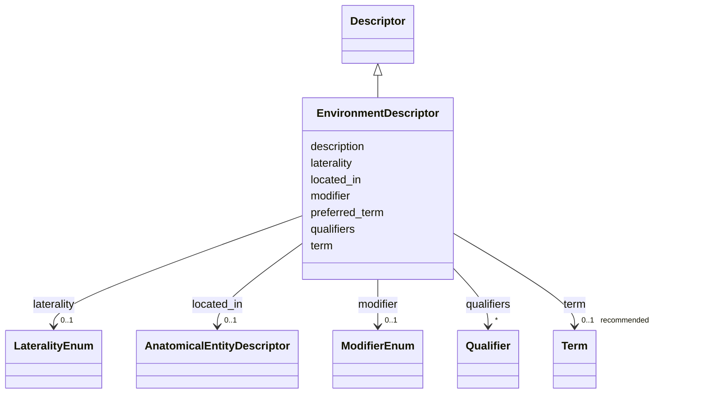

# Class: EnvironmentDescriptor 


_A descriptor for environmental contexts/settings, bindable to ENVO_


URI: [dismech:class/EnvironmentDescriptor](https://w3id.org/monarch-initiative/dismech/class/EnvironmentDescriptor)





## Inheritance
* [Descriptor](../classes/Descriptor.md)
    * **EnvironmentDescriptor**


## Slots

| Name | Cardinality and Range | Description | Inheritance |
| ---  | --- | --- | --- |
| [preferred_term](../slots/preferred_term.md) | 1 <br/> [String](../types/String.md) | The preferred human-readable term for this descriptor | [Descriptor](../classes/Descriptor.md) |
| [description](../slots/description.md) | 0..1 <br/> [String](../types/String.md) | A description of the descriptor | [Descriptor](../classes/Descriptor.md) |
| [term](../slots/term.md) | 0..1 _recommended_ <br/> [Term](../classes/Term.md) | Optional ENVO environment term reference | [Descriptor](../classes/Descriptor.md) |
| [modifier](../slots/modifier.md) | 0..1 <br/> [ModifierEnum](../enums/ModifierEnum.md) | Directional or qualitative modifier for a descriptor (e | [Descriptor](../classes/Descriptor.md) |
| [located_in](../slots/located_in.md) | 0..1 <br/> [AnatomicalEntityDescriptor](../classes/AnatomicalEntityDescriptor.md) | Anatomical location where this entity/process occurs or procedure is performe... | [Descriptor](../classes/Descriptor.md) |
| [laterality](../slots/laterality.md) | 0..1 <br/> [LateralityEnum](../enums/LateralityEnum.md) | Laterality qualifier (left, right, or bilateral) | [Descriptor](../classes/Descriptor.md) |
| [qualifiers](../slots/qualifiers.md) | * <br/> [Qualifier](../classes/Qualifier.md) | List of predicate-value pairs for formal post-composition | [Descriptor](../classes/Descriptor.md) |


## Usages

| used by | used in | type | used |
| ---  | --- | --- | --- |
| [Environmental](../classes/Environmental.md) | [environment_context](../slots/environment_context.md) | range | [EnvironmentDescriptor](../classes/EnvironmentDescriptor.md) |


## Comments

* Use ENVO (Environment Ontology) for habitats, biomes, and environmental features

## Identifier and Mapping Information


### Schema Source


* from schema: https://w3id.org/monarch-initiative/dismech


## Mappings

| Mapping Type | Mapped Value |
| ---  | ---  |
| self | dismech:EnvironmentDescriptor |
| native | dismech:EnvironmentDescriptor |


## LinkML Source

<!-- TODO: investigate https://stackoverflow.com/questions/37606292/how-to-create-tabbed-code-blocks-in-mkdocs-or-sphinx -->

### Direct

<details>
```yaml
name: EnvironmentDescriptor
description: A descriptor for environmental contexts/settings, bindable to ENVO
comments:
- Use ENVO (Environment Ontology) for habitats, biomes, and environmental features
from_schema: https://w3id.org/monarch-initiative/dismech
is_a: Descriptor
slot_usage:
  term:
    name: term
    description: Optional ENVO environment term reference
    bindings:
    - range: EnvironmentTerm
      obligation_level: REQUIRED
      binds_value_of: id

```
</details>

### Induced

<details>
```yaml
name: EnvironmentDescriptor
description: A descriptor for environmental contexts/settings, bindable to ENVO
comments:
- Use ENVO (Environment Ontology) for habitats, biomes, and environmental features
from_schema: https://w3id.org/monarch-initiative/dismech
is_a: Descriptor
slot_usage:
  term:
    name: term
    description: Optional ENVO environment term reference
    bindings:
    - range: EnvironmentTerm
      obligation_level: REQUIRED
      binds_value_of: id
attributes:
  preferred_term:
    name: preferred_term
    description: The preferred human-readable term for this descriptor. This may be
      more specific or nuanced than the linked ontology term label when the ontology
      does not fully capture the desired granularity. Note that postcomposition using
      the modifier slot may be appropriate for capturing the semantics of the preferred
      term.
    from_schema: https://w3id.org/monarch-initiative/dismech
    rank: 1000
    alias: preferred_term
    owner: EnvironmentDescriptor
    domain_of:
    - Descriptor
    - ConditionDescriptor
    range: string
    required: true
  description:
    name: description
    description: A description of the descriptor. This may typically be redundant
      with the `term` object, but the description is more human-readable and may be
      used to communicate nuances not captured by the rigid standardization of the
      term object.
    from_schema: https://w3id.org/monarch-initiative/dismech
    rank: 1000
    alias: description
    owner: EnvironmentDescriptor
    domain_of:
    - Descriptor
    - GeneticContext
    - Dataset
    - ClinicalTrial
    - ComputationalModel
    - ModelVariable
    - DifferentialDiagnosis
    - Subtype
    - CausalEdge
    - TreatmentMechanismTarget
    - ProteinStructure
    - EpidemiologyInfo
    - Pathophysiology
    - Phenotype
    - HistopathologyFinding
    - Environmental
    - Disease
    - Stage
    - AgentLifeCycle
    - AgentLifeCycleStage
    - AnimalModel
    - Treatment
    - InfectiousAgent
    - Transmission
    - Assay
    - Diagnosis
    - Inheritance
    - Variant
    - FunctionalEffect
    - Mechanism
    - ModelingConsideration
    - Definition
    - CriteriaSet
    - ConditionDescriptor
    - GOEnrichment
    - ComorbidityHypothesis
    - UpstreamConditionHypothesis
    - MechanisticHypothesis
    range: string
    recommended: false
  term:
    name: term
    description: Optional ENVO environment term reference
    from_schema: https://w3id.org/monarch-initiative/dismech
    rank: 1000
    alias: term
    owner: EnvironmentDescriptor
    domain_of:
    - Descriptor
    - TermMapping
    - ConditionDescriptor
    - GOEnrichmentTerm
    range: Term
    bindings:
    - range: EnvironmentTerm
      obligation_level: REQUIRED
      binds_value_of: id
    recommended: true
    inlined: true
  modifier:
    name: modifier
    description: Directional or qualitative modifier for a descriptor (e.g., increased,
      decreased, abnormal)
    from_schema: https://w3id.org/monarch-initiative/dismech
    rank: 1000
    alias: modifier
    owner: EnvironmentDescriptor
    domain_of:
    - Descriptor
    range: ModifierEnum
  located_in:
    name: located_in
    description: Anatomical location where this entity/process occurs or procedure
      is performed
    from_schema: https://w3id.org/monarch-initiative/dismech
    rank: 1000
    alias: located_in
    owner: EnvironmentDescriptor
    domain_of:
    - Descriptor
    range: AnatomicalEntityDescriptor
    inlined: true
  laterality:
    name: laterality
    description: Laterality qualifier (left, right, or bilateral)
    from_schema: https://w3id.org/monarch-initiative/dismech
    rank: 1000
    alias: laterality
    owner: EnvironmentDescriptor
    domain_of:
    - Descriptor
    range: LateralityEnum
  qualifiers:
    name: qualifiers
    description: List of predicate-value pairs for formal post-composition. Allows
      OWL-like expressivity with controlled predicates (e.g., RO relations) and values.
    deprecated: Prefer explicit slots like located_in and laterality instead of generic
      qualifiers
    from_schema: https://w3id.org/monarch-initiative/dismech
    rank: 1000
    alias: qualifiers
    owner: EnvironmentDescriptor
    domain_of:
    - Descriptor
    range: Qualifier
    multivalued: true
    inlined: true
    inlined_as_list: true

```
</details>