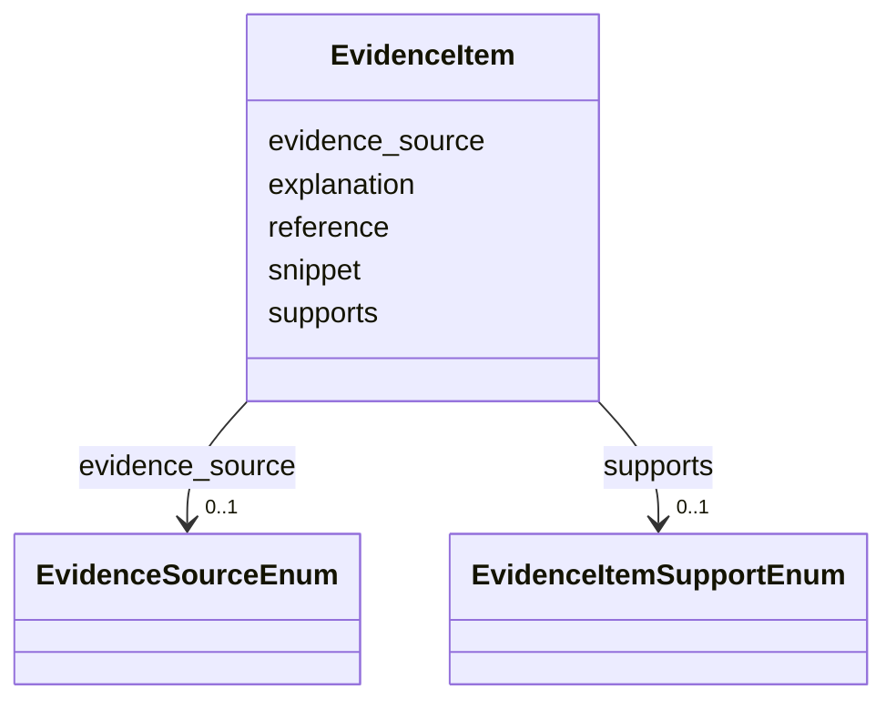

# Class: EvidenceItem 


URI: [dismech:class/EvidenceItem](https://w3id.org/monarch-initiative/dismech/class/EvidenceItem)





<!-- no inheritance hierarchy -->


## Slots

| Name | Cardinality and Range | Description | Inheritance |
| ---  | --- | --- | --- |
| [reference](../slots/reference.md) | 0..1 <br/> [PMID](../types/PMID.md) | The authoritative reference (publication) for this evidence item | direct |
| [supports](../slots/supports.md) | 0..1 <br/> [EvidenceItemSupportEnum](../enums/EvidenceItemSupportEnum.md) |  | direct |
| [evidence_source](../slots/evidence_source.md) | 0..1 <br/> [EvidenceSourceEnum](../enums/EvidenceSourceEnum.md) | Origin of the evidence item (human clinical, model organism, in vitro, or com... | direct |
| [snippet](../slots/snippet.md) | 0..1 <br/> [String](../types/String.md) | An exact excerpt/quote from the referenced publication that supports or refut... | direct |
| [explanation](../slots/explanation.md) | 0..1 <br/> [String](../types/String.md) |  | direct |


## Usages

| used by | used in | type | used |
| ---  | --- | --- | --- |
| [PhenotypeContext](../classes/PhenotypeContext.md) | [evidence](../slots/evidence.md) | range | [EvidenceItem](../classes/EvidenceItem.md) |
| [Dataset](../classes/Dataset.md) | [evidence](../slots/evidence.md) | range | [EvidenceItem](../classes/EvidenceItem.md) |
| [ClinicalTrial](../classes/ClinicalTrial.md) | [evidence](../slots/evidence.md) | range | [EvidenceItem](../classes/EvidenceItem.md) |
| [ComputationalModel](../classes/ComputationalModel.md) | [evidence](../slots/evidence.md) | range | [EvidenceItem](../classes/EvidenceItem.md) |
| [DifferentialDiagnosis](../classes/DifferentialDiagnosis.md) | [evidence](../slots/evidence.md) | range | [EvidenceItem](../classes/EvidenceItem.md) |
| [Subtype](../classes/Subtype.md) | [evidence](../slots/evidence.md) | range | [EvidenceItem](../classes/EvidenceItem.md) |
| [CausalEdge](../classes/CausalEdge.md) | [evidence](../slots/evidence.md) | range | [EvidenceItem](../classes/EvidenceItem.md) |
| [TreatmentMechanismTarget](../classes/TreatmentMechanismTarget.md) | [evidence](../slots/evidence.md) | range | [EvidenceItem](../classes/EvidenceItem.md) |
| [Finding](../classes/Finding.md) | [evidence](../slots/evidence.md) | range | [EvidenceItem](../classes/EvidenceItem.md) |
| [Prevalence](../classes/Prevalence.md) | [evidence](../slots/evidence.md) | range | [EvidenceItem](../classes/EvidenceItem.md) |
| [ProgressionInfo](../classes/ProgressionInfo.md) | [evidence](../slots/evidence.md) | range | [EvidenceItem](../classes/EvidenceItem.md) |
| [EpidemiologyInfo](../classes/EpidemiologyInfo.md) | [evidence](../slots/evidence.md) | range | [EvidenceItem](../classes/EvidenceItem.md) |
| [Pathophysiology](../classes/Pathophysiology.md) | [evidence](../slots/evidence.md) | range | [EvidenceItem](../classes/EvidenceItem.md) |
| [Phenotype](../classes/Phenotype.md) | [evidence](../slots/evidence.md) | range | [EvidenceItem](../classes/EvidenceItem.md) |
| [Biochemical](../classes/Biochemical.md) | [evidence](../slots/evidence.md) | range | [EvidenceItem](../classes/EvidenceItem.md) |
| [HistopathologyFinding](../classes/HistopathologyFinding.md) | [evidence](../slots/evidence.md) | range | [EvidenceItem](../classes/EvidenceItem.md) |
| [Genetic](../classes/Genetic.md) | [evidence](../slots/evidence.md) | range | [EvidenceItem](../classes/EvidenceItem.md) |
| [Environmental](../classes/Environmental.md) | [evidence](../slots/evidence.md) | range | [EvidenceItem](../classes/EvidenceItem.md) |
| [Stage](../classes/Stage.md) | [evidence](../slots/evidence.md) | range | [EvidenceItem](../classes/EvidenceItem.md) |
| [AgentLifeCycle](../classes/AgentLifeCycle.md) | [evidence](../slots/evidence.md) | range | [EvidenceItem](../classes/EvidenceItem.md) |
| [AgentLifeCycleStage](../classes/AgentLifeCycleStage.md) | [evidence](../slots/evidence.md) | range | [EvidenceItem](../classes/EvidenceItem.md) |
| [AnimalModel](../classes/AnimalModel.md) | [evidence](../slots/evidence.md) | range | [EvidenceItem](../classes/EvidenceItem.md) |
| [Treatment](../classes/Treatment.md) | [evidence](../slots/evidence.md) | range | [EvidenceItem](../classes/EvidenceItem.md) |
| [InfectiousAgent](../classes/InfectiousAgent.md) | [evidence](../slots/evidence.md) | range | [EvidenceItem](../classes/EvidenceItem.md) |
| [Transmission](../classes/Transmission.md) | [evidence](../slots/evidence.md) | range | [EvidenceItem](../classes/EvidenceItem.md) |
| [Diagnosis](../classes/Diagnosis.md) | [evidence](../slots/evidence.md) | range | [EvidenceItem](../classes/EvidenceItem.md) |
| [Inheritance](../classes/Inheritance.md) | [evidence](../slots/evidence.md) | range | [EvidenceItem](../classes/EvidenceItem.md) |
| [Variant](../classes/Variant.md) | [evidence](../slots/evidence.md) | range | [EvidenceItem](../classes/EvidenceItem.md) |
| [ModelingConsideration](../classes/ModelingConsideration.md) | [evidence](../slots/evidence.md) | range | [EvidenceItem](../classes/EvidenceItem.md) |
| [ClassificationAssignment](../classes/ClassificationAssignment.md) | [evidence](../slots/evidence.md) | range | [EvidenceItem](../classes/EvidenceItem.md) |
| [ICDOMorphologyAssignment](../classes/ICDOMorphologyAssignment.md) | [evidence](../slots/evidence.md) | range | [EvidenceItem](../classes/EvidenceItem.md) |
| [HarrisonsChapterAssignment](../classes/HarrisonsChapterAssignment.md) | [evidence](../slots/evidence.md) | range | [EvidenceItem](../classes/EvidenceItem.md) |
| [LysosomalStorageAssignment](../classes/LysosomalStorageAssignment.md) | [evidence](../slots/evidence.md) | range | [EvidenceItem](../classes/EvidenceItem.md) |
| [MechanisticNosologyAssignment](../classes/MechanisticNosologyAssignment.md) | [evidence](../slots/evidence.md) | range | [EvidenceItem](../classes/EvidenceItem.md) |
| [IUISAssignment](../classes/IUISAssignment.md) | [evidence](../slots/evidence.md) | range | [EvidenceItem](../classes/EvidenceItem.md) |
| [ChannelopathyAssignment](../classes/ChannelopathyAssignment.md) | [evidence](../slots/evidence.md) | range | [EvidenceItem](../classes/EvidenceItem.md) |
| [Definition](../classes/Definition.md) | [evidence](../slots/evidence.md) | range | [EvidenceItem](../classes/EvidenceItem.md) |
| [CriteriaSet](../classes/CriteriaSet.md) | [evidence](../slots/evidence.md) | range | [EvidenceItem](../classes/EvidenceItem.md) |
| [ComorbidityAssociation](../classes/ComorbidityAssociation.md) | [literature_evidence](../slots/literature_evidence.md) | range | [EvidenceItem](../classes/EvidenceItem.md) |
| [AssociationSignal](../classes/AssociationSignal.md) | [evidence](../slots/evidence.md) | range | [EvidenceItem](../classes/EvidenceItem.md) |
| [AssociationStatistics](../classes/AssociationStatistics.md) | [evidence](../slots/evidence.md) | range | [EvidenceItem](../classes/EvidenceItem.md) |
| [ComorbidityHypothesis](../classes/ComorbidityHypothesis.md) | [evidence](../slots/evidence.md) | range | [EvidenceItem](../classes/EvidenceItem.md) |
| [UpstreamConditionHypothesis](../classes/UpstreamConditionHypothesis.md) | [evidence](../slots/evidence.md) | range | [EvidenceItem](../classes/EvidenceItem.md) |
| [MechanisticHypothesis](../classes/MechanisticHypothesis.md) | [evidence](../slots/evidence.md) | range | [EvidenceItem](../classes/EvidenceItem.md) |


## Identifier and Mapping Information


### Schema Source


* from schema: https://w3id.org/monarch-initiative/dismech


## Mappings

| Mapping Type | Mapped Value |
| ---  | ---  |
| self | dismech:EvidenceItem |
| native | dismech:EvidenceItem |


## LinkML Source

<!-- TODO: investigate https://stackoverflow.com/questions/37606292/how-to-create-tabbed-code-blocks-in-mkdocs-or-sphinx -->

### Direct

<details>
```yaml
name: EvidenceItem
from_schema: https://w3id.org/monarch-initiative/dismech
slots:
- reference
- supports
- evidence_source
- snippet
- explanation

```
</details>

### Induced

<details>
```yaml
name: EvidenceItem
from_schema: https://w3id.org/monarch-initiative/dismech
attributes:
  reference:
    name: reference
    implements:
    - linkml:authoritative_reference
    description: The authoritative reference (publication) for this evidence item
    examples:
    - value: PMID:35533128
    from_schema: https://w3id.org/monarch-initiative/dismech
    rank: 1000
    alias: reference
    owner: EvidenceItem
    domain_of:
    - EvidenceItem
    - PublicationReference
    - MappingConsistency
    range: PMID
  supports:
    name: supports
    examples:
    - value: SUPPORT
    from_schema: https://w3id.org/monarch-initiative/dismech
    rank: 1000
    alias: supports
    owner: EvidenceItem
    domain_of:
    - EvidenceItem
    range: EvidenceItemSupportEnum
  evidence_source:
    name: evidence_source
    description: Origin of the evidence item (human clinical, model organism, in vitro,
      or computational)
    from_schema: https://w3id.org/monarch-initiative/dismech
    rank: 1000
    alias: evidence_source
    owner: EvidenceItem
    domain_of:
    - EvidenceItem
    range: EvidenceSourceEnum
    recommended: false
  snippet:
    name: snippet
    implements:
    - linkml:excerpt
    description: An exact excerpt/quote from the referenced publication that supports
      or refutes the claim
    comments:
    - This is automatically validated by the linkml-reference-validator tool.
    examples:
    - value: At the moment there is no healing therapy, so early kidney transplant
        is a fundamental tool to improve prognosis.
    from_schema: https://w3id.org/monarch-initiative/dismech
    rank: 1000
    alias: snippet
    owner: EvidenceItem
    domain_of:
    - EvidenceItem
    range: string
  explanation:
    name: explanation
    examples:
    - value: There is no curative treatment for nephronophthisis, indicating that
        supportive care, including symptomatic treatment and monitoring, is currently
        applied to manage associated complications.
    from_schema: https://w3id.org/monarch-initiative/dismech
    rank: 1000
    alias: explanation
    owner: EvidenceItem
    domain_of:
    - EvidenceItem
    range: string

```
</details>