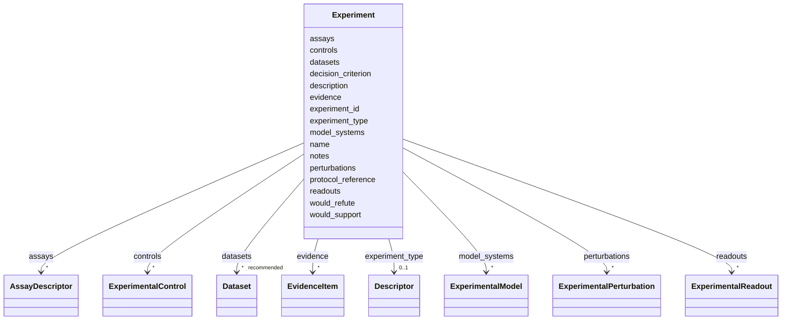

# Class: Experiment 


_A structured experiment or protocol-level study design that can be proposed to resolve a knowledge gap, or later reused to represent experiments that have been carried out. The object itself is intentionally status-neutral: proposal, execution, and evidentiary status are expressed by the containing slot or future evidence context._


URI: [dismech:class/Experiment](https://w3id.org/monarch-initiative/dismech/class/Experiment)





<!-- no inheritance hierarchy -->

## Slots

| Name | Cardinality and Range | Description | Inheritance |
| ---  | --- | --- | --- |
| [experiment_id](../slots/experiment_id.md) | 1 <br/> [String](../types/String.md) | Stable identifier for an Experiment within a disease entry | direct |
| [name](../slots/name.md) | 1 <br/> [String](../types/String.md) |  | direct |
| [description](../slots/description.md) | 0..1 <br/> [String](../types/String.md) |  | direct |
| [experiment_type](../slots/experiment_type.md) | 0..1 <br/> [Descriptor](../classes/Descriptor.md) | Ontology-backed descriptor for the overall experiment or study design | direct |
| [model_systems](../slots/model_systems.md) | * <br/> [ExperimentalModel](../classes/ExperimentalModel.md) | Experimental model systems used or proposed for an experiment, using the Expe... | direct |
| [perturbations](../slots/perturbations.md) | * <br/> [ExperimentalPerturbation](../classes/ExperimentalPerturbation.md) | Interventions or manipulations applied in the experiment | direct |
| [assays](../slots/assays.md) | * <br/> [AssayDescriptor](../classes/AssayDescriptor.md) | Ontology-backed assays used by the experiment; prefer OBI terms when availabl... | direct |
| [readouts](../slots/readouts.md) | * <br/> [ExperimentalReadout](../classes/ExperimentalReadout.md) | Measurements or outcomes interpreted against disease pathograph nodes, phenot... | direct |
| [controls](../slots/controls.md) | * <br/> [ExperimentalControl](../classes/ExperimentalControl.md) | Experimental controls, comparators, or counterfactual arms | direct |
| [decision_criterion](../slots/decision_criterion.md) | 0..1 <br/> [String](../types/String.md) | Pre-specified qualitative or quantitative criterion for interpreting the expe... | direct |
| [would_support](../slots/would_support.md) | * <br/> [String](../types/String.md) | Entity references that would be supported if the experiment meets its decisio... | direct |
| [would_refute](../slots/would_refute.md) | * <br/> [String](../types/String.md) | Entity references that would be weakened or refuted if the experiment meets a... | direct |
| [protocol_reference](../slots/protocol_reference.md) | 0..1 <br/> [String](../types/String.md) | Optional protocol, methods paper, or registry reference for the experimental ... | direct |
| [datasets](../slots/datasets.md) | * _recommended_ <br/> [Dataset](../classes/Dataset.md) | Publicly available datasets relevant to disease research | direct |
| [evidence](../slots/evidence.md) | * <br/> [EvidenceItem](../classes/EvidenceItem.md) | Literature, protocol papers, or dataset evidence supporting the feasibility, ... | direct |
| [notes](../slots/notes.md) | 0..1 <br/> [String](../types/String.md) |  | direct |


## Usages

| used by | used in | type | used |
| ---  | --- | --- | --- |
| [Discussion](../classes/Discussion.md) | [proposed_experiments](../slots/proposed_experiments.md) | range | [Experiment](../classes/Experiment.md) |


## Comments

* In `Discussion.proposed_experiments`, the containing slot means the experiment is proposed as a response to an open question or knowledge gap.
* Use `model_systems` for NAMO-aligned models, `perturbations` for pathograph/gene/chemical/exposure manipulations, and `readouts` for ontology-backed outcome or mechanism measurements.


## Identifier and Mapping Information


### Schema Source


* from schema: https://w3id.org/monarch-initiative/dismech


## Mappings

| Mapping Type | Mapped Value |
| ---  | ---  |
| self | dismech:Experiment |
| native | dismech:Experiment |


## LinkML Source

<!-- TODO: investigate https://stackoverflow.com/questions/37606292/how-to-create-tabbed-code-blocks-in-mkdocs-or-sphinx -->

### Direct

<details>
```yaml
name: Experiment
description: 'A structured experiment or protocol-level study design that can be proposed
  to resolve a knowledge gap, or later reused to represent experiments that have been
  carried out. The object itself is intentionally status-neutral: proposal, execution,
  and evidentiary status are expressed by the containing slot or future evidence context.'
comments:
- In `Discussion.proposed_experiments`, the containing slot means the experiment is
  proposed as a response to an open question or knowledge gap.
- Use `model_systems` for NAMO-aligned models, `perturbations` for pathograph/gene/chemical/exposure
  manipulations, and `readouts` for ontology-backed outcome or mechanism measurements.
from_schema: https://w3id.org/monarch-initiative/dismech
slots:
- experiment_id
- name
- description
- experiment_type
- model_systems
- perturbations
- assays
- readouts
- controls
- decision_criterion
- would_support
- would_refute
- protocol_reference
- datasets
- evidence
- notes
slot_usage:
  experiment_id:
    name: experiment_id
    required: true
  perturbations:
    name: perturbations
    description: Interventions or manipulations applied in the experiment. These may
      target disease pathograph nodes, genes, chemical entities, treatments, exposures,
      triggers, or biological processes.
    range: ExperimentalPerturbation
    inlined_as_list: true
  readouts:
    name: readouts
    description: Measurements or outcomes interpreted against disease pathograph nodes,
      phenotypes, biomarkers, or biological processes.
    range: ExperimentalReadout
    inlined_as_list: true
  assays:
    name: assays
    description: Ontology-backed assays used by the experiment; prefer OBI terms when
      available.
  evidence:
    name: evidence
    description: Literature, protocol papers, or dataset evidence supporting the feasibility,
      precedent, or design rationale for this experiment.
    recommended: false

```
</details>

### Induced

<details>
```yaml
name: Experiment
description: 'A structured experiment or protocol-level study design that can be proposed
  to resolve a knowledge gap, or later reused to represent experiments that have been
  carried out. The object itself is intentionally status-neutral: proposal, execution,
  and evidentiary status are expressed by the containing slot or future evidence context.'
comments:
- In `Discussion.proposed_experiments`, the containing slot means the experiment is
  proposed as a response to an open question or knowledge gap.
- Use `model_systems` for NAMO-aligned models, `perturbations` for pathograph/gene/chemical/exposure
  manipulations, and `readouts` for ontology-backed outcome or mechanism measurements.
from_schema: https://w3id.org/monarch-initiative/dismech
slot_usage:
  experiment_id:
    name: experiment_id
    required: true
  perturbations:
    name: perturbations
    description: Interventions or manipulations applied in the experiment. These may
      target disease pathograph nodes, genes, chemical entities, treatments, exposures,
      triggers, or biological processes.
    range: ExperimentalPerturbation
    inlined_as_list: true
  readouts:
    name: readouts
    description: Measurements or outcomes interpreted against disease pathograph nodes,
      phenotypes, biomarkers, or biological processes.
    range: ExperimentalReadout
    inlined_as_list: true
  assays:
    name: assays
    description: Ontology-backed assays used by the experiment; prefer OBI terms when
      available.
  evidence:
    name: evidence
    description: Literature, protocol papers, or dataset evidence supporting the feasibility,
      precedent, or design rationale for this experiment.
    recommended: false
attributes:
  experiment_id:
    name: experiment_id
    description: Stable identifier for an Experiment within a disease entry
    from_schema: https://w3id.org/monarch-initiative/dismech
    rank: 1000
    alias: experiment_id
    owner: Experiment
    domain_of:
    - Experiment
    range: string
    required: true
  name:
    name: name
    examples:
    - value: Adolescent Nephronophthisis
    from_schema: https://w3id.org/monarch-initiative/dismech
    rank: 1000
    identifier: true
    alias: name
    owner: Experiment
    domain_of:
    - ExperimentalModel
    - Experiment
    - ExperimentalPerturbation
    - ExperimentalReadout
    - ExperimentalControl
    - ClinicalTrial
    - ComputationalModel
    - ModelVariable
    - SeverityTier
    - DifferentialDiagnosis
    - Subtype
    - ReferenceRangeBand
    - SurrogateEndpointCollection
    - ExternalAssertion
    - EpidemiologyInfo
    - Pathophysiology
    - Phenotype
    - Biochemical
    - HistopathologyFinding
    - Genetic
    - Environmental
    - Disease
    - Stage
    - AgentLifeCycleStage
    - Treatment
    - InfectiousAgent
    - Transmission
    - Assay
    - Diagnosis
    - Inheritance
    - Variant
    - Mechanism
    - ModelingConsideration
    - Definition
    - CriteriaSet
    - ComorbidityAssociation
    - Grouping
    range: string
    required: true
  description:
    name: description
    from_schema: https://w3id.org/monarch-initiative/dismech
    rank: 1000
    alias: description
    owner: Experiment
    domain_of:
    - Descriptor
    - DietaryModification
    - GeneticContext
    - Dataset
    - ExperimentalModel
    - Experiment
    - ExperimentalPerturbation
    - ExperimentalReadout
    - ExperimentalControl
    - ClinicalTrial
    - ComputationalModel
    - ModelVariable
    - DifferentialDiagnosis
    - Subtype
    - CausalEdge
    - TreatmentMechanismTarget
    - ModelMechanismLink
    - BiomarkerReadout
    - SurrogateEndpointCollection
    - ProteinStructure
    - ExternalAssertion
    - EpidemiologyInfo
    - Pathophysiology
    - Phenotype
    - HistopathologyFinding
    - Environmental
    - Disease
    - Stage
    - AgentLifeCycle
    - AgentLifeCycleStage
    - AnimalModel
    - Treatment
    - InfectiousAgent
    - Transmission
    - Assay
    - Diagnosis
    - Inheritance
    - Variant
    - FunctionalEffect
    - Mechanism
    - ModelingConsideration
    - Definition
    - CriteriaSet
    - ConditionDescriptor
    - GOEnrichment
    - ComorbidityHypothesis
    - UpstreamConditionHypothesis
    - MechanisticHypothesis
    - Grouping
    - GroupingCriteria
    - LogicalCriterion
    - DifferentiatingMechanism
    range: string
  experiment_type:
    name: experiment_type
    description: Ontology-backed descriptor for the overall experiment or study design.
      Prefer OBI terms when available; assay-level details should go in the `assays`
      slot.
    from_schema: https://w3id.org/monarch-initiative/dismech
    rank: 1000
    alias: experiment_type
    owner: Experiment
    domain_of:
    - Experiment
    range: Descriptor
    inlined: true
  model_systems:
    name: model_systems
    description: Experimental model systems used or proposed for an experiment, using
      the ExperimentalModel pattern and optional NAMO alignment.
    from_schema: https://w3id.org/monarch-initiative/dismech
    rank: 1000
    alias: model_systems
    owner: Experiment
    domain_of:
    - Experiment
    - ExperimentalControl
    range: ExperimentalModel
    multivalued: true
    inlined: true
    inlined_as_list: true
  perturbations:
    name: perturbations
    description: Interventions or manipulations applied in the experiment. These may
      target disease pathograph nodes, genes, chemical entities, treatments, exposures,
      triggers, or biological processes.
    from_schema: https://w3id.org/monarch-initiative/dismech
    rank: 1000
    alias: perturbations
    owner: Experiment
    domain_of:
    - Experiment
    - ExperimentalControl
    - ComputationalModel
    range: ExperimentalPerturbation
    multivalued: true
    inlined: true
    inlined_as_list: true
  assays:
    name: assays
    description: Ontology-backed assays used by the experiment; prefer OBI terms when
      available.
    examples:
    - value: '[{preferred_term: Elevated Blood Glucose}]'
    from_schema: https://w3id.org/monarch-initiative/dismech
    rank: 1000
    alias: assays
    owner: Experiment
    domain_of:
    - Experiment
    - ExperimentalReadout
    - Pathophysiology
    - Biochemical
    range: AssayDescriptor
    multivalued: true
    inlined: true
    inlined_as_list: true
  readouts:
    name: readouts
    description: Measurements or outcomes interpreted against disease pathograph nodes,
      phenotypes, biomarkers, or biological processes.
    comments:
    - Target names should match pathophysiology or phenotype entry names in the same
      disease file
    - Readout links are observational/associative, not causal disease-progression
      edges
    - Use evidence on the readout link when the biomarker-to-mechanism mapping is
      distinct from the biomarker's own evidence
    from_schema: https://w3id.org/monarch-initiative/dismech
    rank: 1000
    alias: readouts
    owner: Experiment
    domain_of:
    - Experiment
    - Biochemical
    range: ExperimentalReadout
    multivalued: true
    inlined: true
    inlined_as_list: true
  controls:
    name: controls
    description: Experimental controls, comparators, or counterfactual arms
    from_schema: https://w3id.org/monarch-initiative/dismech
    rank: 1000
    alias: controls
    owner: Experiment
    domain_of:
    - Experiment
    range: ExperimentalControl
    multivalued: true
    inlined: true
    inlined_as_list: true
  decision_criterion:
    name: decision_criterion
    description: Pre-specified qualitative or quantitative criterion for interpreting
      the experiment relative to the attached discussion or knowledge gap.
    from_schema: https://w3id.org/monarch-initiative/dismech
    rank: 1000
    alias: decision_criterion
    owner: Experiment
    domain_of:
    - Experiment
    range: string
  would_support:
    name: would_support
    description: Entity references that would be supported if the experiment meets
      its decision criterion. Uses the same hash-anchor grammar as `attaches_to`.
    from_schema: https://w3id.org/monarch-initiative/dismech
    rank: 1000
    alias: would_support
    owner: Experiment
    domain_of:
    - Experiment
    range: string
    multivalued: true
  would_refute:
    name: would_refute
    description: Entity references that would be weakened or refuted if the experiment
      meets a contrary result. Uses the same hash-anchor grammar as `attaches_to`.
    from_schema: https://w3id.org/monarch-initiative/dismech
    rank: 1000
    alias: would_refute
    owner: Experiment
    domain_of:
    - Experiment
    range: string
    multivalued: true
  protocol_reference:
    name: protocol_reference
    description: Optional protocol, methods paper, or registry reference for the experimental
      workflow. May be a PMID, DOI, protocols.io DOI, URL, or other stable identifier.
    from_schema: https://w3id.org/monarch-initiative/dismech
    rank: 1000
    alias: protocol_reference
    owner: Experiment
    domain_of:
    - Experiment
    range: string
  datasets:
    name: datasets
    description: Publicly available datasets relevant to disease research
    from_schema: https://w3id.org/monarch-initiative/dismech
    rank: 1000
    alias: datasets
    owner: Experiment
    domain_of:
    - Experiment
    - Disease
    range: Dataset
    recommended: true
    multivalued: true
    inlined: true
    inlined_as_list: true
  evidence:
    name: evidence
    description: Literature, protocol papers, or dataset evidence supporting the feasibility,
      precedent, or design rationale for this experiment.
    from_schema: https://w3id.org/monarch-initiative/dismech
    rank: 1000
    alias: evidence
    owner: Experiment
    domain_of:
    - PhenotypeContext
    - Dataset
    - ExperimentalModel
    - Experiment
    - ExperimentalPerturbation
    - ExperimentalReadout
    - ExperimentalControl
    - ClinicalTrial
    - ComputationalModel
    - DifferentialDiagnosis
    - Subtype
    - CausalEdge
    - TreatmentMechanismTarget
    - ModelMechanismLink
    - BiomarkerReadout
    - ReferenceRange
    - SurrogateEndpoint
    - ExternalAssertion
    - Finding
    - Prevalence
    - ProgressionInfo
    - EpidemiologyInfo
    - Pathophysiology
    - Phenotype
    - Biochemical
    - HistopathologyFinding
    - Genetic
    - Environmental
    - Stage
    - AgentLifeCycle
    - AgentLifeCycleStage
    - AnimalModel
    - Treatment
    - InfectiousAgent
    - Transmission
    - Diagnosis
    - Inheritance
    - Variant
    - ModelingConsideration
    - ClassificationAssignment
    - Definition
    - CriteriaSet
    - AssociationSignal
    - AssociationStatistics
    - ComorbidityHypothesis
    - UpstreamConditionHypothesis
    - MechanisticHypothesis
    - Discussion
    - GroupingCriteria
    - GroupingMember
    - DifferentiatingMechanism
    range: EvidenceItem
    recommended: false
    multivalued: true
    inlined: true
    inlined_as_list: true
  notes:
    name: notes
    examples:
    - value: Contagious stage where symptoms appear and the bacteria can be spread
        to others.
    from_schema: https://w3id.org/monarch-initiative/dismech
    rank: 1000
    alias: notes
    owner: Experiment
    domain_of:
    - GeneticContext
    - OnsetDescriptor
    - PhenotypeContext
    - Dataset
    - ExperimentalModel
    - Experiment
    - ExperimentalPerturbation
    - ExperimentalReadout
    - ExperimentalControl
    - ClinicalTrial
    - ComputationalModel
    - ModelVariable
    - DifferentialDiagnosis
    - ReferenceRange
    - SurrogateEndpoint
    - SurrogateEndpointCollection
    - ExternalAssertion
    - TrackedIssue
    - Prevalence
    - ProgressionInfo
    - EpidemiologyInfo
    - Pathophysiology
    - Phenotype
    - Biochemical
    - HistopathologyFinding
    - Genetic
    - Environmental
    - Disease
    - Stage
    - AgentLifeCycle
    - AgentLifeCycleStage
    - Treatment
    - Transmission
    - Diagnosis
    - ClassificationAssignment
    - Definition
    - CriteriaSet
    - TermMapping
    - MappingConsistency
    - ComorbidityAssociation
    - AssociationSignal
    - AssociationMetric
    - AssociationStatistics
    - MechanisticHypothesis
    - Discussion
    - Grouping
    - GroupingCriteria
    - GroupingMember
    - DifferentiatingMechanism
    range: string

```
</details>