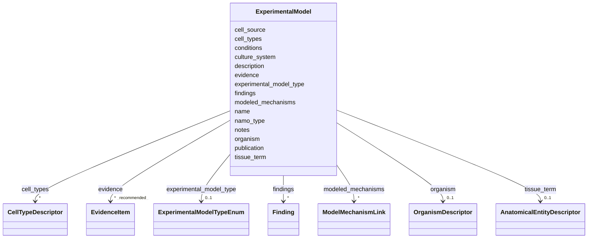

# Class: ExperimentalModel 


_A disease-relevant non-animal experimental model system. This is a disease-centric bridge class inspired by NAMO, intended to capture the model itself while keeping dismech focused on disease mechanisms rather than study-level model registries._


URI: [dismech:class/ExperimentalModel](https://w3id.org/monarch-initiative/dismech/class/ExperimentalModel)





<!-- no inheritance hierarchy -->

## Slots

| Name | Cardinality and Range | Description | Inheritance |
| ---  | --- | --- | --- |
| [name](../slots/name.md) | 1 <br/> [String](../types/String.md) |  | direct |
| [description](../slots/description.md) | 0..1 <br/> [String](../types/String.md) |  | direct |
| [experimental_model_type](../slots/experimental_model_type.md) | 0..1 <br/> [ExperimentalModelTypeEnum](../enums/ExperimentalModelTypeEnum.md) | Broad category for an experimental model system | direct |
| [namo_type](../slots/namo_type.md) | 0..1 <br/> [Uriorcurie](../types/Uriorcurie.md) | Optional mapping to the corresponding NAMO class, such as `namo:Organoid` or ... | direct |
| [organism](../slots/organism.md) | 0..1 <br/> [OrganismDescriptor](../classes/OrganismDescriptor.md) | The organism from which samples were derived | direct |
| [tissue_term](../slots/tissue_term.md) | 0..1 <br/> [AnatomicalEntityDescriptor](../classes/AnatomicalEntityDescriptor.md) | UBERON term for the tissue | direct |
| [cell_types](../slots/cell_types.md) | * <br/> [CellTypeDescriptor](../classes/CellTypeDescriptor.md) |  | direct |
| [conditions](../slots/conditions.md) | * <br/> [String](../types/String.md) | Experimental conditions or disease states represented | direct |
| [cell_source](../slots/cell_source.md) | 0..1 <br/> [String](../types/String.md) | Source of cells used in the experimental model | direct |
| [culture_system](../slots/culture_system.md) | 0..1 <br/> [String](../types/String.md) | Culture format or device context used by the experimental model | direct |
| [publication](../slots/publication.md) | 0..1 <br/> [PMID](../types/PMID.md) | Associated publication (PMID) | direct |
| [modeled_mechanisms](../slots/modeled_mechanisms.md) | * <br/> [ModelMechanismLink](../classes/ModelMechanismLink.md) | Pathophysiology mechanism nodes/assertions that this experimental model is in... | direct |
| [findings](../slots/findings.md) | * <br/> [Finding](../classes/Finding.md) | Key findings or claims extracted from this source (publication or dataset) | direct |
| [evidence](../slots/evidence.md) | * _recommended_ <br/> [EvidenceItem](../classes/EvidenceItem.md) |  | direct |
| [notes](../slots/notes.md) | 0..1 <br/> [String](../types/String.md) |  | direct |


## Usages

| used by | used in | type | used |
| ---  | --- | --- | --- |
| [Experiment](../classes/Experiment.md) | [model_systems](../slots/model_systems.md) | range | [ExperimentalModel](../classes/ExperimentalModel.md) |
| [ExperimentalControl](../classes/ExperimentalControl.md) | [model_systems](../slots/model_systems.md) | range | [ExperimentalModel](../classes/ExperimentalModel.md) |
| [Disease](../classes/Disease.md) | [experimental_models](../slots/experimental_models.md) | range | [ExperimentalModel](../classes/ExperimentalModel.md) |


## Comments

* Use `namo_type` to map to a corresponding NAMO class when applicable
* Prefer `experimental_model_type` for broad local categorization and `description` or `notes` for disease-specific nuance
* Use `cell_source` to record whether the system is patient-derived, iPSC-derived, primary, immortalized, or mixed


## Identifier and Mapping Information


### Schema Source


* from schema: https://w3id.org/monarch-initiative/dismech


## Mappings

| Mapping Type | Mapped Value |
| ---  | ---  |
| self | dismech:ExperimentalModel |
| native | dismech:ExperimentalModel |


## LinkML Source

<!-- TODO: investigate https://stackoverflow.com/questions/37606292/how-to-create-tabbed-code-blocks-in-mkdocs-or-sphinx -->

### Direct

<details>
```yaml
name: ExperimentalModel
description: A disease-relevant non-animal experimental model system. This is a disease-centric
  bridge class inspired by NAMO, intended to capture the model itself while keeping
  dismech focused on disease mechanisms rather than study-level model registries.
comments:
- Use `namo_type` to map to a corresponding NAMO class when applicable
- Prefer `experimental_model_type` for broad local categorization and `description`
  or `notes` for disease-specific nuance
- Use `cell_source` to record whether the system is patient-derived, iPSC-derived,
  primary, immortalized, or mixed
from_schema: https://w3id.org/monarch-initiative/dismech
slots:
- name
- description
- experimental_model_type
- namo_type
- organism
- tissue_term
- cell_types
- conditions
- cell_source
- culture_system
- publication
- modeled_mechanisms
- findings
- evidence
- notes

```
</details>

### Induced

<details>
```yaml
name: ExperimentalModel
description: A disease-relevant non-animal experimental model system. This is a disease-centric
  bridge class inspired by NAMO, intended to capture the model itself while keeping
  dismech focused on disease mechanisms rather than study-level model registries.
comments:
- Use `namo_type` to map to a corresponding NAMO class when applicable
- Prefer `experimental_model_type` for broad local categorization and `description`
  or `notes` for disease-specific nuance
- Use `cell_source` to record whether the system is patient-derived, iPSC-derived,
  primary, immortalized, or mixed
from_schema: https://w3id.org/monarch-initiative/dismech
attributes:
  name:
    name: name
    examples:
    - value: Adolescent Nephronophthisis
    from_schema: https://w3id.org/monarch-initiative/dismech
    rank: 1000
    identifier: true
    alias: name
    owner: ExperimentalModel
    domain_of:
    - ExperimentalModel
    - Experiment
    - ExperimentalPerturbation
    - ExperimentalReadout
    - ExperimentalControl
    - ClinicalTrial
    - ComputationalModel
    - ModelVariable
    - SeverityTier
    - DifferentialDiagnosis
    - Subtype
    - ReferenceRangeBand
    - SurrogateEndpointCollection
    - ExternalAssertion
    - EpidemiologyInfo
    - Pathophysiology
    - Phenotype
    - Biochemical
    - HistopathologyFinding
    - Genetic
    - Environmental
    - Disease
    - Stage
    - AgentLifeCycleStage
    - Treatment
    - InfectiousAgent
    - Transmission
    - Assay
    - Diagnosis
    - Inheritance
    - Variant
    - Mechanism
    - ModelingConsideration
    - Definition
    - CriteriaSet
    - ComorbidityAssociation
    - Grouping
    range: string
    required: true
  description:
    name: description
    from_schema: https://w3id.org/monarch-initiative/dismech
    rank: 1000
    alias: description
    owner: ExperimentalModel
    domain_of:
    - Descriptor
    - DietaryModification
    - GeneticContext
    - Dataset
    - ExperimentalModel
    - Experiment
    - ExperimentalPerturbation
    - ExperimentalReadout
    - ExperimentalControl
    - ClinicalTrial
    - ComputationalModel
    - ModelVariable
    - DifferentialDiagnosis
    - Subtype
    - CausalEdge
    - TreatmentMechanismTarget
    - ModelMechanismLink
    - BiomarkerReadout
    - SurrogateEndpointCollection
    - ProteinStructure
    - ExternalAssertion
    - EpidemiologyInfo
    - Pathophysiology
    - Phenotype
    - HistopathologyFinding
    - Environmental
    - Disease
    - Stage
    - AgentLifeCycle
    - AgentLifeCycleStage
    - AnimalModel
    - Treatment
    - InfectiousAgent
    - Transmission
    - Assay
    - Diagnosis
    - Inheritance
    - Variant
    - FunctionalEffect
    - Mechanism
    - ModelingConsideration
    - Definition
    - CriteriaSet
    - ConditionDescriptor
    - GOEnrichment
    - ComorbidityHypothesis
    - UpstreamConditionHypothesis
    - MechanisticHypothesis
    - Grouping
    - GroupingCriteria
    - LogicalCriterion
    - DifferentiatingMechanism
    range: string
  experimental_model_type:
    name: experimental_model_type
    description: Broad category for an experimental model system
    from_schema: https://w3id.org/monarch-initiative/dismech
    rank: 1000
    alias: experimental_model_type
    owner: ExperimentalModel
    domain_of:
    - ExperimentalModel
    range: ExperimentalModelTypeEnum
  namo_type:
    name: namo_type
    description: Optional mapping to the corresponding NAMO class, such as `namo:Organoid`
      or `namo:OrganOnChip`.
    from_schema: https://w3id.org/monarch-initiative/dismech
    rank: 1000
    alias: namo_type
    owner: ExperimentalModel
    domain_of:
    - ExperimentalModel
    range: uriorcurie
  organism:
    name: organism
    description: The organism from which samples were derived
    from_schema: https://w3id.org/monarch-initiative/dismech
    rank: 1000
    alias: organism
    owner: ExperimentalModel
    domain_of:
    - Dataset
    - ExperimentalModel
    range: OrganismDescriptor
    inlined: true
  tissue_term:
    name: tissue_term
    description: UBERON term for the tissue
    from_schema: https://w3id.org/monarch-initiative/dismech
    rank: 1000
    alias: tissue_term
    owner: ExperimentalModel
    domain_of:
    - SampleTypeDescriptor
    - ExperimentalModel
    range: AnatomicalEntityDescriptor
    inlined: true
  cell_types:
    name: cell_types
    examples:
    - value: '[{preferred_term: Macrophage}, {preferred_term: T Cell}]'
    from_schema: https://w3id.org/monarch-initiative/dismech
    rank: 1000
    alias: cell_types
    owner: ExperimentalModel
    domain_of:
    - ExperimentalModel
    - Pathophysiology
    - Biochemical
    range: CellTypeDescriptor
    multivalued: true
    inlined: true
    inlined_as_list: true
  conditions:
    name: conditions
    description: Experimental conditions or disease states represented
    from_schema: https://w3id.org/monarch-initiative/dismech
    rank: 1000
    alias: conditions
    owner: ExperimentalModel
    domain_of:
    - Dataset
    - ExperimentalModel
    range: string
    multivalued: true
  cell_source:
    name: cell_source
    description: Source of cells used in the experimental model
    from_schema: https://w3id.org/monarch-initiative/dismech
    rank: 1000
    alias: cell_source
    owner: ExperimentalModel
    domain_of:
    - ExperimentalModel
    range: string
  culture_system:
    name: culture_system
    description: Culture format or device context used by the experimental model
    from_schema: https://w3id.org/monarch-initiative/dismech
    rank: 1000
    alias: culture_system
    owner: ExperimentalModel
    domain_of:
    - ExperimentalModel
    range: string
  publication:
    name: publication
    description: Associated publication (PMID)
    from_schema: https://w3id.org/monarch-initiative/dismech
    rank: 1000
    alias: publication
    owner: ExperimentalModel
    domain_of:
    - Dataset
    - ExperimentalModel
    - ComputationalModel
    - ProteinStructure
    range: PMID
  modeled_mechanisms:
    name: modeled_mechanisms
    description: Pathophysiology mechanism nodes/assertions that this experimental
      model is intended to recapitulate, perturb, or measure within the disease pathograph.
    comments:
    - Target names should match pathophysiology entry names in the same disease file
    - Use description to capture the specific assayable or modeled assertion, not
      just the node label
    - Kept intentionally lightweight so it can later align more explicitly with NAMO
      relations
    from_schema: https://w3id.org/monarch-initiative/dismech
    rank: 1000
    alias: modeled_mechanisms
    owner: ExperimentalModel
    domain_of:
    - ExperimentalModel
    - ComputationalModel
    range: ModelMechanismLink
    multivalued: true
    inlined: true
    inlined_as_list: true
  findings:
    name: findings
    description: Key findings or claims extracted from this source (publication or
      dataset)
    from_schema: https://w3id.org/monarch-initiative/dismech
    rank: 1000
    alias: findings
    owner: ExperimentalModel
    domain_of:
    - Dataset
    - ExperimentalModel
    - ComputationalModel
    - PublicationReference
    range: Finding
    multivalued: true
    inlined: true
    inlined_as_list: true
  evidence:
    name: evidence
    from_schema: https://w3id.org/monarch-initiative/dismech
    rank: 1000
    alias: evidence
    owner: ExperimentalModel
    domain_of:
    - PhenotypeContext
    - Dataset
    - ExperimentalModel
    - Experiment
    - ExperimentalPerturbation
    - ExperimentalReadout
    - ExperimentalControl
    - ClinicalTrial
    - ComputationalModel
    - DifferentialDiagnosis
    - Subtype
    - CausalEdge
    - TreatmentMechanismTarget
    - ModelMechanismLink
    - BiomarkerReadout
    - ReferenceRange
    - SurrogateEndpoint
    - ExternalAssertion
    - Finding
    - Prevalence
    - ProgressionInfo
    - EpidemiologyInfo
    - Pathophysiology
    - Phenotype
    - Biochemical
    - HistopathologyFinding
    - Genetic
    - Environmental
    - Stage
    - AgentLifeCycle
    - AgentLifeCycleStage
    - AnimalModel
    - Treatment
    - InfectiousAgent
    - Transmission
    - Diagnosis
    - Inheritance
    - Variant
    - ModelingConsideration
    - ClassificationAssignment
    - Definition
    - CriteriaSet
    - AssociationSignal
    - AssociationStatistics
    - ComorbidityHypothesis
    - UpstreamConditionHypothesis
    - MechanisticHypothesis
    - Discussion
    - GroupingCriteria
    - GroupingMember
    - DifferentiatingMechanism
    range: EvidenceItem
    recommended: true
    multivalued: true
    inlined: true
    inlined_as_list: true
  notes:
    name: notes
    examples:
    - value: Contagious stage where symptoms appear and the bacteria can be spread
        to others.
    from_schema: https://w3id.org/monarch-initiative/dismech
    rank: 1000
    alias: notes
    owner: ExperimentalModel
    domain_of:
    - GeneticContext
    - OnsetDescriptor
    - PhenotypeContext
    - Dataset
    - ExperimentalModel
    - Experiment
    - ExperimentalPerturbation
    - ExperimentalReadout
    - ExperimentalControl
    - ClinicalTrial
    - ComputationalModel
    - ModelVariable
    - DifferentialDiagnosis
    - ReferenceRange
    - SurrogateEndpoint
    - SurrogateEndpointCollection
    - ExternalAssertion
    - TrackedIssue
    - Prevalence
    - ProgressionInfo
    - EpidemiologyInfo
    - Pathophysiology
    - Phenotype
    - Biochemical
    - HistopathologyFinding
    - Genetic
    - Environmental
    - Disease
    - Stage
    - AgentLifeCycle
    - AgentLifeCycleStage
    - Treatment
    - Transmission
    - Diagnosis
    - ClassificationAssignment
    - Definition
    - CriteriaSet
    - TermMapping
    - MappingConsistency
    - ComorbidityAssociation
    - AssociationSignal
    - AssociationMetric
    - AssociationStatistics
    - MechanisticHypothesis
    - Discussion
    - Grouping
    - GroupingCriteria
    - GroupingMember
    - DifferentiatingMechanism
    range: string

```
</details>