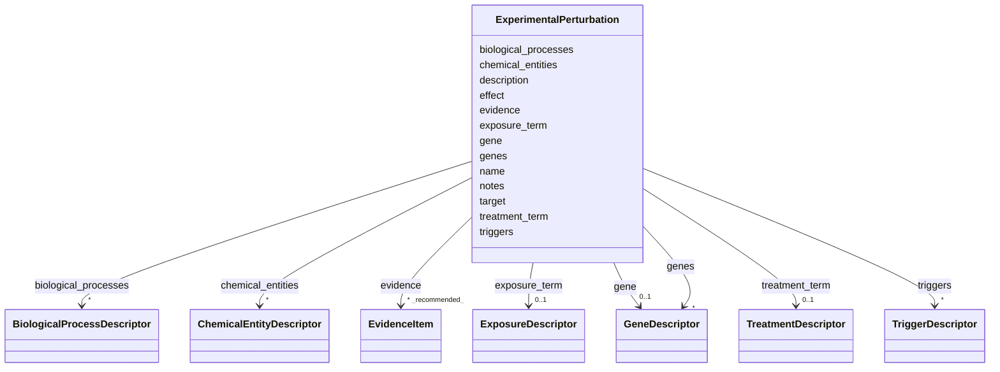

# Class: ExperimentalPerturbation 


_A structured perturbation, intervention, or exposure used in an experiment. Prefer ontology-backed descriptors for genes, chemicals, treatments, exposures, triggers, and biological processes rather than plain string lists._


URI: [dismech:class/ExperimentalPerturbation](https://w3id.org/monarch-initiative/dismech/class/ExperimentalPerturbation)





<!-- no inheritance hierarchy -->

## Slots

| Name | Cardinality and Range | Description | Inheritance |
| ---  | --- | --- | --- |
| [name](../slots/name.md) | 1 <br/> [String](../types/String.md) |  | direct |
| [description](../slots/description.md) | 0..1 <br/> [String](../types/String.md) |  | direct |
| [target](../slots/target.md) | 1 <br/> [String](../types/String.md) | Entity reference for the pathograph node, phenotype, gene, or other modeled o... | direct |
| [gene](../slots/gene.md) | 0..1 <br/> [GeneDescriptor](../classes/GeneDescriptor.md) |  | direct |
| [genes](../slots/genes.md) | * <br/> [GeneDescriptor](../classes/GeneDescriptor.md) |  | direct |
| [chemical_entities](../slots/chemical_entities.md) | * <br/> [ChemicalEntityDescriptor](../classes/ChemicalEntityDescriptor.md) |  | direct |
| [treatment_term](../slots/treatment_term.md) | 0..1 <br/> [TreatmentDescriptor](../classes/TreatmentDescriptor.md) | The MAXO term for this treatment/medical action | direct |
| [exposure_term](../slots/exposure_term.md) | 0..1 <br/> [ExposureDescriptor](../classes/ExposureDescriptor.md) | The ECTO/XCO term for this exposure event | direct |
| [triggers](../slots/triggers.md) | * <br/> [TriggerDescriptor](../classes/TriggerDescriptor.md) |  | direct |
| [biological_processes](../slots/biological_processes.md) | * <br/> [BiologicalProcessDescriptor](../classes/BiologicalProcessDescriptor.md) |  | direct |
| [effect](../slots/effect.md) | 0..1 <br/> [String](../types/String.md) |  | direct |
| [evidence](../slots/evidence.md) | * _recommended_ <br/> [EvidenceItem](../classes/EvidenceItem.md) |  | direct |
| [notes](../slots/notes.md) | 0..1 <br/> [String](../types/String.md) |  | direct |


## Usages

| used by | used in | type | used |
| ---  | --- | --- | --- |
| [Experiment](../classes/Experiment.md) | [perturbations](../slots/perturbations.md) | range | [ExperimentalPerturbation](../classes/ExperimentalPerturbation.md) |
| [ExperimentalControl](../classes/ExperimentalControl.md) | [perturbations](../slots/perturbations.md) | range | [ExperimentalPerturbation](../classes/ExperimentalPerturbation.md) |


## Identifier and Mapping Information


### Schema Source


* from schema: https://w3id.org/monarch-initiative/dismech


## Mappings

| Mapping Type | Mapped Value |
| ---  | ---  |
| self | dismech:ExperimentalPerturbation |
| native | dismech:ExperimentalPerturbation |


## LinkML Source

<!-- TODO: investigate https://stackoverflow.com/questions/37606292/how-to-create-tabbed-code-blocks-in-mkdocs-or-sphinx -->

### Direct

<details>
```yaml
name: ExperimentalPerturbation
description: A structured perturbation, intervention, or exposure used in an experiment.
  Prefer ontology-backed descriptors for genes, chemicals, treatments, exposures,
  triggers, and biological processes rather than plain string lists.
from_schema: https://w3id.org/monarch-initiative/dismech
slots:
- name
- description
- target
- gene
- genes
- chemical_entities
- treatment_term
- exposure_term
- triggers
- biological_processes
- effect
- evidence
- notes
slot_usage:
  target:
    name: target
    description: Entity reference for the pathograph node, phenotype, gene, or other
      modeled object being perturbed. Uses the same hash-anchor grammar as `attaches_to`
      when pointing into a disease entry.

```
</details>

### Induced

<details>
```yaml
name: ExperimentalPerturbation
description: A structured perturbation, intervention, or exposure used in an experiment.
  Prefer ontology-backed descriptors for genes, chemicals, treatments, exposures,
  triggers, and biological processes rather than plain string lists.
from_schema: https://w3id.org/monarch-initiative/dismech
slot_usage:
  target:
    name: target
    description: Entity reference for the pathograph node, phenotype, gene, or other
      modeled object being perturbed. Uses the same hash-anchor grammar as `attaches_to`
      when pointing into a disease entry.
attributes:
  name:
    name: name
    examples:
    - value: Adolescent Nephronophthisis
    from_schema: https://w3id.org/monarch-initiative/dismech
    rank: 1000
    identifier: true
    alias: name
    owner: ExperimentalPerturbation
    domain_of:
    - ExperimentalModel
    - Experiment
    - ExperimentalPerturbation
    - ExperimentalReadout
    - ExperimentalControl
    - ClinicalTrial
    - ComputationalModel
    - ModelVariable
    - SeverityTier
    - DifferentialDiagnosis
    - Subtype
    - ReferenceRangeBand
    - SurrogateEndpointCollection
    - ExternalAssertion
    - EpidemiologyInfo
    - Pathophysiology
    - Phenotype
    - Biochemical
    - HistopathologyFinding
    - Genetic
    - Environmental
    - Disease
    - Stage
    - AgentLifeCycleStage
    - Treatment
    - InfectiousAgent
    - Transmission
    - Assay
    - Diagnosis
    - Inheritance
    - Variant
    - Mechanism
    - ModelingConsideration
    - Definition
    - CriteriaSet
    - ComorbidityAssociation
    - Grouping
    range: string
    required: true
  description:
    name: description
    from_schema: https://w3id.org/monarch-initiative/dismech
    rank: 1000
    alias: description
    owner: ExperimentalPerturbation
    domain_of:
    - Descriptor
    - DietaryModification
    - GeneticContext
    - Dataset
    - ExperimentalModel
    - Experiment
    - ExperimentalPerturbation
    - ExperimentalReadout
    - ExperimentalControl
    - ClinicalTrial
    - ComputationalModel
    - ModelVariable
    - DifferentialDiagnosis
    - Subtype
    - CausalEdge
    - TreatmentMechanismTarget
    - ModelMechanismLink
    - BiomarkerReadout
    - SurrogateEndpointCollection
    - ProteinStructure
    - ExternalAssertion
    - EpidemiologyInfo
    - Pathophysiology
    - Phenotype
    - HistopathologyFinding
    - Environmental
    - Disease
    - Stage
    - AgentLifeCycle
    - AgentLifeCycleStage
    - AnimalModel
    - Treatment
    - InfectiousAgent
    - Transmission
    - Assay
    - Diagnosis
    - Inheritance
    - Variant
    - FunctionalEffect
    - Mechanism
    - ModelingConsideration
    - Definition
    - CriteriaSet
    - ConditionDescriptor
    - GOEnrichment
    - ComorbidityHypothesis
    - UpstreamConditionHypothesis
    - MechanisticHypothesis
    - Grouping
    - GroupingCriteria
    - LogicalCriterion
    - DifferentiatingMechanism
    range: string
  target:
    name: target
    description: Entity reference for the pathograph node, phenotype, gene, or other
      modeled object being perturbed. Uses the same hash-anchor grammar as `attaches_to`
      when pointing into a disease entry.
    from_schema: https://w3id.org/monarch-initiative/dismech
    rank: 1000
    alias: target
    owner: ExperimentalPerturbation
    domain_of:
    - ExperimentalPerturbation
    - ExperimentalReadout
    - CausalEdge
    - TreatmentMechanismTarget
    - ModelMechanismLink
    - BiomarkerReadout
    range: string
    required: true
  gene:
    name: gene
    examples:
    - value: '{preferred_term: MEFV}'
    from_schema: https://w3id.org/monarch-initiative/dismech
    rank: 1000
    alias: gene
    owner: ExperimentalPerturbation
    domain_of:
    - GeneticContext
    - ExperimentalPerturbation
    - Pathophysiology
    - Variant
    - LogicalCriterion
    - DifferentiatingMechanism
    range: GeneDescriptor
    inlined: true
  genes:
    name: genes
    examples:
    - value: '[{preferred_term: HLA-DQ2}, {preferred_term: INS}]'
    from_schema: https://w3id.org/monarch-initiative/dismech
    rank: 1000
    alias: genes
    owner: ExperimentalPerturbation
    domain_of:
    - GeneticContext
    - Dataset
    - ExperimentalPerturbation
    - Subtype
    - Pathophysiology
    - AnimalModel
    range: GeneDescriptor
    multivalued: true
    inlined: true
    inlined_as_list: true
  chemical_entities:
    name: chemical_entities
    examples:
    - value: '[{preferred_term: Plasmalogen}]'
    from_schema: https://w3id.org/monarch-initiative/dismech
    rank: 1000
    alias: chemical_entities
    owner: ExperimentalPerturbation
    domain_of:
    - ExperimentalPerturbation
    - Pathophysiology
    range: ChemicalEntityDescriptor
    multivalued: true
    inlined: true
    inlined_as_list: true
  treatment_term:
    name: treatment_term
    description: The MAXO term for this treatment/medical action
    from_schema: https://w3id.org/monarch-initiative/dismech
    rank: 1000
    alias: treatment_term
    owner: ExperimentalPerturbation
    domain_of:
    - ExperimentalPerturbation
    - Treatment
    range: TreatmentDescriptor
    inlined: true
  exposure_term:
    name: exposure_term
    description: The ECTO/XCO term for this exposure event
    from_schema: https://w3id.org/monarch-initiative/dismech
    rank: 1000
    alias: exposure_term
    owner: ExperimentalPerturbation
    domain_of:
    - ExperimentalPerturbation
    - Environmental
    range: ExposureDescriptor
    inlined: true
  triggers:
    name: triggers
    examples:
    - value: '[{preferred_term: Viral Infections}]'
    from_schema: https://w3id.org/monarch-initiative/dismech
    rank: 1000
    alias: triggers
    owner: ExperimentalPerturbation
    domain_of:
    - ExperimentalPerturbation
    - Pathophysiology
    range: TriggerDescriptor
    multivalued: true
    inlined: true
    inlined_as_list: true
  biological_processes:
    name: biological_processes
    examples:
    - value: '[{preferred_term: TNF-alpha Production}]'
    from_schema: https://w3id.org/monarch-initiative/dismech
    rank: 1000
    alias: biological_processes
    owner: ExperimentalPerturbation
    domain_of:
    - ExperimentalPerturbation
    - ExperimentalReadout
    - Pathophysiology
    - LogicalCriterion
    - DifferentiatingMechanism
    range: BiologicalProcessDescriptor
    multivalued: true
    inlined: true
    inlined_as_list: true
  effect:
    name: effect
    examples:
    - value: Potential trigger for flare-ups
    from_schema: https://w3id.org/monarch-initiative/dismech
    rank: 1000
    alias: effect
    owner: ExperimentalPerturbation
    domain_of:
    - ExperimentalPerturbation
    - Environmental
    - Transmission
    range: string
  evidence:
    name: evidence
    from_schema: https://w3id.org/monarch-initiative/dismech
    rank: 1000
    alias: evidence
    owner: ExperimentalPerturbation
    domain_of:
    - PhenotypeContext
    - Dataset
    - ExperimentalModel
    - Experiment
    - ExperimentalPerturbation
    - ExperimentalReadout
    - ExperimentalControl
    - ClinicalTrial
    - ComputationalModel
    - DifferentialDiagnosis
    - Subtype
    - CausalEdge
    - TreatmentMechanismTarget
    - ModelMechanismLink
    - BiomarkerReadout
    - ReferenceRange
    - SurrogateEndpoint
    - ExternalAssertion
    - Finding
    - Prevalence
    - ProgressionInfo
    - EpidemiologyInfo
    - Pathophysiology
    - Phenotype
    - Biochemical
    - HistopathologyFinding
    - Genetic
    - Environmental
    - Stage
    - AgentLifeCycle
    - AgentLifeCycleStage
    - AnimalModel
    - Treatment
    - InfectiousAgent
    - Transmission
    - Diagnosis
    - Inheritance
    - Variant
    - ModelingConsideration
    - ClassificationAssignment
    - Definition
    - CriteriaSet
    - AssociationSignal
    - AssociationStatistics
    - ComorbidityHypothesis
    - UpstreamConditionHypothesis
    - MechanisticHypothesis
    - Discussion
    - GroupingCriteria
    - GroupingMember
    - DifferentiatingMechanism
    range: EvidenceItem
    recommended: true
    multivalued: true
    inlined: true
    inlined_as_list: true
  notes:
    name: notes
    examples:
    - value: Contagious stage where symptoms appear and the bacteria can be spread
        to others.
    from_schema: https://w3id.org/monarch-initiative/dismech
    rank: 1000
    alias: notes
    owner: ExperimentalPerturbation
    domain_of:
    - GeneticContext
    - OnsetDescriptor
    - PhenotypeContext
    - Dataset
    - ExperimentalModel
    - Experiment
    - ExperimentalPerturbation
    - ExperimentalReadout
    - ExperimentalControl
    - ClinicalTrial
    - ComputationalModel
    - ModelVariable
    - DifferentialDiagnosis
    - ReferenceRange
    - SurrogateEndpoint
    - SurrogateEndpointCollection
    - ExternalAssertion
    - TrackedIssue
    - Prevalence
    - ProgressionInfo
    - EpidemiologyInfo
    - Pathophysiology
    - Phenotype
    - Biochemical
    - HistopathologyFinding
    - Genetic
    - Environmental
    - Disease
    - Stage
    - AgentLifeCycle
    - AgentLifeCycleStage
    - Treatment
    - Transmission
    - Diagnosis
    - ClassificationAssignment
    - Definition
    - CriteriaSet
    - TermMapping
    - MappingConsistency
    - ComorbidityAssociation
    - AssociationSignal
    - AssociationMetric
    - AssociationStatistics
    - MechanisticHypothesis
    - Discussion
    - Grouping
    - GroupingCriteria
    - GroupingMember
    - DifferentiatingMechanism
    range: string

```
</details>