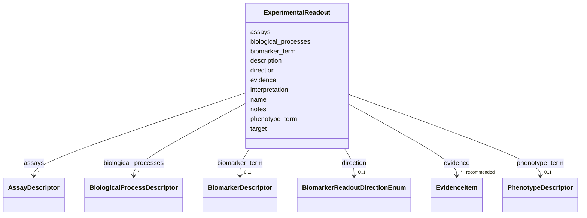

# Class: ExperimentalReadout 


_A structured readout or outcome measured in an experiment. Use descriptor slots to ground readouts to phenotypes, biomarkers, biological processes, and assays._


URI: [dismech:class/ExperimentalReadout](https://w3id.org/monarch-initiative/dismech/class/ExperimentalReadout)





<!-- no inheritance hierarchy -->

## Slots

| Name | Cardinality and Range | Description | Inheritance |
| ---  | --- | --- | --- |
| [name](../slots/name.md) | 1 <br/> [String](../types/String.md) |  | direct |
| [description](../slots/description.md) | 0..1 <br/> [String](../types/String.md) |  | direct |
| [target](../slots/target.md) | 1 <br/> [String](../types/String.md) | Entity reference for the pathograph node, phenotype, or other modeled object ... | direct |
| [phenotype_term](../slots/phenotype_term.md) | 0..1 <br/> [PhenotypeDescriptor](../classes/PhenotypeDescriptor.md) | The HP term for this phenotype | direct |
| [biomarker_term](../slots/biomarker_term.md) | 0..1 <br/> [BiomarkerDescriptor](../classes/BiomarkerDescriptor.md) | Ontology term for a biomarker (from NCIT) | direct |
| [biological_processes](../slots/biological_processes.md) | * <br/> [BiologicalProcessDescriptor](../classes/BiologicalProcessDescriptor.md) |  | direct |
| [assays](../slots/assays.md) | * <br/> [AssayDescriptor](../classes/AssayDescriptor.md) |  | direct |
| [direction](../slots/direction.md) | 0..1 <br/> [BiomarkerReadoutDirectionEnum](../enums/BiomarkerReadoutDirectionEnum.md) | Direction of association between the biomarker value/presence and the linked ... | direct |
| [interpretation](../slots/interpretation.md) | 0..1 <br/> [String](../types/String.md) | Curator-facing explanation of how this readout would be interpreted relative ... | direct |
| [evidence](../slots/evidence.md) | * _recommended_ <br/> [EvidenceItem](../classes/EvidenceItem.md) |  | direct |
| [notes](../slots/notes.md) | 0..1 <br/> [String](../types/String.md) |  | direct |


## Usages

| used by | used in | type | used |
| ---  | --- | --- | --- |
| [Experiment](../classes/Experiment.md) | [readouts](../slots/readouts.md) | range | [ExperimentalReadout](../classes/ExperimentalReadout.md) |


## Identifier and Mapping Information


### Schema Source


* from schema: https://w3id.org/monarch-initiative/dismech


## Mappings

| Mapping Type | Mapped Value |
| ---  | ---  |
| self | dismech:ExperimentalReadout |
| native | dismech:ExperimentalReadout |


## LinkML Source

<!-- TODO: investigate https://stackoverflow.com/questions/37606292/how-to-create-tabbed-code-blocks-in-mkdocs-or-sphinx -->

### Direct

<details>
```yaml
name: ExperimentalReadout
description: A structured readout or outcome measured in an experiment. Use descriptor
  slots to ground readouts to phenotypes, biomarkers, biological processes, and assays.
from_schema: https://w3id.org/monarch-initiative/dismech
slots:
- name
- description
- target
- phenotype_term
- biomarker_term
- biological_processes
- assays
- direction
- interpretation
- evidence
- notes
slot_usage:
  target:
    name: target
    description: Entity reference for the pathograph node, phenotype, or other modeled
      object that this readout measures or adjudicates.
  interpretation:
    name: interpretation
    description: Curator-facing explanation of how this readout would be interpreted
      relative to the experiment's decision criterion.

```
</details>

### Induced

<details>
```yaml
name: ExperimentalReadout
description: A structured readout or outcome measured in an experiment. Use descriptor
  slots to ground readouts to phenotypes, biomarkers, biological processes, and assays.
from_schema: https://w3id.org/monarch-initiative/dismech
slot_usage:
  target:
    name: target
    description: Entity reference for the pathograph node, phenotype, or other modeled
      object that this readout measures or adjudicates.
  interpretation:
    name: interpretation
    description: Curator-facing explanation of how this readout would be interpreted
      relative to the experiment's decision criterion.
attributes:
  name:
    name: name
    examples:
    - value: Adolescent Nephronophthisis
    from_schema: https://w3id.org/monarch-initiative/dismech
    rank: 1000
    identifier: true
    alias: name
    owner: ExperimentalReadout
    domain_of:
    - ExperimentalModel
    - Experiment
    - ExperimentalPerturbation
    - ExperimentalReadout
    - ExperimentalControl
    - ClinicalTrial
    - ComputationalModel
    - ModelVariable
    - SeverityTier
    - DifferentialDiagnosis
    - Subtype
    - ReferenceRangeBand
    - SurrogateEndpointCollection
    - ExternalAssertion
    - EpidemiologyInfo
    - Pathophysiology
    - Phenotype
    - Biochemical
    - HistopathologyFinding
    - Genetic
    - Environmental
    - Disease
    - Stage
    - AgentLifeCycleStage
    - Treatment
    - InfectiousAgent
    - Transmission
    - Assay
    - Diagnosis
    - Inheritance
    - Variant
    - Mechanism
    - ModelingConsideration
    - Definition
    - CriteriaSet
    - ComorbidityAssociation
    - Grouping
    range: string
    required: true
  description:
    name: description
    from_schema: https://w3id.org/monarch-initiative/dismech
    rank: 1000
    alias: description
    owner: ExperimentalReadout
    domain_of:
    - Descriptor
    - DietaryModification
    - GeneticContext
    - Dataset
    - ExperimentalModel
    - Experiment
    - ExperimentalPerturbation
    - ExperimentalReadout
    - ExperimentalControl
    - ClinicalTrial
    - ComputationalModel
    - ModelVariable
    - DifferentialDiagnosis
    - Subtype
    - CausalEdge
    - TreatmentMechanismTarget
    - ModelMechanismLink
    - BiomarkerReadout
    - SurrogateEndpointCollection
    - ProteinStructure
    - ExternalAssertion
    - EpidemiologyInfo
    - Pathophysiology
    - Phenotype
    - HistopathologyFinding
    - Environmental
    - Disease
    - Stage
    - AgentLifeCycle
    - AgentLifeCycleStage
    - AnimalModel
    - Treatment
    - InfectiousAgent
    - Transmission
    - Assay
    - Diagnosis
    - Inheritance
    - Variant
    - FunctionalEffect
    - Mechanism
    - ModelingConsideration
    - Definition
    - CriteriaSet
    - ConditionDescriptor
    - GOEnrichment
    - ComorbidityHypothesis
    - UpstreamConditionHypothesis
    - MechanisticHypothesis
    - Grouping
    - GroupingCriteria
    - LogicalCriterion
    - DifferentiatingMechanism
    range: string
  target:
    name: target
    description: Entity reference for the pathograph node, phenotype, or other modeled
      object that this readout measures or adjudicates.
    from_schema: https://w3id.org/monarch-initiative/dismech
    rank: 1000
    alias: target
    owner: ExperimentalReadout
    domain_of:
    - ExperimentalPerturbation
    - ExperimentalReadout
    - CausalEdge
    - TreatmentMechanismTarget
    - ModelMechanismLink
    - BiomarkerReadout
    range: string
    required: true
  phenotype_term:
    name: phenotype_term
    description: The HP term for this phenotype
    from_schema: https://w3id.org/monarch-initiative/dismech
    rank: 1000
    alias: phenotype_term
    owner: ExperimentalReadout
    domain_of:
    - ExperimentalReadout
    - ReferenceRangeBand
    - Phenotype
    - LogicalCriterion
    - DifferentiatingMechanism
    range: PhenotypeDescriptor
    inlined: true
  biomarker_term:
    name: biomarker_term
    description: Ontology term for a biomarker (from NCIT)
    comments:
    - Use NCIT terms for biomarkers (proteins, genes, fusion products)
    - NCIT:C16342 (Biomarker) is the root class for validation
    from_schema: https://w3id.org/monarch-initiative/dismech
    rank: 1000
    alias: biomarker_term
    owner: ExperimentalReadout
    domain_of:
    - ExperimentalReadout
    - Biochemical
    range: BiomarkerDescriptor
    inlined: true
  biological_processes:
    name: biological_processes
    examples:
    - value: '[{preferred_term: TNF-alpha Production}]'
    from_schema: https://w3id.org/monarch-initiative/dismech
    rank: 1000
    alias: biological_processes
    owner: ExperimentalReadout
    domain_of:
    - ExperimentalPerturbation
    - ExperimentalReadout
    - Pathophysiology
    - LogicalCriterion
    - DifferentiatingMechanism
    range: BiologicalProcessDescriptor
    multivalued: true
    inlined: true
    inlined_as_list: true
  assays:
    name: assays
    examples:
    - value: '[{preferred_term: Elevated Blood Glucose}]'
    from_schema: https://w3id.org/monarch-initiative/dismech
    rank: 1000
    alias: assays
    owner: ExperimentalReadout
    domain_of:
    - Experiment
    - ExperimentalReadout
    - Pathophysiology
    - Biochemical
    range: AssayDescriptor
    multivalued: true
    inlined: true
    inlined_as_list: true
  direction:
    name: direction
    description: Direction of association between the biomarker value/presence and
      the linked pathograph node
    from_schema: https://w3id.org/monarch-initiative/dismech
    rank: 1000
    alias: direction
    owner: ExperimentalReadout
    domain_of:
    - ExperimentalReadout
    - BiomarkerReadout
    range: BiomarkerReadoutDirectionEnum
  interpretation:
    name: interpretation
    description: Curator-facing explanation of how this readout would be interpreted
      relative to the experiment's decision criterion.
    from_schema: https://w3id.org/monarch-initiative/dismech
    rank: 1000
    alias: interpretation
    owner: ExperimentalReadout
    domain_of:
    - ExperimentalReadout
    - BiomarkerReadout
    - ReferenceRangeBand
    range: string
  evidence:
    name: evidence
    from_schema: https://w3id.org/monarch-initiative/dismech
    rank: 1000
    alias: evidence
    owner: ExperimentalReadout
    domain_of:
    - PhenotypeContext
    - Dataset
    - ExperimentalModel
    - Experiment
    - ExperimentalPerturbation
    - ExperimentalReadout
    - ExperimentalControl
    - ClinicalTrial
    - ComputationalModel
    - DifferentialDiagnosis
    - Subtype
    - CausalEdge
    - TreatmentMechanismTarget
    - ModelMechanismLink
    - BiomarkerReadout
    - ReferenceRange
    - SurrogateEndpoint
    - ExternalAssertion
    - Finding
    - Prevalence
    - ProgressionInfo
    - EpidemiologyInfo
    - Pathophysiology
    - Phenotype
    - Biochemical
    - HistopathologyFinding
    - Genetic
    - Environmental
    - Stage
    - AgentLifeCycle
    - AgentLifeCycleStage
    - AnimalModel
    - Treatment
    - InfectiousAgent
    - Transmission
    - Diagnosis
    - Inheritance
    - Variant
    - ModelingConsideration
    - ClassificationAssignment
    - Definition
    - CriteriaSet
    - AssociationSignal
    - AssociationStatistics
    - ComorbidityHypothesis
    - UpstreamConditionHypothesis
    - MechanisticHypothesis
    - Discussion
    - GroupingCriteria
    - GroupingMember
    - DifferentiatingMechanism
    range: EvidenceItem
    recommended: true
    multivalued: true
    inlined: true
    inlined_as_list: true
  notes:
    name: notes
    examples:
    - value: Contagious stage where symptoms appear and the bacteria can be spread
        to others.
    from_schema: https://w3id.org/monarch-initiative/dismech
    rank: 1000
    alias: notes
    owner: ExperimentalReadout
    domain_of:
    - GeneticContext
    - OnsetDescriptor
    - PhenotypeContext
    - Dataset
    - ExperimentalModel
    - Experiment
    - ExperimentalPerturbation
    - ExperimentalReadout
    - ExperimentalControl
    - ClinicalTrial
    - ComputationalModel
    - ModelVariable
    - DifferentialDiagnosis
    - ReferenceRange
    - SurrogateEndpoint
    - SurrogateEndpointCollection
    - ExternalAssertion
    - TrackedIssue
    - Prevalence
    - ProgressionInfo
    - EpidemiologyInfo
    - Pathophysiology
    - Phenotype
    - Biochemical
    - HistopathologyFinding
    - Genetic
    - Environmental
    - Disease
    - Stage
    - AgentLifeCycle
    - AgentLifeCycleStage
    - Treatment
    - Transmission
    - Diagnosis
    - ClassificationAssignment
    - Definition
    - CriteriaSet
    - TermMapping
    - MappingConsistency
    - ComorbidityAssociation
    - AssociationSignal
    - AssociationMetric
    - AssociationStatistics
    - MechanisticHypothesis
    - Discussion
    - Grouping
    - GroupingCriteria
    - GroupingMember
    - DifferentiatingMechanism
    range: string

```
</details>