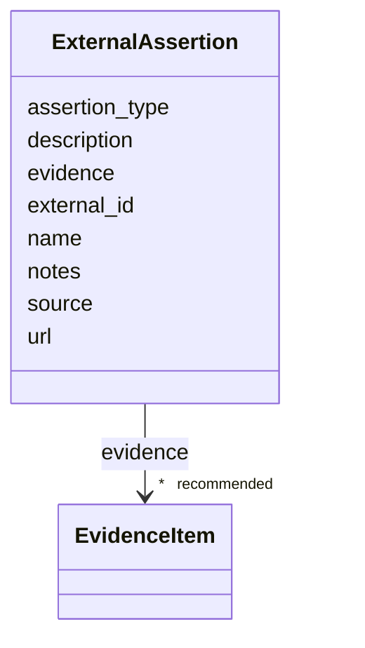

# Class: ExternalAssertion 


_An externally curated assertion or registry record relevant to a disease or variant, such as a ClinGen gene-disease validity assertion or a ClinGen Allele Registry record._


URI: [dismech:class/ExternalAssertion](https://w3id.org/monarch-initiative/dismech/class/ExternalAssertion)





<!-- no inheritance hierarchy -->

## Slots

| Name | Cardinality and Range | Description | Inheritance |
| ---  | --- | --- | --- |
| [name](../slots/name.md) | 1 <br/> [String](../types/String.md) |  | direct |
| [source](../slots/source.md) | 1 <br/> [String](../types/String.md) | Source dataset or provenance label | direct |
| [assertion_type](../slots/assertion_type.md) | 0..1 <br/> [String](../types/String.md) | Type/category of the external assertion or registry record | direct |
| [external_id](../slots/external_id.md) | 1 <br/> [String](../types/String.md) | Identifier used by the external resource (e | direct |
| [url](../slots/url.md) | 0..1 <br/> [Uri](../types/Uri.md) | URL for the external assertion or registry record | direct |
| [description](../slots/description.md) | 0..1 <br/> [String](../types/String.md) |  | direct |
| [evidence](../slots/evidence.md) | * _recommended_ <br/> [EvidenceItem](../classes/EvidenceItem.md) |  | direct |
| [notes](../slots/notes.md) | 0..1 <br/> [String](../types/String.md) |  | direct |


## Usages

| used by | used in | type | used |
| ---  | --- | --- | --- |
| [Disease](../classes/Disease.md) | [external_assertions](../slots/external_assertions.md) | range | [ExternalAssertion](../classes/ExternalAssertion.md) |
| [Variant](../classes/Variant.md) | [external_assertions](../slots/external_assertions.md) | range | [ExternalAssertion](../classes/ExternalAssertion.md) |


## Identifier and Mapping Information


### Schema Source


* from schema: https://w3id.org/monarch-initiative/dismech


## Mappings

| Mapping Type | Mapped Value |
| ---  | ---  |
| self | dismech:ExternalAssertion |
| native | dismech:ExternalAssertion |


## LinkML Source

<!-- TODO: investigate https://stackoverflow.com/questions/37606292/how-to-create-tabbed-code-blocks-in-mkdocs-or-sphinx -->

### Direct

<details>
```yaml
name: ExternalAssertion
description: An externally curated assertion or registry record relevant to a disease
  or variant, such as a ClinGen gene-disease validity assertion or a ClinGen Allele
  Registry record.
from_schema: https://w3id.org/monarch-initiative/dismech
slots:
- name
- source
- assertion_type
- external_id
- url
- description
- evidence
- notes
slot_usage:
  source:
    name: source
    required: true
  external_id:
    name: external_id
    required: true

```
</details>

### Induced

<details>
```yaml
name: ExternalAssertion
description: An externally curated assertion or registry record relevant to a disease
  or variant, such as a ClinGen gene-disease validity assertion or a ClinGen Allele
  Registry record.
from_schema: https://w3id.org/monarch-initiative/dismech
slot_usage:
  source:
    name: source
    required: true
  external_id:
    name: external_id
    required: true
attributes:
  name:
    name: name
    examples:
    - value: Adolescent Nephronophthisis
    from_schema: https://w3id.org/monarch-initiative/dismech
    rank: 1000
    identifier: true
    alias: name
    owner: ExternalAssertion
    domain_of:
    - ExperimentalModel
    - Experiment
    - ExperimentalPerturbation
    - ExperimentalReadout
    - ExperimentalControl
    - ClinicalTrial
    - ComputationalModel
    - ModelVariable
    - SeverityTier
    - DifferentialDiagnosis
    - Subtype
    - ReferenceRangeBand
    - SurrogateEndpointCollection
    - ExternalAssertion
    - EpidemiologyInfo
    - Pathophysiology
    - Phenotype
    - Biochemical
    - HistopathologyFinding
    - Genetic
    - Environmental
    - Disease
    - Stage
    - AgentLifeCycleStage
    - Treatment
    - InfectiousAgent
    - Transmission
    - Assay
    - Diagnosis
    - Inheritance
    - Variant
    - Mechanism
    - ModelingConsideration
    - Definition
    - CriteriaSet
    - ComorbidityAssociation
    - Grouping
    range: string
    required: true
  source:
    name: source
    description: Source dataset or provenance label
    from_schema: https://w3id.org/monarch-initiative/dismech
    rank: 1000
    alias: source
    owner: ExternalAssertion
    domain_of:
    - ExternalAssertion
    - AssociationSignal
    range: string
    required: true
  assertion_type:
    name: assertion_type
    description: Type/category of the external assertion or registry record
    from_schema: https://w3id.org/monarch-initiative/dismech
    rank: 1000
    alias: assertion_type
    owner: ExternalAssertion
    domain_of:
    - ExternalAssertion
    range: string
  external_id:
    name: external_id
    description: Identifier used by the external resource (e.g., CCID:009009, CA2573049045)
    from_schema: https://w3id.org/monarch-initiative/dismech
    rank: 1000
    alias: external_id
    owner: ExternalAssertion
    domain_of:
    - ExternalAssertion
    range: string
    required: true
  url:
    name: url
    description: URL for the external assertion or registry record
    from_schema: https://w3id.org/monarch-initiative/dismech
    rank: 1000
    alias: url
    owner: ExternalAssertion
    domain_of:
    - ExternalAssertion
    - TrackedIssue
    range: uri
  description:
    name: description
    from_schema: https://w3id.org/monarch-initiative/dismech
    rank: 1000
    alias: description
    owner: ExternalAssertion
    domain_of:
    - Descriptor
    - DietaryModification
    - GeneticContext
    - Dataset
    - ExperimentalModel
    - Experiment
    - ExperimentalPerturbation
    - ExperimentalReadout
    - ExperimentalControl
    - ClinicalTrial
    - ComputationalModel
    - ModelVariable
    - DifferentialDiagnosis
    - Subtype
    - CausalEdge
    - TreatmentMechanismTarget
    - ModelMechanismLink
    - BiomarkerReadout
    - SurrogateEndpointCollection
    - ProteinStructure
    - ExternalAssertion
    - EpidemiologyInfo
    - Pathophysiology
    - Phenotype
    - HistopathologyFinding
    - Environmental
    - Disease
    - Stage
    - AgentLifeCycle
    - AgentLifeCycleStage
    - AnimalModel
    - Treatment
    - InfectiousAgent
    - Transmission
    - Assay
    - Diagnosis
    - Inheritance
    - Variant
    - FunctionalEffect
    - Mechanism
    - ModelingConsideration
    - Definition
    - CriteriaSet
    - ConditionDescriptor
    - GOEnrichment
    - ComorbidityHypothesis
    - UpstreamConditionHypothesis
    - MechanisticHypothesis
    - Grouping
    - GroupingCriteria
    - LogicalCriterion
    - DifferentiatingMechanism
    range: string
  evidence:
    name: evidence
    from_schema: https://w3id.org/monarch-initiative/dismech
    rank: 1000
    alias: evidence
    owner: ExternalAssertion
    domain_of:
    - PhenotypeContext
    - Dataset
    - ExperimentalModel
    - Experiment
    - ExperimentalPerturbation
    - ExperimentalReadout
    - ExperimentalControl
    - ClinicalTrial
    - ComputationalModel
    - DifferentialDiagnosis
    - Subtype
    - CausalEdge
    - TreatmentMechanismTarget
    - ModelMechanismLink
    - BiomarkerReadout
    - ReferenceRange
    - SurrogateEndpoint
    - ExternalAssertion
    - Finding
    - Prevalence
    - ProgressionInfo
    - EpidemiologyInfo
    - Pathophysiology
    - Phenotype
    - Biochemical
    - HistopathologyFinding
    - Genetic
    - Environmental
    - Stage
    - AgentLifeCycle
    - AgentLifeCycleStage
    - AnimalModel
    - Treatment
    - InfectiousAgent
    - Transmission
    - Diagnosis
    - Inheritance
    - Variant
    - ModelingConsideration
    - ClassificationAssignment
    - Definition
    - CriteriaSet
    - AssociationSignal
    - AssociationStatistics
    - ComorbidityHypothesis
    - UpstreamConditionHypothesis
    - MechanisticHypothesis
    - Discussion
    - GroupingCriteria
    - GroupingMember
    - DifferentiatingMechanism
    range: EvidenceItem
    recommended: true
    multivalued: true
    inlined: true
    inlined_as_list: true
  notes:
    name: notes
    examples:
    - value: Contagious stage where symptoms appear and the bacteria can be spread
        to others.
    from_schema: https://w3id.org/monarch-initiative/dismech
    rank: 1000
    alias: notes
    owner: ExternalAssertion
    domain_of:
    - GeneticContext
    - OnsetDescriptor
    - PhenotypeContext
    - Dataset
    - ExperimentalModel
    - Experiment
    - ExperimentalPerturbation
    - ExperimentalReadout
    - ExperimentalControl
    - ClinicalTrial
    - ComputationalModel
    - ModelVariable
    - DifferentialDiagnosis
    - ReferenceRange
    - SurrogateEndpoint
    - SurrogateEndpointCollection
    - ExternalAssertion
    - TrackedIssue
    - Prevalence
    - ProgressionInfo
    - EpidemiologyInfo
    - Pathophysiology
    - Phenotype
    - Biochemical
    - HistopathologyFinding
    - Genetic
    - Environmental
    - Disease
    - Stage
    - AgentLifeCycle
    - AgentLifeCycleStage
    - Treatment
    - Transmission
    - Diagnosis
    - ClassificationAssignment
    - Definition
    - CriteriaSet
    - TermMapping
    - MappingConsistency
    - ComorbidityAssociation
    - AssociationSignal
    - AssociationMetric
    - AssociationStatistics
    - MechanisticHypothesis
    - Discussion
    - Grouping
    - GroupingCriteria
    - GroupingMember
    - DifferentiatingMechanism
    range: string

```
</details>