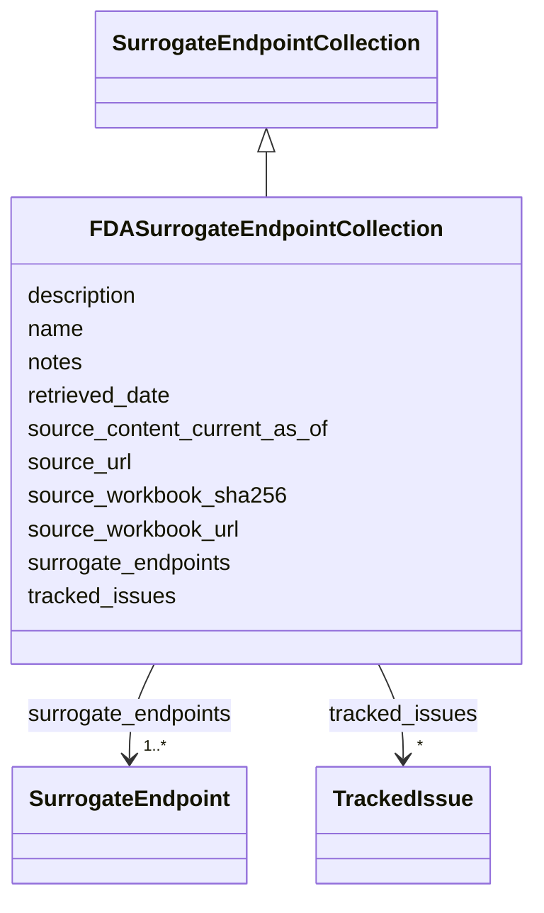

# Class: FDASurrogateEndpointCollection 


_FDA surrogate endpoint table import preserving row-level source provenance_


URI: [dismech:class/FDASurrogateEndpointCollection](https://w3id.org/monarch-initiative/dismech/class/FDASurrogateEndpointCollection)





## Inheritance
* [SurrogateEndpointCollection](../classes/SurrogateEndpointCollection.md)
    * **FDASurrogateEndpointCollection**


## Slots

| Name | Cardinality and Range | Description | Inheritance |
| ---  | --- | --- | --- |
| [name](../slots/name.md) | 1 <br/> [String](../types/String.md) |  | [SurrogateEndpointCollection](../classes/SurrogateEndpointCollection.md) |
| [description](../slots/description.md) | 0..1 <br/> [String](../types/String.md) |  | [SurrogateEndpointCollection](../classes/SurrogateEndpointCollection.md) |
| [source_url](../slots/source_url.md) | 0..1 <br/> [Uri](../types/Uri.md) | URL of the source page for a curated assertion or source collection | [SurrogateEndpointCollection](../classes/SurrogateEndpointCollection.md) |
| [source_workbook_url](../slots/source_workbook_url.md) | 0..1 <br/> [Uri](../types/Uri.md) | URL of the source workbook or downloadable data file | [SurrogateEndpointCollection](../classes/SurrogateEndpointCollection.md) |
| [source_workbook_sha256](../slots/source_workbook_sha256.md) | 0..1 <br/> [String](../types/String.md) | SHA-256 checksum of the downloaded source workbook used for import | [SurrogateEndpointCollection](../classes/SurrogateEndpointCollection.md) |
| [source_content_current_as_of](../slots/source_content_current_as_of.md) | 0..1 <br/> [Date](../types/Date.md) | Date shown by the source as the content-current-as-of date | [SurrogateEndpointCollection](../classes/SurrogateEndpointCollection.md) |
| [retrieved_date](../slots/retrieved_date.md) | 0..1 <br/> [Date](../types/Date.md) | Date on which the source was retrieved for curation | [SurrogateEndpointCollection](../classes/SurrogateEndpointCollection.md) |
| [surrogate_endpoints](../slots/surrogate_endpoints.md) | 1..* <br/> [SurrogateEndpoint](../classes/SurrogateEndpoint.md) | Curated surrogate endpoint assertions | [SurrogateEndpointCollection](../classes/SurrogateEndpointCollection.md) |
| [tracked_issues](../slots/tracked_issues.md) | * <br/> [TrackedIssue](../classes/TrackedIssue.md) | Structured pointers to external tracker issues (e | [SurrogateEndpointCollection](../classes/SurrogateEndpointCollection.md) |
| [notes](../slots/notes.md) | 0..1 <br/> [String](../types/String.md) |  | [SurrogateEndpointCollection](../classes/SurrogateEndpointCollection.md) |


## Identifier and Mapping Information


### Schema Source


* from schema: https://w3id.org/monarch-initiative/dismech


## Mappings

| Mapping Type | Mapped Value |
| ---  | ---  |
| self | dismech:FDASurrogateEndpointCollection |
| native | dismech:FDASurrogateEndpointCollection |


## LinkML Source

<!-- TODO: investigate https://stackoverflow.com/questions/37606292/how-to-create-tabbed-code-blocks-in-mkdocs-or-sphinx -->

### Direct

<details>
```yaml
name: FDASurrogateEndpointCollection
description: FDA surrogate endpoint table import preserving row-level source provenance
from_schema: https://w3id.org/monarch-initiative/dismech
is_a: SurrogateEndpointCollection

```
</details>

### Induced

<details>
```yaml
name: FDASurrogateEndpointCollection
description: FDA surrogate endpoint table import preserving row-level source provenance
from_schema: https://w3id.org/monarch-initiative/dismech
is_a: SurrogateEndpointCollection
attributes:
  name:
    name: name
    examples:
    - value: Adolescent Nephronophthisis
    from_schema: https://w3id.org/monarch-initiative/dismech
    rank: 1000
    identifier: true
    alias: name
    owner: FDASurrogateEndpointCollection
    domain_of:
    - ExperimentalModel
    - Experiment
    - ExperimentalPerturbation
    - ExperimentalReadout
    - ExperimentalControl
    - ClinicalTrial
    - ComputationalModel
    - ModelVariable
    - SeverityTier
    - DifferentialDiagnosis
    - Subtype
    - ReferenceRangeBand
    - SurrogateEndpointCollection
    - ExternalAssertion
    - EpidemiologyInfo
    - Pathophysiology
    - Phenotype
    - Biochemical
    - HistopathologyFinding
    - Genetic
    - Environmental
    - Disease
    - Stage
    - AgentLifeCycleStage
    - Treatment
    - InfectiousAgent
    - Transmission
    - Assay
    - Diagnosis
    - Inheritance
    - Variant
    - Mechanism
    - ModelingConsideration
    - Definition
    - CriteriaSet
    - ComorbidityAssociation
    - Grouping
    range: string
    required: true
  description:
    name: description
    from_schema: https://w3id.org/monarch-initiative/dismech
    rank: 1000
    alias: description
    owner: FDASurrogateEndpointCollection
    domain_of:
    - Descriptor
    - DietaryModification
    - GeneticContext
    - Dataset
    - ExperimentalModel
    - Experiment
    - ExperimentalPerturbation
    - ExperimentalReadout
    - ExperimentalControl
    - ClinicalTrial
    - ComputationalModel
    - ModelVariable
    - DifferentialDiagnosis
    - Subtype
    - CausalEdge
    - TreatmentMechanismTarget
    - ModelMechanismLink
    - BiomarkerReadout
    - SurrogateEndpointCollection
    - ProteinStructure
    - ExternalAssertion
    - EpidemiologyInfo
    - Pathophysiology
    - Phenotype
    - HistopathologyFinding
    - Environmental
    - Disease
    - Stage
    - AgentLifeCycle
    - AgentLifeCycleStage
    - AnimalModel
    - Treatment
    - InfectiousAgent
    - Transmission
    - Assay
    - Diagnosis
    - Inheritance
    - Variant
    - FunctionalEffect
    - Mechanism
    - ModelingConsideration
    - Definition
    - CriteriaSet
    - ConditionDescriptor
    - GOEnrichment
    - ComorbidityHypothesis
    - UpstreamConditionHypothesis
    - MechanisticHypothesis
    - Grouping
    - GroupingCriteria
    - LogicalCriterion
    - DifferentiatingMechanism
    range: string
  source_url:
    name: source_url
    description: URL of the source page for a curated assertion or source collection
    from_schema: https://w3id.org/monarch-initiative/dismech
    rank: 1000
    alias: source_url
    owner: FDASurrogateEndpointCollection
    domain_of:
    - SurrogateEndpoint
    - SurrogateEndpointCollection
    range: uri
  source_workbook_url:
    name: source_workbook_url
    description: URL of the source workbook or downloadable data file
    from_schema: https://w3id.org/monarch-initiative/dismech
    rank: 1000
    alias: source_workbook_url
    owner: FDASurrogateEndpointCollection
    domain_of:
    - SurrogateEndpoint
    - SurrogateEndpointCollection
    range: uri
  source_workbook_sha256:
    name: source_workbook_sha256
    description: SHA-256 checksum of the downloaded source workbook used for import
    from_schema: https://w3id.org/monarch-initiative/dismech
    rank: 1000
    alias: source_workbook_sha256
    owner: FDASurrogateEndpointCollection
    domain_of:
    - SurrogateEndpoint
    - SurrogateEndpointCollection
    range: string
  source_content_current_as_of:
    name: source_content_current_as_of
    description: Date shown by the source as the content-current-as-of date
    from_schema: https://w3id.org/monarch-initiative/dismech
    rank: 1000
    alias: source_content_current_as_of
    owner: FDASurrogateEndpointCollection
    domain_of:
    - SurrogateEndpoint
    - SurrogateEndpointCollection
    range: date
  retrieved_date:
    name: retrieved_date
    description: Date on which the source was retrieved for curation
    from_schema: https://w3id.org/monarch-initiative/dismech
    rank: 1000
    alias: retrieved_date
    owner: FDASurrogateEndpointCollection
    domain_of:
    - SurrogateEndpoint
    - SurrogateEndpointCollection
    range: date
  surrogate_endpoints:
    name: surrogate_endpoints
    description: Curated surrogate endpoint assertions
    from_schema: https://w3id.org/monarch-initiative/dismech
    rank: 1000
    alias: surrogate_endpoints
    owner: FDASurrogateEndpointCollection
    domain_of:
    - SurrogateEndpointCollection
    - Disease
    range: SurrogateEndpoint
    required: true
    multivalued: true
    inlined: true
    inlined_as_list: true
  tracked_issues:
    name: tracked_issues
    description: Structured pointers to external tracker issues (e.g., GitHub ontology
      term requests, schema follow-ups) that provide curation provenance for this
      entry or nested object. Use this in preference to stashing issue URLs inside
      free-text `notes` fields so they can be validated, rendered, and queried consistently.
    from_schema: https://w3id.org/monarch-initiative/dismech
    rank: 1000
    alias: tracked_issues
    owner: FDASurrogateEndpointCollection
    domain_of:
    - SurrogateEndpointCollection
    - Disease
    - TermMapping
    range: TrackedIssue
    multivalued: true
    inlined: true
    inlined_as_list: true
  notes:
    name: notes
    examples:
    - value: Contagious stage where symptoms appear and the bacteria can be spread
        to others.
    from_schema: https://w3id.org/monarch-initiative/dismech
    rank: 1000
    alias: notes
    owner: FDASurrogateEndpointCollection
    domain_of:
    - GeneticContext
    - OnsetDescriptor
    - PhenotypeContext
    - Dataset
    - ExperimentalModel
    - Experiment
    - ExperimentalPerturbation
    - ExperimentalReadout
    - ExperimentalControl
    - ClinicalTrial
    - ComputationalModel
    - ModelVariable
    - DifferentialDiagnosis
    - ReferenceRange
    - SurrogateEndpoint
    - SurrogateEndpointCollection
    - ExternalAssertion
    - TrackedIssue
    - Prevalence
    - ProgressionInfo
    - EpidemiologyInfo
    - Pathophysiology
    - Phenotype
    - Biochemical
    - HistopathologyFinding
    - Genetic
    - Environmental
    - Disease
    - Stage
    - AgentLifeCycle
    - AgentLifeCycleStage
    - Treatment
    - Transmission
    - Diagnosis
    - ClassificationAssignment
    - Definition
    - CriteriaSet
    - TermMapping
    - MappingConsistency
    - ComorbidityAssociation
    - AssociationSignal
    - AssociationMetric
    - AssociationStatistics
    - MechanisticHypothesis
    - Discussion
    - Grouping
    - GroupingCriteria
    - GroupingMember
    - DifferentiatingMechanism
    range: string

```
</details>