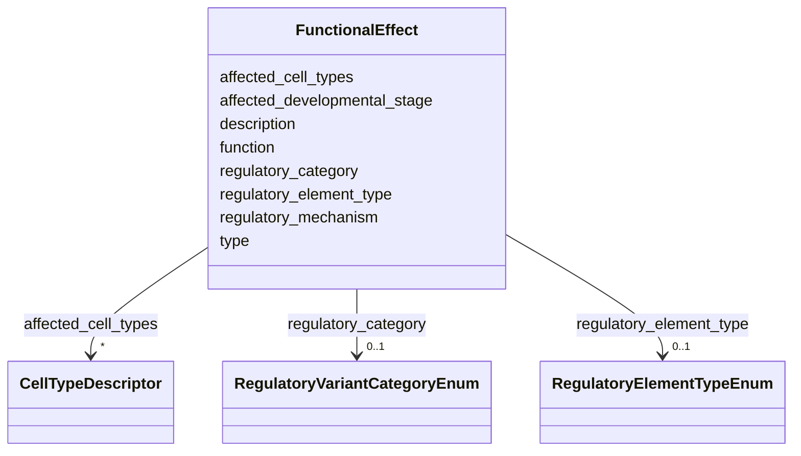

# Class: FunctionalEffect 


_Describes the functional consequence of a genetic variant, including regulatory impact classification (LOE/mLOE/GOE) for non-coding variants and the type of regulatory element affected._


URI: [dismech:class/FunctionalEffect](https://w3id.org/monarch-initiative/dismech/class/FunctionalEffect)





<!-- no inheritance hierarchy -->

## Slots

| Name | Cardinality and Range | Description | Inheritance |
| ---  | --- | --- | --- |
| [function](../slots/function.md) | 0..1 <br/> [String](../types/String.md) |  | direct |
| [description](../slots/description.md) | 0..1 <br/> [String](../types/String.md) |  | direct |
| [type](../slots/type.md) | 0..1 <br/> [String](../types/String.md) |  | direct |
| [regulatory_category](../slots/regulatory_category.md) | 0..1 <br/> [RegulatoryVariantCategoryEnum](../enums/RegulatoryVariantCategoryEnum.md) | Functional classification of a variant's impact on gene expression, using the... | direct |
| [regulatory_element_type](../slots/regulatory_element_type.md) | 0..1 <br/> [RegulatoryElementTypeEnum](../enums/RegulatoryElementTypeEnum.md) | Type of gene regulatory element disrupted by a non-coding variant (e | direct |
| [affected_cell_types](../slots/affected_cell_types.md) | * <br/> [CellTypeDescriptor](../classes/CellTypeDescriptor.md) | Cell types in which gene expression is specifically gained or lost | direct |
| [affected_developmental_stage](../slots/affected_developmental_stage.md) | 0..1 <br/> [String](../types/String.md) | Developmental stage or temporal window in which expression is modularly lost ... | direct |
| [regulatory_mechanism](../slots/regulatory_mechanism.md) | 0..1 <br/> [String](../types/String.md) | The specific molecular mechanism by which the regulatory variant exerts its e... | direct |


## Usages

| used by | used in | type | used |
| ---  | --- | --- | --- |
| [Variant](../classes/Variant.md) | [functional_effects](../slots/functional_effects.md) | range | [FunctionalEffect](../classes/FunctionalEffect.md) |


## Identifier and Mapping Information


### Schema Source


* from schema: https://w3id.org/monarch-initiative/dismech


## Mappings

| Mapping Type | Mapped Value |
| ---  | ---  |
| self | dismech:FunctionalEffect |
| native | dismech:FunctionalEffect |


## LinkML Source

<!-- TODO: investigate https://stackoverflow.com/questions/37606292/how-to-create-tabbed-code-blocks-in-mkdocs-or-sphinx -->

### Direct

<details>
```yaml
name: FunctionalEffect
description: Describes the functional consequence of a genetic variant, including
  regulatory impact classification (LOE/mLOE/GOE) for non-coding variants and the
  type of regulatory element affected.
from_schema: https://w3id.org/monarch-initiative/dismech
slots:
- function
- description
- type
- regulatory_category
- regulatory_element_type
- affected_cell_types
- affected_developmental_stage
- regulatory_mechanism

```
</details>

### Induced

<details>
```yaml
name: FunctionalEffect
description: Describes the functional consequence of a genetic variant, including
  regulatory impact classification (LOE/mLOE/GOE) for non-coding variants and the
  type of regulatory element affected.
from_schema: https://w3id.org/monarch-initiative/dismech
attributes:
  function:
    name: function
    from_schema: https://w3id.org/monarch-initiative/dismech
    rank: 1000
    alias: function
    owner: FunctionalEffect
    domain_of:
    - FunctionalEffect
    range: string
  description:
    name: description
    from_schema: https://w3id.org/monarch-initiative/dismech
    rank: 1000
    alias: description
    owner: FunctionalEffect
    domain_of:
    - Descriptor
    - DietaryModification
    - GeneticContext
    - Dataset
    - ExperimentalModel
    - Experiment
    - ExperimentalPerturbation
    - ExperimentalReadout
    - ExperimentalControl
    - ClinicalTrial
    - ComputationalModel
    - ModelVariable
    - DifferentialDiagnosis
    - Subtype
    - CausalEdge
    - TreatmentMechanismTarget
    - ModelMechanismLink
    - BiomarkerReadout
    - SurrogateEndpointCollection
    - ProteinStructure
    - ExternalAssertion
    - EpidemiologyInfo
    - Pathophysiology
    - Phenotype
    - HistopathologyFinding
    - Environmental
    - Disease
    - Stage
    - AgentLifeCycle
    - AgentLifeCycleStage
    - AnimalModel
    - Treatment
    - InfectiousAgent
    - Transmission
    - Assay
    - Diagnosis
    - Inheritance
    - Variant
    - FunctionalEffect
    - Mechanism
    - ModelingConsideration
    - Definition
    - CriteriaSet
    - ConditionDescriptor
    - GOEnrichment
    - ComorbidityHypothesis
    - UpstreamConditionHypothesis
    - MechanisticHypothesis
    - Grouping
    - GroupingCriteria
    - LogicalCriterion
    - DifferentiatingMechanism
    range: string
  type:
    name: type
    from_schema: https://w3id.org/monarch-initiative/dismech
    rank: 1000
    alias: type
    owner: FunctionalEffect
    domain_of:
    - Variant
    - FunctionalEffect
    range: string
  regulatory_category:
    name: regulatory_category
    description: Functional classification of a variant's impact on gene expression,
      using the LOE/mLOE/GOE framework (Cheng et al. 2024, PMID:38436667) or traditional
      coding categories (LOF/GOF/DN).
    from_schema: https://w3id.org/monarch-initiative/dismech
    rank: 1000
    alias: regulatory_category
    owner: FunctionalEffect
    domain_of:
    - Variant
    - FunctionalEffect
    range: RegulatoryVariantCategoryEnum
  regulatory_element_type:
    name: regulatory_element_type
    description: Type of gene regulatory element disrupted by a non-coding variant
      (e.g., promoter, enhancer, silencer, insulator, TAD boundary).
    from_schema: https://w3id.org/monarch-initiative/dismech
    rank: 1000
    alias: regulatory_element_type
    owner: FunctionalEffect
    domain_of:
    - FunctionalEffect
    range: RegulatoryElementTypeEnum
  affected_cell_types:
    name: affected_cell_types
    description: Cell types in which gene expression is specifically gained or lost.
      Particularly relevant for mLOE variants (modular loss in specific cell types)
      and GOE variants (ectopic gain in new cell types).
    from_schema: https://w3id.org/monarch-initiative/dismech
    rank: 1000
    alias: affected_cell_types
    owner: FunctionalEffect
    domain_of:
    - FunctionalEffect
    range: CellTypeDescriptor
    multivalued: true
    inlined: true
    inlined_as_list: true
  affected_developmental_stage:
    name: affected_developmental_stage
    description: Developmental stage or temporal window in which expression is modularly
      lost or ectopically gained. Relevant for variants with temporal modularity (e.g.,
      Hemophilia B Leyden).
    from_schema: https://w3id.org/monarch-initiative/dismech
    rank: 1000
    alias: affected_developmental_stage
    owner: FunctionalEffect
    domain_of:
    - FunctionalEffect
    range: string
  regulatory_mechanism:
    name: regulatory_mechanism
    description: The specific molecular mechanism by which the regulatory variant
      exerts its effect (e.g., TFBS disruption, enhancer adoption, promoter switching,
      repressor site loss, novel TFBS creation, heterochromatin spreading).
    from_schema: https://w3id.org/monarch-initiative/dismech
    rank: 1000
    alias: regulatory_mechanism
    owner: FunctionalEffect
    domain_of:
    - FunctionalEffect
    range: string

```
</details>