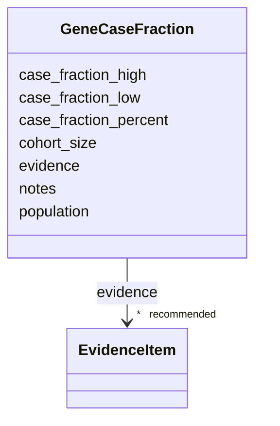

# Class: GeneCaseFraction 


_A structured estimate of the fraction of cases of a genetically heterogeneous disease attributable to one gene, in a defined cohort. The genetic-spectrum analog of a population Prevalence record: it pairs a cohort/population with a normalized percentage (plus optional range bounds and cohort size), source notes, and citable evidence. Distinct from population occurrence (Prevalence) and from population allele frequency; this is "what share of patients have their disease explained by this gene". Complements the coarse free-text `frequency` band on the Genetic entry._


URI: [dismech:class/GeneCaseFraction](https://w3id.org/monarch-initiative/dismech/class/GeneCaseFraction)





<!-- no inheritance hierarchy -->

## Slots

| Name | Cardinality and Range | Description | Inheritance |
| ---  | --- | --- | --- |
| [population](../slots/population.md) | 0..1 <br/> [String](../types/String.md) | Population or cohort description (e | direct |
| [case_fraction_percent](../slots/case_fraction_percent.md) | 0..1 <br/> [Float](../types/Float.md) | Point estimate of the percentage of cases attributable to this gene in the st... | direct |
| [case_fraction_low](../slots/case_fraction_low.md) | 0..1 <br/> [Float](../types/Float.md) | Lower bound of the case fraction (percent) when the source gives a range | direct |
| [case_fraction_high](../slots/case_fraction_high.md) | 0..1 <br/> [Float](../types/Float.md) | Upper bound of the case fraction (percent) when the source gives a range | direct |
| [cohort_size](../slots/cohort_size.md) | 0..1 <br/> [Integer](../types/Integer.md) | Number of probands/cases in the cohort the case fraction was computed in, whe... | direct |
| [evidence](../slots/evidence.md) | * _recommended_ <br/> [EvidenceItem](../classes/EvidenceItem.md) |  | direct |
| [notes](../slots/notes.md) | 0..1 <br/> [String](../types/String.md) |  | direct |


## Usages

| used by | used in | type | used |
| ---  | --- | --- | --- |
| [Genetic](../classes/Genetic.md) | [case_fractions](../slots/case_fractions.md) | range | [GeneCaseFraction](../classes/GeneCaseFraction.md) |


## Identifier and Mapping Information


### Schema Source


* from schema: https://w3id.org/monarch-initiative/dismech


## Mappings

| Mapping Type | Mapped Value |
| ---  | ---  |
| self | dismech:GeneCaseFraction |
| native | dismech:GeneCaseFraction |


## LinkML Source

<!-- TODO: investigate https://stackoverflow.com/questions/37606292/how-to-create-tabbed-code-blocks-in-mkdocs-or-sphinx -->

### Direct

<details>
```yaml
name: GeneCaseFraction
description: 'A structured estimate of the fraction of cases of a genetically heterogeneous
  disease attributable to one gene, in a defined cohort. The genetic-spectrum analog
  of a population Prevalence record: it pairs a cohort/population with a normalized
  percentage (plus optional range bounds and cohort size), source notes, and citable
  evidence. Distinct from population occurrence (Prevalence) and from population allele
  frequency; this is "what share of patients have their disease explained by this
  gene". Complements the coarse free-text `frequency` band on the Genetic entry.'
from_schema: https://w3id.org/monarch-initiative/dismech
slots:
- population
- case_fraction_percent
- case_fraction_low
- case_fraction_high
- cohort_size
- evidence
- notes

```
</details>

### Induced

<details>
```yaml
name: GeneCaseFraction
description: 'A structured estimate of the fraction of cases of a genetically heterogeneous
  disease attributable to one gene, in a defined cohort. The genetic-spectrum analog
  of a population Prevalence record: it pairs a cohort/population with a normalized
  percentage (plus optional range bounds and cohort size), source notes, and citable
  evidence. Distinct from population occurrence (Prevalence) and from population allele
  frequency; this is "what share of patients have their disease explained by this
  gene". Complements the coarse free-text `frequency` band on the Genetic entry.'
from_schema: https://w3id.org/monarch-initiative/dismech
attributes:
  population:
    name: population
    description: Population or cohort description (e.g., for prevalence or association
      signals)
    examples:
    - value: Global
    from_schema: https://w3id.org/monarch-initiative/dismech
    rank: 1000
    alias: population
    owner: GeneCaseFraction
    domain_of:
    - PhenotypeContext
    - ReferenceRange
    - Prevalence
    - GeneCaseFraction
    - AssociationSignal
    range: string
  case_fraction_percent:
    name: case_fraction_percent
    description: Point estimate of the percentage of cases attributable to this gene
      in the stated cohort (0-100). The structured, queryable counterpart of the free-text
      genetic `frequency` band. Use case_fraction_low/high for ranges.
    examples:
    - value: '24.6'
    from_schema: https://w3id.org/monarch-initiative/dismech
    rank: 1000
    alias: case_fraction_percent
    owner: GeneCaseFraction
    domain_of:
    - GeneCaseFraction
    range: float
  case_fraction_low:
    name: case_fraction_low
    description: Lower bound of the case fraction (percent) when the source gives
      a range.
    examples:
    - value: '27.0'
    from_schema: https://w3id.org/monarch-initiative/dismech
    rank: 1000
    alias: case_fraction_low
    owner: GeneCaseFraction
    domain_of:
    - GeneCaseFraction
    range: float
  case_fraction_high:
    name: case_fraction_high
    description: Upper bound of the case fraction (percent) when the source gives
      a range.
    examples:
    - value: '32.8'
    from_schema: https://w3id.org/monarch-initiative/dismech
    rank: 1000
    alias: case_fraction_high
    owner: GeneCaseFraction
    domain_of:
    - GeneCaseFraction
    range: float
  cohort_size:
    name: cohort_size
    description: Number of probands/cases in the cohort the case fraction was computed
      in, when reported. Helps weight competing per-gene estimates.
    examples:
    - value: '61'
    from_schema: https://w3id.org/monarch-initiative/dismech
    rank: 1000
    alias: cohort_size
    owner: GeneCaseFraction
    domain_of:
    - GeneCaseFraction
    range: integer
  evidence:
    name: evidence
    from_schema: https://w3id.org/monarch-initiative/dismech
    rank: 1000
    alias: evidence
    owner: GeneCaseFraction
    domain_of:
    - PhenotypeContext
    - Dataset
    - ExperimentalModel
    - Experiment
    - ExperimentalPerturbation
    - ExperimentalReadout
    - ExperimentalControl
    - ClinicalTrial
    - ComputationalModel
    - DifferentialDiagnosis
    - Subtype
    - CausalEdge
    - TreatmentMechanismTarget
    - ModelMechanismLink
    - BiomarkerReadout
    - PhenotypeReadout
    - ReferenceRange
    - SurrogateEndpoint
    - ExternalAssertion
    - Finding
    - Prevalence
    - GeneCaseFraction
    - ProgressionInfo
    - ClinicalBurden
    - EpidemiologyInfo
    - Pathophysiology
    - Phenotype
    - Biochemical
    - HistopathologyFinding
    - ImagingFinding
    - Genetic
    - Environmental
    - Stage
    - AgentLifeCycle
    - AgentLifeCycleStage
    - AnimalModel
    - Treatment
    - InfectiousAgent
    - Transmission
    - Diagnosis
    - Inheritance
    - Variant
    - ModelingConsideration
    - ClassificationAssignment
    - Definition
    - AlgorithmValidationStatus
    - CriteriaSet
    - AssociationSignal
    - AssociationStatistics
    - ComorbidityHypothesis
    - UpstreamConditionHypothesis
    - MechanisticHypothesis
    - Discussion
    - GroupingCriteria
    - GroupingMember
    - DifferentiatingMechanism
    range: EvidenceItem
    recommended: true
    multivalued: true
    inlined: true
    inlined_as_list: true
  notes:
    name: notes
    examples:
    - value: Contagious stage where symptoms appear and the bacteria can be spread
        to others.
    from_schema: https://w3id.org/monarch-initiative/dismech
    rank: 1000
    alias: notes
    owner: GeneCaseFraction
    domain_of:
    - GeneticContext
    - OnsetDescriptor
    - PhenotypeContext
    - Dataset
    - ExperimentalModel
    - Experiment
    - ExperimentalPerturbation
    - ExperimentalReadout
    - ExperimentalControl
    - ClinicalTrial
    - ComputationalModel
    - ModelVariable
    - DifferentialDiagnosis
    - ReferenceRange
    - SurrogateEndpoint
    - SurrogateEndpointCollection
    - ExternalAssertion
    - TrackedIssue
    - Prevalence
    - GeneCaseFraction
    - ProgressionInfo
    - ClinicalBurden
    - EpidemiologyInfo
    - Pathophysiology
    - Phenotype
    - Biochemical
    - HistopathologyFinding
    - ImagingFinding
    - Genetic
    - Environmental
    - Disease
    - Stage
    - AgentLifeCycle
    - AgentLifeCycleStage
    - Treatment
    - Transmission
    - Diagnosis
    - ClassificationAssignment
    - Definition
    - CriteriaSet
    - TermMapping
    - MappingConsistency
    - ComorbidityAssociation
    - AssociationSignal
    - AssociationMetric
    - AssociationStatistics
    - MechanisticHypothesis
    - Discussion
    - Grouping
    - GroupingCriteria
    - GroupingMember
    - DifferentiatingMechanism
    range: string

```
</details>