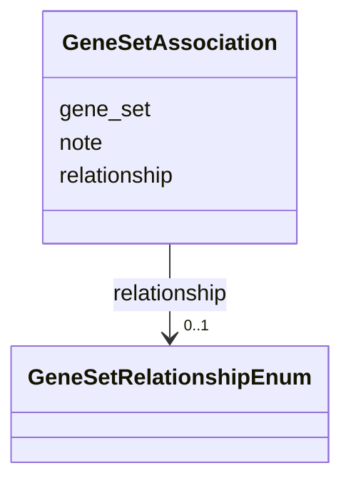

# Class: GeneSetAssociation 


_A curated link between this disease and an external gene set, referenced by its structured-source id (MYGENESET:<id>, resolving to references_cache/MYGENESET_<id>.md). The gene set's membership and curated GO interpretation live upstream / in the cache file; this object records only the precise disease<->set link and its semantics, avoiding re-duplication of genes in the KB. It is the anchor for BP alignment (`just genesets-align`): the set's curated biological processes are scored against this disease's pathograph._


URI: [dismech:class/GeneSetAssociation](https://w3id.org/monarch-initiative/dismech/class/GeneSetAssociation)





<!-- no inheritance hierarchy -->

## Slots

| Name | Cardinality and Range | Description | Inheritance |
| ---  | --- | --- | --- |
| [gene_set](../slots/gene_set.md) | 1 <br/> [Uriorcurie](../types/Uriorcurie.md) | Structured-source id of the gene set, e | direct |
| [relationship](../slots/relationship.md) | 0..1 <br/> [GeneSetRelationshipEnum](../enums/GeneSetRelationshipEnum.md) | How the gene set relates to this disease | direct |
| [note](../slots/note.md) | 0..1 <br/> [String](../types/String.md) | Free-text curator note on the link (e | direct |


## Usages

| used by | used in | type | used |
| ---  | --- | --- | --- |
| [Disease](../classes/Disease.md) | [gene_sets](../slots/gene_sets.md) | range | [GeneSetAssociation](../classes/GeneSetAssociation.md) |


## Identifier and Mapping Information


### Schema Source


* from schema: https://w3id.org/monarch-initiative/dismech


## Mappings

| Mapping Type | Mapped Value |
| ---  | ---  |
| self | dismech:GeneSetAssociation |
| native | dismech:GeneSetAssociation |


## LinkML Source

<!-- TODO: investigate https://stackoverflow.com/questions/37606292/how-to-create-tabbed-code-blocks-in-mkdocs-or-sphinx -->

### Direct

<details>
```yaml
name: GeneSetAssociation
description: 'A curated link between this disease and an external gene set, referenced
  by its structured-source id (MYGENESET:<id>, resolving to references_cache/MYGENESET_<id>.md).
  The gene set''s membership and curated GO interpretation live upstream / in the
  cache file; this object records only the precise disease<->set link and its semantics,
  avoiding re-duplication of genes in the KB. It is the anchor for BP alignment (`just
  genesets-align`): the set''s curated biological processes are scored against this
  disease''s pathograph.'
from_schema: https://w3id.org/monarch-initiative/dismech
attributes:
  gene_set:
    name: gene_set
    description: Structured-source id of the gene set, e.g. MYGENESET:KEGG_ASTHMA.
      Resolves to references_cache/MYGENESET_<id>.md.
    from_schema: https://w3id.org/monarch-initiative/dismech
    rank: 1000
    domain_of:
    - GeneSetAssociation
    range: uriorcurie
    required: true
  relationship:
    name: relationship
    description: How the gene set relates to this disease.
    from_schema: https://w3id.org/monarch-initiative/dismech
    domain_of:
    - GeneSetAssociation
    - BiomarkerReadout
    - PhenotypeReadout
    range: GeneSetRelationshipEnum
  note:
    name: note
    description: Free-text curator note on the link (e.g. which arms overlap).
    from_schema: https://w3id.org/monarch-initiative/dismech
    rank: 1000
    domain_of:
    - GeneSetAssociation
    range: string

```
</details>

### Induced

<details>
```yaml
name: GeneSetAssociation
description: 'A curated link between this disease and an external gene set, referenced
  by its structured-source id (MYGENESET:<id>, resolving to references_cache/MYGENESET_<id>.md).
  The gene set''s membership and curated GO interpretation live upstream / in the
  cache file; this object records only the precise disease<->set link and its semantics,
  avoiding re-duplication of genes in the KB. It is the anchor for BP alignment (`just
  genesets-align`): the set''s curated biological processes are scored against this
  disease''s pathograph.'
from_schema: https://w3id.org/monarch-initiative/dismech
attributes:
  gene_set:
    name: gene_set
    description: Structured-source id of the gene set, e.g. MYGENESET:KEGG_ASTHMA.
      Resolves to references_cache/MYGENESET_<id>.md.
    from_schema: https://w3id.org/monarch-initiative/dismech
    rank: 1000
    alias: gene_set
    owner: GeneSetAssociation
    domain_of:
    - GeneSetAssociation
    range: uriorcurie
    required: true
  relationship:
    name: relationship
    description: How the gene set relates to this disease.
    from_schema: https://w3id.org/monarch-initiative/dismech
    alias: relationship
    owner: GeneSetAssociation
    domain_of:
    - GeneSetAssociation
    - BiomarkerReadout
    - PhenotypeReadout
    range: GeneSetRelationshipEnum
  note:
    name: note
    description: Free-text curator note on the link (e.g. which arms overlap).
    from_schema: https://w3id.org/monarch-initiative/dismech
    rank: 1000
    alias: note
    owner: GeneSetAssociation
    domain_of:
    - GeneSetAssociation
    range: string

```
</details>