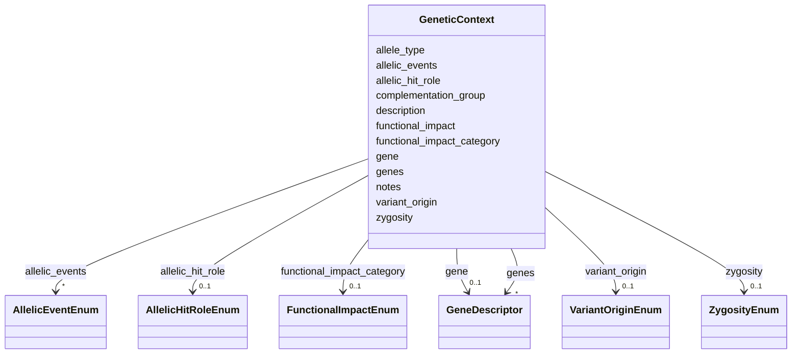

# Class: GeneticContext 


_A structured description of a genetic context that modifies phenotype frequency, severity, or presentation. Flexible enough to capture single genes, multiple genes, mutation types, zygosity, complementation groups, and complex genotypes. The description slot accommodates contexts that don't fit neatly into the structured fields (e.g., structural variants, complex rearrangements)._


URI: [dismech:class/GeneticContext](https://w3id.org/monarch-initiative/dismech/class/GeneticContext)





<!-- no inheritance hierarchy -->

## Slots

| Name | Cardinality and Range | Description | Inheritance |
| ---  | --- | --- | --- |
| [gene](../slots/gene.md) | 0..1 <br/> [GeneDescriptor](../classes/GeneDescriptor.md) |  | direct |
| [genes](../slots/genes.md) | * <br/> [GeneDescriptor](../classes/GeneDescriptor.md) |  | direct |
| [allele_type](../slots/allele_type.md) | 0..1 <br/> [String](../types/String.md) | Type of allele or mutation (e | direct |
| [variant_origin](../slots/variant_origin.md) | 0..1 <br/> [VariantOriginEnum](../enums/VariantOriginEnum.md) | The origin of disease-associated variation in this gene (germline, somatic, d... | direct |
| [allelic_hit_role](../slots/allelic_hit_role.md) | 0..1 <br/> [AllelicHitRoleEnum](../enums/AllelicHitRoleEnum.md) | Role of the alteration in a multi-hit mechanism, such as first hit, second hi... | direct |
| [allelic_events](../slots/allelic_events.md) | * <br/> [AllelicEventEnum](../enums/AllelicEventEnum.md) | Event types affecting the allele or locus | direct |
| [zygosity](../slots/zygosity.md) | 0..1 <br/> [ZygosityEnum](../enums/ZygosityEnum.md) | Zygosity context | direct |
| [functional_impact](../slots/functional_impact.md) | 0..1 <br/> [String](../types/String.md) | Functional consequence of the genetic variant (e | direct |
| [functional_impact_category](../slots/functional_impact_category.md) | 0..1 <br/> [FunctionalImpactEnum](../enums/FunctionalImpactEnum.md) | Controlled functional impact category for a genetic context | direct |
| [complementation_group](../slots/complementation_group.md) | 0..1 <br/> [String](../types/String.md) | Complementation group designation (e | direct |
| [description](../slots/description.md) | 0..1 <br/> [String](../types/String.md) |  | direct |
| [notes](../slots/notes.md) | 0..1 <br/> [String](../types/String.md) |  | direct |


## Usages

| used by | used in | type | used |
| ---  | --- | --- | --- |
| [PhenotypeContext](../classes/PhenotypeContext.md) | [genetic_context](../slots/genetic_context.md) | range | [GeneticContext](../classes/GeneticContext.md) |
| [Pathophysiology](../classes/Pathophysiology.md) | [genetic_context](../slots/genetic_context.md) | range | [GeneticContext](../classes/GeneticContext.md) |


## Identifier and Mapping Information


### Schema Source


* from schema: https://w3id.org/monarch-initiative/dismech


## Mappings

| Mapping Type | Mapped Value |
| ---  | ---  |
| self | dismech:GeneticContext |
| native | dismech:GeneticContext |


## LinkML Source

<!-- TODO: investigate https://stackoverflow.com/questions/37606292/how-to-create-tabbed-code-blocks-in-mkdocs-or-sphinx -->

### Direct

<details>
```yaml
name: GeneticContext
description: A structured description of a genetic context that modifies phenotype
  frequency, severity, or presentation. Flexible enough to capture single genes, multiple
  genes, mutation types, zygosity, complementation groups, and complex genotypes.
  The description slot accommodates contexts that don't fit neatly into the structured
  fields (e.g., structural variants, complex rearrangements).
from_schema: https://w3id.org/monarch-initiative/dismech
slots:
- gene
- genes
- allele_type
- variant_origin
- allelic_hit_role
- allelic_events
- zygosity
- functional_impact
- functional_impact_category
- complementation_group
- description
- notes

```
</details>

### Induced

<details>
```yaml
name: GeneticContext
description: A structured description of a genetic context that modifies phenotype
  frequency, severity, or presentation. Flexible enough to capture single genes, multiple
  genes, mutation types, zygosity, complementation groups, and complex genotypes.
  The description slot accommodates contexts that don't fit neatly into the structured
  fields (e.g., structural variants, complex rearrangements).
from_schema: https://w3id.org/monarch-initiative/dismech
attributes:
  gene:
    name: gene
    examples:
    - value: '{preferred_term: MEFV}'
    from_schema: https://w3id.org/monarch-initiative/dismech
    rank: 1000
    alias: gene
    owner: GeneticContext
    domain_of:
    - GeneticContext
    - ExperimentalPerturbation
    - Pathophysiology
    - Variant
    - LogicalCriterion
    - DifferentiatingMechanism
    range: GeneDescriptor
    inlined: true
  genes:
    name: genes
    examples:
    - value: '[{preferred_term: HLA-DQ2}, {preferred_term: INS}]'
    from_schema: https://w3id.org/monarch-initiative/dismech
    rank: 1000
    alias: genes
    owner: GeneticContext
    domain_of:
    - GeneticContext
    - Dataset
    - ExperimentalPerturbation
    - Subtype
    - Pathophysiology
    - AnimalModel
    range: GeneDescriptor
    multivalued: true
    inlined: true
    inlined_as_list: true
  allele_type:
    name: allele_type
    description: Type of allele or mutation (e.g., null, missense, splice_site, deletion,
      frameshift, nonsense, hypomorphic, structural_variant). Free text retained for
      legacy or unusually complex contexts. Prefer the structured `allelic_events`,
      `allelic_hit_role`, `variant_origin`, and `functional_impact_category` slots
      when possible.
    from_schema: https://w3id.org/monarch-initiative/dismech
    rank: 1000
    alias: allele_type
    owner: GeneticContext
    domain_of:
    - GeneticContext
    range: string
  variant_origin:
    name: variant_origin
    description: The origin of disease-associated variation in this gene (germline,
      somatic, de novo, or both). Bound to GENO allele origin terms.
    examples:
    - value: SOMATIC
    from_schema: https://w3id.org/monarch-initiative/dismech
    rank: 1000
    alias: variant_origin
    owner: GeneticContext
    domain_of:
    - GeneticContext
    - Genetic
    range: VariantOriginEnum
  allelic_hit_role:
    name: allelic_hit_role
    description: Role of the alteration in a multi-hit mechanism, such as first hit,
      second hit, or biallelic inactivation.
    from_schema: https://w3id.org/monarch-initiative/dismech
    rank: 1000
    alias: allelic_hit_role
    owner: GeneticContext
    domain_of:
    - GeneticContext
    range: AllelicHitRoleEnum
  allelic_events:
    name: allelic_events
    description: Event types affecting the allele or locus. Multivalued so events
      such as deletion plus loss of heterozygosity can be composed without cross-product
      enum values.
    from_schema: https://w3id.org/monarch-initiative/dismech
    rank: 1000
    alias: allelic_events
    owner: GeneticContext
    domain_of:
    - GeneticContext
    range: AllelicEventEnum
    multivalued: true
  zygosity:
    name: zygosity
    description: Zygosity context
    from_schema: https://w3id.org/monarch-initiative/dismech
    rank: 1000
    alias: zygosity
    owner: GeneticContext
    domain_of:
    - GeneticContext
    range: ZygosityEnum
  functional_impact:
    name: functional_impact
    description: Functional consequence of the genetic variant (e.g., loss_of_function,
      gain_of_function, dominant_negative). Free text retained for legacy values;
      prefer `functional_impact_category` when a controlled value applies.
    from_schema: https://w3id.org/monarch-initiative/dismech
    rank: 1000
    alias: functional_impact
    owner: GeneticContext
    domain_of:
    - GeneticContext
    range: string
  functional_impact_category:
    name: functional_impact_category
    description: Controlled functional impact category for a genetic context.
    from_schema: https://w3id.org/monarch-initiative/dismech
    rank: 1000
    alias: functional_impact_category
    owner: GeneticContext
    domain_of:
    - GeneticContext
    range: FunctionalImpactEnum
  complementation_group:
    name: complementation_group
    description: Complementation group designation (e.g., FA-A, FA-D1, BBS1). Used
      for genetically heterogeneous diseases where subtypes are historically named
      by complementation analysis.
    from_schema: https://w3id.org/monarch-initiative/dismech
    rank: 1000
    alias: complementation_group
    owner: GeneticContext
    domain_of:
    - GeneticContext
    range: string
  description:
    name: description
    from_schema: https://w3id.org/monarch-initiative/dismech
    rank: 1000
    alias: description
    owner: GeneticContext
    domain_of:
    - Descriptor
    - DietaryModification
    - GeneticContext
    - Dataset
    - ExperimentalModel
    - Experiment
    - ExperimentalPerturbation
    - ExperimentalReadout
    - ExperimentalControl
    - ClinicalTrial
    - ComputationalModel
    - ModelVariable
    - DifferentialDiagnosis
    - Subtype
    - CausalEdge
    - TreatmentMechanismTarget
    - ModelMechanismLink
    - BiomarkerReadout
    - SurrogateEndpointCollection
    - ProteinStructure
    - ExternalAssertion
    - EpidemiologyInfo
    - Pathophysiology
    - Phenotype
    - HistopathologyFinding
    - Environmental
    - Disease
    - Stage
    - AgentLifeCycle
    - AgentLifeCycleStage
    - AnimalModel
    - Treatment
    - InfectiousAgent
    - Transmission
    - Assay
    - Diagnosis
    - Inheritance
    - Variant
    - FunctionalEffect
    - Mechanism
    - ModelingConsideration
    - Definition
    - CriteriaSet
    - ConditionDescriptor
    - GOEnrichment
    - ComorbidityHypothesis
    - UpstreamConditionHypothesis
    - MechanisticHypothesis
    - Grouping
    - GroupingCriteria
    - LogicalCriterion
    - DifferentiatingMechanism
    range: string
  notes:
    name: notes
    examples:
    - value: Contagious stage where symptoms appear and the bacteria can be spread
        to others.
    from_schema: https://w3id.org/monarch-initiative/dismech
    rank: 1000
    alias: notes
    owner: GeneticContext
    domain_of:
    - GeneticContext
    - OnsetDescriptor
    - PhenotypeContext
    - Dataset
    - ExperimentalModel
    - Experiment
    - ExperimentalPerturbation
    - ExperimentalReadout
    - ExperimentalControl
    - ClinicalTrial
    - ComputationalModel
    - ModelVariable
    - DifferentialDiagnosis
    - ReferenceRange
    - SurrogateEndpoint
    - SurrogateEndpointCollection
    - ExternalAssertion
    - TrackedIssue
    - Prevalence
    - ProgressionInfo
    - EpidemiologyInfo
    - Pathophysiology
    - Phenotype
    - Biochemical
    - HistopathologyFinding
    - Genetic
    - Environmental
    - Disease
    - Stage
    - AgentLifeCycle
    - AgentLifeCycleStage
    - Treatment
    - Transmission
    - Diagnosis
    - ClassificationAssignment
    - Definition
    - CriteriaSet
    - TermMapping
    - MappingConsistency
    - ComorbidityAssociation
    - AssociationSignal
    - AssociationMetric
    - AssociationStatistics
    - MechanisticHypothesis
    - Discussion
    - Grouping
    - GroupingCriteria
    - GroupingMember
    - DifferentiatingMechanism
    range: string

```
</details>