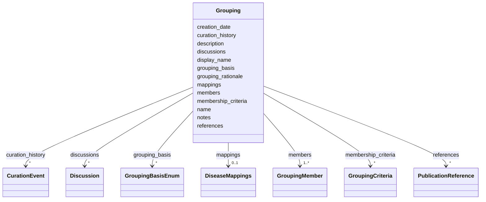

# Class: Grouping 


_An explicit, curated union of distinct Disease entries assembled below the level of the formal classification taxonomies. A Grouping points DOWN: it lists its members rather than being inferred from them, and it does not recapitulate MONDO (an optional `mappings` block may cross-reference an external grouping term). Its purpose is to make the grouping boundary auditable — recording WHY these conditions are grouped (`grouping_basis`, `grouping_rationale`), the shared `membership_criteria` (prose plus an optional boolean expression), and, per member, the mechanisms that differentiate it from its siblings._


URI: [dismech:class/Grouping](https://w3id.org/monarch-initiative/dismech/class/Grouping)





<!-- no inheritance hierarchy -->

## Slots

| Name | Cardinality and Range | Description | Inheritance |
| ---  | --- | --- | --- |
| [name](../slots/name.md) | 1 <br/> [String](../types/String.md) | Preferred name for the grouping (unique; serves as FK target) | direct |
| [display_name](../slots/display_name.md) | 0..1 <br/> [String](../types/String.md) | Human-readable display name for a subtype, used when the name (which serves a... | direct |
| [creation_date](../slots/creation_date.md) | 0..1 _recommended_ <br/> [String](../types/String.md) | Timestamp for initial creation of this grouping entry | direct |
| [description](../slots/description.md) | 0..1 <br/> [String](../types/String.md) |  | direct |
| [grouping_basis](../slots/grouping_basis.md) | * <br/> [GroupingBasisEnum](../enums/GroupingBasisEnum.md) | The axis or axes on which this grouping is drawn (records why the members bel... | direct |
| [grouping_rationale](../slots/grouping_rationale.md) | 0..1 <br/> [String](../types/String.md) | Free-text justification for the grouping boundary: why these members are grou... | direct |
| [membership_criteria](../slots/membership_criteria.md) | * <br/> [GroupingCriteria](../classes/GroupingCriteria.md) | The shared criteria a Disease must satisfy to belong to this grouping, expres... | direct |
| [members](../slots/members.md) | 1..* <br/> [GroupingMember](../classes/GroupingMember.md) | The explicit members of this grouping (the union it groups; points down to in... | direct |
| [mappings](../slots/mappings.md) | 0..1 <br/> [DiseaseMappings](../classes/DiseaseMappings.md) | External identifier mappings for this disease or subtype (SSSOM-inspired) | direct |
| [references](../slots/references.md) | * <br/> [PublicationReference](../classes/PublicationReference.md) | Top-level list of references with their key findings for this disease | direct |
| [discussions](../slots/discussions.md) | * <br/> [Discussion](../classes/Discussion.md) | Open or recently-resolved discussion items attached to this entry | direct |
| [curation_history](../slots/curation_history.md) | * <br/> [CurationEvent](../classes/CurationEvent.md) | Audit trail of AI-assisted curation events | direct |
| [notes](../slots/notes.md) | 0..1 <br/> [String](../types/String.md) |  | direct |


## Identifier and Mapping Information


### Schema Source


* from schema: https://w3id.org/monarch-initiative/dismech


## Mappings

| Mapping Type | Mapped Value |
| ---  | ---  |
| self | dismech:Grouping |
| native | dismech:Grouping |


## LinkML Source

<!-- TODO: investigate https://stackoverflow.com/questions/37606292/how-to-create-tabbed-code-blocks-in-mkdocs-or-sphinx -->

### Direct

<details>
```yaml
name: Grouping
description: 'An explicit, curated union of distinct Disease entries assembled below
  the level of the formal classification taxonomies. A Grouping points DOWN: it lists
  its members rather than being inferred from them, and it does not recapitulate MONDO
  (an optional `mappings` block may cross-reference an external grouping term). Its
  purpose is to make the grouping boundary auditable — recording WHY these conditions
  are grouped (`grouping_basis`, `grouping_rationale`), the shared `membership_criteria`
  (prose plus an optional boolean expression), and, per member, the mechanisms that
  differentiate it from its siblings.'
from_schema: https://w3id.org/monarch-initiative/dismech
slots:
- name
- display_name
- creation_date
- description
- grouping_basis
- grouping_rationale
- membership_criteria
- members
- mappings
- references
- discussions
- curation_history
- notes
slot_usage:
  name:
    name: name
    description: Preferred name for the grouping (unique; serves as FK target)
    required: true
  creation_date:
    name: creation_date
    description: Timestamp for initial creation of this grouping entry. Keep this
      stable after first set.
    recommended: true
  members:
    name: members
    required: true

```
</details>

### Induced

<details>
```yaml
name: Grouping
description: 'An explicit, curated union of distinct Disease entries assembled below
  the level of the formal classification taxonomies. A Grouping points DOWN: it lists
  its members rather than being inferred from them, and it does not recapitulate MONDO
  (an optional `mappings` block may cross-reference an external grouping term). Its
  purpose is to make the grouping boundary auditable — recording WHY these conditions
  are grouped (`grouping_basis`, `grouping_rationale`), the shared `membership_criteria`
  (prose plus an optional boolean expression), and, per member, the mechanisms that
  differentiate it from its siblings.'
from_schema: https://w3id.org/monarch-initiative/dismech
slot_usage:
  name:
    name: name
    description: Preferred name for the grouping (unique; serves as FK target)
    required: true
  creation_date:
    name: creation_date
    description: Timestamp for initial creation of this grouping entry. Keep this
      stable after first set.
    recommended: true
  members:
    name: members
    required: true
attributes:
  name:
    name: name
    description: Preferred name for the grouping (unique; serves as FK target)
    examples:
    - value: Adolescent Nephronophthisis
    from_schema: https://w3id.org/monarch-initiative/dismech
    rank: 1000
    identifier: true
    alias: name
    owner: Grouping
    domain_of:
    - ExperimentalModel
    - Experiment
    - ExperimentalPerturbation
    - ExperimentalReadout
    - ExperimentalControl
    - ClinicalTrial
    - ComputationalModel
    - ModelVariable
    - SeverityTier
    - DifferentialDiagnosis
    - Subtype
    - ReferenceRangeBand
    - SurrogateEndpointCollection
    - ExternalAssertion
    - EpidemiologyInfo
    - Pathophysiology
    - Phenotype
    - Biochemical
    - HistopathologyFinding
    - Genetic
    - Environmental
    - Disease
    - Stage
    - AgentLifeCycleStage
    - Treatment
    - InfectiousAgent
    - Transmission
    - Assay
    - Diagnosis
    - Inheritance
    - Variant
    - Mechanism
    - ModelingConsideration
    - Definition
    - CriteriaSet
    - ComorbidityAssociation
    - Grouping
    range: string
    required: true
  display_name:
    name: display_name
    description: Human-readable display name for a subtype, used when the name (which
      serves as the FK target) is too terse for comfortable display. Optional; when
      absent, renderers should fall back to name.
    from_schema: https://w3id.org/monarch-initiative/dismech
    rank: 1000
    alias: display_name
    owner: Grouping
    domain_of:
    - Subtype
    - Grouping
    - GroupingMember
    range: string
  creation_date:
    name: creation_date
    description: Timestamp for initial creation of this grouping entry. Keep this
      stable after first set.
    from_schema: https://w3id.org/monarch-initiative/dismech
    rank: 1000
    alias: creation_date
    owner: Grouping
    domain_of:
    - Disease
    - ComorbidityAssociation
    - Grouping
    range: string
    recommended: true
    pattern: ^\d{4}-\d{2}-\d{2}T\d{2}:\d{2}:\d{2}(?:\.\d+)?(?:Z|[+\-]\d{2}:\d{2})$
  description:
    name: description
    from_schema: https://w3id.org/monarch-initiative/dismech
    rank: 1000
    alias: description
    owner: Grouping
    domain_of:
    - Descriptor
    - DietaryModification
    - GeneticContext
    - Dataset
    - ExperimentalModel
    - Experiment
    - ExperimentalPerturbation
    - ExperimentalReadout
    - ExperimentalControl
    - ClinicalTrial
    - ComputationalModel
    - ModelVariable
    - DifferentialDiagnosis
    - Subtype
    - CausalEdge
    - TreatmentMechanismTarget
    - ModelMechanismLink
    - BiomarkerReadout
    - SurrogateEndpointCollection
    - ProteinStructure
    - ExternalAssertion
    - EpidemiologyInfo
    - Pathophysiology
    - Phenotype
    - HistopathologyFinding
    - Environmental
    - Disease
    - Stage
    - AgentLifeCycle
    - AgentLifeCycleStage
    - AnimalModel
    - Treatment
    - InfectiousAgent
    - Transmission
    - Assay
    - Diagnosis
    - Inheritance
    - Variant
    - FunctionalEffect
    - Mechanism
    - ModelingConsideration
    - Definition
    - CriteriaSet
    - ConditionDescriptor
    - GOEnrichment
    - ComorbidityHypothesis
    - UpstreamConditionHypothesis
    - MechanisticHypothesis
    - Grouping
    - GroupingCriteria
    - LogicalCriterion
    - DifferentiatingMechanism
    range: string
  grouping_basis:
    name: grouping_basis
    description: The axis or axes on which this grouping is drawn (records why the
      members belong together).
    from_schema: https://w3id.org/monarch-initiative/dismech
    rank: 1000
    alias: grouping_basis
    owner: Grouping
    domain_of:
    - Grouping
    range: GroupingBasisEnum
    multivalued: true
  grouping_rationale:
    name: grouping_rationale
    description: 'Free-text justification for the grouping boundary: why these members
      are grouped together and, where relevant, why they are deliberately kept as
      separate Disease entries rather than merged.'
    from_schema: https://w3id.org/monarch-initiative/dismech
    rank: 1000
    alias: grouping_rationale
    owner: Grouping
    domain_of:
    - Grouping
    range: string
  membership_criteria:
    name: membership_criteria
    description: The shared criteria a Disease must satisfy to belong to this grouping,
      expressed as human-readable prose plus an optional structured boolean expression.
      Multivalued so a grouping can carry several independent NECESSARY criteria blocks
      alongside an optional defining (NECESSARY_AND_SUFFICIENT) block, mirroring OWL
      subclass/equivalence axioms.
    from_schema: https://w3id.org/monarch-initiative/dismech
    rank: 1000
    alias: membership_criteria
    owner: Grouping
    domain_of:
    - Grouping
    range: GroupingCriteria
    multivalued: true
    inlined: true
    inlined_as_list: true
  members:
    name: members
    description: The explicit members of this grouping (the union it groups; points
      down to individual entries).
    from_schema: https://w3id.org/monarch-initiative/dismech
    rank: 1000
    alias: members
    owner: Grouping
    domain_of:
    - Grouping
    range: GroupingMember
    required: true
    multivalued: true
    inlined: true
    inlined_as_list: true
  mappings:
    name: mappings
    description: External identifier mappings for this disease or subtype (SSSOM-inspired)
    from_schema: https://w3id.org/monarch-initiative/dismech
    rank: 1000
    alias: mappings
    owner: Grouping
    domain_of:
    - Subtype
    - Disease
    - Grouping
    range: DiseaseMappings
    inlined: true
  references:
    name: references
    description: Top-level list of references with their key findings for this disease
    from_schema: https://w3id.org/monarch-initiative/dismech
    rank: 1000
    alias: references
    owner: Grouping
    domain_of:
    - Disease
    - Grouping
    range: PublicationReference
    multivalued: true
    inlined: true
    inlined_as_list: true
  discussions:
    name: discussions
    description: Open or recently-resolved discussion items attached to this entry.
      Each Discussion is a thread-like object with a `prompt`, a `kind` (OPEN_QUESTION,
      KNOWLEDGE_GAP, CONTROVERSY, etc.), a `status`, optional `attaches_to` pointers
      to specific nodes/gaps, an optional `proposed_experiments` block, and an `evidence`
      block reusing the standard EvidenceItem shape for citing primary literature,
      community commentary (e.g., Alzforum), and forum/issue threads.
    from_schema: https://w3id.org/monarch-initiative/dismech
    rank: 1000
    alias: discussions
    owner: Grouping
    domain_of:
    - Disease
    - Grouping
    range: Discussion
    multivalued: true
    inlined: true
    inlined_as_list: true
  curation_history:
    name: curation_history
    description: Audit trail of AI-assisted curation events
    from_schema: https://w3id.org/monarch-initiative/dismech
    rank: 1000
    alias: curation_history
    owner: Grouping
    domain_of:
    - Disease
    - Grouping
    range: CurationEvent
    multivalued: true
    inlined: true
    inlined_as_list: true
  notes:
    name: notes
    examples:
    - value: Contagious stage where symptoms appear and the bacteria can be spread
        to others.
    from_schema: https://w3id.org/monarch-initiative/dismech
    rank: 1000
    alias: notes
    owner: Grouping
    domain_of:
    - GeneticContext
    - OnsetDescriptor
    - PhenotypeContext
    - Dataset
    - ExperimentalModel
    - Experiment
    - ExperimentalPerturbation
    - ExperimentalReadout
    - ExperimentalControl
    - ClinicalTrial
    - ComputationalModel
    - ModelVariable
    - DifferentialDiagnosis
    - ReferenceRange
    - SurrogateEndpoint
    - SurrogateEndpointCollection
    - ExternalAssertion
    - TrackedIssue
    - Prevalence
    - ProgressionInfo
    - EpidemiologyInfo
    - Pathophysiology
    - Phenotype
    - Biochemical
    - HistopathologyFinding
    - Genetic
    - Environmental
    - Disease
    - Stage
    - AgentLifeCycle
    - AgentLifeCycleStage
    - Treatment
    - Transmission
    - Diagnosis
    - ClassificationAssignment
    - Definition
    - CriteriaSet
    - TermMapping
    - MappingConsistency
    - ComorbidityAssociation
    - AssociationSignal
    - AssociationMetric
    - AssociationStatistics
    - MechanisticHypothesis
    - Discussion
    - Grouping
    - GroupingCriteria
    - GroupingMember
    - DifferentiatingMechanism
    range: string

```
</details>