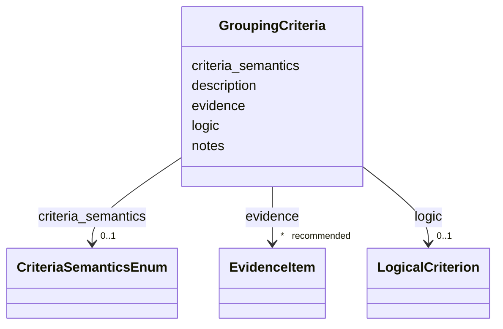

# Class: GroupingCriteria 


_The shared membership criteria for a grouping, pairing a human-readable description with an optional structured boolean expression and a necessary/sufficient/equivalent semantics marker._


URI: [dismech:class/GroupingCriteria](https://w3id.org/monarch-initiative/dismech/class/GroupingCriteria)





<!-- no inheritance hierarchy -->

## Slots

| Name | Cardinality and Range | Description | Inheritance |
| ---  | --- | --- | --- |
| [description](../slots/description.md) | 1 <br/> [String](../types/String.md) | Human-readable statement of the membership criteria | direct |
| [criteria_semantics](../slots/criteria_semantics.md) | 0..1 <br/> [CriteriaSemanticsEnum](../enums/CriteriaSemanticsEnum.md) | The logical relationship between this criteria block and grouping membership ... | direct |
| [logic](../slots/logic.md) | 0..1 <br/> [LogicalCriterion](../classes/LogicalCriterion.md) | Root of the structured (boolean/nested) membership-criteria expression for th... | direct |
| [evidence](../slots/evidence.md) | * _recommended_ <br/> [EvidenceItem](../classes/EvidenceItem.md) |  | direct |
| [notes](../slots/notes.md) | 0..1 <br/> [String](../types/String.md) |  | direct |


## Usages

| used by | used in | type | used |
| ---  | --- | --- | --- |
| [Grouping](../classes/Grouping.md) | [membership_criteria](../slots/membership_criteria.md) | range | [GroupingCriteria](../classes/GroupingCriteria.md) |


## Identifier and Mapping Information


### Schema Source


* from schema: https://w3id.org/monarch-initiative/dismech


## Mappings

| Mapping Type | Mapped Value |
| ---  | ---  |
| self | dismech:GroupingCriteria |
| native | dismech:GroupingCriteria |


## LinkML Source

<!-- TODO: investigate https://stackoverflow.com/questions/37606292/how-to-create-tabbed-code-blocks-in-mkdocs-or-sphinx -->

### Direct

<details>
```yaml
name: GroupingCriteria
description: The shared membership criteria for a grouping, pairing a human-readable
  description with an optional structured boolean expression and a necessary/sufficient/equivalent
  semantics marker.
from_schema: https://w3id.org/monarch-initiative/dismech
slots:
- description
- criteria_semantics
- logic
- evidence
- notes
slot_usage:
  description:
    name: description
    description: Human-readable statement of the membership criteria.
    required: true

```
</details>

### Induced

<details>
```yaml
name: GroupingCriteria
description: The shared membership criteria for a grouping, pairing a human-readable
  description with an optional structured boolean expression and a necessary/sufficient/equivalent
  semantics marker.
from_schema: https://w3id.org/monarch-initiative/dismech
slot_usage:
  description:
    name: description
    description: Human-readable statement of the membership criteria.
    required: true
attributes:
  description:
    name: description
    description: Human-readable statement of the membership criteria.
    from_schema: https://w3id.org/monarch-initiative/dismech
    rank: 1000
    alias: description
    owner: GroupingCriteria
    domain_of:
    - Descriptor
    - DietaryModification
    - GeneticContext
    - Dataset
    - ExperimentalModel
    - Experiment
    - ExperimentalPerturbation
    - ExperimentalReadout
    - ExperimentalControl
    - ClinicalTrial
    - ComputationalModel
    - ModelVariable
    - DifferentialDiagnosis
    - Subtype
    - CausalEdge
    - TreatmentMechanismTarget
    - ModelMechanismLink
    - BiomarkerReadout
    - SurrogateEndpointCollection
    - ProteinStructure
    - ExternalAssertion
    - EpidemiologyInfo
    - Pathophysiology
    - Phenotype
    - HistopathologyFinding
    - Environmental
    - Disease
    - Stage
    - AgentLifeCycle
    - AgentLifeCycleStage
    - AnimalModel
    - Treatment
    - InfectiousAgent
    - Transmission
    - Assay
    - Diagnosis
    - Inheritance
    - Variant
    - FunctionalEffect
    - Mechanism
    - ModelingConsideration
    - Definition
    - CriteriaSet
    - ConditionDescriptor
    - GOEnrichment
    - ComorbidityHypothesis
    - UpstreamConditionHypothesis
    - MechanisticHypothesis
    - Grouping
    - GroupingCriteria
    - LogicalCriterion
    - DifferentiatingMechanism
    range: string
    required: true
  criteria_semantics:
    name: criteria_semantics
    description: 'The logical relationship between this criteria block and grouping
      membership (the =>/<=/<=> distinction): NECESSARY (members entail the criteria),
      SUFFICIENT (the criteria entail membership), or NECESSARY_AND_SUFFICIENT (the
      criteria define the grouping).'
    from_schema: https://w3id.org/monarch-initiative/dismech
    rank: 1000
    alias: criteria_semantics
    owner: GroupingCriteria
    domain_of:
    - GroupingCriteria
    range: CriteriaSemanticsEnum
  logic:
    name: logic
    description: Root of the structured (boolean/nested) membership-criteria expression
      for this grouping.
    from_schema: https://w3id.org/monarch-initiative/dismech
    rank: 1000
    alias: logic
    owner: GroupingCriteria
    domain_of:
    - GroupingCriteria
    range: LogicalCriterion
    inlined: true
  evidence:
    name: evidence
    from_schema: https://w3id.org/monarch-initiative/dismech
    rank: 1000
    alias: evidence
    owner: GroupingCriteria
    domain_of:
    - PhenotypeContext
    - Dataset
    - ExperimentalModel
    - Experiment
    - ExperimentalPerturbation
    - ExperimentalReadout
    - ExperimentalControl
    - ClinicalTrial
    - ComputationalModel
    - DifferentialDiagnosis
    - Subtype
    - CausalEdge
    - TreatmentMechanismTarget
    - ModelMechanismLink
    - BiomarkerReadout
    - ReferenceRange
    - SurrogateEndpoint
    - ExternalAssertion
    - Finding
    - Prevalence
    - ProgressionInfo
    - EpidemiologyInfo
    - Pathophysiology
    - Phenotype
    - Biochemical
    - HistopathologyFinding
    - Genetic
    - Environmental
    - Stage
    - AgentLifeCycle
    - AgentLifeCycleStage
    - AnimalModel
    - Treatment
    - InfectiousAgent
    - Transmission
    - Diagnosis
    - Inheritance
    - Variant
    - ModelingConsideration
    - ClassificationAssignment
    - Definition
    - CriteriaSet
    - AssociationSignal
    - AssociationStatistics
    - ComorbidityHypothesis
    - UpstreamConditionHypothesis
    - MechanisticHypothesis
    - Discussion
    - GroupingCriteria
    - GroupingMember
    - DifferentiatingMechanism
    range: EvidenceItem
    recommended: true
    multivalued: true
    inlined: true
    inlined_as_list: true
  notes:
    name: notes
    examples:
    - value: Contagious stage where symptoms appear and the bacteria can be spread
        to others.
    from_schema: https://w3id.org/monarch-initiative/dismech
    rank: 1000
    alias: notes
    owner: GroupingCriteria
    domain_of:
    - GeneticContext
    - OnsetDescriptor
    - PhenotypeContext
    - Dataset
    - ExperimentalModel
    - Experiment
    - ExperimentalPerturbation
    - ExperimentalReadout
    - ExperimentalControl
    - ClinicalTrial
    - ComputationalModel
    - ModelVariable
    - DifferentialDiagnosis
    - ReferenceRange
    - SurrogateEndpoint
    - SurrogateEndpointCollection
    - ExternalAssertion
    - TrackedIssue
    - Prevalence
    - ProgressionInfo
    - EpidemiologyInfo
    - Pathophysiology
    - Phenotype
    - Biochemical
    - HistopathologyFinding
    - Genetic
    - Environmental
    - Disease
    - Stage
    - AgentLifeCycle
    - AgentLifeCycleStage
    - Treatment
    - Transmission
    - Diagnosis
    - ClassificationAssignment
    - Definition
    - CriteriaSet
    - TermMapping
    - MappingConsistency
    - ComorbidityAssociation
    - AssociationSignal
    - AssociationMetric
    - AssociationStatistics
    - MechanisticHypothesis
    - Discussion
    - Grouping
    - GroupingCriteria
    - GroupingMember
    - DifferentiatingMechanism
    range: string

```
</details>