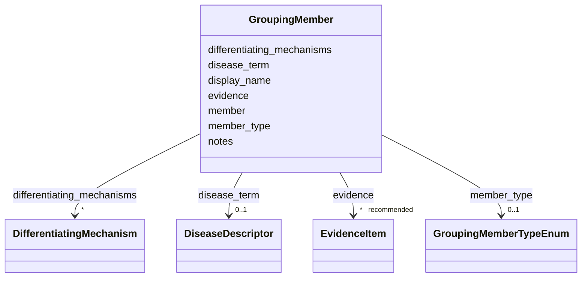

# Class: GroupingMember 


_One member of a grouping, referenced by foreign key, together with the mechanisms that differentiate it from its siblings._


URI: [dismech:class/GroupingMember](https://w3id.org/monarch-initiative/dismech/class/GroupingMember)





<!-- no inheritance hierarchy -->

## Slots

| Name | Cardinality and Range | Description | Inheritance |
| ---  | --- | --- | --- |
| [member](../slots/member.md) | 1 <br/> [String](../types/String.md) | Foreign key to the grouped entity | direct |
| [member_type](../slots/member_type.md) | 0..1 <br/> [GroupingMemberTypeEnum](../enums/GroupingMemberTypeEnum.md) | The kind of entity referenced (defaults conceptually to DISEASE) | direct |
| [display_name](../slots/display_name.md) | 0..1 <br/> [String](../types/String.md) | Human-readable display name for a subtype, used when the name (which serves a... | direct |
| [disease_term](../slots/disease_term.md) | 0..1 <br/> [DiseaseDescriptor](../classes/DiseaseDescriptor.md) | The MONDO disease term for this disease | direct |
| [differentiating_mechanisms](../slots/differentiating_mechanisms.md) | * <br/> [DifferentiatingMechanism](../classes/DifferentiatingMechanism.md) | Mechanisms or features that distinguish this member from its siblings in the ... | direct |
| [evidence](../slots/evidence.md) | * _recommended_ <br/> [EvidenceItem](../classes/EvidenceItem.md) |  | direct |
| [notes](../slots/notes.md) | 0..1 <br/> [String](../types/String.md) |  | direct |


## Usages

| used by | used in | type | used |
| ---  | --- | --- | --- |
| [Grouping](../classes/Grouping.md) | [members](../slots/members.md) | range | [GroupingMember](../classes/GroupingMember.md) |


## Identifier and Mapping Information


### Schema Source


* from schema: https://w3id.org/monarch-initiative/dismech


## Mappings

| Mapping Type | Mapped Value |
| ---  | ---  |
| self | dismech:GroupingMember |
| native | dismech:GroupingMember |


## LinkML Source

<!-- TODO: investigate https://stackoverflow.com/questions/37606292/how-to-create-tabbed-code-blocks-in-mkdocs-or-sphinx -->

### Direct

<details>
```yaml
name: GroupingMember
description: One member of a grouping, referenced by foreign key, together with the
  mechanisms that differentiate it from its siblings.
from_schema: https://w3id.org/monarch-initiative/dismech
slots:
- member
- member_type
- display_name
- disease_term
- differentiating_mechanisms
- evidence
- notes
slot_usage:
  member:
    name: member
    required: true
  member_type:
    name: member_type
    description: The kind of entity referenced (defaults conceptually to DISEASE).

```
</details>

### Induced

<details>
```yaml
name: GroupingMember
description: One member of a grouping, referenced by foreign key, together with the
  mechanisms that differentiate it from its siblings.
from_schema: https://w3id.org/monarch-initiative/dismech
slot_usage:
  member:
    name: member
    required: true
  member_type:
    name: member_type
    description: The kind of entity referenced (defaults conceptually to DISEASE).
attributes:
  member:
    name: member
    description: Foreign key to the grouped entity. For member_type DISEASE this is
      the Disease entry's `name`; for MODULE it is the module filename stem; for GROUPING
      it is another grouping's `name`.
    from_schema: https://w3id.org/monarch-initiative/dismech
    rank: 1000
    alias: member
    owner: GroupingMember
    domain_of:
    - GroupingMember
    range: string
    required: true
  member_type:
    name: member_type
    description: The kind of entity referenced (defaults conceptually to DISEASE).
    from_schema: https://w3id.org/monarch-initiative/dismech
    rank: 1000
    alias: member_type
    owner: GroupingMember
    domain_of:
    - GroupingMember
    range: GroupingMemberTypeEnum
  display_name:
    name: display_name
    description: Human-readable display name for a subtype, used when the name (which
      serves as the FK target) is too terse for comfortable display. Optional; when
      absent, renderers should fall back to name.
    from_schema: https://w3id.org/monarch-initiative/dismech
    rank: 1000
    alias: display_name
    owner: GroupingMember
    domain_of:
    - Subtype
    - Grouping
    - GroupingMember
    range: string
  disease_term:
    name: disease_term
    description: The MONDO disease term for this disease
    from_schema: https://w3id.org/monarch-initiative/dismech
    rank: 1000
    alias: disease_term
    owner: GroupingMember
    domain_of:
    - DifferentialDiagnosis
    - Disease
    - GroupingMember
    range: DiseaseDescriptor
    inlined: true
  differentiating_mechanisms:
    name: differentiating_mechanisms
    description: Mechanisms or features that distinguish this member from its siblings
      in the grouping, as prose plus optional structured descriptors.
    from_schema: https://w3id.org/monarch-initiative/dismech
    rank: 1000
    alias: differentiating_mechanisms
    owner: GroupingMember
    domain_of:
    - GroupingMember
    range: DifferentiatingMechanism
    multivalued: true
    inlined: true
    inlined_as_list: true
  evidence:
    name: evidence
    from_schema: https://w3id.org/monarch-initiative/dismech
    rank: 1000
    alias: evidence
    owner: GroupingMember
    domain_of:
    - PhenotypeContext
    - Dataset
    - ExperimentalModel
    - Experiment
    - ExperimentalPerturbation
    - ExperimentalReadout
    - ExperimentalControl
    - ClinicalTrial
    - ComputationalModel
    - DifferentialDiagnosis
    - Subtype
    - CausalEdge
    - TreatmentMechanismTarget
    - ModelMechanismLink
    - BiomarkerReadout
    - ReferenceRange
    - SurrogateEndpoint
    - ExternalAssertion
    - Finding
    - Prevalence
    - ProgressionInfo
    - EpidemiologyInfo
    - Pathophysiology
    - Phenotype
    - Biochemical
    - HistopathologyFinding
    - Genetic
    - Environmental
    - Stage
    - AgentLifeCycle
    - AgentLifeCycleStage
    - AnimalModel
    - Treatment
    - InfectiousAgent
    - Transmission
    - Diagnosis
    - Inheritance
    - Variant
    - ModelingConsideration
    - ClassificationAssignment
    - Definition
    - CriteriaSet
    - AssociationSignal
    - AssociationStatistics
    - ComorbidityHypothesis
    - UpstreamConditionHypothesis
    - MechanisticHypothesis
    - Discussion
    - GroupingCriteria
    - GroupingMember
    - DifferentiatingMechanism
    range: EvidenceItem
    recommended: true
    multivalued: true
    inlined: true
    inlined_as_list: true
  notes:
    name: notes
    examples:
    - value: Contagious stage where symptoms appear and the bacteria can be spread
        to others.
    from_schema: https://w3id.org/monarch-initiative/dismech
    rank: 1000
    alias: notes
    owner: GroupingMember
    domain_of:
    - GeneticContext
    - OnsetDescriptor
    - PhenotypeContext
    - Dataset
    - ExperimentalModel
    - Experiment
    - ExperimentalPerturbation
    - ExperimentalReadout
    - ExperimentalControl
    - ClinicalTrial
    - ComputationalModel
    - ModelVariable
    - DifferentialDiagnosis
    - ReferenceRange
    - SurrogateEndpoint
    - SurrogateEndpointCollection
    - ExternalAssertion
    - TrackedIssue
    - Prevalence
    - ProgressionInfo
    - EpidemiologyInfo
    - Pathophysiology
    - Phenotype
    - Biochemical
    - HistopathologyFinding
    - Genetic
    - Environmental
    - Disease
    - Stage
    - AgentLifeCycle
    - AgentLifeCycleStage
    - Treatment
    - Transmission
    - Diagnosis
    - ClassificationAssignment
    - Definition
    - CriteriaSet
    - TermMapping
    - MappingConsistency
    - ComorbidityAssociation
    - AssociationSignal
    - AssociationMetric
    - AssociationStatistics
    - MechanisticHypothesis
    - Discussion
    - Grouping
    - GroupingCriteria
    - GroupingMember
    - DifferentiatingMechanism
    range: string

```
</details>