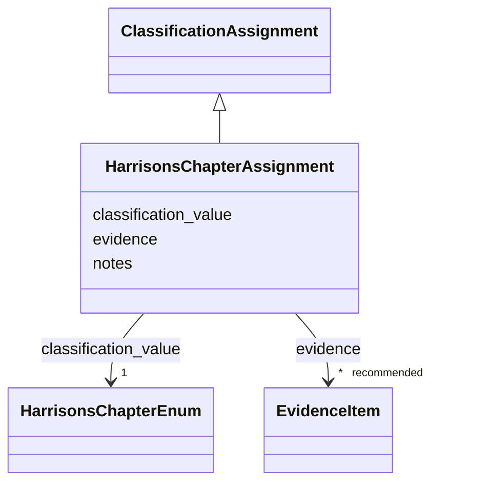

# Class: HarrisonsChapterAssignment 


_Harrison's internal medicine chapter classification assignment_


URI: [dismech:class/HarrisonsChapterAssignment](https://w3id.org/monarch-initiative/dismech/class/HarrisonsChapterAssignment)





## Inheritance
* [ClassificationAssignment](../classes/ClassificationAssignment.md)
    * **HarrisonsChapterAssignment**


## Slots

| Name | Cardinality and Range | Description | Inheritance |
| ---  | --- | --- | --- |
| [classification_value](../slots/classification_value.md) | 1 <br/> [HarrisonsChapterEnum](../enums/HarrisonsChapterEnum.md) | The classification value assigned | direct |
| [evidence](../slots/evidence.md) | * _recommended_ <br/> [EvidenceItem](../classes/EvidenceItem.md) |  | [ClassificationAssignment](../classes/ClassificationAssignment.md) |
| [notes](../slots/notes.md) | 0..1 <br/> [String](../types/String.md) |  | [ClassificationAssignment](../classes/ClassificationAssignment.md) |


## Usages

| used by | used in | type | used |
| ---  | --- | --- | --- |
| [DiseaseClassifications](../classes/DiseaseClassifications.md) | [harrisons_chapter](../slots/harrisons_chapter.md) | range | [HarrisonsChapterAssignment](../classes/HarrisonsChapterAssignment.md) |


## Identifier and Mapping Information


### Schema Source


* from schema: https://w3id.org/monarch-initiative/dismech


## Mappings

| Mapping Type | Mapped Value |
| ---  | ---  |
| self | dismech:HarrisonsChapterAssignment |
| native | dismech:HarrisonsChapterAssignment |


## LinkML Source

<!-- TODO: investigate https://stackoverflow.com/questions/37606292/how-to-create-tabbed-code-blocks-in-mkdocs-or-sphinx -->

### Direct

<details>
```yaml
name: HarrisonsChapterAssignment
description: Harrison's internal medicine chapter classification assignment
from_schema: https://w3id.org/monarch-initiative/dismech
is_a: ClassificationAssignment
slots:
- classification_value
slot_usage:
  classification_value:
    name: classification_value
    range: HarrisonsChapterEnum
    required: true

```
</details>

### Induced

<details>
```yaml
name: HarrisonsChapterAssignment
description: Harrison's internal medicine chapter classification assignment
from_schema: https://w3id.org/monarch-initiative/dismech
is_a: ClassificationAssignment
slot_usage:
  classification_value:
    name: classification_value
    range: HarrisonsChapterEnum
    required: true
attributes:
  classification_value:
    name: classification_value
    description: The classification value assigned
    from_schema: https://w3id.org/monarch-initiative/dismech
    rank: 1000
    alias: classification_value
    owner: HarrisonsChapterAssignment
    domain_of:
    - ICDOMorphologyAssignment
    - HarrisonsChapterAssignment
    - LysosomalStorageAssignment
    - MechanisticNosologyAssignment
    - IUISAssignment
    - ChannelopathyAssignment
    range: HarrisonsChapterEnum
    required: true
  evidence:
    name: evidence
    from_schema: https://w3id.org/monarch-initiative/dismech
    rank: 1000
    alias: evidence
    owner: HarrisonsChapterAssignment
    domain_of:
    - PhenotypeContext
    - Dataset
    - ClinicalTrial
    - ComputationalModel
    - DifferentialDiagnosis
    - Subtype
    - CausalEdge
    - TreatmentMechanismTarget
    - Finding
    - Prevalence
    - ProgressionInfo
    - EpidemiologyInfo
    - Pathophysiology
    - Phenotype
    - Biochemical
    - HistopathologyFinding
    - Genetic
    - Environmental
    - Stage
    - AgentLifeCycle
    - AgentLifeCycleStage
    - AnimalModel
    - Treatment
    - InfectiousAgent
    - Transmission
    - Diagnosis
    - Inheritance
    - Variant
    - ModelingConsideration
    - ClassificationAssignment
    - Definition
    - CriteriaSet
    - AssociationSignal
    - AssociationStatistics
    - ComorbidityHypothesis
    - UpstreamConditionHypothesis
    - MechanisticHypothesis
    range: EvidenceItem
    recommended: true
    multivalued: true
    inlined: true
    inlined_as_list: true
  notes:
    name: notes
    examples:
    - value: Contagious stage where symptoms appear and the bacteria can be spread
        to others.
    from_schema: https://w3id.org/monarch-initiative/dismech
    rank: 1000
    alias: notes
    owner: HarrisonsChapterAssignment
    domain_of:
    - GeneticContext
    - OnsetDescriptor
    - PhenotypeContext
    - Dataset
    - ClinicalTrial
    - ComputationalModel
    - ModelVariable
    - DifferentialDiagnosis
    - Prevalence
    - ProgressionInfo
    - EpidemiologyInfo
    - Pathophysiology
    - Phenotype
    - Biochemical
    - HistopathologyFinding
    - Genetic
    - Environmental
    - Disease
    - Stage
    - AgentLifeCycle
    - AgentLifeCycleStage
    - Treatment
    - Transmission
    - Diagnosis
    - ClassificationAssignment
    - Definition
    - CriteriaSet
    - TermMapping
    - MappingConsistency
    - ComorbidityAssociation
    - AssociationSignal
    - AssociationMetric
    - AssociationStatistics
    - MechanisticHypothesis
    range: string

```
</details>