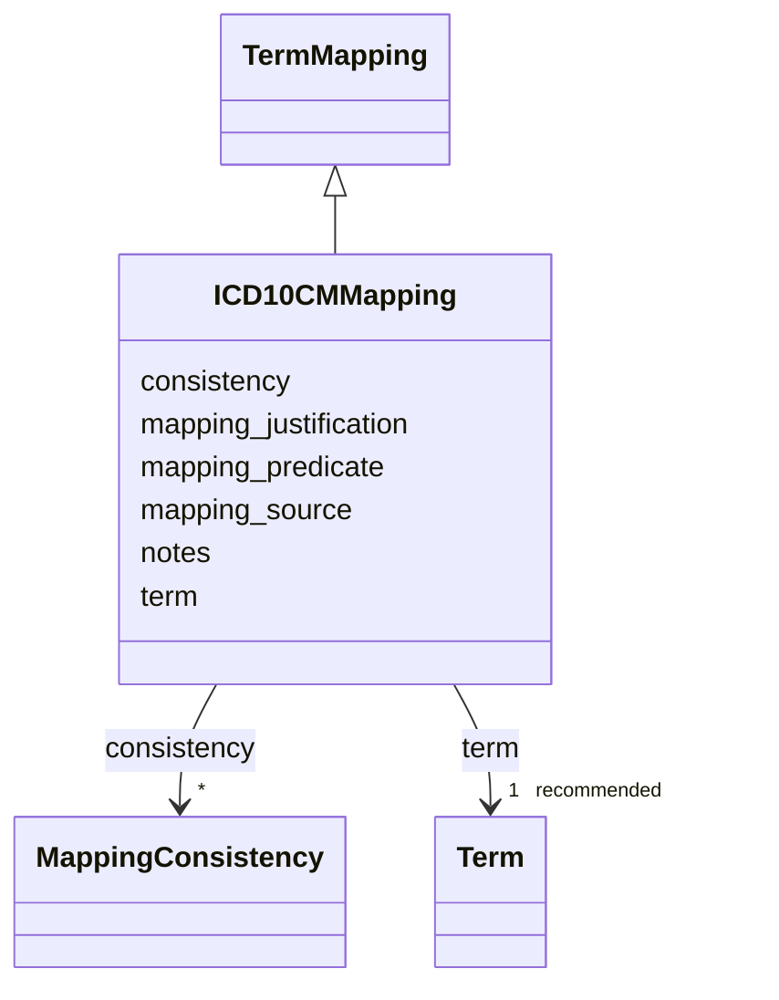

# Class: ICD10CMMapping 


_ICD-10-CM diagnosis code mapping_


URI: [dismech:class/ICD10CMMapping](https://w3id.org/monarch-initiative/dismech/class/ICD10CMMapping)





## Inheritance
* [TermMapping](../classes/TermMapping.md)
    * **ICD10CMMapping**


## Slots

| Name | Cardinality and Range | Description | Inheritance |
| ---  | --- | --- | --- |
| [term](../slots/term.md) | 1 _recommended_ <br/> [Term](../classes/Term.md) | Optional structured ontology term reference | [TermMapping](../classes/TermMapping.md) |
| [mapping_predicate](../slots/mapping_predicate.md) | 1 <br/> [Uriorcurie](../types/Uriorcurie.md) | Relationship between this disease and the mapped term (e | [TermMapping](../classes/TermMapping.md) |
| [mapping_source](../slots/mapping_source.md) | 0..1 <br/> [String](../types/String.md) | Source of the mapping (e | [TermMapping](../classes/TermMapping.md) |
| [mapping_justification](../slots/mapping_justification.md) | 0..1 <br/> [String](../types/String.md) | Brief rationale or justification for the mapping | [TermMapping](../classes/TermMapping.md) |
| [consistency](../slots/consistency.md) | * <br/> [MappingConsistency](../classes/MappingConsistency.md) | Consistency assertions for this mapping against other sources | [TermMapping](../classes/TermMapping.md) |
| [notes](../slots/notes.md) | 0..1 <br/> [String](../types/String.md) |  | [TermMapping](../classes/TermMapping.md) |


## Usages

| used by | used in | type | used |
| ---  | --- | --- | --- |
| [DiseaseMappings](../classes/DiseaseMappings.md) | [icd10cm_mappings](../slots/icd10cm_mappings.md) | range | [ICD10CMMapping](../classes/ICD10CMMapping.md) |


## Identifier and Mapping Information


### Schema Source


* from schema: https://w3id.org/monarch-initiative/dismech


## Mappings

| Mapping Type | Mapped Value |
| ---  | ---  |
| self | dismech:ICD10CMMapping |
| native | dismech:ICD10CMMapping |


## LinkML Source

<!-- TODO: investigate https://stackoverflow.com/questions/37606292/how-to-create-tabbed-code-blocks-in-mkdocs-or-sphinx -->

### Direct

<details>
```yaml
name: ICD10CMMapping
description: ICD-10-CM diagnosis code mapping
from_schema: https://w3id.org/monarch-initiative/dismech
is_a: TermMapping
slot_usage:
  term:
    name: term
    bindings:
    - range: ICD10CMTerm
      obligation_level: REQUIRED
      binds_value_of: id

```
</details>

### Induced

<details>
```yaml
name: ICD10CMMapping
description: ICD-10-CM diagnosis code mapping
from_schema: https://w3id.org/monarch-initiative/dismech
is_a: TermMapping
slot_usage:
  term:
    name: term
    bindings:
    - range: ICD10CMTerm
      obligation_level: REQUIRED
      binds_value_of: id
attributes:
  term:
    name: term
    description: Optional structured ontology term reference
    from_schema: https://w3id.org/monarch-initiative/dismech
    rank: 1000
    alias: term
    owner: ICD10CMMapping
    domain_of:
    - Descriptor
    - TermMapping
    - ConditionDescriptor
    - GOEnrichmentTerm
    range: Term
    bindings:
    - range: ICD10CMTerm
      obligation_level: REQUIRED
      binds_value_of: id
    required: true
    recommended: true
    inlined: true
  mapping_predicate:
    name: mapping_predicate
    description: Relationship between this disease and the mapped term (e.g., skos:exactMatch)
    from_schema: https://w3id.org/monarch-initiative/dismech
    rank: 1000
    alias: mapping_predicate
    owner: ICD10CMMapping
    domain_of:
    - TermMapping
    range: uriorcurie
    required: true
  mapping_source:
    name: mapping_source
    description: Source of the mapping (e.g., MONDO, ICD-10-CM, manual curation)
    from_schema: https://w3id.org/monarch-initiative/dismech
    rank: 1000
    alias: mapping_source
    owner: ICD10CMMapping
    domain_of:
    - TermMapping
    range: string
  mapping_justification:
    name: mapping_justification
    description: Brief rationale or justification for the mapping
    from_schema: https://w3id.org/monarch-initiative/dismech
    rank: 1000
    alias: mapping_justification
    owner: ICD10CMMapping
    domain_of:
    - TermMapping
    range: string
  consistency:
    name: consistency
    description: Consistency assertions for this mapping against other sources
    from_schema: https://w3id.org/monarch-initiative/dismech
    rank: 1000
    alias: consistency
    owner: ICD10CMMapping
    domain_of:
    - TermMapping
    range: MappingConsistency
    multivalued: true
    inlined: true
    inlined_as_list: true
  notes:
    name: notes
    examples:
    - value: Contagious stage where symptoms appear and the bacteria can be spread
        to others.
    from_schema: https://w3id.org/monarch-initiative/dismech
    rank: 1000
    alias: notes
    owner: ICD10CMMapping
    domain_of:
    - GeneticContext
    - OnsetDescriptor
    - PhenotypeContext
    - Dataset
    - ClinicalTrial
    - ComputationalModel
    - ModelVariable
    - DifferentialDiagnosis
    - Prevalence
    - ProgressionInfo
    - EpidemiologyInfo
    - Pathophysiology
    - Phenotype
    - Biochemical
    - HistopathologyFinding
    - Genetic
    - Environmental
    - Disease
    - Stage
    - AgentLifeCycle
    - AgentLifeCycleStage
    - Treatment
    - Transmission
    - Diagnosis
    - ClassificationAssignment
    - Definition
    - CriteriaSet
    - TermMapping
    - MappingConsistency
    - ComorbidityAssociation
    - AssociationSignal
    - AssociationMetric
    - AssociationStatistics
    - MechanisticHypothesis
    range: string

```
</details>