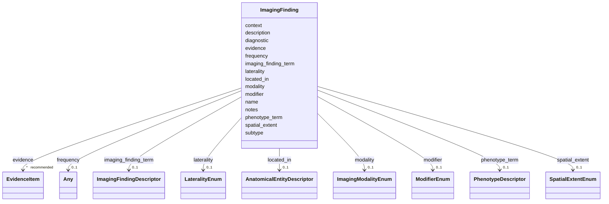

# Class: ImagingFinding 


_A finding detected by in-vivo medical imaging (MRI, CT, PET, ultrasound, etc.) that reflects disease pathophysiology or defines a diagnostic criterion. The macroscopic / in-vivo counterpart of HistopathologyFinding. Captures the modality plus the imaging appearance - NOT acquisition protocol, per-patient reads, or radiology decision support._


URI: [dismech:class/ImagingFinding](https://w3id.org/monarch-initiative/dismech/class/ImagingFinding)





<!-- no inheritance hierarchy -->

## Slots

| Name | Cardinality and Range | Description | Inheritance |
| ---  | --- | --- | --- |
| [name](../slots/name.md) | 1 <br/> [String](../types/String.md) | Name of the imaging finding | direct |
| [modality](../slots/modality.md) | 0..1 <br/> [ImagingModalityEnum](../enums/ImagingModalityEnum.md) | The imaging modality by which this finding is detected | direct |
| [imaging_finding_term](../slots/imaging_finding_term.md) | 0..1 <br/> [ImagingFindingDescriptor](../classes/ImagingFindingDescriptor.md) | Ontology term for an imaging finding (from the NCIT Imaging Finding branch or... | direct |
| [description](../slots/description.md) | 0..1 <br/> [String](../types/String.md) | Detailed description of the finding and its clinical significance | direct |
| [located_in](../slots/located_in.md) | 0..1 <br/> [AnatomicalEntityDescriptor](../classes/AnatomicalEntityDescriptor.md) | Anatomical body site of the finding (UBERON) | direct |
| [laterality](../slots/laterality.md) | 0..1 <br/> [LateralityEnum](../enums/LateralityEnum.md) | Laterality qualifier (left, right, or bilateral) | direct |
| [spatial_extent](../slots/spatial_extent.md) | 0..1 <br/> [SpatialExtentEnum](../enums/SpatialExtentEnum.md) | The spatial extent or distribution pattern applicable to this descriptor (e | direct |
| [phenotype_term](../slots/phenotype_term.md) | 0..1 <br/> [PhenotypeDescriptor](../classes/PhenotypeDescriptor.md) | Optional HP phenotype this imaging finding also maps to | direct |
| [diagnostic](../slots/diagnostic.md) | 0..1 <br/> [Boolean](../types/Boolean.md) | Whether this finding is pathognomonic or defines a diagnostic criterion | direct |
| [frequency](../slots/frequency.md) | 0..1 <br/> [FrequencyEnum](../enums/FrequencyEnum.md)&nbsp;or&nbsp;<br />[FrequencyQuantity](../types/FrequencyQuantity.md)&nbsp;or&nbsp;<br />[Any](../classes/Any.md) |  | direct |
| [modifier](../slots/modifier.md) | 0..1 <br/> [ModifierEnum](../enums/ModifierEnum.md) | Directional or qualitative modifier for a descriptor (e | direct |
| [evidence](../slots/evidence.md) | * _recommended_ <br/> [EvidenceItem](../classes/EvidenceItem.md) |  | direct |
| [notes](../slots/notes.md) | 0..1 <br/> [String](../types/String.md) |  | direct |
| [context](../slots/context.md) | 0..1 <br/> [String](../types/String.md) | Context in which this finding is observed (e | direct |
| [subtype](../slots/subtype.md) | 0..1 <br/> [String](../types/String.md) |  | direct |


## Usages

| used by | used in | type | used |
| ---  | --- | --- | --- |
| [Disease](../classes/Disease.md) | [imaging_findings](../slots/imaging_findings.md) | range | [ImagingFinding](../classes/ImagingFinding.md) |


## Comments

* Separate from phenotypes - names the modality plus appearance, even when the abnormality is also an HP phenotype (cross-linked via phenotype_term)
* Separate from histopathology - in-vivo / macroscopic, no biopsy
* Separate from the generic diagnosis slot - carries a structured finding rather than a free-text test name


## Identifier and Mapping Information


### Schema Source


* from schema: https://w3id.org/monarch-initiative/dismech


## Mappings

| Mapping Type | Mapped Value |
| ---  | ---  |
| self | dismech:ImagingFinding |
| native | dismech:ImagingFinding |


## LinkML Source

<!-- TODO: investigate https://stackoverflow.com/questions/37606292/how-to-create-tabbed-code-blocks-in-mkdocs-or-sphinx -->

### Direct

<details>
```yaml
name: ImagingFinding
description: A finding detected by in-vivo medical imaging (MRI, CT, PET, ultrasound,
  etc.) that reflects disease pathophysiology or defines a diagnostic criterion. The
  macroscopic / in-vivo counterpart of HistopathologyFinding. Captures the modality
  plus the imaging appearance - NOT acquisition protocol, per-patient reads, or radiology
  decision support.
comments:
- Separate from phenotypes - names the modality plus appearance, even when the abnormality
  is also an HP phenotype (cross-linked via phenotype_term)
- Separate from histopathology - in-vivo / macroscopic, no biopsy
- Separate from the generic diagnosis slot - carries a structured finding rather than
  a free-text test name
from_schema: https://w3id.org/monarch-initiative/dismech
slots:
- name
- modality
- imaging_finding_term
- description
- located_in
- laterality
- spatial_extent
- phenotype_term
- diagnostic
- frequency
- modifier
- evidence
- notes
- context
- subtype
slot_usage:
  name:
    name: name
    description: Name of the imaging finding
  description:
    name: description
    description: Detailed description of the finding and its clinical significance
    examples:
    - value: Multifocal periventricular white matter lesions on MRI
    - value: Gadolinium-enhancing lesion
    - value: Cerebral atrophy on CT
  modality:
    name: modality
    description: The imaging modality by which this finding is detected
  located_in:
    name: located_in
    description: Anatomical body site of the finding (UBERON)
  phenotype_term:
    name: phenotype_term
    description: Optional HP phenotype this imaging finding also maps to
  diagnostic:
    name: diagnostic
    description: Whether this finding is pathognomonic or defines a diagnostic criterion
  context:
    name: context
    description: Context in which this finding is observed (e.g., specific subtype)

```
</details>

### Induced

<details>
```yaml
name: ImagingFinding
description: A finding detected by in-vivo medical imaging (MRI, CT, PET, ultrasound,
  etc.) that reflects disease pathophysiology or defines a diagnostic criterion. The
  macroscopic / in-vivo counterpart of HistopathologyFinding. Captures the modality
  plus the imaging appearance - NOT acquisition protocol, per-patient reads, or radiology
  decision support.
comments:
- Separate from phenotypes - names the modality plus appearance, even when the abnormality
  is also an HP phenotype (cross-linked via phenotype_term)
- Separate from histopathology - in-vivo / macroscopic, no biopsy
- Separate from the generic diagnosis slot - carries a structured finding rather than
  a free-text test name
from_schema: https://w3id.org/monarch-initiative/dismech
slot_usage:
  name:
    name: name
    description: Name of the imaging finding
  description:
    name: description
    description: Detailed description of the finding and its clinical significance
    examples:
    - value: Multifocal periventricular white matter lesions on MRI
    - value: Gadolinium-enhancing lesion
    - value: Cerebral atrophy on CT
  modality:
    name: modality
    description: The imaging modality by which this finding is detected
  located_in:
    name: located_in
    description: Anatomical body site of the finding (UBERON)
  phenotype_term:
    name: phenotype_term
    description: Optional HP phenotype this imaging finding also maps to
  diagnostic:
    name: diagnostic
    description: Whether this finding is pathognomonic or defines a diagnostic criterion
  context:
    name: context
    description: Context in which this finding is observed (e.g., specific subtype)
attributes:
  name:
    name: name
    description: Name of the imaging finding
    examples:
    - value: Adolescent Nephronophthisis
    from_schema: https://w3id.org/monarch-initiative/dismech
    rank: 1000
    identifier: true
    alias: name
    owner: ImagingFinding
    domain_of:
    - ExperimentalModel
    - Experiment
    - ExperimentalPerturbation
    - ExperimentalReadout
    - ExperimentalControl
    - ClinicalTrial
    - ComputationalModel
    - ModelVariable
    - SeverityTier
    - DifferentialDiagnosis
    - Subtype
    - ReferenceRangeBand
    - SurrogateEndpointCollection
    - ExternalAssertion
    - EpidemiologyInfo
    - Pathophysiology
    - Phenotype
    - Biochemical
    - HistopathologyFinding
    - ImagingFinding
    - Genetic
    - Environmental
    - Disease
    - Stage
    - AgentLifeCycleStage
    - Treatment
    - InfectiousAgent
    - Transmission
    - Assay
    - Diagnosis
    - Inheritance
    - Variant
    - Mechanism
    - ModelingConsideration
    - Definition
    - CriteriaSet
    - ComorbidityAssociation
    - Grouping
    range: string
    required: true
  modality:
    name: modality
    description: The imaging modality by which this finding is detected
    from_schema: https://w3id.org/monarch-initiative/dismech
    rank: 1000
    alias: modality
    owner: ImagingFinding
    domain_of:
    - ImagingFinding
    range: ImagingModalityEnum
  imaging_finding_term:
    name: imaging_finding_term
    description: Ontology term for an imaging finding (from the NCIT Imaging Finding
      branch or HP)
    comments:
    - Use NCIT Imaging Finding terms (C176708 / C199145) or HP imaging-observable
      phenotypes (atrophy, white-matter lesions, hyperintensity)
    from_schema: https://w3id.org/monarch-initiative/dismech
    rank: 1000
    alias: imaging_finding_term
    owner: ImagingFinding
    domain_of:
    - ImagingFinding
    range: ImagingFindingDescriptor
    inlined: true
  description:
    name: description
    description: Detailed description of the finding and its clinical significance
    examples:
    - value: Multifocal periventricular white matter lesions on MRI
    - value: Gadolinium-enhancing lesion
    - value: Cerebral atrophy on CT
    from_schema: https://w3id.org/monarch-initiative/dismech
    rank: 1000
    alias: description
    owner: ImagingFinding
    domain_of:
    - Descriptor
    - DietaryModification
    - GeneticContext
    - Dataset
    - ExperimentalModel
    - Experiment
    - ExperimentalPerturbation
    - ExperimentalReadout
    - ExperimentalControl
    - ClinicalTrial
    - ComputationalModel
    - ModelVariable
    - DifferentialDiagnosis
    - Subtype
    - CausalEdge
    - TreatmentMechanismTarget
    - ModelMechanismLink
    - BiomarkerReadout
    - PhenotypeReadout
    - SurrogateEndpointCollection
    - ProteinStructure
    - ExternalAssertion
    - EpidemiologyInfo
    - Pathophysiology
    - Phenotype
    - HistopathologyFinding
    - ImagingFinding
    - Environmental
    - Disease
    - Stage
    - AgentLifeCycle
    - AgentLifeCycleStage
    - AnimalModel
    - Treatment
    - InfectiousAgent
    - Transmission
    - Assay
    - Diagnosis
    - Inheritance
    - Variant
    - FunctionalEffect
    - Mechanism
    - ModelingConsideration
    - Definition
    - CriteriaSet
    - ConditionDescriptor
    - GOEnrichment
    - ComorbidityHypothesis
    - UpstreamConditionHypothesis
    - MechanisticHypothesis
    - Grouping
    - GroupingCriteria
    - LogicalCriterion
    - DifferentiatingMechanism
    range: string
  located_in:
    name: located_in
    description: Anatomical body site of the finding (UBERON)
    from_schema: https://w3id.org/monarch-initiative/dismech
    rank: 1000
    alias: located_in
    owner: ImagingFinding
    domain_of:
    - Descriptor
    - ImagingFinding
    range: AnatomicalEntityDescriptor
    inlined: true
  laterality:
    name: laterality
    description: Laterality qualifier (left, right, or bilateral)
    from_schema: https://w3id.org/monarch-initiative/dismech
    rank: 1000
    alias: laterality
    owner: ImagingFinding
    domain_of:
    - Descriptor
    - ImagingFinding
    range: LateralityEnum
  spatial_extent:
    name: spatial_extent
    description: The spatial extent or distribution pattern applicable to this descriptor
      (e.g., focal, diffuse, extensive)
    from_schema: https://w3id.org/monarch-initiative/dismech
    rank: 1000
    alias: spatial_extent
    owner: ImagingFinding
    domain_of:
    - Descriptor
    - ImagingFinding
    range: SpatialExtentEnum
  phenotype_term:
    name: phenotype_term
    description: Optional HP phenotype this imaging finding also maps to
    from_schema: https://w3id.org/monarch-initiative/dismech
    rank: 1000
    alias: phenotype_term
    owner: ImagingFinding
    domain_of:
    - ExperimentalReadout
    - ReferenceRangeBand
    - Phenotype
    - ImagingFinding
    - LogicalCriterion
    - DifferentiatingMechanism
    range: PhenotypeDescriptor
    inlined: true
  diagnostic:
    name: diagnostic
    description: Whether this finding is pathognomonic or defines a diagnostic criterion
    from_schema: https://w3id.org/monarch-initiative/dismech
    rank: 1000
    alias: diagnostic
    owner: ImagingFinding
    domain_of:
    - Phenotype
    - HistopathologyFinding
    - ImagingFinding
    range: boolean
  frequency:
    name: frequency
    examples:
    - value: Occasional
    from_schema: https://w3id.org/monarch-initiative/dismech
    rank: 1000
    alias: frequency
    owner: ImagingFinding
    domain_of:
    - PhenotypeContext
    - Pathophysiology
    - Phenotype
    - Biochemical
    - HistopathologyFinding
    - ImagingFinding
    - Genetic
    range: Any
    any_of:
    - range: FrequencyEnum
    - range: FrequencyQuantity
  modifier:
    name: modifier
    description: Directional or qualitative modifier for a descriptor (e.g., increased,
      decreased, abnormal)
    from_schema: https://w3id.org/monarch-initiative/dismech
    rank: 1000
    alias: modifier
    owner: ImagingFinding
    domain_of:
    - Descriptor
    - ImagingFinding
    - DifferentiatingMechanism
    range: ModifierEnum
  evidence:
    name: evidence
    from_schema: https://w3id.org/monarch-initiative/dismech
    rank: 1000
    alias: evidence
    owner: ImagingFinding
    domain_of:
    - PhenotypeContext
    - Dataset
    - ExperimentalModel
    - Experiment
    - ExperimentalPerturbation
    - ExperimentalReadout
    - ExperimentalControl
    - ClinicalTrial
    - ComputationalModel
    - DifferentialDiagnosis
    - Subtype
    - CausalEdge
    - TreatmentMechanismTarget
    - ModelMechanismLink
    - BiomarkerReadout
    - PhenotypeReadout
    - ReferenceRange
    - SurrogateEndpoint
    - ExternalAssertion
    - Finding
    - Prevalence
    - GeneCaseFraction
    - ProgressionInfo
    - ClinicalBurden
    - EpidemiologyInfo
    - Pathophysiology
    - Phenotype
    - Biochemical
    - HistopathologyFinding
    - ImagingFinding
    - Genetic
    - Environmental
    - Stage
    - AgentLifeCycle
    - AgentLifeCycleStage
    - AnimalModel
    - Treatment
    - InfectiousAgent
    - Transmission
    - Diagnosis
    - Inheritance
    - Variant
    - ModelingConsideration
    - ClassificationAssignment
    - Definition
    - AlgorithmValidationStatus
    - CriteriaSet
    - AssociationSignal
    - AssociationStatistics
    - ComorbidityHypothesis
    - UpstreamConditionHypothesis
    - MechanisticHypothesis
    - Discussion
    - GroupingCriteria
    - GroupingMember
    - DifferentiatingMechanism
    range: EvidenceItem
    recommended: true
    multivalued: true
    inlined: true
    inlined_as_list: true
  notes:
    name: notes
    examples:
    - value: Contagious stage where symptoms appear and the bacteria can be spread
        to others.
    from_schema: https://w3id.org/monarch-initiative/dismech
    rank: 1000
    alias: notes
    owner: ImagingFinding
    domain_of:
    - GeneticContext
    - OnsetDescriptor
    - PhenotypeContext
    - Dataset
    - ExperimentalModel
    - Experiment
    - ExperimentalPerturbation
    - ExperimentalReadout
    - ExperimentalControl
    - ClinicalTrial
    - ComputationalModel
    - ModelVariable
    - DifferentialDiagnosis
    - ReferenceRange
    - SurrogateEndpoint
    - SurrogateEndpointCollection
    - ExternalAssertion
    - TrackedIssue
    - Prevalence
    - GeneCaseFraction
    - ProgressionInfo
    - ClinicalBurden
    - EpidemiologyInfo
    - Pathophysiology
    - Phenotype
    - Biochemical
    - HistopathologyFinding
    - ImagingFinding
    - Genetic
    - Environmental
    - Disease
    - Stage
    - AgentLifeCycle
    - AgentLifeCycleStage
    - Treatment
    - Transmission
    - Diagnosis
    - ClassificationAssignment
    - Definition
    - CriteriaSet
    - TermMapping
    - MappingConsistency
    - ComorbidityAssociation
    - AssociationSignal
    - AssociationMetric
    - AssociationStatistics
    - MechanisticHypothesis
    - Discussion
    - Grouping
    - GroupingCriteria
    - GroupingMember
    - DifferentiatingMechanism
    range: string
  context:
    name: context
    description: Context in which this finding is observed (e.g., specific subtype)
    examples:
    - value: Pregnancy
    from_schema: https://w3id.org/monarch-initiative/dismech
    rank: 1000
    alias: context
    owner: ImagingFinding
    domain_of:
    - Phenotype
    - Biochemical
    - HistopathologyFinding
    - ImagingFinding
    - Stage
    - AgentLifeCycle
    - AgentLifeCycleStage
    - Treatment
    range: string
  subtype:
    name: subtype
    examples:
    - value: Eyelid Myoclonia with Absences
    from_schema: https://w3id.org/monarch-initiative/dismech
    rank: 1000
    alias: subtype
    owner: ImagingFinding
    domain_of:
    - PhenotypeContext
    - Prevalence
    - ProgressionInfo
    - Phenotype
    - Biochemical
    - HistopathologyFinding
    - ImagingFinding
    - Genetic
    range: string

```
</details>