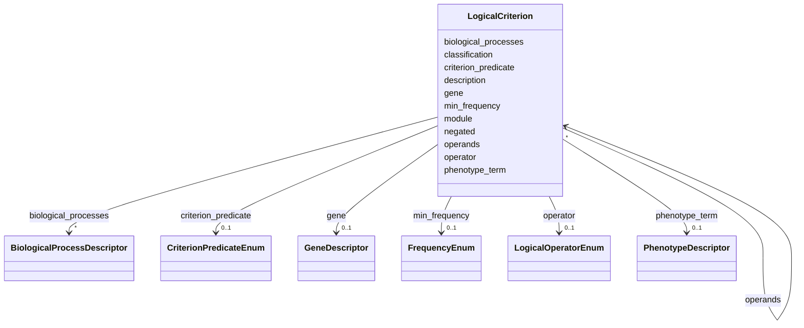

# Class: LogicalCriterion 


_A node in a nested boolean membership-criteria expression. A branch node sets `operator` and combines child `operands`; a leaf node sets `criterion_predicate` and the payload slots relevant to that predicate. This is a deliberately lightweight, OWL-inspired representation, not a full logical formalism._


URI: [dismech:class/LogicalCriterion](https://w3id.org/monarch-initiative/dismech/class/LogicalCriterion)





<!-- no inheritance hierarchy -->

## Slots

| Name | Cardinality and Range | Description | Inheritance |
| ---  | --- | --- | --- |
| [operator](../slots/operator.md) | 0..1 <br/> [LogicalOperatorEnum](../enums/LogicalOperatorEnum.md) | Boolean operator for a branch node in a membership-criteria expression | direct |
| [operands](../slots/operands.md) | * <br/> [LogicalCriterion](../classes/LogicalCriterion.md) | Child criteria combined by this branch node's operator | direct |
| [criterion_predicate](../slots/criterion_predicate.md) | 0..1 <br/> [CriterionPredicateEnum](../enums/CriterionPredicateEnum.md) | The constraint kind for a leaf node in a membership-criteria expression | direct |
| [description](../slots/description.md) | 0..1 <br/> [String](../types/String.md) |  | direct |
| [negated](../slots/negated.md) | 0..1 <br/> [Boolean](../types/Boolean.md) | If true, this leaf criterion is negated (the constraint must NOT hold) | direct |
| [phenotype_term](../slots/phenotype_term.md) | 0..1 <br/> [PhenotypeDescriptor](../classes/PhenotypeDescriptor.md) | The HP term for this phenotype | direct |
| [min_frequency](../slots/min_frequency.md) | 0..1 <br/> [FrequencyEnum](../enums/FrequencyEnum.md) | Minimum phenotype frequency threshold for a HAS_PHENOTYPE criterion; members ... | direct |
| [gene](../slots/gene.md) | 0..1 <br/> [GeneDescriptor](../classes/GeneDescriptor.md) |  | direct |
| [biological_processes](../slots/biological_processes.md) | * <br/> [BiologicalProcessDescriptor](../classes/BiologicalProcessDescriptor.md) |  | direct |
| [module](../slots/module.md) | 0..1 <br/> [String](../types/String.md) | Reference to a mechanism module in kb/modules/ (filename stem, without  | direct |
| [classification](../slots/classification.md) | 0..1 <br/> [String](../types/String.md) | Classification scheme this subtype belongs to (e | direct |


## Usages

| used by | used in | type | used |
| ---  | --- | --- | --- |
| [GroupingCriteria](../classes/GroupingCriteria.md) | [logic](../slots/logic.md) | range | [LogicalCriterion](../classes/LogicalCriterion.md) |
| [LogicalCriterion](../classes/LogicalCriterion.md) | [operands](../slots/operands.md) | range | [LogicalCriterion](../classes/LogicalCriterion.md) |


## Identifier and Mapping Information


### Schema Source


* from schema: https://w3id.org/monarch-initiative/dismech


## Mappings

| Mapping Type | Mapped Value |
| ---  | ---  |
| self | dismech:LogicalCriterion |
| native | dismech:LogicalCriterion |


## LinkML Source

<!-- TODO: investigate https://stackoverflow.com/questions/37606292/how-to-create-tabbed-code-blocks-in-mkdocs-or-sphinx -->

### Direct

<details>
```yaml
name: LogicalCriterion
description: A node in a nested boolean membership-criteria expression. A branch node
  sets `operator` and combines child `operands`; a leaf node sets `criterion_predicate`
  and the payload slots relevant to that predicate. This is a deliberately lightweight,
  OWL-inspired representation, not a full logical formalism.
from_schema: https://w3id.org/monarch-initiative/dismech
slots:
- operator
- operands
- criterion_predicate
- description
- negated
- phenotype_term
- min_frequency
- gene
- biological_processes
- module
- classification

```
</details>

### Induced

<details>
```yaml
name: LogicalCriterion
description: A node in a nested boolean membership-criteria expression. A branch node
  sets `operator` and combines child `operands`; a leaf node sets `criterion_predicate`
  and the payload slots relevant to that predicate. This is a deliberately lightweight,
  OWL-inspired representation, not a full logical formalism.
from_schema: https://w3id.org/monarch-initiative/dismech
attributes:
  operator:
    name: operator
    description: Boolean operator for a branch node in a membership-criteria expression.
      Present on branch nodes; absent on leaf nodes.
    from_schema: https://w3id.org/monarch-initiative/dismech
    rank: 1000
    alias: operator
    owner: LogicalCriterion
    domain_of:
    - LogicalCriterion
    range: LogicalOperatorEnum
  operands:
    name: operands
    description: Child criteria combined by this branch node's operator.
    from_schema: https://w3id.org/monarch-initiative/dismech
    rank: 1000
    alias: operands
    owner: LogicalCriterion
    domain_of:
    - LogicalCriterion
    range: LogicalCriterion
    multivalued: true
    inlined: true
    inlined_as_list: true
  criterion_predicate:
    name: criterion_predicate
    description: The constraint kind for a leaf node in a membership-criteria expression.
      Present on leaf nodes; absent on branch nodes.
    from_schema: https://w3id.org/monarch-initiative/dismech
    rank: 1000
    alias: criterion_predicate
    owner: LogicalCriterion
    domain_of:
    - LogicalCriterion
    range: CriterionPredicateEnum
  description:
    name: description
    from_schema: https://w3id.org/monarch-initiative/dismech
    rank: 1000
    alias: description
    owner: LogicalCriterion
    domain_of:
    - Descriptor
    - DietaryModification
    - GeneticContext
    - Dataset
    - ExperimentalModel
    - Experiment
    - ExperimentalPerturbation
    - ExperimentalReadout
    - ExperimentalControl
    - ClinicalTrial
    - ComputationalModel
    - ModelVariable
    - DifferentialDiagnosis
    - Subtype
    - CausalEdge
    - TreatmentMechanismTarget
    - ModelMechanismLink
    - BiomarkerReadout
    - SurrogateEndpointCollection
    - ProteinStructure
    - ExternalAssertion
    - EpidemiologyInfo
    - Pathophysiology
    - Phenotype
    - HistopathologyFinding
    - Environmental
    - Disease
    - Stage
    - AgentLifeCycle
    - AgentLifeCycleStage
    - AnimalModel
    - Treatment
    - InfectiousAgent
    - Transmission
    - Assay
    - Diagnosis
    - Inheritance
    - Variant
    - FunctionalEffect
    - Mechanism
    - ModelingConsideration
    - Definition
    - CriteriaSet
    - ConditionDescriptor
    - GOEnrichment
    - ComorbidityHypothesis
    - UpstreamConditionHypothesis
    - MechanisticHypothesis
    - Grouping
    - GroupingCriteria
    - LogicalCriterion
    - DifferentiatingMechanism
    range: string
  negated:
    name: negated
    description: If true, this leaf criterion is negated (the constraint must NOT
      hold). An alternative to wrapping the node in a NOT operator.
    from_schema: https://w3id.org/monarch-initiative/dismech
    rank: 1000
    alias: negated
    owner: LogicalCriterion
    domain_of:
    - LogicalCriterion
    range: boolean
  phenotype_term:
    name: phenotype_term
    description: The HP term for this phenotype
    from_schema: https://w3id.org/monarch-initiative/dismech
    rank: 1000
    alias: phenotype_term
    owner: LogicalCriterion
    domain_of:
    - ExperimentalReadout
    - ReferenceRangeBand
    - Phenotype
    - LogicalCriterion
    - DifferentiatingMechanism
    range: PhenotypeDescriptor
    inlined: true
  min_frequency:
    name: min_frequency
    description: Minimum phenotype frequency threshold for a HAS_PHENOTYPE criterion;
      members must exhibit the phenotype at this frequency band or higher.
    from_schema: https://w3id.org/monarch-initiative/dismech
    rank: 1000
    alias: min_frequency
    owner: LogicalCriterion
    domain_of:
    - LogicalCriterion
    range: FrequencyEnum
  gene:
    name: gene
    examples:
    - value: '{preferred_term: MEFV}'
    from_schema: https://w3id.org/monarch-initiative/dismech
    rank: 1000
    alias: gene
    owner: LogicalCriterion
    domain_of:
    - GeneticContext
    - ExperimentalPerturbation
    - Pathophysiology
    - Variant
    - LogicalCriterion
    - DifferentiatingMechanism
    range: GeneDescriptor
    inlined: true
  biological_processes:
    name: biological_processes
    examples:
    - value: '[{preferred_term: TNF-alpha Production}]'
    from_schema: https://w3id.org/monarch-initiative/dismech
    rank: 1000
    alias: biological_processes
    owner: LogicalCriterion
    domain_of:
    - ExperimentalPerturbation
    - ExperimentalReadout
    - Pathophysiology
    - LogicalCriterion
    - DifferentiatingMechanism
    range: BiologicalProcessDescriptor
    multivalued: true
    inlined: true
    inlined_as_list: true
  module:
    name: module
    description: Reference to a mechanism module in kb/modules/ (filename stem, without
      .yaml, optionally with a "#Node Name" anchor). Used by CONFORMS_TO_MODULE criteria
      and by differentiating mechanisms.
    from_schema: https://w3id.org/monarch-initiative/dismech
    rank: 1000
    alias: module
    owner: LogicalCriterion
    domain_of:
    - LogicalCriterion
    - DifferentiatingMechanism
    range: string
  classification:
    name: classification
    description: Classification scheme this subtype belongs to (e.g., 'complementation_group',
      'pathway_tier', 'histological', 'molecular', 'clinical_phenotype').
    from_schema: https://w3id.org/monarch-initiative/dismech
    rank: 1000
    alias: classification
    owner: LogicalCriterion
    domain_of:
    - Subtype
    - LogicalCriterion
    range: string

```
</details>