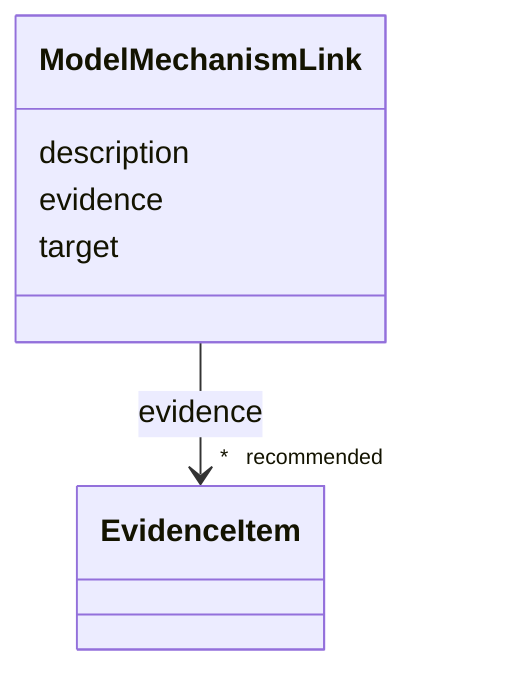

# Class: ModelMechanismLink 


_Links an experimental model to a specific pathophysiology mechanism node, with optional assertion text describing the aspect of the mechanism that the model recapitulates, perturbs, or reads out._


URI: [dismech:class/ModelMechanismLink](https://w3id.org/monarch-initiative/dismech/class/ModelMechanismLink)





<!-- no inheritance hierarchy -->

## Slots

| Name | Cardinality and Range | Description | Inheritance |
| ---  | --- | --- | --- |
| [target](../slots/target.md) | 1 <br/> [String](../types/String.md) | Name of the pathophysiology entry this model is linked to | direct |
| [description](../slots/description.md) | 0..1 <br/> [String](../types/String.md) | Brief assertion-level note describing what facet of the linked mechanism the ... | direct |
| [evidence](../slots/evidence.md) | * _recommended_ <br/> [EvidenceItem](../classes/EvidenceItem.md) | Evidence that this model is informative for the linked mechanism | direct |


## Usages

| used by | used in | type | used |
| ---  | --- | --- | --- |
| [ExperimentalModel](../classes/ExperimentalModel.md) | [modeled_mechanisms](../slots/modeled_mechanisms.md) | range | [ModelMechanismLink](../classes/ModelMechanismLink.md) |
| [ComputationalModel](../classes/ComputationalModel.md) | [modeled_mechanisms](../slots/modeled_mechanisms.md) | range | [ModelMechanismLink](../classes/ModelMechanismLink.md) |


## Identifier and Mapping Information


### Schema Source


* from schema: https://w3id.org/monarch-initiative/dismech


## Mappings

| Mapping Type | Mapped Value |
| ---  | ---  |
| self | dismech:ModelMechanismLink |
| native | dismech:ModelMechanismLink |


## LinkML Source

<!-- TODO: investigate https://stackoverflow.com/questions/37606292/how-to-create-tabbed-code-blocks-in-mkdocs-or-sphinx -->

### Direct

<details>
```yaml
name: ModelMechanismLink
description: Links an experimental model to a specific pathophysiology mechanism node,
  with optional assertion text describing the aspect of the mechanism that the model
  recapitulates, perturbs, or reads out.
from_schema: https://w3id.org/monarch-initiative/dismech
slots:
- target
- description
- evidence
slot_usage:
  target:
    name: target
    description: Name of the pathophysiology entry this model is linked to. Must match
      a pathophysiology name in the same disease file.
  description:
    name: description
    description: Brief assertion-level note describing what facet of the linked mechanism
      the model captures or assays.
  evidence:
    name: evidence
    description: Evidence that this model is informative for the linked mechanism

```
</details>

### Induced

<details>
```yaml
name: ModelMechanismLink
description: Links an experimental model to a specific pathophysiology mechanism node,
  with optional assertion text describing the aspect of the mechanism that the model
  recapitulates, perturbs, or reads out.
from_schema: https://w3id.org/monarch-initiative/dismech
slot_usage:
  target:
    name: target
    description: Name of the pathophysiology entry this model is linked to. Must match
      a pathophysiology name in the same disease file.
  description:
    name: description
    description: Brief assertion-level note describing what facet of the linked mechanism
      the model captures or assays.
  evidence:
    name: evidence
    description: Evidence that this model is informative for the linked mechanism
attributes:
  target:
    name: target
    description: Name of the pathophysiology entry this model is linked to. Must match
      a pathophysiology name in the same disease file.
    from_schema: https://w3id.org/monarch-initiative/dismech
    rank: 1000
    alias: target
    owner: ModelMechanismLink
    domain_of:
    - ExperimentalPerturbation
    - ExperimentalReadout
    - CausalEdge
    - TreatmentMechanismTarget
    - ModelMechanismLink
    - BiomarkerReadout
    range: string
    required: true
  description:
    name: description
    description: Brief assertion-level note describing what facet of the linked mechanism
      the model captures or assays.
    from_schema: https://w3id.org/monarch-initiative/dismech
    rank: 1000
    alias: description
    owner: ModelMechanismLink
    domain_of:
    - Descriptor
    - DietaryModification
    - GeneticContext
    - Dataset
    - ExperimentalModel
    - Experiment
    - ExperimentalPerturbation
    - ExperimentalReadout
    - ExperimentalControl
    - ClinicalTrial
    - ComputationalModel
    - ModelVariable
    - DifferentialDiagnosis
    - Subtype
    - CausalEdge
    - TreatmentMechanismTarget
    - ModelMechanismLink
    - BiomarkerReadout
    - SurrogateEndpointCollection
    - ProteinStructure
    - ExternalAssertion
    - EpidemiologyInfo
    - Pathophysiology
    - Phenotype
    - HistopathologyFinding
    - Environmental
    - Disease
    - Stage
    - AgentLifeCycle
    - AgentLifeCycleStage
    - AnimalModel
    - Treatment
    - InfectiousAgent
    - Transmission
    - Assay
    - Diagnosis
    - Inheritance
    - Variant
    - FunctionalEffect
    - Mechanism
    - ModelingConsideration
    - Definition
    - CriteriaSet
    - ConditionDescriptor
    - GOEnrichment
    - ComorbidityHypothesis
    - UpstreamConditionHypothesis
    - MechanisticHypothesis
    - Grouping
    - GroupingCriteria
    - LogicalCriterion
    - DifferentiatingMechanism
    range: string
  evidence:
    name: evidence
    description: Evidence that this model is informative for the linked mechanism
    from_schema: https://w3id.org/monarch-initiative/dismech
    rank: 1000
    alias: evidence
    owner: ModelMechanismLink
    domain_of:
    - PhenotypeContext
    - Dataset
    - ExperimentalModel
    - Experiment
    - ExperimentalPerturbation
    - ExperimentalReadout
    - ExperimentalControl
    - ClinicalTrial
    - ComputationalModel
    - DifferentialDiagnosis
    - Subtype
    - CausalEdge
    - TreatmentMechanismTarget
    - ModelMechanismLink
    - BiomarkerReadout
    - ReferenceRange
    - SurrogateEndpoint
    - ExternalAssertion
    - Finding
    - Prevalence
    - ProgressionInfo
    - EpidemiologyInfo
    - Pathophysiology
    - Phenotype
    - Biochemical
    - HistopathologyFinding
    - Genetic
    - Environmental
    - Stage
    - AgentLifeCycle
    - AgentLifeCycleStage
    - AnimalModel
    - Treatment
    - InfectiousAgent
    - Transmission
    - Diagnosis
    - Inheritance
    - Variant
    - ModelingConsideration
    - ClassificationAssignment
    - Definition
    - CriteriaSet
    - AssociationSignal
    - AssociationStatistics
    - ComorbidityHypothesis
    - UpstreamConditionHypothesis
    - MechanisticHypothesis
    - Discussion
    - GroupingCriteria
    - GroupingMember
    - DifferentiatingMechanism
    range: EvidenceItem
    recommended: true
    multivalued: true
    inlined: true
    inlined_as_list: true

```
</details>