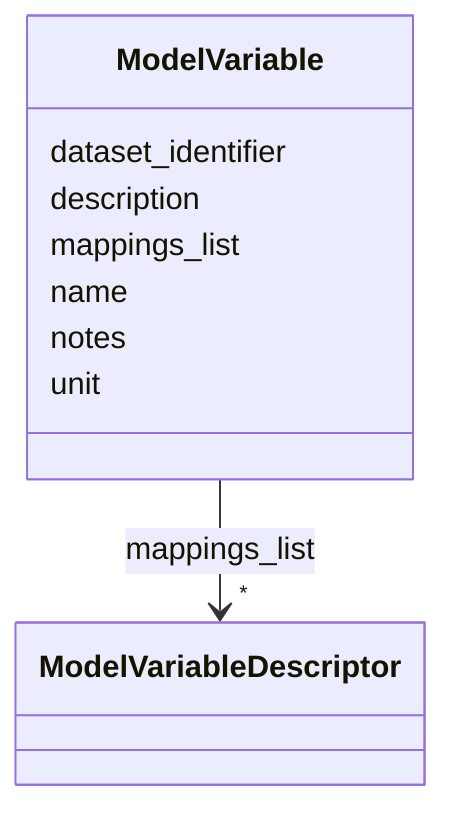

# Class: ModelVariable 


_A variable in a computational model, identified by a human-readable name, with an optional dataset_identifier for the native name in the model file and ontology term mappings (e.g., LOINC for clinical observables, CHEBI for metabolites, HP for phenotypic readouts)._


URI: [dismech:class/ModelVariable](https://w3id.org/monarch-initiative/dismech/class/ModelVariable)





<!-- no inheritance hierarchy -->


## Slots

| Name | Cardinality and Range | Description | Inheritance |
| ---  | --- | --- | --- |
| [name](../slots/name.md) | 1 <br/> [String](../types/String.md) |  | direct |
| [dataset_identifier](../slots/dataset_identifier.md) | 0..1 <br/> [String](../types/String.md) | Native identifier for this variable in the source dataset or model (e | direct |
| [description](../slots/description.md) | 0..1 <br/> [String](../types/String.md) |  | direct |
| [unit](../slots/unit.md) | 0..1 <br/> [String](../types/String.md) |  | direct |
| [mappings_list](../slots/mappings_list.md) | * <br/> [ModelVariableDescriptor](../classes/ModelVariableDescriptor.md) | Ontology term mappings for a model variable (LOINC, CHEBI, HP, etc | direct |
| [notes](../slots/notes.md) | 0..1 <br/> [String](../types/String.md) |  | direct |


## Usages

| used by | used in | type | used |
| ---  | --- | --- | --- |
| [ComputationalModel](../classes/ComputationalModel.md) | [variables](../slots/variables.md) | range | [ModelVariable](../classes/ModelVariable.md) |


## Comments

* Use 'name' for human-readable display (e.g., "Plasma Calcium")
* Use 'dataset_identifier' for the native model name (e.g., SBML species "P", COBRA reaction "R_0001")
* Map to LOINC codes for clinical lab measurements to link model outputs to CDEs
* Map to CHEBI for metabolite variables, HP for phenotypic readouts

## Identifier and Mapping Information


### Schema Source


* from schema: https://w3id.org/monarch-initiative/dismech


## Mappings

| Mapping Type | Mapped Value |
| ---  | ---  |
| self | dismech:ModelVariable |
| native | dismech:ModelVariable |


## LinkML Source

<!-- TODO: investigate https://stackoverflow.com/questions/37606292/how-to-create-tabbed-code-blocks-in-mkdocs-or-sphinx -->

### Direct

<details>
```yaml
name: ModelVariable
description: A variable in a computational model, identified by a human-readable name,
  with an optional dataset_identifier for the native name in the model file and ontology
  term mappings (e.g., LOINC for clinical observables, CHEBI for metabolites, HP for
  phenotypic readouts).
comments:
- Use 'name' for human-readable display (e.g., "Plasma Calcium")
- Use 'dataset_identifier' for the native model name (e.g., SBML species "P", COBRA
  reaction "R_0001")
- Map to LOINC codes for clinical lab measurements to link model outputs to CDEs
- Map to CHEBI for metabolite variables, HP for phenotypic readouts
from_schema: https://w3id.org/monarch-initiative/dismech
slots:
- name
- dataset_identifier
- description
- unit
- mappings_list
- notes

```
</details>

### Induced

<details>
```yaml
name: ModelVariable
description: A variable in a computational model, identified by a human-readable name,
  with an optional dataset_identifier for the native name in the model file and ontology
  term mappings (e.g., LOINC for clinical observables, CHEBI for metabolites, HP for
  phenotypic readouts).
comments:
- Use 'name' for human-readable display (e.g., "Plasma Calcium")
- Use 'dataset_identifier' for the native model name (e.g., SBML species "P", COBRA
  reaction "R_0001")
- Map to LOINC codes for clinical lab measurements to link model outputs to CDEs
- Map to CHEBI for metabolite variables, HP for phenotypic readouts
from_schema: https://w3id.org/monarch-initiative/dismech
attributes:
  name:
    name: name
    examples:
    - value: Adolescent Nephronophthisis
    from_schema: https://w3id.org/monarch-initiative/dismech
    rank: 1000
    identifier: true
    alias: name
    owner: ModelVariable
    domain_of:
    - ClinicalTrial
    - ComputationalModel
    - ModelVariable
    - SeverityTier
    - DifferentialDiagnosis
    - Subtype
    - EpidemiologyInfo
    - Pathophysiology
    - Phenotype
    - Biochemical
    - HistopathologyFinding
    - Genetic
    - Environmental
    - Disease
    - Stage
    - AgentLifeCycleStage
    - Treatment
    - InfectiousAgent
    - Transmission
    - Assay
    - Diagnosis
    - Inheritance
    - Variant
    - Mechanism
    - ModelingConsideration
    - Definition
    - CriteriaSet
    - ComorbidityAssociation
    range: string
    required: true
  dataset_identifier:
    name: dataset_identifier
    description: Native identifier for this variable in the source dataset or model
      (e.g., SBML species ID, database column name, COBRA reaction ID). When the parent
      context already specifies the dataset (e.g., a ComputationalModel with model_id),
      this field gives the local name within that dataset.
    examples:
    - value: ECCPhos
    - value: Qbone
    from_schema: https://w3id.org/monarch-initiative/dismech
    rank: 1000
    alias: dataset_identifier
    owner: ModelVariable
    domain_of:
    - ModelVariable
    range: string
  description:
    name: description
    from_schema: https://w3id.org/monarch-initiative/dismech
    rank: 1000
    alias: description
    owner: ModelVariable
    domain_of:
    - Descriptor
    - GeneticContext
    - Dataset
    - ClinicalTrial
    - ComputationalModel
    - ModelVariable
    - DifferentialDiagnosis
    - Subtype
    - CausalEdge
    - TreatmentMechanismTarget
    - ProteinStructure
    - EpidemiologyInfo
    - Pathophysiology
    - Phenotype
    - HistopathologyFinding
    - Environmental
    - Disease
    - Stage
    - AgentLifeCycle
    - AgentLifeCycleStage
    - AnimalModel
    - Treatment
    - InfectiousAgent
    - Transmission
    - Assay
    - Diagnosis
    - Inheritance
    - Variant
    - FunctionalEffect
    - Mechanism
    - ModelingConsideration
    - Definition
    - CriteriaSet
    - ConditionDescriptor
    - GOEnrichment
    - ComorbidityHypothesis
    - UpstreamConditionHypothesis
    - MechanisticHypothesis
    range: string
  unit:
    name: unit
    examples:
    - value: cm
    from_schema: https://w3id.org/monarch-initiative/dismech
    rank: 1000
    alias: unit
    owner: ModelVariable
    domain_of:
    - ModelVariable
    - EpidemiologyInfo
    range: string
  mappings_list:
    name: mappings_list
    description: Ontology term mappings for a model variable (LOINC, CHEBI, HP, etc.)
    from_schema: https://w3id.org/monarch-initiative/dismech
    rank: 1000
    alias: mappings_list
    owner: ModelVariable
    domain_of:
    - ModelVariable
    - Biochemical
    range: ModelVariableDescriptor
    multivalued: true
    inlined: true
    inlined_as_list: true
  notes:
    name: notes
    examples:
    - value: Contagious stage where symptoms appear and the bacteria can be spread
        to others.
    from_schema: https://w3id.org/monarch-initiative/dismech
    rank: 1000
    alias: notes
    owner: ModelVariable
    domain_of:
    - GeneticContext
    - OnsetDescriptor
    - PhenotypeContext
    - Dataset
    - ClinicalTrial
    - ComputationalModel
    - ModelVariable
    - DifferentialDiagnosis
    - Prevalence
    - ProgressionInfo
    - EpidemiologyInfo
    - Pathophysiology
    - Phenotype
    - Biochemical
    - HistopathologyFinding
    - Genetic
    - Environmental
    - Disease
    - Stage
    - AgentLifeCycle
    - AgentLifeCycleStage
    - Treatment
    - Transmission
    - Diagnosis
    - ClassificationAssignment
    - Definition
    - CriteriaSet
    - TermMapping
    - MappingConsistency
    - ComorbidityAssociation
    - AssociationSignal
    - AssociationMetric
    - AssociationStatistics
    - MechanisticHypothesis
    range: string

```
</details>