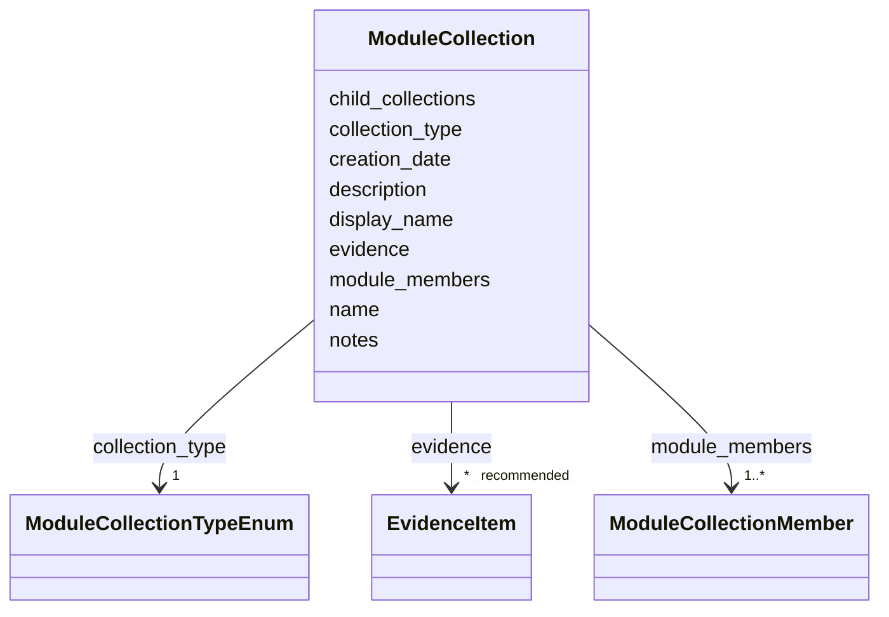

# Class: ModuleCollection 


_A curated navigation or framework record that organizes mechanism modules. A ModuleCollection is not itself a mechanism and does not assert disease membership. It points down to module filename stems, may nest more specific collections, and may cite the publication that defines the framework._


URI: [dismech:class/ModuleCollection](https://w3id.org/monarch-initiative/dismech/class/ModuleCollection)





<!-- no inheritance hierarchy -->

## Class Properties

| Property | Value |
| --- | --- |
| Tree Root | Yes |


## Slots

| Name | Cardinality and Range | Description | Inheritance |
| ---  | --- | --- | --- |
| [name](../slots/name.md) | 1 <br/> [String](../types/String.md) | Preferred collection name (unique; serves as an FK target) | direct |
| [display_name](../slots/display_name.md) | 0..1 <br/> [String](../types/String.md) | Human-readable display name for a subtype, used when the name (which serves a... | direct |
| [creation_date](../slots/creation_date.md) | 0..1 _recommended_ <br/> [String](../types/String.md) | Timestamp for initial creation of this module collection | direct |
| [description](../slots/description.md) | 0..1 <br/> [String](../types/String.md) |  | direct |
| [collection_type](../slots/collection_type.md) | 1 <br/> [ModuleCollectionTypeEnum](../enums/ModuleCollectionTypeEnum.md) | The organizing principle represented by a ModuleCollection | direct |
| [module_members](../slots/module_members.md) | 1..* <br/> [ModuleCollectionMember](../classes/ModuleCollectionMember.md) | The mechanism modules explicitly included in this collection | direct |
| [child_collections](../slots/child_collections.md) | * <br/> [String](../types/String.md) | Names of more specific ModuleCollection records nested under this collection | direct |
| [evidence](../slots/evidence.md) | * _recommended_ <br/> [EvidenceItem](../classes/EvidenceItem.md) |  | direct |
| [notes](../slots/notes.md) | 0..1 <br/> [String](../types/String.md) |  | direct |


## Identifier and Mapping Information


### Schema Source


* from schema: https://w3id.org/monarch-initiative/dismech


## Mappings

| Mapping Type | Mapped Value |
| ---  | ---  |
| self | dismech:ModuleCollection |
| native | dismech:ModuleCollection |


## LinkML Source

<!-- TODO: investigate https://stackoverflow.com/questions/37606292/how-to-create-tabbed-code-blocks-in-mkdocs-or-sphinx -->

### Direct

<details>
```yaml
name: ModuleCollection
description: A curated navigation or framework record that organizes mechanism modules.
  A ModuleCollection is not itself a mechanism and does not assert disease membership.
  It points down to module filename stems, may nest more specific collections, and
  may cite the publication that defines the framework.
from_schema: https://w3id.org/monarch-initiative/dismech
slots:
- name
- display_name
- creation_date
- description
- collection_type
- module_members
- child_collections
- evidence
- notes
slot_usage:
  name:
    name: name
    description: Preferred collection name (unique; serves as an FK target).
    required: true
  creation_date:
    name: creation_date
    description: Timestamp for initial creation of this module collection. Keep this
      stable after first set.
    recommended: true
  collection_type:
    name: collection_type
    required: true
  module_members:
    name: module_members
    required: true
```
</details>

### Induced

<details>
```yaml
name: ModuleCollection
description: A curated navigation or framework record that organizes mechanism modules.
  A ModuleCollection is not itself a mechanism and does not assert disease membership.
  It points down to module filename stems, may nest more specific collections, and
  may cite the publication that defines the framework.
from_schema: https://w3id.org/monarch-initiative/dismech
slot_usage:
  name:
    name: name
    description: Preferred collection name (unique; serves as an FK target).
    required: true
  creation_date:
    name: creation_date
    description: Timestamp for initial creation of this module collection. Keep this
      stable after first set.
    recommended: true
  collection_type:
    name: collection_type
    required: true
  module_members:
    name: module_members
    required: true
attributes:
  name:
    name: name
    description: Preferred collection name (unique; serves as an FK target).
    examples:
    - value: Adolescent Nephronophthisis
    from_schema: https://w3id.org/monarch-initiative/dismech
    rank: 1000
    identifier: true
    alias: name
    owner: ModuleCollection
    domain_of:
    - ExperimentalModel
    - Experiment
    - ExperimentalPerturbation
    - ExperimentalReadout
    - ExperimentalControl
    - ClinicalTrial
    - ComputationalModel
    - ModelVariable
    - SeverityTier
    - DifferentialDiagnosis
    - Subtype
    - ReferenceRangeBand
    - SurrogateEndpointCollection
    - ExternalAssertion
    - EpidemiologyInfo
    - Pathophysiology
    - Phenotype
    - Biochemical
    - HistopathologyFinding
    - ImagingFinding
    - Genetic
    - Environmental
    - Disease
    - Stage
    - AgentLifeCycleStage
    - AnimalModel
    - Treatment
    - InfectiousAgent
    - Transmission
    - Assay
    - Diagnosis
    - Inheritance
    - Variant
    - Mechanism
    - ModelingConsideration
    - Definition
    - CriteriaSet
    - ComorbidityAssociation
    - Grouping
    - ModuleCollection
    range: string
    required: true
  display_name:
    name: display_name
    description: Human-readable display name for a subtype, used when the name (which
      serves as the FK target) is too terse for comfortable display. Optional; when
      absent, renderers should fall back to name.
    from_schema: https://w3id.org/monarch-initiative/dismech
    rank: 1000
    alias: display_name
    owner: ModuleCollection
    domain_of:
    - Subtype
    - Grouping
    - GroupingMember
    - ModuleCollection
    range: string
  creation_date:
    name: creation_date
    description: Timestamp for initial creation of this module collection. Keep this
      stable after first set.
    from_schema: https://w3id.org/monarch-initiative/dismech
    rank: 1000
    alias: creation_date
    owner: ModuleCollection
    domain_of:
    - Disease
    - ComorbidityAssociation
    - Grouping
    - ModuleCollection
    range: string
    recommended: true
    pattern: ^\d{4}-\d{2}-\d{2}T\d{2}:\d{2}:\d{2}(?:\.\d+)?(?:Z|[+\-]\d{2}:\d{2})$
  description:
    name: description
    from_schema: https://w3id.org/monarch-initiative/dismech
    rank: 1000
    alias: description
    owner: ModuleCollection
    domain_of:
    - Descriptor
    - DietaryModification
    - GeneticContext
    - Dataset
    - ExperimentalModel
    - Experiment
    - ExperimentalPerturbation
    - ExperimentalReadout
    - ExperimentalControl
    - ClinicalTrial
    - ComputationalModel
    - ModelVariable
    - DifferentialDiagnosis
    - Subtype
    - CausalEdge
    - TreatmentMechanismTarget
    - EnvironmentalMechanismTarget
    - ModelMechanismLink
    - BiomarkerReadout
    - PhenotypeReadout
    - SurrogateEndpointCollection
    - ProteinStructure
    - ExternalAssertion
    - EpidemiologyInfo
    - Pathophysiology
    - Phenotype
    - HistopathologyFinding
    - ImagingFinding
    - Environmental
    - Disease
    - Stage
    - AgentLifeCycle
    - AgentLifeCycleStage
    - AnimalModel
    - Treatment
    - InfectiousAgent
    - Transmission
    - Assay
    - Diagnosis
    - Inheritance
    - Variant
    - FunctionalEffect
    - Mechanism
    - ModelingConsideration
    - Definition
    - CriteriaSet
    - ConditionDescriptor
    - GOEnrichment
    - ComorbidityHypothesis
    - UpstreamConditionHypothesis
    - MechanisticHypothesis
    - Grouping
    - GroupingCriteria
    - LogicalCriterion
    - DifferentiatingMechanism
    - ModuleCollection
    - ModuleCollectionMember
    range: string
  collection_type:
    name: collection_type
    description: The organizing principle represented by a ModuleCollection.
    from_schema: https://w3id.org/monarch-initiative/dismech
    rank: 1000
    alias: collection_type
    owner: ModuleCollection
    domain_of:
    - ModuleCollection
    range: ModuleCollectionTypeEnum
    required: true
  module_members:
    name: module_members
    description: The mechanism modules explicitly included in this collection. Module
      filename stems are used as foreign keys.
    from_schema: https://w3id.org/monarch-initiative/dismech
    rank: 1000
    alias: module_members
    owner: ModuleCollection
    domain_of:
    - ModuleCollection
    range: ModuleCollectionMember
    required: true
    multivalued: true
    inlined: true
    inlined_as_list: true
  child_collections:
    name: child_collections
    description: Names of more specific ModuleCollection records nested under this
      collection.
    from_schema: https://w3id.org/monarch-initiative/dismech
    rank: 1000
    alias: child_collections
    owner: ModuleCollection
    domain_of:
    - ModuleCollection
    range: string
    multivalued: true
  evidence:
    name: evidence
    from_schema: https://w3id.org/monarch-initiative/dismech
    rank: 1000
    alias: evidence
    owner: ModuleCollection
    domain_of:
    - PhenotypeContext
    - Dataset
    - ExperimentalModel
    - Experiment
    - ExperimentalPerturbation
    - ExperimentalReadout
    - ExperimentalControl
    - ClinicalTrial
    - ComputationalModel
    - DifferentialDiagnosis
    - Subtype
    - CausalEdge
    - TreatmentMechanismTarget
    - EnvironmentalMechanismTarget
    - ModelMechanismLink
    - BiomarkerReadout
    - PhenotypeReadout
    - ReferenceRange
    - SurrogateEndpoint
    - ExternalAssertion
    - Finding
    - Prevalence
    - GeneCaseFraction
    - ProgressionInfo
    - ClinicalBurden
    - EpidemiologyInfo
    - Pathophysiology
    - Phenotype
    - Biochemical
    - HistopathologyFinding
    - ImagingFinding
    - Genetic
    - Environmental
    - Stage
    - AgentLifeCycle
    - AgentLifeCycleStage
    - AnimalModel
    - Treatment
    - InfectiousAgent
    - Transmission
    - Diagnosis
    - Inheritance
    - Variant
    - ModelingConsideration
    - ClassificationAssignment
    - Definition
    - AlgorithmValidationStatus
    - CriteriaSet
    - AssociationSignal
    - AssociationStatistics
    - ComorbidityHypothesis
    - UpstreamConditionHypothesis
    - MechanisticHypothesis
    - Discussion
    - GroupingCriteria
    - GroupingMember
    - DifferentiatingMechanism
    - ModuleCollection
    - ModuleCollectionMember
    range: EvidenceItem
    recommended: true
    multivalued: true
    inlined: true
    inlined_as_list: true
  notes:
    name: notes
    examples:
    - value: Contagious stage where symptoms appear and the bacteria can be spread
        to others.
    from_schema: https://w3id.org/monarch-initiative/dismech
    rank: 1000
    alias: notes
    owner: ModuleCollection
    domain_of:
    - GeneticContext
    - OnsetDescriptor
    - PhenotypeContext
    - Dataset
    - ExperimentalModel
    - Experiment
    - ExperimentalPerturbation
    - ExperimentalReadout
    - ExperimentalControl
    - ClinicalTrial
    - ComputationalModel
    - ModelVariable
    - DifferentialDiagnosis
    - ReferenceRange
    - SurrogateEndpoint
    - SurrogateEndpointCollection
    - ExternalAssertion
    - TrackedIssue
    - Prevalence
    - GeneCaseFraction
    - ProgressionInfo
    - ClinicalBurden
    - EpidemiologyInfo
    - Pathophysiology
    - Phenotype
    - Biochemical
    - HistopathologyFinding
    - ImagingFinding
    - Genetic
    - Environmental
    - Disease
    - Stage
    - AgentLifeCycle
    - AgentLifeCycleStage
    - AnimalModel
    - Treatment
    - Transmission
    - Diagnosis
    - ClassificationAssignment
    - Definition
    - CriteriaSet
    - TermMapping
    - MappingConsistency
    - ComorbidityAssociation
    - AssociationSignal
    - AssociationMetric
    - AssociationStatistics
    - MechanisticHypothesis
    - Discussion
    - Grouping
    - GroupingCriteria
    - GroupingMember
    - DifferentiatingMechanism
    - ModuleCollection
    - ModuleCollectionMember
    range: string
```
</details>
