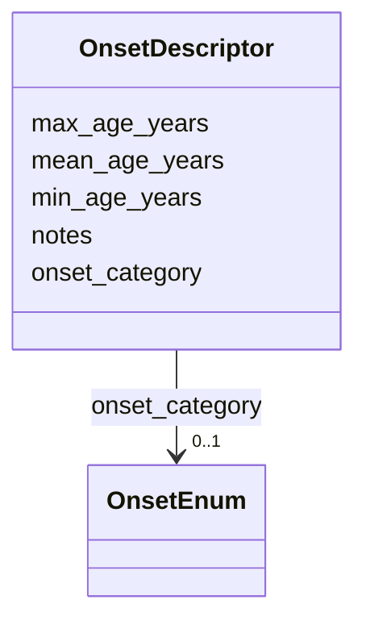

# Class: OnsetDescriptor 


_Structured description of age of onset. Combines an HPO onset category with optional quantitative age data and notes._


URI: [dismech:class/OnsetDescriptor](https://w3id.org/monarch-initiative/dismech/class/OnsetDescriptor)





<!-- no inheritance hierarchy -->

## Slots

| Name | Cardinality and Range | Description | Inheritance |
| ---  | --- | --- | --- |
| [onset_category](../slots/onset_category.md) | 0..1 <br/> [OnsetEnum](../enums/OnsetEnum.md) | HPO onset category (e | direct |
| [mean_age_years](../slots/mean_age_years.md) | 0..1 <br/> [Float](../types/Float.md) | Mean age of onset in years, as reported in a cohort study | direct |
| [min_age_years](../slots/min_age_years.md) | 0..1 <br/> [Float](../types/Float.md) | Minimum (earliest) age of onset in years | direct |
| [max_age_years](../slots/max_age_years.md) | 0..1 <br/> [Float](../types/Float.md) | Maximum (latest) age of onset in years | direct |
| [notes](../slots/notes.md) | 0..1 <br/> [String](../types/String.md) |  | direct |


## Usages

| used by | used in | type | used |
| ---  | --- | --- | --- |
| [Descriptor](../classes/Descriptor.md) | [onset](../slots/onset.md) | range | [OnsetDescriptor](../classes/OnsetDescriptor.md) |
| [CellTypeDescriptor](../classes/CellTypeDescriptor.md) | [onset](../slots/onset.md) | range | [OnsetDescriptor](../classes/OnsetDescriptor.md) |
| [BiologicalProcessDescriptor](../classes/BiologicalProcessDescriptor.md) | [onset](../slots/onset.md) | range | [OnsetDescriptor](../classes/OnsetDescriptor.md) |
| [MolecularFunctionDescriptor](../classes/MolecularFunctionDescriptor.md) | [onset](../slots/onset.md) | range | [OnsetDescriptor](../classes/OnsetDescriptor.md) |
| [AnatomicalEntityDescriptor](../classes/AnatomicalEntityDescriptor.md) | [onset](../slots/onset.md) | range | [OnsetDescriptor](../classes/OnsetDescriptor.md) |
| [ChemicalEntityDescriptor](../classes/ChemicalEntityDescriptor.md) | [onset](../slots/onset.md) | range | [OnsetDescriptor](../classes/OnsetDescriptor.md) |
| [GeneDescriptor](../classes/GeneDescriptor.md) | [onset](../slots/onset.md) | range | [OnsetDescriptor](../classes/OnsetDescriptor.md) |
| [CellularComponentDescriptor](../classes/CellularComponentDescriptor.md) | [onset](../slots/onset.md) | range | [OnsetDescriptor](../classes/OnsetDescriptor.md) |
| [ProteinComplexDescriptor](../classes/ProteinComplexDescriptor.md) | [onset](../slots/onset.md) | range | [OnsetDescriptor](../classes/OnsetDescriptor.md) |
| [AssayDescriptor](../classes/AssayDescriptor.md) | [onset](../slots/onset.md) | range | [OnsetDescriptor](../classes/OnsetDescriptor.md) |
| [TriggerDescriptor](../classes/TriggerDescriptor.md) | [onset](../slots/onset.md) | range | [OnsetDescriptor](../classes/OnsetDescriptor.md) |
| [DiseaseDescriptor](../classes/DiseaseDescriptor.md) | [onset](../slots/onset.md) | range | [OnsetDescriptor](../classes/OnsetDescriptor.md) |
| [SubtypeDescriptor](../classes/SubtypeDescriptor.md) | [onset](../slots/onset.md) | range | [OnsetDescriptor](../classes/OnsetDescriptor.md) |
| [BiomarkerDescriptor](../classes/BiomarkerDescriptor.md) | [onset](../slots/onset.md) | range | [OnsetDescriptor](../classes/OnsetDescriptor.md) |
| [GeneProductDescriptor](../classes/GeneProductDescriptor.md) | [onset](../slots/onset.md) | range | [OnsetDescriptor](../classes/OnsetDescriptor.md) |
| [HistopathologyFindingDescriptor](../classes/HistopathologyFindingDescriptor.md) | [onset](../slots/onset.md) | range | [OnsetDescriptor](../classes/OnsetDescriptor.md) |
| [LifeCycleStageDescriptor](../classes/LifeCycleStageDescriptor.md) | [onset](../slots/onset.md) | range | [OnsetDescriptor](../classes/OnsetDescriptor.md) |
| [PhenotypeDescriptor](../classes/PhenotypeDescriptor.md) | [onset](../slots/onset.md) | range | [OnsetDescriptor](../classes/OnsetDescriptor.md) |
| [InheritanceDescriptor](../classes/InheritanceDescriptor.md) | [onset](../slots/onset.md) | range | [OnsetDescriptor](../classes/OnsetDescriptor.md) |
| [TreatmentDescriptor](../classes/TreatmentDescriptor.md) | [onset](../slots/onset.md) | range | [OnsetDescriptor](../classes/OnsetDescriptor.md) |
| [RegimenDescriptor](../classes/RegimenDescriptor.md) | [onset](../slots/onset.md) | range | [OnsetDescriptor](../classes/OnsetDescriptor.md) |
| [ExposureDescriptor](../classes/ExposureDescriptor.md) | [onset](../slots/onset.md) | range | [OnsetDescriptor](../classes/OnsetDescriptor.md) |
| [EnvironmentDescriptor](../classes/EnvironmentDescriptor.md) | [onset](../slots/onset.md) | range | [OnsetDescriptor](../classes/OnsetDescriptor.md) |
| [FoodDescriptor](../classes/FoodDescriptor.md) | [onset](../slots/onset.md) | range | [OnsetDescriptor](../classes/OnsetDescriptor.md) |
| [OrganismDescriptor](../classes/OrganismDescriptor.md) | [onset](../slots/onset.md) | range | [OnsetDescriptor](../classes/OnsetDescriptor.md) |
| [HostDescriptor](../classes/HostDescriptor.md) | [onset](../slots/onset.md) | range | [OnsetDescriptor](../classes/OnsetDescriptor.md) |
| [SampleTypeDescriptor](../classes/SampleTypeDescriptor.md) | [onset](../slots/onset.md) | range | [OnsetDescriptor](../classes/OnsetDescriptor.md) |
| [PhenotypeContext](../classes/PhenotypeContext.md) | [onset](../slots/onset.md) | range | [OnsetDescriptor](../classes/OnsetDescriptor.md) |
| [ModelVariableDescriptor](../classes/ModelVariableDescriptor.md) | [onset](../slots/onset.md) | range | [OnsetDescriptor](../classes/OnsetDescriptor.md) |
| [CriteriaItem](../classes/CriteriaItem.md) | [onset](../slots/onset.md) | range | [OnsetDescriptor](../classes/OnsetDescriptor.md) |
| [ConditionDescriptor](../classes/ConditionDescriptor.md) | [onset](../slots/onset.md) | range | [OnsetDescriptor](../classes/OnsetDescriptor.md) |


## Identifier and Mapping Information


### Schema Source


* from schema: https://w3id.org/monarch-initiative/dismech


## Mappings

| Mapping Type | Mapped Value |
| ---  | ---  |
| self | dismech:OnsetDescriptor |
| native | dismech:OnsetDescriptor |


## LinkML Source

<!-- TODO: investigate https://stackoverflow.com/questions/37606292/how-to-create-tabbed-code-blocks-in-mkdocs-or-sphinx -->

### Direct

<details>
```yaml
name: OnsetDescriptor
description: Structured description of age of onset. Combines an HPO onset category
  with optional quantitative age data and notes.
from_schema: https://w3id.org/monarch-initiative/dismech
slots:
- onset_category
- mean_age_years
- min_age_years
- max_age_years
- notes

```
</details>

### Induced

<details>
```yaml
name: OnsetDescriptor
description: Structured description of age of onset. Combines an HPO onset category
  with optional quantitative age data and notes.
from_schema: https://w3id.org/monarch-initiative/dismech
attributes:
  onset_category:
    name: onset_category
    description: HPO onset category (e.g., CHILDHOOD, NEONATAL). Use when an approximate
      developmental stage is known.
    from_schema: https://w3id.org/monarch-initiative/dismech
    rank: 1000
    alias: onset_category
    owner: OnsetDescriptor
    domain_of:
    - OnsetDescriptor
    range: OnsetEnum
  mean_age_years:
    name: mean_age_years
    description: Mean age of onset in years, as reported in a cohort study.
    from_schema: https://w3id.org/monarch-initiative/dismech
    rank: 1000
    alias: mean_age_years
    owner: OnsetDescriptor
    domain_of:
    - OnsetDescriptor
    range: float
  min_age_years:
    name: min_age_years
    description: Minimum (earliest) age of onset in years.
    from_schema: https://w3id.org/monarch-initiative/dismech
    rank: 1000
    alias: min_age_years
    owner: OnsetDescriptor
    domain_of:
    - OnsetDescriptor
    range: float
  max_age_years:
    name: max_age_years
    description: Maximum (latest) age of onset in years.
    from_schema: https://w3id.org/monarch-initiative/dismech
    rank: 1000
    alias: max_age_years
    owner: OnsetDescriptor
    domain_of:
    - OnsetDescriptor
    range: float
  notes:
    name: notes
    examples:
    - value: Contagious stage where symptoms appear and the bacteria can be spread
        to others.
    from_schema: https://w3id.org/monarch-initiative/dismech
    rank: 1000
    alias: notes
    owner: OnsetDescriptor
    domain_of:
    - GeneticContext
    - OnsetDescriptor
    - PhenotypeContext
    - Dataset
    - ExperimentalModel
    - Experiment
    - ExperimentalPerturbation
    - ExperimentalReadout
    - ExperimentalControl
    - ClinicalTrial
    - ComputationalModel
    - ModelVariable
    - DifferentialDiagnosis
    - ReferenceRange
    - SurrogateEndpoint
    - SurrogateEndpointCollection
    - ExternalAssertion
    - TrackedIssue
    - Prevalence
    - ProgressionInfo
    - EpidemiologyInfo
    - Pathophysiology
    - Phenotype
    - Biochemical
    - HistopathologyFinding
    - Genetic
    - Environmental
    - Disease
    - Stage
    - AgentLifeCycle
    - AgentLifeCycleStage
    - Treatment
    - Transmission
    - Diagnosis
    - ClassificationAssignment
    - Definition
    - CriteriaSet
    - TermMapping
    - MappingConsistency
    - ComorbidityAssociation
    - AssociationSignal
    - AssociationMetric
    - AssociationStatistics
    - MechanisticHypothesis
    - Discussion
    - Grouping
    - GroupingCriteria
    - GroupingMember
    - DifferentiatingMechanism
    range: string

```
</details>