# Class: Pathophysiology 


URI: [dismech:class/Pathophysiology](https://w3id.org/monarch-initiative/dismech/class/Pathophysiology)

```mermaid
 classDiagram
    class Pathophysiology
    click Pathophysiology href "../../classes/Pathophysiology/"
      Pathophysiology : assays
        
          
    
        
        
        Pathophysiology --> "*" AssayDescriptor : assays
        click AssayDescriptor href "../../classes/AssayDescriptor/"
    

        
      Pathophysiology : biological_processes
        
          
    
        
        
        Pathophysiology --> "*" BiologicalProcessDescriptor : biological_processes
        click BiologicalProcessDescriptor href "../../classes/BiologicalProcessDescriptor/"
    

        
      Pathophysiology : cell_types
        
          
    
        
        
        Pathophysiology --> "*" CellTypeDescriptor : cell_types
        click CellTypeDescriptor href "../../classes/CellTypeDescriptor/"
    

        
      Pathophysiology : cellular_components
        
          
    
        
        
        Pathophysiology --> "*" CellularComponentDescriptor : cellular_components
        click CellularComponentDescriptor href "../../classes/CellularComponentDescriptor/"
    

        
      Pathophysiology : chemical_entities
        
          
    
        
        
        Pathophysiology --> "*" ChemicalEntityDescriptor : chemical_entities
        click ChemicalEntityDescriptor href "../../classes/ChemicalEntityDescriptor/"
    

        
      Pathophysiology : conforms_to
        
      Pathophysiology : consequence
        
      Pathophysiology : consequences
        
      Pathophysiology : description
        
      Pathophysiology : downstream
        
          
    
        
        
        Pathophysiology --> "*" CausalEdge : downstream
        click CausalEdge href "../../classes/CausalEdge/"
    

        
      Pathophysiology : evidence
        
          
    
        
        
        Pathophysiology --> "* _recommended_" EvidenceItem : evidence
        click EvidenceItem href "../../classes/EvidenceItem/"
    

        
      Pathophysiology : examples
        
      Pathophysiology : frequency
        
          
    
        
        
        Pathophysiology --> "0..1" Any : frequency
        click Any href "../../classes/Any/"
    

        
      Pathophysiology : gene
        
          
    
        
        
        Pathophysiology --> "0..1" GeneDescriptor : gene
        click GeneDescriptor href "../../classes/GeneDescriptor/"
    

        
      Pathophysiology : gene_products
        
          
    
        
        
        Pathophysiology --> "*" GeneProductDescriptor : gene_products
        click GeneProductDescriptor href "../../classes/GeneProductDescriptor/"
    

        
      Pathophysiology : genes
        
          
    
        
        
        Pathophysiology --> "*" GeneDescriptor : genes
        click GeneDescriptor href "../../classes/GeneDescriptor/"
    

        
      Pathophysiology : genetic_context
        
          
    
        
        
        Pathophysiology --> "0..1" GeneticContext : genetic_context
        click GeneticContext href "../../classes/GeneticContext/"
    

        
      Pathophysiology : locations
        
          
    
        
        
        Pathophysiology --> "*" AnatomicalEntityDescriptor : locations
        click AnatomicalEntityDescriptor href "../../classes/AnatomicalEntityDescriptor/"
    

        
      Pathophysiology : mechanism_confidence
        
          
    
        
        
        Pathophysiology --> "0..1" MechanismConfidenceEnum : mechanism_confidence
        click MechanismConfidenceEnum href "../../enums/MechanismConfidenceEnum/"
    

        
      Pathophysiology : mechanisms
        
      Pathophysiology : molecular_functions
        
          
    
        
        
        Pathophysiology --> "*" MolecularFunctionDescriptor : molecular_functions
        click MolecularFunctionDescriptor href "../../classes/MolecularFunctionDescriptor/"
    

        
      Pathophysiology : name
        
      Pathophysiology : notes
        
      Pathophysiology : pathways
        
          
    
        
        
        Pathophysiology --> "*" BiologicalProcessDescriptor : pathways
        click BiologicalProcessDescriptor href "../../classes/BiologicalProcessDescriptor/"
    

        
      Pathophysiology : pdb_structures
        
          
    
        
        
        Pathophysiology --> "*" ProteinStructure : pdb_structures
        click ProteinStructure href "../../classes/ProteinStructure/"
    

        
      Pathophysiology : protein_complexes
        
          
    
        
        
        Pathophysiology --> "*" ProteinComplexDescriptor : protein_complexes
        click ProteinComplexDescriptor href "../../classes/ProteinComplexDescriptor/"
    

        
      Pathophysiology : role
        
      Pathophysiology : subtypes
        
      Pathophysiology : synonyms
        
      Pathophysiology : triggers
        
          
    
        
        
        Pathophysiology --> "*" TriggerDescriptor : triggers
        click TriggerDescriptor href "../../classes/TriggerDescriptor/"
    

        
      
```





<!-- no inheritance hierarchy -->

## Slots

| Name | Cardinality and Range | Description | Inheritance |
| ---  | --- | --- | --- |
| [name](../slots/name.md) | 1 <br/> [String](../types/String.md) |  | direct |
| [description](../slots/description.md) | 0..1 <br/> [String](../types/String.md) |  | direct |
| [cell_types](../slots/cell_types.md) | * <br/> [CellTypeDescriptor](../classes/CellTypeDescriptor.md) |  | direct |
| [evidence](../slots/evidence.md) | * _recommended_ <br/> [EvidenceItem](../classes/EvidenceItem.md) |  | direct |
| [biological_processes](../slots/biological_processes.md) | * <br/> [BiologicalProcessDescriptor](../classes/BiologicalProcessDescriptor.md) |  | direct |
| [molecular_functions](../slots/molecular_functions.md) | * <br/> [MolecularFunctionDescriptor](../classes/MolecularFunctionDescriptor.md) |  | direct |
| [locations](../slots/locations.md) | * <br/> [AnatomicalEntityDescriptor](../classes/AnatomicalEntityDescriptor.md) |  | direct |
| [examples](../slots/examples.md) | * <br/> [String](../types/String.md) |  | direct |
| [role](../slots/role.md) | 0..1 <br/> [String](../types/String.md) |  | direct |
| [conforms_to](../slots/conforms_to.md) | 0..1 <br/> [String](../types/String.md) | Reference to a mechanism module that this pathophysiology node is an organ-sp... | direct |
| [synonyms](../slots/synonyms.md) | * <br/> [String](../types/String.md) |  | direct |
| [consequence](../slots/consequence.md) | 0..1 <br/> [String](../types/String.md) |  | direct |
| [consequences](../slots/consequences.md) | * <br/> [String](../types/String.md) |  | direct |
| [gene](../slots/gene.md) | 0..1 <br/> [GeneDescriptor](../classes/GeneDescriptor.md) |  | direct |
| [pathways](../slots/pathways.md) | * <br/> [BiologicalProcessDescriptor](../classes/BiologicalProcessDescriptor.md) |  | direct |
| [downstream](../slots/downstream.md) | * <br/> [CausalEdge](../classes/CausalEdge.md) |  | direct |
| [genes](../slots/genes.md) | * <br/> [GeneDescriptor](../classes/GeneDescriptor.md) |  | direct |
| [subtypes](../slots/subtypes.md) | * <br/> [String](../types/String.md) | Names of subtypes (foreign keys to this disease's `has_subtypes[] | direct |
| [cellular_components](../slots/cellular_components.md) | * <br/> [CellularComponentDescriptor](../classes/CellularComponentDescriptor.md) |  | direct |
| [protein_complexes](../slots/protein_complexes.md) | * <br/> [ProteinComplexDescriptor](../classes/ProteinComplexDescriptor.md) | Protein complexes that gene products participate in | direct |
| [chemical_entities](../slots/chemical_entities.md) | * <br/> [ChemicalEntityDescriptor](../classes/ChemicalEntityDescriptor.md) |  | direct |
| [gene_products](../slots/gene_products.md) | * <br/> [GeneProductDescriptor](../classes/GeneProductDescriptor.md) | Gene products (proteins, fusion proteins, oncoproteins) involved in this path... | direct |
| [triggers](../slots/triggers.md) | * <br/> [TriggerDescriptor](../classes/TriggerDescriptor.md) |  | direct |
| [assays](../slots/assays.md) | * <br/> [AssayDescriptor](../classes/AssayDescriptor.md) |  | direct |
| [mechanisms](../slots/mechanisms.md) | * <br/> [String](../types/String.md) |  | direct |
| [notes](../slots/notes.md) | 0..1 <br/> [String](../types/String.md) |  | direct |
| [frequency](../slots/frequency.md) | 0..1 <br/> [Any](../classes/Any.md)&nbsp;or&nbsp;<br />[FrequencyEnum](../enums/FrequencyEnum.md)&nbsp;or&nbsp;<br />[FrequencyQuantity](../types/FrequencyQuantity.md) |  | direct |
| [genetic_context](../slots/genetic_context.md) | 0..1 <br/> [GeneticContext](../classes/GeneticContext.md) | The genetic context under which this qualification applies | direct |
| [pdb_structures](../slots/pdb_structures.md) | * <br/> [ProteinStructure](../classes/ProteinStructure.md) | Experimental or predicted 3D protein structures relevant to this treatment's ... | direct |
| [mechanism_confidence](../slots/mechanism_confidence.md) | 0..1 <br/> [MechanismConfidenceEnum](../enums/MechanismConfidenceEnum.md) | Level of confidence in this pathophysiology mechanism | direct |


## Usages

| used by | used in | type | used |
| ---  | --- | --- | --- |
| [Disease](../classes/Disease.md) | [pathophysiology](../slots/pathophysiology.md) | range | [Pathophysiology](../classes/Pathophysiology.md) |
| [Stage](../classes/Stage.md) | [pathophysiology](../slots/pathophysiology.md) | range | [Pathophysiology](../classes/Pathophysiology.md) |
| [ComorbidityHypothesis](../classes/ComorbidityHypothesis.md) | [pathophysiology](../slots/pathophysiology.md) | range | [Pathophysiology](../classes/Pathophysiology.md) |


## Identifier and Mapping Information


### Schema Source


* from schema: https://w3id.org/monarch-initiative/dismech


## Mappings

| Mapping Type | Mapped Value |
| ---  | ---  |
| self | dismech:Pathophysiology |
| native | dismech:Pathophysiology |


## LinkML Source

<!-- TODO: investigate https://stackoverflow.com/questions/37606292/how-to-create-tabbed-code-blocks-in-mkdocs-or-sphinx -->

### Direct

<details>
```yaml
name: Pathophysiology
from_schema: https://w3id.org/monarch-initiative/dismech
slots:
- name
- description
- cell_types
- evidence
- biological_processes
- molecular_functions
- locations
- examples
- role
- conforms_to
- synonyms
- consequence
- consequences
- gene
- pathways
- downstream
- genes
- subtypes
- cellular_components
- protein_complexes
- chemical_entities
- gene_products
- triggers
- assays
- mechanisms
- notes
- frequency
- genetic_context
- pdb_structures
- mechanism_confidence

```
</details>

### Induced

<details>
```yaml
name: Pathophysiology
from_schema: https://w3id.org/monarch-initiative/dismech
attributes:
  name:
    name: name
    examples:
    - value: Adolescent Nephronophthisis
    from_schema: https://w3id.org/monarch-initiative/dismech
    rank: 1000
    identifier: true
    alias: name
    owner: Pathophysiology
    domain_of:
    - ExperimentalModel
    - Experiment
    - ExperimentalPerturbation
    - ExperimentalReadout
    - ExperimentalControl
    - ClinicalTrial
    - ComputationalModel
    - ModelVariable
    - SeverityTier
    - DifferentialDiagnosis
    - Subtype
    - ReferenceRangeBand
    - SurrogateEndpointCollection
    - ExternalAssertion
    - EpidemiologyInfo
    - Pathophysiology
    - Phenotype
    - Biochemical
    - HistopathologyFinding
    - Genetic
    - Environmental
    - Disease
    - Stage
    - AgentLifeCycleStage
    - Treatment
    - InfectiousAgent
    - Transmission
    - Assay
    - Diagnosis
    - Inheritance
    - Variant
    - Mechanism
    - ModelingConsideration
    - Definition
    - CriteriaSet
    - ComorbidityAssociation
    - Grouping
    range: string
    required: true
  description:
    name: description
    from_schema: https://w3id.org/monarch-initiative/dismech
    rank: 1000
    alias: description
    owner: Pathophysiology
    domain_of:
    - Descriptor
    - DietaryModification
    - GeneticContext
    - Dataset
    - ExperimentalModel
    - Experiment
    - ExperimentalPerturbation
    - ExperimentalReadout
    - ExperimentalControl
    - ClinicalTrial
    - ComputationalModel
    - ModelVariable
    - DifferentialDiagnosis
    - Subtype
    - CausalEdge
    - TreatmentMechanismTarget
    - ModelMechanismLink
    - BiomarkerReadout
    - SurrogateEndpointCollection
    - ProteinStructure
    - ExternalAssertion
    - EpidemiologyInfo
    - Pathophysiology
    - Phenotype
    - HistopathologyFinding
    - Environmental
    - Disease
    - Stage
    - AgentLifeCycle
    - AgentLifeCycleStage
    - AnimalModel
    - Treatment
    - InfectiousAgent
    - Transmission
    - Assay
    - Diagnosis
    - Inheritance
    - Variant
    - FunctionalEffect
    - Mechanism
    - ModelingConsideration
    - Definition
    - CriteriaSet
    - ConditionDescriptor
    - GOEnrichment
    - ComorbidityHypothesis
    - UpstreamConditionHypothesis
    - MechanisticHypothesis
    - Grouping
    - GroupingCriteria
    - LogicalCriterion
    - DifferentiatingMechanism
    range: string
  cell_types:
    name: cell_types
    examples:
    - value: '[{preferred_term: Macrophage}, {preferred_term: T Cell}]'
    from_schema: https://w3id.org/monarch-initiative/dismech
    rank: 1000
    alias: cell_types
    owner: Pathophysiology
    domain_of:
    - ExperimentalModel
    - Pathophysiology
    - Biochemical
    range: CellTypeDescriptor
    multivalued: true
    inlined: true
    inlined_as_list: true
  evidence:
    name: evidence
    from_schema: https://w3id.org/monarch-initiative/dismech
    rank: 1000
    alias: evidence
    owner: Pathophysiology
    domain_of:
    - PhenotypeContext
    - Dataset
    - ExperimentalModel
    - Experiment
    - ExperimentalPerturbation
    - ExperimentalReadout
    - ExperimentalControl
    - ClinicalTrial
    - ComputationalModel
    - DifferentialDiagnosis
    - Subtype
    - CausalEdge
    - TreatmentMechanismTarget
    - ModelMechanismLink
    - BiomarkerReadout
    - ReferenceRange
    - SurrogateEndpoint
    - ExternalAssertion
    - Finding
    - Prevalence
    - ProgressionInfo
    - EpidemiologyInfo
    - Pathophysiology
    - Phenotype
    - Biochemical
    - HistopathologyFinding
    - Genetic
    - Environmental
    - Stage
    - AgentLifeCycle
    - AgentLifeCycleStage
    - AnimalModel
    - Treatment
    - InfectiousAgent
    - Transmission
    - Diagnosis
    - Inheritance
    - Variant
    - ModelingConsideration
    - ClassificationAssignment
    - Definition
    - CriteriaSet
    - AssociationSignal
    - AssociationStatistics
    - ComorbidityHypothesis
    - UpstreamConditionHypothesis
    - MechanisticHypothesis
    - Discussion
    - GroupingCriteria
    - GroupingMember
    - DifferentiatingMechanism
    range: EvidenceItem
    recommended: true
    multivalued: true
    inlined: true
    inlined_as_list: true
  biological_processes:
    name: biological_processes
    examples:
    - value: '[{preferred_term: TNF-alpha Production}]'
    from_schema: https://w3id.org/monarch-initiative/dismech
    rank: 1000
    alias: biological_processes
    owner: Pathophysiology
    domain_of:
    - ExperimentalPerturbation
    - ExperimentalReadout
    - Pathophysiology
    - LogicalCriterion
    - DifferentiatingMechanism
    range: BiologicalProcessDescriptor
    multivalued: true
    inlined: true
    inlined_as_list: true
  molecular_functions:
    name: molecular_functions
    examples:
    - value: '[{preferred_term: Kinase Activity}]'
    from_schema: https://w3id.org/monarch-initiative/dismech
    rank: 1000
    alias: molecular_functions
    owner: Pathophysiology
    domain_of:
    - Pathophysiology
    range: MolecularFunctionDescriptor
    multivalued: true
    inlined: true
    inlined_as_list: true
  locations:
    name: locations
    from_schema: https://w3id.org/monarch-initiative/dismech
    rank: 1000
    alias: locations
    owner: Pathophysiology
    domain_of:
    - Subtype
    - Pathophysiology
    range: AnatomicalEntityDescriptor
    multivalued: true
    inlined: true
    inlined_as_list: true
  examples:
    name: examples
    examples:
    - value: '[''Kaposi Sarcoma'']'
    from_schema: https://w3id.org/monarch-initiative/dismech
    rank: 1000
    alias: examples
    owner: Pathophysiology
    domain_of:
    - Pathophysiology
    - Genetic
    - Environmental
    - Stage
    - Treatment
    range: string
    multivalued: true
  role:
    name: role
    examples:
    - value: Primary
    from_schema: https://w3id.org/monarch-initiative/dismech
    rank: 1000
    alias: role
    owner: Pathophysiology
    domain_of:
    - HostDescriptor
    - Pathophysiology
    - Stage
    - Treatment
    range: string
  conforms_to:
    name: conforms_to
    description: 'Reference to a mechanism module that this pathophysiology node is
      an organ-specific instance of. Value is a path relative to kb/modules/ (e.g.,
      "fibrotic_response") plus an optional node name after a hash (e.g., "fibrotic_response#Mesenchymal
      Cell Activation"). Used for cross-disorder consistency checking: if a node declares
      conformance, it should include the expected cell types, biological processes,
      and causal edges defined in the referenced module node.'
    from_schema: https://w3id.org/monarch-initiative/dismech
    rank: 1000
    alias: conforms_to
    owner: Pathophysiology
    domain_of:
    - Pathophysiology
    range: string
  synonyms:
    name: synonyms
    examples:
    - value: '[''CYFRA 21-1'']'
    from_schema: https://w3id.org/monarch-initiative/dismech
    rank: 1000
    alias: synonyms
    owner: Pathophysiology
    domain_of:
    - Pathophysiology
    - Biochemical
    - Environmental
    - Disease
    - Variant
    range: string
    multivalued: true
  consequence:
    name: consequence
    examples:
    - value: Leads to abnormal sexual development and bone maturation.
    from_schema: https://w3id.org/monarch-initiative/dismech
    rank: 1000
    alias: consequence
    owner: Pathophysiology
    domain_of:
    - Pathophysiology
    range: string
  consequences:
    name: consequences
    todos:
    - unify consequences and consequence
    from_schema: https://w3id.org/monarch-initiative/dismech
    rank: 1000
    alias: consequences
    owner: Pathophysiology
    domain_of:
    - Pathophysiology
    range: string
    multivalued: true
  gene:
    name: gene
    examples:
    - value: '{preferred_term: MEFV}'
    from_schema: https://w3id.org/monarch-initiative/dismech
    rank: 1000
    alias: gene
    owner: Pathophysiology
    domain_of:
    - GeneticContext
    - ExperimentalPerturbation
    - Pathophysiology
    - Variant
    - LogicalCriterion
    - DifferentiatingMechanism
    range: GeneDescriptor
    inlined: true
  pathways:
    name: pathways
    examples:
    - value: '[{preferred_term: Wnt Pathway}]'
    from_schema: https://w3id.org/monarch-initiative/dismech
    rank: 1000
    alias: pathways
    owner: Pathophysiology
    domain_of:
    - Pathophysiology
    range: BiologicalProcessDescriptor
    multivalued: true
    inlined: true
    inlined_as_list: true
  downstream:
    name: downstream
    examples:
    - value: '[{target: Tissue Damage, causal_link_type: INDIRECT_UNKNOWN_INTERMEDIATES,
        hypothesis_groups: [canonical_model]}]'
    from_schema: https://w3id.org/monarch-initiative/dismech
    rank: 1000
    alias: downstream
    owner: Pathophysiology
    domain_of:
    - Pathophysiology
    range: CausalEdge
    multivalued: true
    inlined: true
    inlined_as_list: true
  genes:
    name: genes
    examples:
    - value: '[{preferred_term: HLA-DQ2}, {preferred_term: INS}]'
    from_schema: https://w3id.org/monarch-initiative/dismech
    rank: 1000
    alias: genes
    owner: Pathophysiology
    domain_of:
    - GeneticContext
    - Dataset
    - ExperimentalPerturbation
    - Subtype
    - Pathophysiology
    - AnimalModel
    range: GeneDescriptor
    multivalued: true
    inlined: true
    inlined_as_list: true
  subtypes:
    name: subtypes
    description: Names of subtypes (foreign keys to this disease's `has_subtypes[].name`)
      associated with a phenotype, biochemical finding, pathophysiology node, or other
      subtyped entry. Use this multivalued form when an item is characteristic of
      more than one subtype with overlapping features. For single-subtype associations,
      the scalar `subtype` slot may still be used.
    examples:
    - value: '[''DENV-1'', ''DENV-2'', ''DENV-3'', ''DENV-4'']'
    - value: '[''Type 1'', ''Type 2'']'
    from_schema: https://w3id.org/monarch-initiative/dismech
    rank: 1000
    alias: subtypes
    owner: Pathophysiology
    domain_of:
    - Pathophysiology
    - Phenotype
    - Biochemical
    range: string
    multivalued: true
  cellular_components:
    name: cellular_components
    examples:
    - value: '[{preferred_term: Peroxisome}]'
    from_schema: https://w3id.org/monarch-initiative/dismech
    rank: 1000
    alias: cellular_components
    owner: Pathophysiology
    domain_of:
    - Pathophysiology
    range: CellularComponentDescriptor
    multivalued: true
    inlined: true
    inlined_as_list: true
  protein_complexes:
    name: protein_complexes
    description: Protein complexes that gene products participate in
    examples:
    - value: '[{preferred_term: FA nuclear complex, term: {id: "GO:0043240", label:
        "Fanconi anaemia nuclear complex"}}]'
    from_schema: https://w3id.org/monarch-initiative/dismech
    rank: 1000
    alias: protein_complexes
    owner: Pathophysiology
    domain_of:
    - Pathophysiology
    range: ProteinComplexDescriptor
    multivalued: true
    inlined: true
    inlined_as_list: true
  chemical_entities:
    name: chemical_entities
    examples:
    - value: '[{preferred_term: Plasmalogen}]'
    from_schema: https://w3id.org/monarch-initiative/dismech
    rank: 1000
    alias: chemical_entities
    owner: Pathophysiology
    domain_of:
    - ExperimentalPerturbation
    - Pathophysiology
    range: ChemicalEntityDescriptor
    multivalued: true
    inlined: true
    inlined_as_list: true
  gene_products:
    name: gene_products
    description: Gene products (proteins, fusion proteins, oncoproteins) involved
      in this pathophysiology mechanism. Use NCIT terms for specific proteins.
    examples:
    - value: '[{preferred_term: BCR-ABL1 fusion protein, term: {id: NCIT:C16325, label:
        BCR/ABL1 Fusion Protein}}]'
    from_schema: https://w3id.org/monarch-initiative/dismech
    rank: 1000
    alias: gene_products
    owner: Pathophysiology
    domain_of:
    - Pathophysiology
    range: GeneProductDescriptor
    multivalued: true
    inlined: true
    inlined_as_list: true
  triggers:
    name: triggers
    examples:
    - value: '[{preferred_term: Viral Infections}]'
    from_schema: https://w3id.org/monarch-initiative/dismech
    rank: 1000
    alias: triggers
    owner: Pathophysiology
    domain_of:
    - ExperimentalPerturbation
    - Pathophysiology
    range: TriggerDescriptor
    multivalued: true
    inlined: true
    inlined_as_list: true
  assays:
    name: assays
    examples:
    - value: '[{preferred_term: Elevated Blood Glucose}]'
    from_schema: https://w3id.org/monarch-initiative/dismech
    rank: 1000
    alias: assays
    owner: Pathophysiology
    domain_of:
    - Experiment
    - ExperimentalReadout
    - Pathophysiology
    - Biochemical
    range: AssayDescriptor
    multivalued: true
    inlined: true
    inlined_as_list: true
  mechanisms:
    name: mechanisms
    examples:
    - value: '[''Thrombocytopenia'', ''Platelet Dysfunction'', ''Disseminated Intravascular
        Coagulation (DIC)'']'
    from_schema: https://w3id.org/monarch-initiative/dismech
    rank: 1000
    alias: mechanisms
    owner: Pathophysiology
    domain_of:
    - Pathophysiology
    range: string
    multivalued: true
  notes:
    name: notes
    examples:
    - value: Contagious stage where symptoms appear and the bacteria can be spread
        to others.
    from_schema: https://w3id.org/monarch-initiative/dismech
    rank: 1000
    alias: notes
    owner: Pathophysiology
    domain_of:
    - GeneticContext
    - OnsetDescriptor
    - PhenotypeContext
    - Dataset
    - ExperimentalModel
    - Experiment
    - ExperimentalPerturbation
    - ExperimentalReadout
    - ExperimentalControl
    - ClinicalTrial
    - ComputationalModel
    - ModelVariable
    - DifferentialDiagnosis
    - ReferenceRange
    - SurrogateEndpoint
    - SurrogateEndpointCollection
    - ExternalAssertion
    - TrackedIssue
    - Prevalence
    - ProgressionInfo
    - EpidemiologyInfo
    - Pathophysiology
    - Phenotype
    - Biochemical
    - HistopathologyFinding
    - Genetic
    - Environmental
    - Disease
    - Stage
    - AgentLifeCycle
    - AgentLifeCycleStage
    - Treatment
    - Transmission
    - Diagnosis
    - ClassificationAssignment
    - Definition
    - CriteriaSet
    - TermMapping
    - MappingConsistency
    - ComorbidityAssociation
    - AssociationSignal
    - AssociationMetric
    - AssociationStatistics
    - MechanisticHypothesis
    - Discussion
    - Grouping
    - GroupingCriteria
    - GroupingMember
    - DifferentiatingMechanism
    range: string
  frequency:
    name: frequency
    examples:
    - value: Occasional
    from_schema: https://w3id.org/monarch-initiative/dismech
    rank: 1000
    alias: frequency
    owner: Pathophysiology
    domain_of:
    - PhenotypeContext
    - Pathophysiology
    - Phenotype
    - Biochemical
    - HistopathologyFinding
    - Genetic
    range: Any
    any_of:
    - range: FrequencyEnum
    - range: FrequencyQuantity
  genetic_context:
    name: genetic_context
    description: The genetic context under which this qualification applies. May specify
      genes, mutation types, zygosity, complementation groups, or complex genotypes.
    from_schema: https://w3id.org/monarch-initiative/dismech
    rank: 1000
    alias: genetic_context
    owner: Pathophysiology
    domain_of:
    - PhenotypeContext
    - Pathophysiology
    range: GeneticContext
    inlined: true
  pdb_structures:
    name: pdb_structures
    description: Experimental or predicted 3D protein structures relevant to this
      treatment's mechanism of action. Typically co-crystal structures of the drug
      bound to its target protein, or AlphaFold predictions of the drug target.
    from_schema: https://w3id.org/monarch-initiative/dismech
    rank: 1000
    alias: pdb_structures
    owner: Pathophysiology
    domain_of:
    - Pathophysiology
    - Treatment
    range: ProteinStructure
    multivalued: true
    inlined: true
    inlined_as_list: true
  mechanism_confidence:
    name: mechanism_confidence
    description: Level of confidence in this pathophysiology mechanism. If not specified,
      the mechanism is assumed to be established.
    from_schema: https://w3id.org/monarch-initiative/dismech
    rank: 1000
    alias: mechanism_confidence
    owner: Pathophysiology
    domain_of:
    - Pathophysiology
    range: MechanismConfidenceEnum

```
</details>