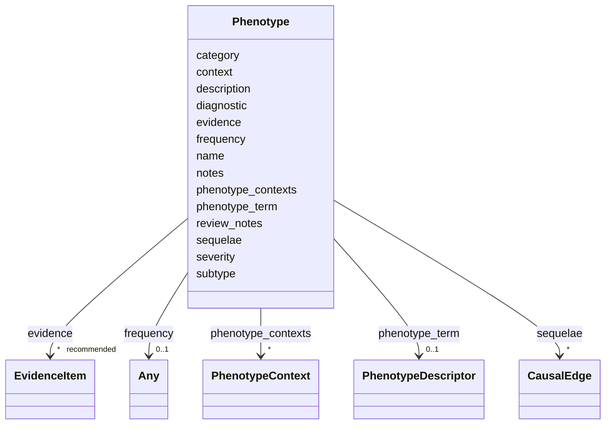

# Class: Phenotype 


URI: [dismech:class/Phenotype](https://w3id.org/monarch-initiative/dismech/class/Phenotype)





<!-- no inheritance hierarchy -->


## Slots

| Name | Cardinality and Range | Description | Inheritance |
| ---  | --- | --- | --- |
| [category](../slots/category.md) | 0..1 <br/> [String](../types/String.md) |  | direct |
| [name](../slots/name.md) | 1 <br/> [String](../types/String.md) |  | direct |
| [phenotype_term](../slots/phenotype_term.md) | 0..1 <br/> [PhenotypeDescriptor](../classes/PhenotypeDescriptor.md) | The HP term for this phenotype | direct |
| [frequency](../slots/frequency.md) | 0..1 <br/> [Any](../classes/Any.md)&nbsp;or&nbsp;<br />[FrequencyEnum](../enums/FrequencyEnum.md)&nbsp;or&nbsp;<br />[FrequencyQuantity](../types/FrequencyQuantity.md) |  | direct |
| [description](../slots/description.md) | 0..1 <br/> [String](../types/String.md) |  | direct |
| [diagnostic](../slots/diagnostic.md) | 0..1 <br/> [Boolean](../types/Boolean.md) |  | direct |
| [sequelae](../slots/sequelae.md) | * <br/> [CausalEdge](../classes/CausalEdge.md) |  | direct |
| [evidence](../slots/evidence.md) | * _recommended_ <br/> [EvidenceItem](../classes/EvidenceItem.md) |  | direct |
| [context](../slots/context.md) | 0..1 <br/> [String](../types/String.md) |  | direct |
| [review_notes](../slots/review_notes.md) | 0..1 <br/> [String](../types/String.md) |  | direct |
| [severity](../slots/severity.md) | 0..1 <br/> [String](../types/String.md) |  | direct |
| [notes](../slots/notes.md) | 0..1 <br/> [String](../types/String.md) |  | direct |
| [subtype](../slots/subtype.md) | 0..1 <br/> [String](../types/String.md) |  | direct |
| [phenotype_contexts](../slots/phenotype_contexts.md) | * <br/> [PhenotypeContext](../classes/PhenotypeContext.md) | Context-specific qualifications of this phenotype's frequency, severity, or o... | direct |


## Usages

| used by | used in | type | used |
| ---  | --- | --- | --- |
| [DifferentialDiagnosis](../classes/DifferentialDiagnosis.md) | [phenotypes](../slots/phenotypes.md) | range | [Phenotype](../classes/Phenotype.md) |
| [Disease](../classes/Disease.md) | [phenotypes](../slots/phenotypes.md) | range | [Phenotype](../classes/Phenotype.md) |
| [ComorbidityAssociation](../classes/ComorbidityAssociation.md) | [phenotypes](../slots/phenotypes.md) | range | [Phenotype](../classes/Phenotype.md) |


## Identifier and Mapping Information


### Schema Source


* from schema: https://w3id.org/monarch-initiative/dismech


## Mappings

| Mapping Type | Mapped Value |
| ---  | ---  |
| self | dismech:Phenotype |
| native | dismech:Phenotype |


## LinkML Source

<!-- TODO: investigate https://stackoverflow.com/questions/37606292/how-to-create-tabbed-code-blocks-in-mkdocs-or-sphinx -->

### Direct

<details>
```yaml
name: Phenotype
from_schema: https://w3id.org/monarch-initiative/dismech
slots:
- category
- name
- phenotype_term
- frequency
- description
- diagnostic
- sequelae
- evidence
- context
- review_notes
- severity
- notes
- subtype
- phenotype_contexts

```
</details>

### Induced

<details>
```yaml
name: Phenotype
from_schema: https://w3id.org/monarch-initiative/dismech
attributes:
  category:
    name: category
    examples:
    - value: Hematologic
    from_schema: https://w3id.org/monarch-initiative/dismech
    rank: 1000
    alias: category
    owner: Phenotype
    domain_of:
    - Phenotype
    - Disease
    - AnimalModel
    range: string
  name:
    name: name
    examples:
    - value: Adolescent Nephronophthisis
    from_schema: https://w3id.org/monarch-initiative/dismech
    rank: 1000
    identifier: true
    alias: name
    owner: Phenotype
    domain_of:
    - ClinicalTrial
    - ComputationalModel
    - ModelVariable
    - SeverityTier
    - DifferentialDiagnosis
    - Subtype
    - EpidemiologyInfo
    - Pathophysiology
    - Phenotype
    - Biochemical
    - HistopathologyFinding
    - Genetic
    - Environmental
    - Disease
    - Stage
    - AgentLifeCycleStage
    - Treatment
    - InfectiousAgent
    - Transmission
    - Assay
    - Diagnosis
    - Inheritance
    - Variant
    - Mechanism
    - ModelingConsideration
    - Definition
    - CriteriaSet
    - ComorbidityAssociation
    range: string
    required: true
  phenotype_term:
    name: phenotype_term
    description: The HP term for this phenotype
    from_schema: https://w3id.org/monarch-initiative/dismech
    rank: 1000
    alias: phenotype_term
    owner: Phenotype
    domain_of:
    - Phenotype
    range: PhenotypeDescriptor
    inlined: true
  frequency:
    name: frequency
    examples:
    - value: Occasional
    from_schema: https://w3id.org/monarch-initiative/dismech
    rank: 1000
    alias: frequency
    owner: Phenotype
    domain_of:
    - PhenotypeContext
    - Pathophysiology
    - Phenotype
    - Biochemical
    - HistopathologyFinding
    - Genetic
    range: Any
    any_of:
    - range: FrequencyEnum
    - range: FrequencyQuantity
  description:
    name: description
    from_schema: https://w3id.org/monarch-initiative/dismech
    rank: 1000
    alias: description
    owner: Phenotype
    domain_of:
    - Descriptor
    - GeneticContext
    - Dataset
    - ClinicalTrial
    - ComputationalModel
    - ModelVariable
    - DifferentialDiagnosis
    - Subtype
    - CausalEdge
    - TreatmentMechanismTarget
    - ProteinStructure
    - EpidemiologyInfo
    - Pathophysiology
    - Phenotype
    - HistopathologyFinding
    - Environmental
    - Disease
    - Stage
    - AgentLifeCycle
    - AgentLifeCycleStage
    - AnimalModel
    - Treatment
    - InfectiousAgent
    - Transmission
    - Assay
    - Diagnosis
    - Inheritance
    - Variant
    - FunctionalEffect
    - Mechanism
    - ModelingConsideration
    - Definition
    - CriteriaSet
    - ConditionDescriptor
    - GOEnrichment
    - ComorbidityHypothesis
    - UpstreamConditionHypothesis
    - MechanisticHypothesis
    range: string
  diagnostic:
    name: diagnostic
    from_schema: https://w3id.org/monarch-initiative/dismech
    rank: 1000
    alias: diagnostic
    owner: Phenotype
    domain_of:
    - Phenotype
    - HistopathologyFinding
    range: boolean
  sequelae:
    name: sequelae
    examples:
    - value: '[{target: Diabetic Ketoacidosis}, {target: Chronic Complications}]'
    from_schema: https://w3id.org/monarch-initiative/dismech
    rank: 1000
    alias: sequelae
    owner: Phenotype
    domain_of:
    - Phenotype
    range: CausalEdge
    multivalued: true
    inlined: true
    inlined_as_list: true
  evidence:
    name: evidence
    from_schema: https://w3id.org/monarch-initiative/dismech
    rank: 1000
    alias: evidence
    owner: Phenotype
    domain_of:
    - PhenotypeContext
    - Dataset
    - ClinicalTrial
    - ComputationalModel
    - DifferentialDiagnosis
    - Subtype
    - CausalEdge
    - TreatmentMechanismTarget
    - Finding
    - Prevalence
    - ProgressionInfo
    - EpidemiologyInfo
    - Pathophysiology
    - Phenotype
    - Biochemical
    - HistopathologyFinding
    - Genetic
    - Environmental
    - Stage
    - AgentLifeCycle
    - AgentLifeCycleStage
    - AnimalModel
    - Treatment
    - InfectiousAgent
    - Transmission
    - Diagnosis
    - Inheritance
    - Variant
    - ModelingConsideration
    - ClassificationAssignment
    - Definition
    - CriteriaSet
    - AssociationSignal
    - AssociationStatistics
    - ComorbidityHypothesis
    - UpstreamConditionHypothesis
    - MechanisticHypothesis
    range: EvidenceItem
    recommended: true
    multivalued: true
    inlined: true
    inlined_as_list: true
  context:
    name: context
    examples:
    - value: Pregnancy
    from_schema: https://w3id.org/monarch-initiative/dismech
    rank: 1000
    alias: context
    owner: Phenotype
    domain_of:
    - Phenotype
    - Biochemical
    - HistopathologyFinding
    - Stage
    - AgentLifeCycle
    - AgentLifeCycleStage
    - Treatment
    range: string
  review_notes:
    name: review_notes
    examples:
    - value: Added an additional clinically relevant subtype.
    from_schema: https://w3id.org/monarch-initiative/dismech
    rank: 1000
    alias: review_notes
    owner: Phenotype
    domain_of:
    - ClinicalTrial
    - Subtype
    - ProgressionInfo
    - Phenotype
    - Genetic
    - Environmental
    - Disease
    - Stage
    - AgentLifeCycle
    - AgentLifeCycleStage
    - Treatment
    range: string
  severity:
    name: severity
    examples:
    - value: Severe
    from_schema: https://w3id.org/monarch-initiative/dismech
    rank: 1000
    alias: severity
    owner: Phenotype
    domain_of:
    - PhenotypeContext
    - Phenotype
    range: string
  notes:
    name: notes
    examples:
    - value: Contagious stage where symptoms appear and the bacteria can be spread
        to others.
    from_schema: https://w3id.org/monarch-initiative/dismech
    rank: 1000
    alias: notes
    owner: Phenotype
    domain_of:
    - GeneticContext
    - OnsetDescriptor
    - PhenotypeContext
    - Dataset
    - ClinicalTrial
    - ComputationalModel
    - ModelVariable
    - DifferentialDiagnosis
    - Prevalence
    - ProgressionInfo
    - EpidemiologyInfo
    - Pathophysiology
    - Phenotype
    - Biochemical
    - HistopathologyFinding
    - Genetic
    - Environmental
    - Disease
    - Stage
    - AgentLifeCycle
    - AgentLifeCycleStage
    - Treatment
    - Transmission
    - Diagnosis
    - ClassificationAssignment
    - Definition
    - CriteriaSet
    - TermMapping
    - MappingConsistency
    - ComorbidityAssociation
    - AssociationSignal
    - AssociationMetric
    - AssociationStatistics
    - MechanisticHypothesis
    range: string
  subtype:
    name: subtype
    examples:
    - value: Eyelid Myoclonia with Absences
    from_schema: https://w3id.org/monarch-initiative/dismech
    rank: 1000
    alias: subtype
    owner: Phenotype
    domain_of:
    - PhenotypeContext
    - Prevalence
    - ProgressionInfo
    - Phenotype
    - Biochemical
    - HistopathologyFinding
    - Genetic
    range: string
  phenotype_contexts:
    name: phenotype_contexts
    description: Context-specific qualifications of this phenotype's frequency, severity,
      or onset. Each context can optionally specify a genetic context, demographic
      stratum, or disease subtype. When no context qualifiers are set, provides evidence
      for the base frequency/severity claim (addressing the frequency-evidence separation
      problem).
    from_schema: https://w3id.org/monarch-initiative/dismech
    rank: 1000
    alias: phenotype_contexts
    owner: Phenotype
    domain_of:
    - Phenotype
    range: PhenotypeContext
    multivalued: true
    inlined: true
    inlined_as_list: true

```
</details>