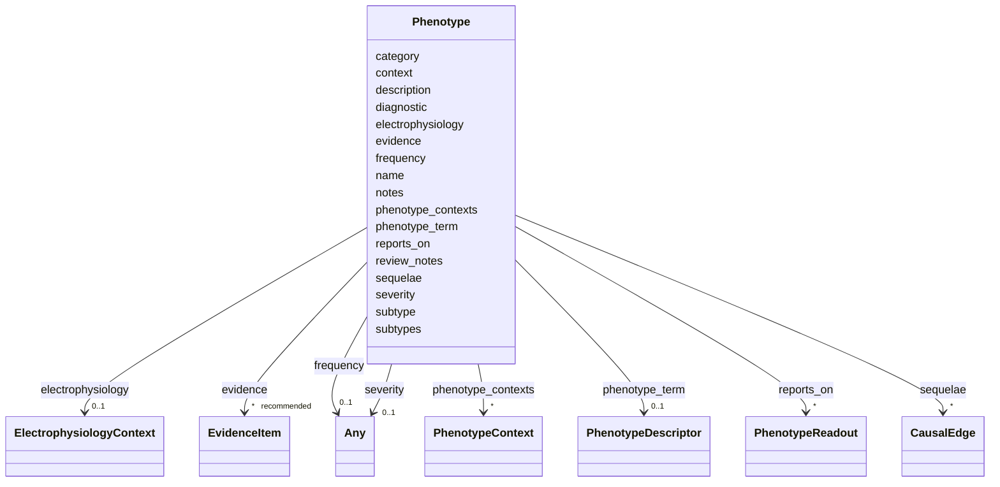

# Class: Phenotype 


URI: [dismech:class/Phenotype](https://w3id.org/monarch-initiative/dismech/class/Phenotype)



```mermaid
 classDiagram
    class Phenotype
    click Phenotype href "../../classes/Phenotype/"
      Phenotype : category
        
      Phenotype : context
        
      Phenotype : description
        
      Phenotype : diagnostic
        
      Phenotype : electrophysiology
        
          
    
        
        
        Phenotype --> "0..1" ElectrophysiologyContext : electrophysiology
        click ElectrophysiologyContext href "../../classes/ElectrophysiologyContext/"
    

        
      Phenotype : evidence
        
          
    
        
        
        Phenotype --> "* _recommended_" EvidenceItem : evidence
        click EvidenceItem href "../../classes/EvidenceItem/"
    

        
      Phenotype : frequency
        
          
    
        
        
        Phenotype --> "0..1" Any : frequency
        click Any href "../../classes/Any/"
    

        
      Phenotype : name
        
      Phenotype : notes
        
      Phenotype : phenotype_contexts
        
          
    
        
        
        Phenotype --> "*" PhenotypeContext : phenotype_contexts
        click PhenotypeContext href "../../classes/PhenotypeContext/"
    

        
      Phenotype : phenotype_term
        
          
    
        
        
        Phenotype --> "0..1" PhenotypeDescriptor : phenotype_term
        click PhenotypeDescriptor href "../../classes/PhenotypeDescriptor/"
    

        
      Phenotype : reports_on
        
          
    
        
        
        Phenotype --> "*" PhenotypeReadout : reports_on
        click PhenotypeReadout href "../../classes/PhenotypeReadout/"
    

        
      Phenotype : review_notes
        
      Phenotype : sequelae
        
          
    
        
        
        Phenotype --> "*" CausalEdge : sequelae
        click CausalEdge href "../../classes/CausalEdge/"
    

        
      Phenotype : severity
        
          
    
        
        
        Phenotype --> "0..1" Any : severity
        click Any href "../../classes/Any/"
    

        
      Phenotype : subtype
        
      Phenotype : subtypes
        
      
```


<!-- no inheritance hierarchy -->

## Slots

| Name | Cardinality and Range | Description | Inheritance |
| ---  | --- | --- | --- |
| [category](../slots/category.md) | 0..1 <br/> [String](../types/String.md) |  | direct |
| [name](../slots/name.md) | 1 <br/> [String](../types/String.md) |  | direct |
| [phenotype_term](../slots/phenotype_term.md) | 0..1 <br/> [PhenotypeDescriptor](../classes/PhenotypeDescriptor.md) | The HP term for this phenotype | direct |
| [frequency](../slots/frequency.md) | 0..1 <br/> [FrequencyEnum](../enums/FrequencyEnum.md)&nbsp;or&nbsp;<br />[FrequencyQuantity](../types/FrequencyQuantity.md)&nbsp;or&nbsp;<br />[Any](../classes/Any.md) |  | direct |
| [description](../slots/description.md) | 0..1 <br/> [String](../types/String.md) |  | direct |
| [diagnostic](../slots/diagnostic.md) | 0..1 <br/> [Boolean](../types/Boolean.md) |  | direct |
| [sequelae](../slots/sequelae.md) | * <br/> [CausalEdge](../classes/CausalEdge.md) |  | direct |
| [evidence](../slots/evidence.md) | * _recommended_ <br/> [EvidenceItem](../classes/EvidenceItem.md) |  | direct |
| [context](../slots/context.md) | 0..1 <br/> [String](../types/String.md) |  | direct |
| [review_notes](../slots/review_notes.md) | 0..1 <br/> [String](../types/String.md) |  | direct |
| [severity](../slots/severity.md) | 0..1 <br/> [SeverityQualifierEnum](../enums/SeverityQualifierEnum.md)&nbsp;or&nbsp;<br />[Any](../classes/Any.md)&nbsp;or&nbsp;<br />[String](../types/String.md) |  | direct |
| [notes](../slots/notes.md) | 0..1 <br/> [String](../types/String.md) |  | direct |
| [subtype](../slots/subtype.md) | 0..1 <br/> [String](../types/String.md) |  | direct |
| [subtypes](../slots/subtypes.md) | * <br/> [String](../types/String.md) | Names of subtypes (foreign keys to this disease's `has_subtypes[] | direct |
| [phenotype_contexts](../slots/phenotype_contexts.md) | * <br/> [PhenotypeContext](../classes/PhenotypeContext.md) | Context-specific qualifications of this phenotype's frequency, severity, or o... | direct |
| [electrophysiology](../slots/electrophysiology.md) | 0..1 <br/> [ElectrophysiologyContext](../classes/ElectrophysiologyContext.md) | Optional electrophysiologic post-composition sidecar for a phenotype whose ph... | direct |
| [reports_on](../slots/reports_on.md) | * <br/> [PhenotypeReadout](../classes/PhenotypeReadout.md) | Links an investigation-readout phenotype (e | direct |


## Usages

| used by | used in | type | used |
| ---  | --- | --- | --- |
| [DifferentialDiagnosis](../classes/DifferentialDiagnosis.md) | [phenotypes](../slots/phenotypes.md) | range | [Phenotype](../classes/Phenotype.md) |
| [Disease](../classes/Disease.md) | [phenotypes](../slots/phenotypes.md) | range | [Phenotype](../classes/Phenotype.md) |
| [ComorbidityAssociation](../classes/ComorbidityAssociation.md) | [phenotypes](../slots/phenotypes.md) | range | [Phenotype](../classes/Phenotype.md) |


## Identifier and Mapping Information


### Schema Source


* from schema: https://w3id.org/monarch-initiative/dismech


## Mappings

| Mapping Type | Mapped Value |
| ---  | ---  |
| self | dismech:Phenotype |
| native | dismech:Phenotype |


## LinkML Source

<!-- TODO: investigate https://stackoverflow.com/questions/37606292/how-to-create-tabbed-code-blocks-in-mkdocs-or-sphinx -->

### Direct

<details>
```yaml
name: Phenotype
from_schema: https://w3id.org/monarch-initiative/dismech
slots:
- category
- name
- phenotype_term
- frequency
- description
- diagnostic
- sequelae
- evidence
- context
- review_notes
- severity
- notes
- subtype
- subtypes
- phenotype_contexts
- electrophysiology
- reports_on

```
</details>

### Induced

<details>
```yaml
name: Phenotype
from_schema: https://w3id.org/monarch-initiative/dismech
attributes:
  category:
    name: category
    examples:
    - value: Hematologic
    from_schema: https://w3id.org/monarch-initiative/dismech
    rank: 1000
    alias: category
    owner: Phenotype
    domain_of:
    - Phenotype
    - Disease
    - AnimalModel
    range: string
  name:
    name: name
    examples:
    - value: Adolescent Nephronophthisis
    from_schema: https://w3id.org/monarch-initiative/dismech
    rank: 1000
    identifier: true
    alias: name
    owner: Phenotype
    domain_of:
    - ExperimentalModel
    - Experiment
    - ExperimentalPerturbation
    - ExperimentalReadout
    - ExperimentalControl
    - ClinicalTrial
    - ComputationalModel
    - ModelVariable
    - SeverityTier
    - DifferentialDiagnosis
    - Subtype
    - ReferenceRangeBand
    - SurrogateEndpointCollection
    - ExternalAssertion
    - EpidemiologyInfo
    - Pathophysiology
    - Phenotype
    - Biochemical
    - HistopathologyFinding
    - ImagingFinding
    - Genetic
    - Environmental
    - Disease
    - Stage
    - AgentLifeCycleStage
    - Treatment
    - InfectiousAgent
    - Transmission
    - Assay
    - Diagnosis
    - Inheritance
    - Variant
    - Mechanism
    - ModelingConsideration
    - Definition
    - CriteriaSet
    - ComorbidityAssociation
    - Grouping
    range: string
    required: true
  phenotype_term:
    name: phenotype_term
    description: The HP term for this phenotype
    from_schema: https://w3id.org/monarch-initiative/dismech
    rank: 1000
    alias: phenotype_term
    owner: Phenotype
    domain_of:
    - ExperimentalReadout
    - ReferenceRangeBand
    - Phenotype
    - ImagingFinding
    - LogicalCriterion
    - DifferentiatingMechanism
    range: PhenotypeDescriptor
    inlined: true
  frequency:
    name: frequency
    examples:
    - value: Occasional
    from_schema: https://w3id.org/monarch-initiative/dismech
    rank: 1000
    alias: frequency
    owner: Phenotype
    domain_of:
    - PhenotypeContext
    - Pathophysiology
    - Phenotype
    - Biochemical
    - HistopathologyFinding
    - ImagingFinding
    - Genetic
    range: Any
    any_of:
    - range: FrequencyEnum
    - range: FrequencyQuantity
  description:
    name: description
    from_schema: https://w3id.org/monarch-initiative/dismech
    rank: 1000
    alias: description
    owner: Phenotype
    domain_of:
    - Descriptor
    - DietaryModification
    - GeneticContext
    - Dataset
    - ExperimentalModel
    - Experiment
    - ExperimentalPerturbation
    - ExperimentalReadout
    - ExperimentalControl
    - ClinicalTrial
    - ComputationalModel
    - ModelVariable
    - DifferentialDiagnosis
    - Subtype
    - CausalEdge
    - TreatmentMechanismTarget
    - ModelMechanismLink
    - BiomarkerReadout
    - PhenotypeReadout
    - SurrogateEndpointCollection
    - ProteinStructure
    - ExternalAssertion
    - EpidemiologyInfo
    - Pathophysiology
    - Phenotype
    - HistopathologyFinding
    - ImagingFinding
    - Environmental
    - Disease
    - Stage
    - AgentLifeCycle
    - AgentLifeCycleStage
    - AnimalModel
    - Treatment
    - InfectiousAgent
    - Transmission
    - Assay
    - Diagnosis
    - Inheritance
    - Variant
    - FunctionalEffect
    - Mechanism
    - ModelingConsideration
    - Definition
    - CriteriaSet
    - ConditionDescriptor
    - GOEnrichment
    - ComorbidityHypothesis
    - UpstreamConditionHypothesis
    - MechanisticHypothesis
    - Grouping
    - GroupingCriteria
    - LogicalCriterion
    - DifferentiatingMechanism
    range: string
  diagnostic:
    name: diagnostic
    from_schema: https://w3id.org/monarch-initiative/dismech
    rank: 1000
    alias: diagnostic
    owner: Phenotype
    domain_of:
    - Phenotype
    - HistopathologyFinding
    - ImagingFinding
    range: boolean
  sequelae:
    name: sequelae
    examples:
    - value: '[{target: Diabetic Ketoacidosis}, {target: Chronic Complications}]'
    from_schema: https://w3id.org/monarch-initiative/dismech
    rank: 1000
    alias: sequelae
    owner: Phenotype
    domain_of:
    - Phenotype
    range: CausalEdge
    multivalued: true
    inlined: true
    inlined_as_list: true
  evidence:
    name: evidence
    from_schema: https://w3id.org/monarch-initiative/dismech
    rank: 1000
    alias: evidence
    owner: Phenotype
    domain_of:
    - PhenotypeContext
    - Dataset
    - ExperimentalModel
    - Experiment
    - ExperimentalPerturbation
    - ExperimentalReadout
    - ExperimentalControl
    - ClinicalTrial
    - ComputationalModel
    - DifferentialDiagnosis
    - Subtype
    - CausalEdge
    - TreatmentMechanismTarget
    - ModelMechanismLink
    - BiomarkerReadout
    - PhenotypeReadout
    - ReferenceRange
    - SurrogateEndpoint
    - ExternalAssertion
    - Finding
    - Prevalence
    - GeneCaseFraction
    - ProgressionInfo
    - ClinicalBurden
    - EpidemiologyInfo
    - Pathophysiology
    - Phenotype
    - Biochemical
    - HistopathologyFinding
    - ImagingFinding
    - Genetic
    - Environmental
    - Stage
    - AgentLifeCycle
    - AgentLifeCycleStage
    - AnimalModel
    - Treatment
    - InfectiousAgent
    - Transmission
    - Diagnosis
    - Inheritance
    - Variant
    - ModelingConsideration
    - ClassificationAssignment
    - Definition
    - AlgorithmValidationStatus
    - CriteriaSet
    - AssociationSignal
    - AssociationStatistics
    - ComorbidityHypothesis
    - UpstreamConditionHypothesis
    - MechanisticHypothesis
    - Discussion
    - GroupingCriteria
    - GroupingMember
    - DifferentiatingMechanism
    range: EvidenceItem
    recommended: true
    multivalued: true
    inlined: true
    inlined_as_list: true
  context:
    name: context
    examples:
    - value: Pregnancy
    from_schema: https://w3id.org/monarch-initiative/dismech
    rank: 1000
    alias: context
    owner: Phenotype
    domain_of:
    - Phenotype
    - Biochemical
    - HistopathologyFinding
    - ImagingFinding
    - Stage
    - AgentLifeCycle
    - AgentLifeCycleStage
    - Treatment
    range: string
  review_notes:
    name: review_notes
    examples:
    - value: Added an additional clinically relevant subtype.
    from_schema: https://w3id.org/monarch-initiative/dismech
    rank: 1000
    alias: review_notes
    owner: Phenotype
    domain_of:
    - ClinicalTrial
    - Subtype
    - ProgressionInfo
    - Phenotype
    - Genetic
    - Environmental
    - Disease
    - Stage
    - AgentLifeCycle
    - AgentLifeCycleStage
    - Treatment
    range: string
  severity:
    name: severity
    examples:
    - value: Severe
    from_schema: https://w3id.org/monarch-initiative/dismech
    rank: 1000
    alias: severity
    owner: Phenotype
    domain_of:
    - Descriptor
    - PhenotypeContext
    - ReferenceRangeBand
    - Phenotype
    range: Any
    any_of:
    - range: SeverityQualifierEnum
    - range: string
  notes:
    name: notes
    examples:
    - value: Contagious stage where symptoms appear and the bacteria can be spread
        to others.
    from_schema: https://w3id.org/monarch-initiative/dismech
    rank: 1000
    alias: notes
    owner: Phenotype
    domain_of:
    - GeneticContext
    - OnsetDescriptor
    - PhenotypeContext
    - Dataset
    - ExperimentalModel
    - Experiment
    - ExperimentalPerturbation
    - ExperimentalReadout
    - ExperimentalControl
    - ClinicalTrial
    - ComputationalModel
    - ModelVariable
    - DifferentialDiagnosis
    - ReferenceRange
    - SurrogateEndpoint
    - SurrogateEndpointCollection
    - ExternalAssertion
    - TrackedIssue
    - Prevalence
    - GeneCaseFraction
    - ProgressionInfo
    - ClinicalBurden
    - EpidemiologyInfo
    - Pathophysiology
    - Phenotype
    - Biochemical
    - HistopathologyFinding
    - ImagingFinding
    - Genetic
    - Environmental
    - Disease
    - Stage
    - AgentLifeCycle
    - AgentLifeCycleStage
    - Treatment
    - Transmission
    - Diagnosis
    - ClassificationAssignment
    - Definition
    - CriteriaSet
    - TermMapping
    - MappingConsistency
    - ComorbidityAssociation
    - AssociationSignal
    - AssociationMetric
    - AssociationStatistics
    - MechanisticHypothesis
    - Discussion
    - Grouping
    - GroupingCriteria
    - GroupingMember
    - DifferentiatingMechanism
    range: string
  subtype:
    name: subtype
    examples:
    - value: Eyelid Myoclonia with Absences
    from_schema: https://w3id.org/monarch-initiative/dismech
    rank: 1000
    alias: subtype
    owner: Phenotype
    domain_of:
    - PhenotypeContext
    - Prevalence
    - ProgressionInfo
    - Phenotype
    - Biochemical
    - HistopathologyFinding
    - ImagingFinding
    - Genetic
    range: string
  subtypes:
    name: subtypes
    description: Names of subtypes (foreign keys to this disease's `has_subtypes[].name`)
      associated with a phenotype, biochemical finding, pathophysiology node, or other
      subtyped entry. Use this multivalued form when an item is characteristic of
      more than one subtype with overlapping features. For single-subtype associations,
      the scalar `subtype` slot may still be used.
    examples:
    - value: '[''DENV-1'', ''DENV-2'', ''DENV-3'', ''DENV-4'']'
    - value: '[''Type 1'', ''Type 2'']'
    from_schema: https://w3id.org/monarch-initiative/dismech
    rank: 1000
    alias: subtypes
    owner: Phenotype
    domain_of:
    - Pathophysiology
    - Phenotype
    - Biochemical
    range: string
    multivalued: true
  phenotype_contexts:
    name: phenotype_contexts
    description: Context-specific qualifications of this phenotype's frequency, severity,
      or onset. Each context can optionally specify a genetic context, demographic
      stratum, or disease subtype. When no context qualifiers are set, provides evidence
      for the base frequency/severity claim (addressing the frequency-evidence separation
      problem).
    from_schema: https://w3id.org/monarch-initiative/dismech
    rank: 1000
    alias: phenotype_contexts
    owner: Phenotype
    domain_of:
    - Phenotype
    range: PhenotypeContext
    multivalued: true
    inlined: true
    inlined_as_list: true
  electrophysiology:
    name: electrophysiology
    description: Optional electrophysiologic post-composition sidecar for a phenotype
      whose phenotype_term is an EEG/EMG/EKG finding (HP:0002353 / HP:0003457 / HP:0003115
      subtrees). Carries modality plus the ictal and recording-state axes a flat HP
      term cannot express. Electrophysiologic findings are HP phenotypes, so they
      stay in `phenotypes`; this only post-composes them.
    comments:
    - Use on EEG/EMG/EKG phenotypes; leave absent otherwise
    - Not for acquisition protocol, per-patient tracings, or decision support
    from_schema: https://w3id.org/monarch-initiative/dismech
    rank: 1000
    alias: electrophysiology
    owner: Phenotype
    domain_of:
    - Phenotype
    range: ElectrophysiologyContext
    inlined: true
  reports_on:
    name: reports_on
    description: Links an investigation-readout phenotype (e.g. an abnormal electrophysiology
      or clinical-test finding such as HP:0000512 Abnormal electroretinogram) to the
      pathograph node whose underlying state it measures or reflects. The target is
      a named pathophysiology or phenotype node in the same disease file. These are
      observational readout links, not causal disease-progression edges, so they let
      an otherwise-disconnected test-result phenotype attach to the mechanism it reports
      on without asserting that the mechanism "causes" the test result.
    comments:
    - Use on investigation/test-result phenotypes (electrophysiology, functional testing,
      laboratory findings) that report on an underlying mechanism rather than participating
      causally
    - Target names should match a pathophysiology or phenotype entry name in the same
      disease file
    - Rendered as a dashed observational edge (mechanism -.-> readout), like biomarker
      readouts
    from_schema: https://w3id.org/monarch-initiative/dismech
    rank: 1000
    alias: reports_on
    owner: Phenotype
    domain_of:
    - Phenotype
    range: PhenotypeReadout
    multivalued: true
    inlined: true
    inlined_as_list: true

```
</details>