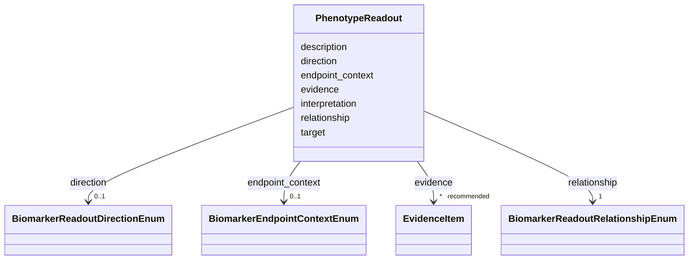

# Class: PhenotypeReadout 


_Links an investigation-readout phenotype (an abnormal electrophysiology, functional-test, or clinical-laboratory finding, e.g. HP:0000512 Abnormal electroretinogram) to the pathograph node whose underlying state it measures or reflects. This is an observational readout link, not a causal claim that the target mechanism causes the test result. It is the phenotype-side counterpart of BiomarkerReadout, deliberately lean: it omits the surrogate-endpoint/regulatory slots (regulatory_endpoint_refs and the source-table bridge) that belong only to molecular biomarker readouts._


URI: [dismech:class/PhenotypeReadout](https://w3id.org/monarch-initiative/dismech/class/PhenotypeReadout)





<!-- no inheritance hierarchy -->

## Slots

| Name | Cardinality and Range | Description | Inheritance |
| ---  | --- | --- | --- |
| [target](../slots/target.md) | 1 <br/> [String](../types/String.md) | Name of the pathograph node this phenotype reports on | direct |
| [relationship](../slots/relationship.md) | 1 <br/> [BiomarkerReadoutRelationshipEnum](../enums/BiomarkerReadoutRelationshipEnum.md) | How the investigation readout relates to the linked pathograph node | direct |
| [direction](../slots/direction.md) | 0..1 <br/> [BiomarkerReadoutDirectionEnum](../enums/BiomarkerReadoutDirectionEnum.md) | Direction of association between the readout value/abnormality and the linked... | direct |
| [endpoint_context](../slots/endpoint_context.md) | 0..1 <br/> [BiomarkerEndpointContextEnum](../enums/BiomarkerEndpointContextEnum.md) | Diagnostic, prognostic, monitoring, pharmacodynamic, or candidate-surrogate u... | direct |
| [interpretation](../slots/interpretation.md) | 0..1 <br/> [String](../types/String.md) | Human-readable interpretation of the link for display and curation review | direct |
| [description](../slots/description.md) | 0..1 <br/> [String](../types/String.md) |  | direct |
| [evidence](../slots/evidence.md) | * _recommended_ <br/> [EvidenceItem](../classes/EvidenceItem.md) | Evidence supporting this phenotype-to-pathograph-node readout link | direct |


## Usages

| used by | used in | type | used |
| ---  | --- | --- | --- |
| [Phenotype](../classes/Phenotype.md) | [reports_on](../slots/reports_on.md) | range | [PhenotypeReadout](../classes/PhenotypeReadout.md) |


## Comments

* Use on test-result phenotypes that report on an underlying mechanism rather than participating causally in the pathograph
* READOUT_OF is the typical relationship; CORRELATES_WITH / PREDICTS also apply
* Reuses the BiomarkerReadout relationship, direction, and endpoint-context vocabularies for consistency


## Identifier and Mapping Information


### Schema Source


* from schema: https://w3id.org/monarch-initiative/dismech


## Mappings

| Mapping Type | Mapped Value |
| ---  | ---  |
| self | dismech:PhenotypeReadout |
| native | dismech:PhenotypeReadout |


## LinkML Source

<!-- TODO: investigate https://stackoverflow.com/questions/37606292/how-to-create-tabbed-code-blocks-in-mkdocs-or-sphinx -->

### Direct

<details>
```yaml
name: PhenotypeReadout
description: 'Links an investigation-readout phenotype (an abnormal electrophysiology,
  functional-test, or clinical-laboratory finding, e.g. HP:0000512 Abnormal electroretinogram)
  to the pathograph node whose underlying state it measures or reflects. This is an
  observational readout link, not a causal claim that the target mechanism causes
  the test result. It is the phenotype-side counterpart of BiomarkerReadout, deliberately
  lean: it omits the surrogate-endpoint/regulatory slots (regulatory_endpoint_refs
  and the source-table bridge) that belong only to molecular biomarker readouts.'
comments:
- Use on test-result phenotypes that report on an underlying mechanism rather than
  participating causally in the pathograph
- READOUT_OF is the typical relationship; CORRELATES_WITH / PREDICTS also apply
- Reuses the BiomarkerReadout relationship, direction, and endpoint-context vocabularies
  for consistency
from_schema: https://w3id.org/monarch-initiative/dismech
slots:
- target
- relationship
- direction
- endpoint_context
- interpretation
- description
- evidence
slot_usage:
  target:
    name: target
    description: Name of the pathograph node this phenotype reports on. Prefer a pathophysiology
      entry; a phenotype target is also allowed when the readout is tied to another
      clinical manifestation.
    required: true
  relationship:
    name: relationship
    description: How the investigation readout relates to the linked pathograph node.
    required: true
  direction:
    name: direction
    description: Direction of association between the readout value/abnormality and
      the linked event or endpoint.
  endpoint_context:
    name: endpoint_context
    description: Diagnostic, prognostic, monitoring, pharmacodynamic, or candidate-surrogate
      use context.
  interpretation:
    name: interpretation
    description: Human-readable interpretation of the link for display and curation
      review.
  evidence:
    name: evidence
    description: Evidence supporting this phenotype-to-pathograph-node readout link

```
</details>

### Induced

<details>
```yaml
name: PhenotypeReadout
description: 'Links an investigation-readout phenotype (an abnormal electrophysiology,
  functional-test, or clinical-laboratory finding, e.g. HP:0000512 Abnormal electroretinogram)
  to the pathograph node whose underlying state it measures or reflects. This is an
  observational readout link, not a causal claim that the target mechanism causes
  the test result. It is the phenotype-side counterpart of BiomarkerReadout, deliberately
  lean: it omits the surrogate-endpoint/regulatory slots (regulatory_endpoint_refs
  and the source-table bridge) that belong only to molecular biomarker readouts.'
comments:
- Use on test-result phenotypes that report on an underlying mechanism rather than
  participating causally in the pathograph
- READOUT_OF is the typical relationship; CORRELATES_WITH / PREDICTS also apply
- Reuses the BiomarkerReadout relationship, direction, and endpoint-context vocabularies
  for consistency
from_schema: https://w3id.org/monarch-initiative/dismech
slot_usage:
  target:
    name: target
    description: Name of the pathograph node this phenotype reports on. Prefer a pathophysiology
      entry; a phenotype target is also allowed when the readout is tied to another
      clinical manifestation.
    required: true
  relationship:
    name: relationship
    description: How the investigation readout relates to the linked pathograph node.
    required: true
  direction:
    name: direction
    description: Direction of association between the readout value/abnormality and
      the linked event or endpoint.
  endpoint_context:
    name: endpoint_context
    description: Diagnostic, prognostic, monitoring, pharmacodynamic, or candidate-surrogate
      use context.
  interpretation:
    name: interpretation
    description: Human-readable interpretation of the link for display and curation
      review.
  evidence:
    name: evidence
    description: Evidence supporting this phenotype-to-pathograph-node readout link
attributes:
  target:
    name: target
    description: Name of the pathograph node this phenotype reports on. Prefer a pathophysiology
      entry; a phenotype target is also allowed when the readout is tied to another
      clinical manifestation.
    from_schema: https://w3id.org/monarch-initiative/dismech
    rank: 1000
    alias: target
    owner: PhenotypeReadout
    domain_of:
    - ExperimentalPerturbation
    - ExperimentalReadout
    - CausalEdge
    - TreatmentMechanismTarget
    - ModelMechanismLink
    - BiomarkerReadout
    - PhenotypeReadout
    range: string
    required: true
  relationship:
    name: relationship
    description: How the investigation readout relates to the linked pathograph node.
    from_schema: https://w3id.org/monarch-initiative/dismech
    rank: 1000
    alias: relationship
    owner: PhenotypeReadout
    domain_of:
    - GeneSetAssociation
    - BiomarkerReadout
    - PhenotypeReadout
    range: BiomarkerReadoutRelationshipEnum
    required: true
  direction:
    name: direction
    description: Direction of association between the readout value/abnormality and
      the linked event or endpoint.
    from_schema: https://w3id.org/monarch-initiative/dismech
    rank: 1000
    alias: direction
    owner: PhenotypeReadout
    domain_of:
    - ExperimentalReadout
    - BiomarkerReadout
    - PhenotypeReadout
    range: BiomarkerReadoutDirectionEnum
  endpoint_context:
    name: endpoint_context
    description: Diagnostic, prognostic, monitoring, pharmacodynamic, or candidate-surrogate
      use context.
    from_schema: https://w3id.org/monarch-initiative/dismech
    rank: 1000
    alias: endpoint_context
    owner: PhenotypeReadout
    domain_of:
    - BiomarkerReadout
    - PhenotypeReadout
    range: BiomarkerEndpointContextEnum
  interpretation:
    name: interpretation
    description: Human-readable interpretation of the link for display and curation
      review.
    from_schema: https://w3id.org/monarch-initiative/dismech
    rank: 1000
    alias: interpretation
    owner: PhenotypeReadout
    domain_of:
    - ExperimentalReadout
    - BiomarkerReadout
    - PhenotypeReadout
    - ReferenceRangeBand
    range: string
  description:
    name: description
    from_schema: https://w3id.org/monarch-initiative/dismech
    rank: 1000
    alias: description
    owner: PhenotypeReadout
    domain_of:
    - Descriptor
    - DietaryModification
    - GeneticContext
    - Dataset
    - ExperimentalModel
    - Experiment
    - ExperimentalPerturbation
    - ExperimentalReadout
    - ExperimentalControl
    - ClinicalTrial
    - ComputationalModel
    - ModelVariable
    - DifferentialDiagnosis
    - Subtype
    - CausalEdge
    - TreatmentMechanismTarget
    - ModelMechanismLink
    - BiomarkerReadout
    - PhenotypeReadout
    - SurrogateEndpointCollection
    - ProteinStructure
    - ExternalAssertion
    - EpidemiologyInfo
    - Pathophysiology
    - Phenotype
    - HistopathologyFinding
    - ImagingFinding
    - Environmental
    - Disease
    - Stage
    - AgentLifeCycle
    - AgentLifeCycleStage
    - AnimalModel
    - Treatment
    - InfectiousAgent
    - Transmission
    - Assay
    - Diagnosis
    - Inheritance
    - Variant
    - FunctionalEffect
    - Mechanism
    - ModelingConsideration
    - Definition
    - CriteriaSet
    - ConditionDescriptor
    - GOEnrichment
    - ComorbidityHypothesis
    - UpstreamConditionHypothesis
    - MechanisticHypothesis
    - Grouping
    - GroupingCriteria
    - LogicalCriterion
    - DifferentiatingMechanism
    range: string
  evidence:
    name: evidence
    description: Evidence supporting this phenotype-to-pathograph-node readout link
    from_schema: https://w3id.org/monarch-initiative/dismech
    rank: 1000
    alias: evidence
    owner: PhenotypeReadout
    domain_of:
    - PhenotypeContext
    - Dataset
    - ExperimentalModel
    - Experiment
    - ExperimentalPerturbation
    - ExperimentalReadout
    - ExperimentalControl
    - ClinicalTrial
    - ComputationalModel
    - DifferentialDiagnosis
    - Subtype
    - CausalEdge
    - TreatmentMechanismTarget
    - ModelMechanismLink
    - BiomarkerReadout
    - PhenotypeReadout
    - ReferenceRange
    - SurrogateEndpoint
    - ExternalAssertion
    - Finding
    - Prevalence
    - GeneCaseFraction
    - ProgressionInfo
    - ClinicalBurden
    - EpidemiologyInfo
    - Pathophysiology
    - Phenotype
    - Biochemical
    - HistopathologyFinding
    - ImagingFinding
    - Genetic
    - Environmental
    - Stage
    - AgentLifeCycle
    - AgentLifeCycleStage
    - AnimalModel
    - Treatment
    - InfectiousAgent
    - Transmission
    - Diagnosis
    - Inheritance
    - Variant
    - ModelingConsideration
    - ClassificationAssignment
    - Definition
    - AlgorithmValidationStatus
    - CriteriaSet
    - AssociationSignal
    - AssociationStatistics
    - ComorbidityHypothesis
    - UpstreamConditionHypothesis
    - MechanisticHypothesis
    - Discussion
    - GroupingCriteria
    - GroupingMember
    - DifferentiatingMechanism
    range: EvidenceItem
    recommended: true
    multivalued: true
    inlined: true
    inlined_as_list: true

```
</details>