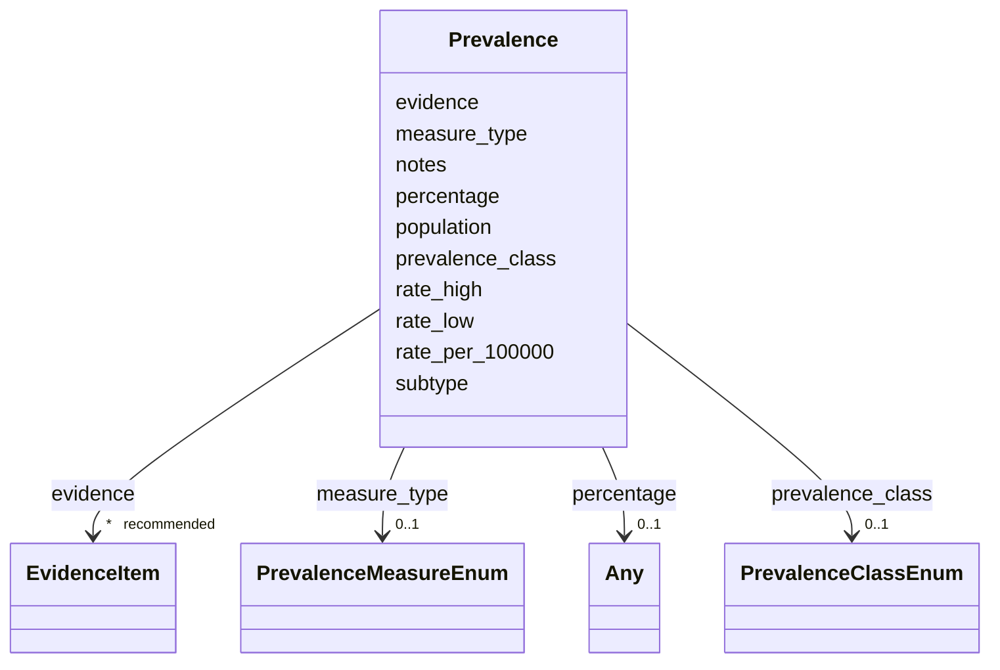

# Class: Prevalence 


URI: [dismech:class/Prevalence](https://w3id.org/monarch-initiative/dismech/class/Prevalence)





<!-- no inheritance hierarchy -->

## Slots

| Name | Cardinality and Range | Description | Inheritance |
| ---  | --- | --- | --- |
| [subtype](../slots/subtype.md) | 0..1 <br/> [String](../types/String.md) |  | direct |
| [population](../slots/population.md) | 0..1 <br/> [String](../types/String.md) | Population or cohort description (e | direct |
| [measure_type](../slots/measure_type.md) | 0..1 <br/> [PrevalenceMeasureEnum](../enums/PrevalenceMeasureEnum.md) | Which epidemiological measure this Prevalence record reports (point prevalenc... | direct |
| [prevalence_class](../slots/prevalence_class.md) | 0..1 <br/> [PrevalenceClassEnum](../enums/PrevalenceClassEnum.md) | Coarse occurrence band (Orphanet prevalence class or qualitative tier) — the ... | direct |
| [rate_per_100000](../slots/rate_per_100000.md) | 0..1 <br/> [Float](../types/Float.md) | Normalized point estimate of occurrence expressed as cases per 100,000, for m... | direct |
| [rate_low](../slots/rate_low.md) | 0..1 <br/> [Float](../types/Float.md) | Lower bound of the occurrence rate per 100,000 when the source gives a range ... | direct |
| [rate_high](../slots/rate_high.md) | 0..1 <br/> [Float](../types/Float.md) | Upper bound of the occurrence rate per 100,000 when the source gives a range ... | direct |
| [percentage](../slots/percentage.md) | 0..1 <br/> [Any](../classes/Any.md)&nbsp;or&nbsp;<br />[Integer](../types/Integer.md)&nbsp;or&nbsp;<br />[Float](../types/Float.md)&nbsp;or&nbsp;<br />[String](../types/String.md) |  | direct |
| [evidence](../slots/evidence.md) | * _recommended_ <br/> [EvidenceItem](../classes/EvidenceItem.md) |  | direct |
| [notes](../slots/notes.md) | 0..1 <br/> [String](../types/String.md) |  | direct |


## Usages

| used by | used in | type | used |
| ---  | --- | --- | --- |
| [Disease](../classes/Disease.md) | [prevalence](../slots/prevalence.md) | range | [Prevalence](../classes/Prevalence.md) |


## Identifier and Mapping Information


### Schema Source


* from schema: https://w3id.org/monarch-initiative/dismech


## Mappings

| Mapping Type | Mapped Value |
| ---  | ---  |
| self | dismech:Prevalence |
| native | dismech:Prevalence |


## LinkML Source

<!-- TODO: investigate https://stackoverflow.com/questions/37606292/how-to-create-tabbed-code-blocks-in-mkdocs-or-sphinx -->

### Direct

<details>
```yaml
name: Prevalence
from_schema: https://w3id.org/monarch-initiative/dismech
slots:
- subtype
- population
- measure_type
- prevalence_class
- rate_per_100000
- rate_low
- rate_high
- percentage
- evidence
- notes

```
</details>

### Induced

<details>
```yaml
name: Prevalence
from_schema: https://w3id.org/monarch-initiative/dismech
attributes:
  subtype:
    name: subtype
    examples:
    - value: Eyelid Myoclonia with Absences
    from_schema: https://w3id.org/monarch-initiative/dismech
    rank: 1000
    alias: subtype
    owner: Prevalence
    domain_of:
    - PhenotypeContext
    - Prevalence
    - ProgressionInfo
    - Phenotype
    - Biochemical
    - HistopathologyFinding
    - ImagingFinding
    - Genetic
    range: string
  population:
    name: population
    description: Population or cohort description (e.g., for prevalence or association
      signals)
    examples:
    - value: Global
    from_schema: https://w3id.org/monarch-initiative/dismech
    rank: 1000
    alias: population
    owner: Prevalence
    domain_of:
    - PhenotypeContext
    - ReferenceRange
    - Prevalence
    - GeneCaseFraction
    - AssociationSignal
    range: string
  measure_type:
    name: measure_type
    description: Which epidemiological measure this Prevalence record reports (point
      prevalence, birth prevalence, annual incidence, literature case-count, etc.).
      Makes explicit a dimension that was previously leaking into population/notes.
    examples:
    - value: POINT_PREVALENCE
    from_schema: https://w3id.org/monarch-initiative/dismech
    rank: 1000
    alias: measure_type
    owner: Prevalence
    domain_of:
    - Prevalence
    range: PrevalenceMeasureEnum
  prevalence_class:
    name: prevalence_class
    description: Coarse occurrence band (Orphanet prevalence class or qualitative
      tier) — the always-fillable, queryable summary, analogous to phenotype FrequencyEnum.
    examples:
    - value: BAND_1_9_PER_100000
    from_schema: https://w3id.org/monarch-initiative/dismech
    rank: 1000
    alias: prevalence_class
    owner: Prevalence
    domain_of:
    - Prevalence
    range: PrevalenceClassEnum
  rate_per_100000:
    name: rate_per_100000
    description: Normalized point estimate of occurrence expressed as cases per 100,000,
      for machine comparison across records. Convert from any source notation (% ->
      x1000; "per million" -> /10; "1 in N" -> 100000/N). Leave absent for band-only
      or qualitative records; use rate_low/rate_high for ranges.
    examples:
    - value: '0.82'
    from_schema: https://w3id.org/monarch-initiative/dismech
    rank: 1000
    alias: rate_per_100000
    owner: Prevalence
    domain_of:
    - Prevalence
    range: float
  rate_low:
    name: rate_low
    description: Lower bound of the occurrence rate per 100,000 when the source gives
      a range or a band.
    examples:
    - value: '1.0'
    from_schema: https://w3id.org/monarch-initiative/dismech
    rank: 1000
    alias: rate_low
    owner: Prevalence
    domain_of:
    - Prevalence
    range: float
  rate_high:
    name: rate_high
    description: Upper bound of the occurrence rate per 100,000 when the source gives
      a range or a band.
    examples:
    - value: '9.0'
    from_schema: https://w3id.org/monarch-initiative/dismech
    rank: 1000
    alias: rate_high
    owner: Prevalence
    domain_of:
    - Prevalence
    range: float
  percentage:
    name: percentage
    deprecated: 'Overloaded free-text/Any field that conflated measure type, rate,
      unit, and qualitative bands in incompatible notations. Superseded by the structured
      prevalence slots: measure_type, prevalence_class, and rate_per_100000 (with
      rate_low/rate_high for ranges). Retained read-only during migration; do not
      populate on new records.'
    examples:
    - value: '0.1'
    from_schema: https://w3id.org/monarch-initiative/dismech
    rank: 1000
    alias: percentage
    owner: Prevalence
    domain_of:
    - Prevalence
    range: Any
    any_of:
    - range: float
    - range: integer
    - description: for ranges
      range: string
  evidence:
    name: evidence
    from_schema: https://w3id.org/monarch-initiative/dismech
    rank: 1000
    alias: evidence
    owner: Prevalence
    domain_of:
    - PhenotypeContext
    - Dataset
    - ExperimentalModel
    - Experiment
    - ExperimentalPerturbation
    - ExperimentalReadout
    - ExperimentalControl
    - ClinicalTrial
    - ComputationalModel
    - DifferentialDiagnosis
    - Subtype
    - CausalEdge
    - TreatmentMechanismTarget
    - ModelMechanismLink
    - BiomarkerReadout
    - PhenotypeReadout
    - ReferenceRange
    - SurrogateEndpoint
    - ExternalAssertion
    - Finding
    - Prevalence
    - GeneCaseFraction
    - ProgressionInfo
    - ClinicalBurden
    - EpidemiologyInfo
    - Pathophysiology
    - Phenotype
    - Biochemical
    - HistopathologyFinding
    - ImagingFinding
    - Genetic
    - Environmental
    - Stage
    - AgentLifeCycle
    - AgentLifeCycleStage
    - AnimalModel
    - Treatment
    - InfectiousAgent
    - Transmission
    - Diagnosis
    - Inheritance
    - Variant
    - ModelingConsideration
    - ClassificationAssignment
    - Definition
    - AlgorithmValidationStatus
    - CriteriaSet
    - AssociationSignal
    - AssociationStatistics
    - ComorbidityHypothesis
    - UpstreamConditionHypothesis
    - MechanisticHypothesis
    - Discussion
    - GroupingCriteria
    - GroupingMember
    - DifferentiatingMechanism
    range: EvidenceItem
    recommended: true
    multivalued: true
    inlined: true
    inlined_as_list: true
  notes:
    name: notes
    examples:
    - value: Contagious stage where symptoms appear and the bacteria can be spread
        to others.
    from_schema: https://w3id.org/monarch-initiative/dismech
    rank: 1000
    alias: notes
    owner: Prevalence
    domain_of:
    - GeneticContext
    - OnsetDescriptor
    - PhenotypeContext
    - Dataset
    - ExperimentalModel
    - Experiment
    - ExperimentalPerturbation
    - ExperimentalReadout
    - ExperimentalControl
    - ClinicalTrial
    - ComputationalModel
    - ModelVariable
    - DifferentialDiagnosis
    - ReferenceRange
    - SurrogateEndpoint
    - SurrogateEndpointCollection
    - ExternalAssertion
    - TrackedIssue
    - Prevalence
    - GeneCaseFraction
    - ProgressionInfo
    - ClinicalBurden
    - EpidemiologyInfo
    - Pathophysiology
    - Phenotype
    - Biochemical
    - HistopathologyFinding
    - ImagingFinding
    - Genetic
    - Environmental
    - Disease
    - Stage
    - AgentLifeCycle
    - AgentLifeCycleStage
    - Treatment
    - Transmission
    - Diagnosis
    - ClassificationAssignment
    - Definition
    - CriteriaSet
    - TermMapping
    - MappingConsistency
    - ComorbidityAssociation
    - AssociationSignal
    - AssociationMetric
    - AssociationStatistics
    - MechanisticHypothesis
    - Discussion
    - Grouping
    - GroupingCriteria
    - GroupingMember
    - DifferentiatingMechanism
    range: string

```
</details>