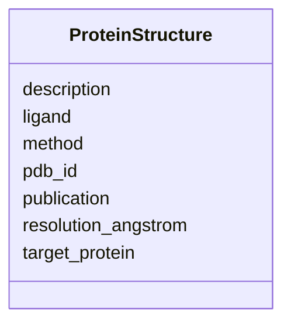

# Class: ProteinStructure 


_A 3D protein structure from PDB or AlphaFold relevant to understanding a treatment's mechanism of action. Enables embedded 3D visualization of drug-target interactions via Mol* viewer._


URI: [dismech:class/ProteinStructure](https://w3id.org/monarch-initiative/dismech/class/ProteinStructure)





<!-- no inheritance hierarchy -->


## Slots

| Name | Cardinality and Range | Description | Inheritance |
| ---  | --- | --- | --- |
| [pdb_id](../slots/pdb_id.md) | 1 <br/> [String](../types/String.md) | PDB accession code (e | direct |
| [description](../slots/description.md) | 0..1 <br/> [String](../types/String.md) | Brief description of what the structure shows (e | direct |
| [resolution_angstrom](../slots/resolution_angstrom.md) | 0..1 <br/> [Float](../types/Float.md) | Structure resolution in angstroms (for experimental structures) | direct |
| [method](../slots/method.md) | 0..1 <br/> [String](../types/String.md) | Experimental method (X-ray, cryo-EM, NMR) or prediction method (AlphaFold) | direct |
| [ligand](../slots/ligand.md) | 0..1 <br/> [String](../types/String.md) | Name of bound drug/ligand if this is a co-crystal structure | direct |
| [target_protein](../slots/target_protein.md) | 0..1 <br/> [String](../types/String.md) | Name of the protein target in the structure | direct |
| [publication](../slots/publication.md) | 0..1 <br/> [PMID](../types/PMID.md) | Reference for the structure deposition or associated paper (e | direct |


## Usages

| used by | used in | type | used |
| ---  | --- | --- | --- |
| [Pathophysiology](../classes/Pathophysiology.md) | [pdb_structures](../slots/pdb_structures.md) | range | [ProteinStructure](../classes/ProteinStructure.md) |
| [Treatment](../classes/Treatment.md) | [pdb_structures](../slots/pdb_structures.md) | range | [ProteinStructure](../classes/ProteinStructure.md) |


## Identifier and Mapping Information


### Schema Source


* from schema: https://w3id.org/monarch-initiative/dismech


## Mappings

| Mapping Type | Mapped Value |
| ---  | ---  |
| self | dismech:ProteinStructure |
| native | dismech:ProteinStructure |


## LinkML Source

<!-- TODO: investigate https://stackoverflow.com/questions/37606292/how-to-create-tabbed-code-blocks-in-mkdocs-or-sphinx -->

### Direct

<details>
```yaml
name: ProteinStructure
description: A 3D protein structure from PDB or AlphaFold relevant to understanding
  a treatment's mechanism of action. Enables embedded 3D visualization of drug-target
  interactions via Mol* viewer.
from_schema: https://w3id.org/monarch-initiative/dismech
attributes:
  pdb_id:
    name: pdb_id
    description: PDB accession code (e.g., 3TCT) or AlphaFold identifier (e.g., AF-P02766-F1).
      Used to construct viewer URLs and fetch structure data.
    from_schema: https://w3id.org/monarch-initiative/dismech
    rank: 1000
    domain_of:
    - ProteinStructure
    range: string
    required: true
  description:
    name: description
    description: Brief description of what the structure shows (e.g., drug-target
      co-crystal)
    from_schema: https://w3id.org/monarch-initiative/dismech
    domain_of:
    - Descriptor
    - GeneticContext
    - Dataset
    - ClinicalTrial
    - ComputationalModel
    - ModelVariable
    - DifferentialDiagnosis
    - Subtype
    - CausalEdge
    - TreatmentMechanismTarget
    - ProteinStructure
    - EpidemiologyInfo
    - Pathophysiology
    - Phenotype
    - HistopathologyFinding
    - Environmental
    - Disease
    - Stage
    - AgentLifeCycle
    - AgentLifeCycleStage
    - AnimalModel
    - Treatment
    - InfectiousAgent
    - Transmission
    - Assay
    - Diagnosis
    - Inheritance
    - Variant
    - FunctionalEffect
    - Mechanism
    - ModelingConsideration
    - Definition
    - CriteriaSet
    - ConditionDescriptor
    - GOEnrichment
    - ComorbidityHypothesis
    - UpstreamConditionHypothesis
    - MechanisticHypothesis
    range: string
  resolution_angstrom:
    name: resolution_angstrom
    description: Structure resolution in angstroms (for experimental structures)
    from_schema: https://w3id.org/monarch-initiative/dismech
    rank: 1000
    domain_of:
    - ProteinStructure
    range: float
  method:
    name: method
    description: Experimental method (X-ray, cryo-EM, NMR) or prediction method (AlphaFold)
    from_schema: https://w3id.org/monarch-initiative/dismech
    domain_of:
    - ProteinStructure
    - AssociationSignal
    - GOEnrichment
    range: string
  ligand:
    name: ligand
    description: Name of bound drug/ligand if this is a co-crystal structure
    from_schema: https://w3id.org/monarch-initiative/dismech
    rank: 1000
    domain_of:
    - ProteinStructure
    range: string
  target_protein:
    name: target_protein
    description: Name of the protein target in the structure
    from_schema: https://w3id.org/monarch-initiative/dismech
    rank: 1000
    domain_of:
    - ProteinStructure
    range: string
  publication:
    name: publication
    description: Reference for the structure deposition or associated paper (e.g.,
      PMID:12345678)
    from_schema: https://w3id.org/monarch-initiative/dismech
    domain_of:
    - Dataset
    - ComputationalModel
    - ProteinStructure
    range: PMID

```
</details>

### Induced

<details>
```yaml
name: ProteinStructure
description: A 3D protein structure from PDB or AlphaFold relevant to understanding
  a treatment's mechanism of action. Enables embedded 3D visualization of drug-target
  interactions via Mol* viewer.
from_schema: https://w3id.org/monarch-initiative/dismech
attributes:
  pdb_id:
    name: pdb_id
    description: PDB accession code (e.g., 3TCT) or AlphaFold identifier (e.g., AF-P02766-F1).
      Used to construct viewer URLs and fetch structure data.
    from_schema: https://w3id.org/monarch-initiative/dismech
    rank: 1000
    alias: pdb_id
    owner: ProteinStructure
    domain_of:
    - ProteinStructure
    range: string
    required: true
  description:
    name: description
    description: Brief description of what the structure shows (e.g., drug-target
      co-crystal)
    from_schema: https://w3id.org/monarch-initiative/dismech
    alias: description
    owner: ProteinStructure
    domain_of:
    - Descriptor
    - GeneticContext
    - Dataset
    - ClinicalTrial
    - ComputationalModel
    - ModelVariable
    - DifferentialDiagnosis
    - Subtype
    - CausalEdge
    - TreatmentMechanismTarget
    - ProteinStructure
    - EpidemiologyInfo
    - Pathophysiology
    - Phenotype
    - HistopathologyFinding
    - Environmental
    - Disease
    - Stage
    - AgentLifeCycle
    - AgentLifeCycleStage
    - AnimalModel
    - Treatment
    - InfectiousAgent
    - Transmission
    - Assay
    - Diagnosis
    - Inheritance
    - Variant
    - FunctionalEffect
    - Mechanism
    - ModelingConsideration
    - Definition
    - CriteriaSet
    - ConditionDescriptor
    - GOEnrichment
    - ComorbidityHypothesis
    - UpstreamConditionHypothesis
    - MechanisticHypothesis
    range: string
  resolution_angstrom:
    name: resolution_angstrom
    description: Structure resolution in angstroms (for experimental structures)
    from_schema: https://w3id.org/monarch-initiative/dismech
    rank: 1000
    alias: resolution_angstrom
    owner: ProteinStructure
    domain_of:
    - ProteinStructure
    range: float
  method:
    name: method
    description: Experimental method (X-ray, cryo-EM, NMR) or prediction method (AlphaFold)
    from_schema: https://w3id.org/monarch-initiative/dismech
    alias: method
    owner: ProteinStructure
    domain_of:
    - ProteinStructure
    - AssociationSignal
    - GOEnrichment
    range: string
  ligand:
    name: ligand
    description: Name of bound drug/ligand if this is a co-crystal structure
    from_schema: https://w3id.org/monarch-initiative/dismech
    rank: 1000
    alias: ligand
    owner: ProteinStructure
    domain_of:
    - ProteinStructure
    range: string
  target_protein:
    name: target_protein
    description: Name of the protein target in the structure
    from_schema: https://w3id.org/monarch-initiative/dismech
    rank: 1000
    alias: target_protein
    owner: ProteinStructure
    domain_of:
    - ProteinStructure
    range: string
  publication:
    name: publication
    description: Reference for the structure deposition or associated paper (e.g.,
      PMID:12345678)
    from_schema: https://w3id.org/monarch-initiative/dismech
    alias: publication
    owner: ProteinStructure
    domain_of:
    - Dataset
    - ComputationalModel
    - ProteinStructure
    range: PMID

```
</details>