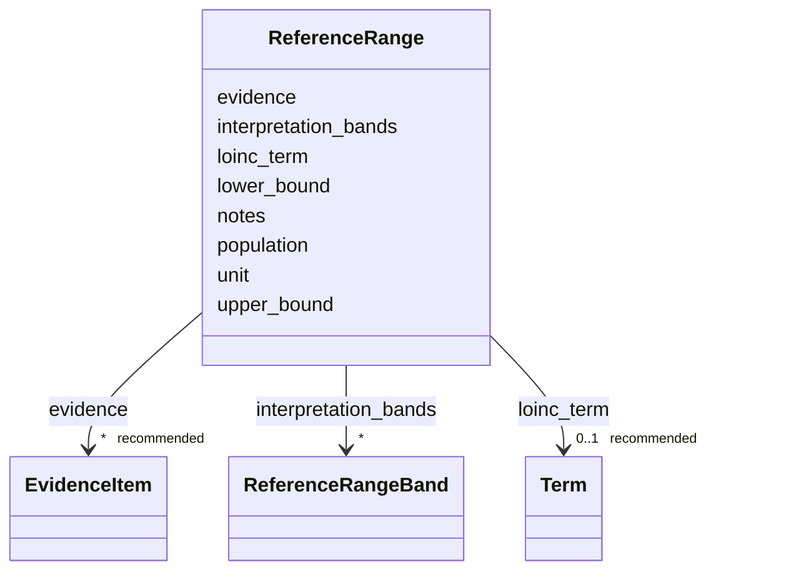

# Class: ReferenceRange 


_A population reference interval for a clinical laboratory analyte. Captures the numeric normal range (lower and upper bounds), measurement unit in UCUM notation, and population qualifier. Provenance is carried by structured evidence items (the same EvidenceItem model used elsewhere in dismech), consistent with how all other assertions are attributed. Complements ModelVariableDescriptor thresholds (which define disease-model activation points) with empirically grounded clinical reference intervals._


URI: [dismech:class/ReferenceRange](https://w3id.org/monarch-initiative/dismech/class/ReferenceRange)





<!-- no inheritance hierarchy -->

## Slots

| Name | Cardinality and Range | Description | Inheritance |
| ---  | --- | --- | --- |
| [loinc_term](../slots/loinc_term.md) | 0..1 _recommended_ <br/> [Term](../classes/Term.md) | LOINC code for the measured analyte (e | direct |
| [lower_bound](../slots/lower_bound.md) | 0..1 <br/> [Float](../types/Float.md) | Lower bound of the reference interval (inclusive) | direct |
| [upper_bound](../slots/upper_bound.md) | 0..1 <br/> [Float](../types/Float.md) | Upper bound of the reference interval (inclusive) | direct |
| [unit](../slots/unit.md) | 0..1 _recommended_ <br/> [String](../types/String.md) | UCUM unit string for the measured quantity (e | direct |
| [population](../slots/population.md) | 0..1 <br/> [String](../types/String.md) | Population or stratification qualifier for this interval (e | direct |
| [interpretation_bands](../slots/interpretation_bands.md) | * <br/> [ReferenceRangeBand](../classes/ReferenceRangeBand.md) | Ordered graded interpretation bands for this analyte (normal / mild / moderat... | direct |
| [evidence](../slots/evidence.md) | * _recommended_ <br/> [EvidenceItem](../classes/EvidenceItem.md) | Structured evidence items attributing this reference interval (typically a cl... | direct |
| [notes](../slots/notes.md) | 0..1 <br/> [String](../types/String.md) | Free-text provenance or caveats that are not a citable reference (e | direct |


## Usages

| used by | used in | type | used |
| ---  | --- | --- | --- |
| [Biochemical](../classes/Biochemical.md) | [reference_ranges](../slots/reference_ranges.md) | range | [ReferenceRange](../classes/ReferenceRange.md) |


## Comments

* Use LOINC codes for loinc_term to enable cross-analyte queries
* Use UCUM notation for unit (e.g., "mmol/L", "g/dL", "U/L")
* population describes age group, sex, fasting state, or other stratifiers
* Omit lower_bound or upper_bound when the interval is one-sided
* Attribute the interval with evidence; use notes for non-citable provenance (e.g., a lab manual)


## Identifier and Mapping Information


### Schema Source


* from schema: https://w3id.org/monarch-initiative/dismech


## Mappings

| Mapping Type | Mapped Value |
| ---  | ---  |
| self | dismech:ReferenceRange |
| native | dismech:ReferenceRange |


## LinkML Source

<!-- TODO: investigate https://stackoverflow.com/questions/37606292/how-to-create-tabbed-code-blocks-in-mkdocs-or-sphinx -->

### Direct

<details>
```yaml
name: ReferenceRange
description: A population reference interval for a clinical laboratory analyte. Captures
  the numeric normal range (lower and upper bounds), measurement unit in UCUM notation,
  and population qualifier. Provenance is carried by structured evidence items (the
  same EvidenceItem model used elsewhere in dismech), consistent with how all other
  assertions are attributed. Complements ModelVariableDescriptor thresholds (which
  define disease-model activation points) with empirically grounded clinical reference
  intervals.
comments:
- Use LOINC codes for loinc_term to enable cross-analyte queries
- Use UCUM notation for unit (e.g., "mmol/L", "g/dL", "U/L")
- population describes age group, sex, fasting state, or other stratifiers
- Omit lower_bound or upper_bound when the interval is one-sided
- Attribute the interval with evidence; use notes for non-citable provenance (e.g.,
  a lab manual)
from_schema: https://w3id.org/monarch-initiative/dismech
slots:
- loinc_term
- lower_bound
- upper_bound
- unit
- population
- interpretation_bands
- evidence
- notes
slot_usage:
  loinc_term:
    name: loinc_term
    description: LOINC code for the measured analyte (e.g., LOINC:2823-3 for serum
      potassium, LOINC:2777-1 for serum phosphate). Required for machine-queryable
      reference interval lookups.
    recommended: true
  interpretation_bands:
    name: interpretation_bands
    description: Ordered graded interpretation bands for this analyte (normal / mild
      / moderate / severe / critical). Use when a result is classified into categories
      beyond the single normal interval; order from lowest to highest value.
  lower_bound:
    name: lower_bound
    description: Lower bound of the reference interval (inclusive). Omit when there
      is no clinically meaningful lower limit (e.g., analytes where only elevation
      is abnormal).
  upper_bound:
    name: upper_bound
    description: Upper bound of the reference interval (inclusive). Omit when there
      is no clinically meaningful upper limit (e.g., analytes where only low values
      are abnormal).
  unit:
    name: unit
    description: UCUM unit string for the measured quantity (e.g., "mmol/L", "g/dL",
      "mIU/L"). Should match the unit used for lower_bound and upper_bound.
    recommended: true
  population:
    name: population
    description: Population or stratification qualifier for this interval (e.g., "adults",
      "female 20-60y", "fasting", "pediatric 0-12mo"). Omit for universal adult reference
      ranges without stratification.
  evidence:
    name: evidence
    description: Structured evidence items attributing this reference interval (typically
      a clinical guideline or primary-study PMID/DOI, or a structured-source reference).
      Preferred over free-text provenance so reference ranges are held to the same
      evidentiary standard as other dismech assertions.
    recommended: true
  notes:
    name: notes
    description: Free-text provenance or caveats that are not a citable reference
      (e.g., a lab-manual interval such as "Tietz Clinical Guide 4th ed." or an assay-dependence
      note).

```
</details>

### Induced

<details>
```yaml
name: ReferenceRange
description: A population reference interval for a clinical laboratory analyte. Captures
  the numeric normal range (lower and upper bounds), measurement unit in UCUM notation,
  and population qualifier. Provenance is carried by structured evidence items (the
  same EvidenceItem model used elsewhere in dismech), consistent with how all other
  assertions are attributed. Complements ModelVariableDescriptor thresholds (which
  define disease-model activation points) with empirically grounded clinical reference
  intervals.
comments:
- Use LOINC codes for loinc_term to enable cross-analyte queries
- Use UCUM notation for unit (e.g., "mmol/L", "g/dL", "U/L")
- population describes age group, sex, fasting state, or other stratifiers
- Omit lower_bound or upper_bound when the interval is one-sided
- Attribute the interval with evidence; use notes for non-citable provenance (e.g.,
  a lab manual)
from_schema: https://w3id.org/monarch-initiative/dismech
slot_usage:
  loinc_term:
    name: loinc_term
    description: LOINC code for the measured analyte (e.g., LOINC:2823-3 for serum
      potassium, LOINC:2777-1 for serum phosphate). Required for machine-queryable
      reference interval lookups.
    recommended: true
  interpretation_bands:
    name: interpretation_bands
    description: Ordered graded interpretation bands for this analyte (normal / mild
      / moderate / severe / critical). Use when a result is classified into categories
      beyond the single normal interval; order from lowest to highest value.
  lower_bound:
    name: lower_bound
    description: Lower bound of the reference interval (inclusive). Omit when there
      is no clinically meaningful lower limit (e.g., analytes where only elevation
      is abnormal).
  upper_bound:
    name: upper_bound
    description: Upper bound of the reference interval (inclusive). Omit when there
      is no clinically meaningful upper limit (e.g., analytes where only low values
      are abnormal).
  unit:
    name: unit
    description: UCUM unit string for the measured quantity (e.g., "mmol/L", "g/dL",
      "mIU/L"). Should match the unit used for lower_bound and upper_bound.
    recommended: true
  population:
    name: population
    description: Population or stratification qualifier for this interval (e.g., "adults",
      "female 20-60y", "fasting", "pediatric 0-12mo"). Omit for universal adult reference
      ranges without stratification.
  evidence:
    name: evidence
    description: Structured evidence items attributing this reference interval (typically
      a clinical guideline or primary-study PMID/DOI, or a structured-source reference).
      Preferred over free-text provenance so reference ranges are held to the same
      evidentiary standard as other dismech assertions.
    recommended: true
  notes:
    name: notes
    description: Free-text provenance or caveats that are not a citable reference
      (e.g., a lab-manual interval such as "Tietz Clinical Guide 4th ed." or an assay-dependence
      note).
attributes:
  loinc_term:
    name: loinc_term
    description: LOINC code for the measured analyte (e.g., LOINC:2823-3 for serum
      potassium, LOINC:2777-1 for serum phosphate). Required for machine-queryable
      reference interval lookups.
    from_schema: https://w3id.org/monarch-initiative/dismech
    rank: 1000
    alias: loinc_term
    owner: ReferenceRange
    domain_of:
    - ReferenceRange
    range: Term
    recommended: true
    inlined: true
  lower_bound:
    name: lower_bound
    description: Lower bound of the reference interval (inclusive). Omit when there
      is no clinically meaningful lower limit (e.g., analytes where only elevation
      is abnormal).
    from_schema: https://w3id.org/monarch-initiative/dismech
    rank: 1000
    alias: lower_bound
    owner: ReferenceRange
    domain_of:
    - ReferenceRangeBand
    - ReferenceRange
    range: float
  upper_bound:
    name: upper_bound
    description: Upper bound of the reference interval (inclusive). Omit when there
      is no clinically meaningful upper limit (e.g., analytes where only low values
      are abnormal).
    from_schema: https://w3id.org/monarch-initiative/dismech
    rank: 1000
    alias: upper_bound
    owner: ReferenceRange
    domain_of:
    - ReferenceRangeBand
    - ReferenceRange
    range: float
  unit:
    name: unit
    description: UCUM unit string for the measured quantity (e.g., "mmol/L", "g/dL",
      "mIU/L"). Should match the unit used for lower_bound and upper_bound.
    examples:
    - value: cm
    from_schema: https://w3id.org/monarch-initiative/dismech
    rank: 1000
    alias: unit
    owner: ReferenceRange
    domain_of:
    - ModelVariable
    - ReferenceRangeBand
    - ReferenceRange
    - EpidemiologyInfo
    range: string
    recommended: true
  population:
    name: population
    description: Population or stratification qualifier for this interval (e.g., "adults",
      "female 20-60y", "fasting", "pediatric 0-12mo"). Omit for universal adult reference
      ranges without stratification.
    examples:
    - value: Global
    from_schema: https://w3id.org/monarch-initiative/dismech
    rank: 1000
    alias: population
    owner: ReferenceRange
    domain_of:
    - PhenotypeContext
    - ReferenceRange
    - Prevalence
    - AssociationSignal
    range: string
  interpretation_bands:
    name: interpretation_bands
    description: Ordered graded interpretation bands for this analyte (normal / mild
      / moderate / severe / critical). Use when a result is classified into categories
      beyond the single normal interval; order from lowest to highest value.
    from_schema: https://w3id.org/monarch-initiative/dismech
    rank: 1000
    alias: interpretation_bands
    owner: ReferenceRange
    domain_of:
    - ReferenceRange
    range: ReferenceRangeBand
    multivalued: true
    inlined: true
    inlined_as_list: true
  evidence:
    name: evidence
    description: Structured evidence items attributing this reference interval (typically
      a clinical guideline or primary-study PMID/DOI, or a structured-source reference).
      Preferred over free-text provenance so reference ranges are held to the same
      evidentiary standard as other dismech assertions.
    from_schema: https://w3id.org/monarch-initiative/dismech
    rank: 1000
    alias: evidence
    owner: ReferenceRange
    domain_of:
    - PhenotypeContext
    - Dataset
    - ExperimentalModel
    - Experiment
    - ExperimentalPerturbation
    - ExperimentalReadout
    - ExperimentalControl
    - ClinicalTrial
    - ComputationalModel
    - DifferentialDiagnosis
    - Subtype
    - CausalEdge
    - TreatmentMechanismTarget
    - ModelMechanismLink
    - BiomarkerReadout
    - ReferenceRange
    - SurrogateEndpoint
    - ExternalAssertion
    - Finding
    - Prevalence
    - ProgressionInfo
    - EpidemiologyInfo
    - Pathophysiology
    - Phenotype
    - Biochemical
    - HistopathologyFinding
    - Genetic
    - Environmental
    - Stage
    - AgentLifeCycle
    - AgentLifeCycleStage
    - AnimalModel
    - Treatment
    - InfectiousAgent
    - Transmission
    - Diagnosis
    - Inheritance
    - Variant
    - ModelingConsideration
    - ClassificationAssignment
    - Definition
    - CriteriaSet
    - AssociationSignal
    - AssociationStatistics
    - ComorbidityHypothesis
    - UpstreamConditionHypothesis
    - MechanisticHypothesis
    - Discussion
    - GroupingCriteria
    - GroupingMember
    - DifferentiatingMechanism
    range: EvidenceItem
    recommended: true
    multivalued: true
    inlined: true
    inlined_as_list: true
  notes:
    name: notes
    description: Free-text provenance or caveats that are not a citable reference
      (e.g., a lab-manual interval such as "Tietz Clinical Guide 4th ed." or an assay-dependence
      note).
    examples:
    - value: Contagious stage where symptoms appear and the bacteria can be spread
        to others.
    from_schema: https://w3id.org/monarch-initiative/dismech
    rank: 1000
    alias: notes
    owner: ReferenceRange
    domain_of:
    - GeneticContext
    - OnsetDescriptor
    - PhenotypeContext
    - Dataset
    - ExperimentalModel
    - Experiment
    - ExperimentalPerturbation
    - ExperimentalReadout
    - ExperimentalControl
    - ClinicalTrial
    - ComputationalModel
    - ModelVariable
    - DifferentialDiagnosis
    - ReferenceRange
    - SurrogateEndpoint
    - SurrogateEndpointCollection
    - ExternalAssertion
    - TrackedIssue
    - Prevalence
    - ProgressionInfo
    - EpidemiologyInfo
    - Pathophysiology
    - Phenotype
    - Biochemical
    - HistopathologyFinding
    - Genetic
    - Environmental
    - Disease
    - Stage
    - AgentLifeCycle
    - AgentLifeCycleStage
    - Treatment
    - Transmission
    - Diagnosis
    - ClassificationAssignment
    - Definition
    - CriteriaSet
    - TermMapping
    - MappingConsistency
    - ComorbidityAssociation
    - AssociationSignal
    - AssociationMetric
    - AssociationStatistics
    - MechanisticHypothesis
    - Discussion
    - Grouping
    - GroupingCriteria
    - GroupingMember
    - DifferentiatingMechanism
    range: string

```
</details>