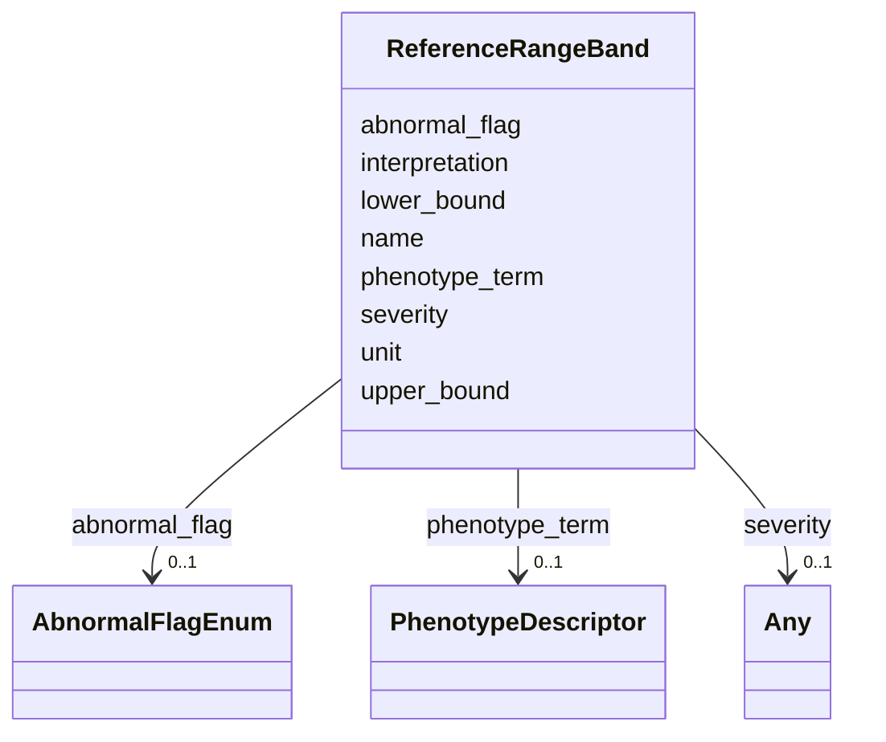

# Class: ReferenceRangeBand 


_A single graded interpretation band within a reference range, mapping a value interval to a categorical clinical label (e.g., "Normal", "Mild", "Moderate", "Severe", "Critical"). Bands partition the measurement scale so a numeric result can be classified into a clinical category. This expresses the "above value X is mild, above value Y is moderate" style of graded result interpretation that a single normal interval cannot capture._


URI: [dismech:class/ReferenceRangeBand](https://w3id.org/monarch-initiative/dismech/class/ReferenceRangeBand)





<!-- no inheritance hierarchy -->

## Slots

| Name | Cardinality and Range | Description | Inheritance |
| ---  | --- | --- | --- |
| [name](../slots/name.md) | 1 <br/> [String](../types/String.md) | Category label for this band (e | direct |
| [lower_bound](../slots/lower_bound.md) | 0..1 <br/> [Float](../types/Float.md) | Inclusive lower bound of this band's value interval | direct |
| [upper_bound](../slots/upper_bound.md) | 0..1 <br/> [Float](../types/Float.md) | Exclusive upper bound of this band's value interval, so adjacent bands sharin... | direct |
| [unit](../slots/unit.md) | 0..1 <br/> [String](../types/String.md) | UCUM unit for this band's bounds | direct |
| [abnormal_flag](../slots/abnormal_flag.md) | 0..1 <br/> [AbnormalFlagEnum](../enums/AbnormalFlagEnum.md) | Normal/low/high/critical classification of results in this band, following HL... | direct |
| [severity](../slots/severity.md) | 0..1 <br/> [Any](../classes/Any.md)&nbsp;or&nbsp;<br />[String](../types/String.md)&nbsp;or&nbsp;<br />[SeverityQualifierEnum](../enums/SeverityQualifierEnum.md) | Optional ordinal severity for this band when the category aligns with MILD/MO... | direct |
| [phenotype_term](../slots/phenotype_term.md) | 0..1 <br/> [PhenotypeDescriptor](../classes/PhenotypeDescriptor.md) | Optional HP phenotype that an abnormal result in this band maps to (LOINC2HPO... | direct |
| [interpretation](../slots/interpretation.md) | 0..1 <br/> [String](../types/String.md) | Free-text clinical interpretation of results that fall in this band | direct |


## Usages

| used by | used in | type | used |
| ---  | --- | --- | --- |
| [ReferenceRange](../classes/ReferenceRange.md) | [interpretation_bands](../slots/interpretation_bands.md) | range | [ReferenceRangeBand](../classes/ReferenceRangeBand.md) |


## Comments

* Order bands from lowest to highest value when listing them
* Bands partition the scale half-open, [lower_bound, upper_bound) — lower_bound inclusive, upper_bound exclusive — so adjacent bands sharing a boundary value do not overlap
* Omit lower_bound for the lowest (open-below) band
* Omit upper_bound for the highest (open-above) band
* Use abnormal_flag to record normal/low/high/critical status per HL7/LOINC
* Optionally map an abnormal band to an HP phenotype via phenotype_term (LOINC2HPO style)


## Identifier and Mapping Information


### Schema Source


* from schema: https://w3id.org/monarch-initiative/dismech


## Mappings

| Mapping Type | Mapped Value |
| ---  | ---  |
| self | dismech:ReferenceRangeBand |
| native | dismech:ReferenceRangeBand |


## LinkML Source

<!-- TODO: investigate https://stackoverflow.com/questions/37606292/how-to-create-tabbed-code-blocks-in-mkdocs-or-sphinx -->

### Direct

<details>
```yaml
name: ReferenceRangeBand
description: A single graded interpretation band within a reference range, mapping
  a value interval to a categorical clinical label (e.g., "Normal", "Mild", "Moderate",
  "Severe", "Critical"). Bands partition the measurement scale so a numeric result
  can be classified into a clinical category. This expresses the "above value X is
  mild, above value Y is moderate" style of graded result interpretation that a single
  normal interval cannot capture.
comments:
- Order bands from lowest to highest value when listing them
- Bands partition the scale half-open, [lower_bound, upper_bound) — lower_bound inclusive,
  upper_bound exclusive — so adjacent bands sharing a boundary value do not overlap
- Omit lower_bound for the lowest (open-below) band
- Omit upper_bound for the highest (open-above) band
- Use abnormal_flag to record normal/low/high/critical status per HL7/LOINC
- Optionally map an abnormal band to an HP phenotype via phenotype_term (LOINC2HPO
  style)
from_schema: https://w3id.org/monarch-initiative/dismech
slots:
- name
- lower_bound
- upper_bound
- unit
- abnormal_flag
- severity
- phenotype_term
- interpretation
slot_usage:
  name:
    name: name
    description: Category label for this band (e.g., "Normal", "Mild", "Moderate",
      "Severe", "Critical high").
    required: true
  lower_bound:
    name: lower_bound
    description: Inclusive lower bound of this band's value interval. Omit for an
      open-below band (the lowest tier).
  upper_bound:
    name: upper_bound
    description: Exclusive upper bound of this band's value interval, so adjacent
      bands sharing a boundary value partition cleanly (a result exactly at the boundary
      falls in the next band, whose inclusive lower_bound equals it). Omit for an
      open-above band (the highest tier).
  unit:
    name: unit
    description: UCUM unit for this band's bounds. Usually matches the parent reference
      range; set only if it differs or for standalone clarity.
  abnormal_flag:
    name: abnormal_flag
    description: Normal/low/high/critical classification of results in this band,
      following HL7/LOINC abnormal-flag conventions.
  severity:
    name: severity
    description: Optional ordinal severity for this band when the category aligns
      with MILD/MODERATE/SEVERE grading.
  phenotype_term:
    name: phenotype_term
    description: Optional HP phenotype that an abnormal result in this band maps to
      (LOINC2HPO-style observation-to-phenotype linkage).
  interpretation:
    name: interpretation
    description: Free-text clinical interpretation of results that fall in this band.

```
</details>

### Induced

<details>
```yaml
name: ReferenceRangeBand
description: A single graded interpretation band within a reference range, mapping
  a value interval to a categorical clinical label (e.g., "Normal", "Mild", "Moderate",
  "Severe", "Critical"). Bands partition the measurement scale so a numeric result
  can be classified into a clinical category. This expresses the "above value X is
  mild, above value Y is moderate" style of graded result interpretation that a single
  normal interval cannot capture.
comments:
- Order bands from lowest to highest value when listing them
- Bands partition the scale half-open, [lower_bound, upper_bound) — lower_bound inclusive,
  upper_bound exclusive — so adjacent bands sharing a boundary value do not overlap
- Omit lower_bound for the lowest (open-below) band
- Omit upper_bound for the highest (open-above) band
- Use abnormal_flag to record normal/low/high/critical status per HL7/LOINC
- Optionally map an abnormal band to an HP phenotype via phenotype_term (LOINC2HPO
  style)
from_schema: https://w3id.org/monarch-initiative/dismech
slot_usage:
  name:
    name: name
    description: Category label for this band (e.g., "Normal", "Mild", "Moderate",
      "Severe", "Critical high").
    required: true
  lower_bound:
    name: lower_bound
    description: Inclusive lower bound of this band's value interval. Omit for an
      open-below band (the lowest tier).
  upper_bound:
    name: upper_bound
    description: Exclusive upper bound of this band's value interval, so adjacent
      bands sharing a boundary value partition cleanly (a result exactly at the boundary
      falls in the next band, whose inclusive lower_bound equals it). Omit for an
      open-above band (the highest tier).
  unit:
    name: unit
    description: UCUM unit for this band's bounds. Usually matches the parent reference
      range; set only if it differs or for standalone clarity.
  abnormal_flag:
    name: abnormal_flag
    description: Normal/low/high/critical classification of results in this band,
      following HL7/LOINC abnormal-flag conventions.
  severity:
    name: severity
    description: Optional ordinal severity for this band when the category aligns
      with MILD/MODERATE/SEVERE grading.
  phenotype_term:
    name: phenotype_term
    description: Optional HP phenotype that an abnormal result in this band maps to
      (LOINC2HPO-style observation-to-phenotype linkage).
  interpretation:
    name: interpretation
    description: Free-text clinical interpretation of results that fall in this band.
attributes:
  name:
    name: name
    description: Category label for this band (e.g., "Normal", "Mild", "Moderate",
      "Severe", "Critical high").
    examples:
    - value: Adolescent Nephronophthisis
    from_schema: https://w3id.org/monarch-initiative/dismech
    rank: 1000
    identifier: true
    alias: name
    owner: ReferenceRangeBand
    domain_of:
    - ExperimentalModel
    - Experiment
    - ExperimentalPerturbation
    - ExperimentalReadout
    - ExperimentalControl
    - ClinicalTrial
    - ComputationalModel
    - ModelVariable
    - SeverityTier
    - DifferentialDiagnosis
    - Subtype
    - ReferenceRangeBand
    - SurrogateEndpointCollection
    - ExternalAssertion
    - EpidemiologyInfo
    - Pathophysiology
    - Phenotype
    - Biochemical
    - HistopathologyFinding
    - Genetic
    - Environmental
    - Disease
    - Stage
    - AgentLifeCycleStage
    - Treatment
    - InfectiousAgent
    - Transmission
    - Assay
    - Diagnosis
    - Inheritance
    - Variant
    - Mechanism
    - ModelingConsideration
    - Definition
    - CriteriaSet
    - ComorbidityAssociation
    - Grouping
    range: string
    required: true
  lower_bound:
    name: lower_bound
    description: Inclusive lower bound of this band's value interval. Omit for an
      open-below band (the lowest tier).
    from_schema: https://w3id.org/monarch-initiative/dismech
    rank: 1000
    alias: lower_bound
    owner: ReferenceRangeBand
    domain_of:
    - ReferenceRangeBand
    - ReferenceRange
    range: float
  upper_bound:
    name: upper_bound
    description: Exclusive upper bound of this band's value interval, so adjacent
      bands sharing a boundary value partition cleanly (a result exactly at the boundary
      falls in the next band, whose inclusive lower_bound equals it). Omit for an
      open-above band (the highest tier).
    from_schema: https://w3id.org/monarch-initiative/dismech
    rank: 1000
    alias: upper_bound
    owner: ReferenceRangeBand
    domain_of:
    - ReferenceRangeBand
    - ReferenceRange
    range: float
  unit:
    name: unit
    description: UCUM unit for this band's bounds. Usually matches the parent reference
      range; set only if it differs or for standalone clarity.
    examples:
    - value: cm
    from_schema: https://w3id.org/monarch-initiative/dismech
    rank: 1000
    alias: unit
    owner: ReferenceRangeBand
    domain_of:
    - ModelVariable
    - ReferenceRangeBand
    - ReferenceRange
    - EpidemiologyInfo
    range: string
  abnormal_flag:
    name: abnormal_flag
    description: Normal/low/high/critical classification of results in this band,
      following HL7/LOINC abnormal-flag conventions.
    from_schema: https://w3id.org/monarch-initiative/dismech
    rank: 1000
    alias: abnormal_flag
    owner: ReferenceRangeBand
    domain_of:
    - ReferenceRangeBand
    range: AbnormalFlagEnum
  severity:
    name: severity
    description: Optional ordinal severity for this band when the category aligns
      with MILD/MODERATE/SEVERE grading.
    examples:
    - value: Severe
    from_schema: https://w3id.org/monarch-initiative/dismech
    rank: 1000
    alias: severity
    owner: ReferenceRangeBand
    domain_of:
    - Descriptor
    - PhenotypeContext
    - ReferenceRangeBand
    - Phenotype
    range: Any
    any_of:
    - range: SeverityQualifierEnum
    - range: string
  phenotype_term:
    name: phenotype_term
    description: Optional HP phenotype that an abnormal result in this band maps to
      (LOINC2HPO-style observation-to-phenotype linkage).
    from_schema: https://w3id.org/monarch-initiative/dismech
    rank: 1000
    alias: phenotype_term
    owner: ReferenceRangeBand
    domain_of:
    - ExperimentalReadout
    - ReferenceRangeBand
    - Phenotype
    - LogicalCriterion
    - DifferentiatingMechanism
    range: PhenotypeDescriptor
    inlined: true
  interpretation:
    name: interpretation
    description: Free-text clinical interpretation of results that fall in this band.
    from_schema: https://w3id.org/monarch-initiative/dismech
    rank: 1000
    alias: interpretation
    owner: ReferenceRangeBand
    domain_of:
    - ExperimentalReadout
    - BiomarkerReadout
    - ReferenceRangeBand
    range: string

```
</details>