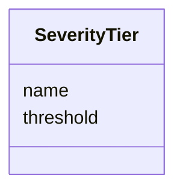

# Class: SeverityTier 


_A threshold-severity pair defining one tier in a severity scale_


URI: [dismech:class/SeverityTier](https://w3id.org/monarch-initiative/dismech/class/SeverityTier)





<!-- no inheritance hierarchy -->


## Slots

| Name | Cardinality and Range | Description | Inheritance |
| ---  | --- | --- | --- |
| [threshold](../slots/threshold.md) | 1 <br/> [Float](../types/Float.md) | The variable value at which this severity tier activates | direct |
| [name](../slots/name.md) | 1 <br/> [String](../types/String.md) | Severity label (e | direct |


## Usages

| used by | used in | type | used |
| ---  | --- | --- | --- |
| [ModelVariableDescriptor](../classes/ModelVariableDescriptor.md) | [severity_scale](../slots/severity_scale.md) | range | [SeverityTier](../classes/SeverityTier.md) |


## Identifier and Mapping Information


### Schema Source


* from schema: https://w3id.org/monarch-initiative/dismech


## Mappings

| Mapping Type | Mapped Value |
| ---  | ---  |
| self | dismech:SeverityTier |
| native | dismech:SeverityTier |


## LinkML Source

<!-- TODO: investigate https://stackoverflow.com/questions/37606292/how-to-create-tabbed-code-blocks-in-mkdocs-or-sphinx -->

### Direct

<details>
```yaml
name: SeverityTier
description: A threshold-severity pair defining one tier in a severity scale
from_schema: https://w3id.org/monarch-initiative/dismech
slots:
- threshold
- name
slot_usage:
  threshold:
    name: threshold
    description: The variable value at which this severity tier activates
    required: true
  name:
    name: name
    description: Severity label (e.g., "mild", "moderate", "severe")
    required: true

```
</details>

### Induced

<details>
```yaml
name: SeverityTier
description: A threshold-severity pair defining one tier in a severity scale
from_schema: https://w3id.org/monarch-initiative/dismech
slot_usage:
  threshold:
    name: threshold
    description: The variable value at which this severity tier activates
    required: true
  name:
    name: name
    description: Severity label (e.g., "mild", "moderate", "severe")
    required: true
attributes:
  threshold:
    name: threshold
    description: The variable value at which this severity tier activates
    from_schema: https://w3id.org/monarch-initiative/dismech
    rank: 1000
    alias: threshold
    owner: SeverityTier
    domain_of:
    - SeverityTier
    - ModelVariableDescriptor
    range: float
    required: true
  name:
    name: name
    description: Severity label (e.g., "mild", "moderate", "severe")
    examples:
    - value: Adolescent Nephronophthisis
    from_schema: https://w3id.org/monarch-initiative/dismech
    rank: 1000
    identifier: true
    alias: name
    owner: SeverityTier
    domain_of:
    - ClinicalTrial
    - ComputationalModel
    - ModelVariable
    - SeverityTier
    - DifferentialDiagnosis
    - Subtype
    - EpidemiologyInfo
    - Pathophysiology
    - Phenotype
    - Biochemical
    - HistopathologyFinding
    - Genetic
    - Environmental
    - Disease
    - Stage
    - AgentLifeCycleStage
    - Treatment
    - InfectiousAgent
    - Transmission
    - Assay
    - Diagnosis
    - Inheritance
    - Variant
    - Mechanism
    - ModelingConsideration
    - Definition
    - CriteriaSet
    - ComorbidityAssociation
    range: string
    required: true

```
</details>