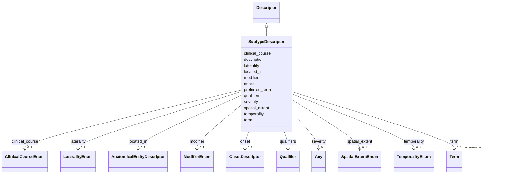

# Class: SubtypeDescriptor 


_A descriptor for disease subtypes, bindable to MONDO disease terms or NCIT oncology subtype terms._


URI: [dismech:class/SubtypeDescriptor](https://w3id.org/monarch-initiative/dismech/class/SubtypeDescriptor)





## Inheritance
* [Descriptor](../classes/Descriptor.md)
    * **SubtypeDescriptor**


## Slots

| Name | Cardinality and Range | Description | Inheritance |
| ---  | --- | --- | --- |
| [preferred_term](../slots/preferred_term.md) | 1 <br/> [String](../types/String.md) | The preferred human-readable term for this descriptor | [Descriptor](../classes/Descriptor.md) |
| [description](../slots/description.md) | 0..1 <br/> [String](../types/String.md) | A description of the descriptor | [Descriptor](../classes/Descriptor.md) |
| [term](../slots/term.md) | 0..1 _recommended_ <br/> [Term](../classes/Term.md) | MONDO or NCIT term reference for a subtype/facet value | [Descriptor](../classes/Descriptor.md) |
| [modifier](../slots/modifier.md) | 0..1 <br/> [ModifierEnum](../enums/ModifierEnum.md) | Directional or qualitative modifier for a descriptor (e | [Descriptor](../classes/Descriptor.md) |
| [located_in](../slots/located_in.md) | 0..1 <br/> [AnatomicalEntityDescriptor](../classes/AnatomicalEntityDescriptor.md) | Anatomical location where this entity/process occurs or procedure is performe... | [Descriptor](../classes/Descriptor.md) |
| [laterality](../slots/laterality.md) | 0..1 <br/> [LateralityEnum](../enums/LateralityEnum.md) | Laterality qualifier (left, right, or bilateral) | [Descriptor](../classes/Descriptor.md) |
| [spatial_extent](../slots/spatial_extent.md) | 0..1 <br/> [SpatialExtentEnum](../enums/SpatialExtentEnum.md) | The spatial extent or distribution pattern applicable to this descriptor (e | [Descriptor](../classes/Descriptor.md) |
| [onset](../slots/onset.md) | 0..1 <br/> [OnsetDescriptor](../classes/OnsetDescriptor.md) | Structured age of onset descriptor | [Descriptor](../classes/Descriptor.md) |
| [temporality](../slots/temporality.md) | 0..1 <br/> [TemporalityEnum](../enums/TemporalityEnum.md) | Temporal qualifier for this descriptor (e | [Descriptor](../classes/Descriptor.md) |
| [clinical_course](../slots/clinical_course.md) | 0..1 <br/> [ClinicalCourseEnum](../enums/ClinicalCourseEnum.md) | Clinical course qualifier for this descriptor (e | [Descriptor](../classes/Descriptor.md) |
| [severity](../slots/severity.md) | 0..1 <br/> [Any](../classes/Any.md)&nbsp;or&nbsp;<br />[String](../types/String.md)&nbsp;or&nbsp;<br />[SeverityQualifierEnum](../enums/SeverityQualifierEnum.md) |  | [Descriptor](../classes/Descriptor.md) |
| [qualifiers](../slots/qualifiers.md) | * <br/> [Qualifier](../classes/Qualifier.md) | List of predicate-value pairs for formal post-composition | [Descriptor](../classes/Descriptor.md) |


## Usages

| used by | used in | type | used |
| ---  | --- | --- | --- |
| [Subtype](../classes/Subtype.md) | [subtype_term](../slots/subtype_term.md) | range | [SubtypeDescriptor](../classes/SubtypeDescriptor.md) |


## Identifier and Mapping Information


### Schema Source


* from schema: https://w3id.org/monarch-initiative/dismech


## Mappings

| Mapping Type | Mapped Value |
| ---  | ---  |
| self | dismech:SubtypeDescriptor |
| native | dismech:SubtypeDescriptor |


## LinkML Source

<!-- TODO: investigate https://stackoverflow.com/questions/37606292/how-to-create-tabbed-code-blocks-in-mkdocs-or-sphinx -->

### Direct

<details>
```yaml
name: SubtypeDescriptor
description: A descriptor for disease subtypes, bindable to MONDO disease terms or
  NCIT oncology subtype terms.
from_schema: https://w3id.org/monarch-initiative/dismech
is_a: Descriptor
slot_usage:
  term:
    name: term
    description: MONDO or NCIT term reference for a subtype/facet value
    bindings:
    - range: DiseaseOrSubtypeTerm
      obligation_level: REQUIRED
      binds_value_of: id

```
</details>

### Induced

<details>
```yaml
name: SubtypeDescriptor
description: A descriptor for disease subtypes, bindable to MONDO disease terms or
  NCIT oncology subtype terms.
from_schema: https://w3id.org/monarch-initiative/dismech
is_a: Descriptor
slot_usage:
  term:
    name: term
    description: MONDO or NCIT term reference for a subtype/facet value
    bindings:
    - range: DiseaseOrSubtypeTerm
      obligation_level: REQUIRED
      binds_value_of: id
attributes:
  preferred_term:
    name: preferred_term
    description: The preferred human-readable term for this descriptor. This may be
      more specific or nuanced than the linked ontology term label when the ontology
      does not fully capture the desired granularity. Note that postcomposition using
      the modifier slot may be appropriate for capturing the semantics of the preferred
      term.
    from_schema: https://w3id.org/monarch-initiative/dismech
    rank: 1000
    alias: preferred_term
    owner: SubtypeDescriptor
    domain_of:
    - Descriptor
    - ConditionDescriptor
    range: string
    required: true
  description:
    name: description
    description: A description of the descriptor. This may typically be redundant
      with the `term` object, but the description is more human-readable and may be
      used to communicate nuances not captured by the rigid standardization of the
      term object.
    from_schema: https://w3id.org/monarch-initiative/dismech
    rank: 1000
    alias: description
    owner: SubtypeDescriptor
    domain_of:
    - Descriptor
    - DietaryModification
    - GeneticContext
    - Dataset
    - ExperimentalModel
    - Experiment
    - ExperimentalPerturbation
    - ExperimentalReadout
    - ExperimentalControl
    - ClinicalTrial
    - ComputationalModel
    - ModelVariable
    - DifferentialDiagnosis
    - Subtype
    - CausalEdge
    - TreatmentMechanismTarget
    - ModelMechanismLink
    - BiomarkerReadout
    - SurrogateEndpointCollection
    - ProteinStructure
    - ExternalAssertion
    - EpidemiologyInfo
    - Pathophysiology
    - Phenotype
    - HistopathologyFinding
    - Environmental
    - Disease
    - Stage
    - AgentLifeCycle
    - AgentLifeCycleStage
    - AnimalModel
    - Treatment
    - InfectiousAgent
    - Transmission
    - Assay
    - Diagnosis
    - Inheritance
    - Variant
    - FunctionalEffect
    - Mechanism
    - ModelingConsideration
    - Definition
    - CriteriaSet
    - ConditionDescriptor
    - GOEnrichment
    - ComorbidityHypothesis
    - UpstreamConditionHypothesis
    - MechanisticHypothesis
    - Grouping
    - GroupingCriteria
    - LogicalCriterion
    - DifferentiatingMechanism
    range: string
    recommended: false
  term:
    name: term
    description: MONDO or NCIT term reference for a subtype/facet value
    from_schema: https://w3id.org/monarch-initiative/dismech
    rank: 1000
    alias: term
    owner: SubtypeDescriptor
    domain_of:
    - Descriptor
    - TermMapping
    - ConditionDescriptor
    - GOEnrichmentTerm
    range: Term
    bindings:
    - range: DiseaseOrSubtypeTerm
      obligation_level: REQUIRED
      binds_value_of: id
    recommended: true
    inlined: true
  modifier:
    name: modifier
    description: Directional or qualitative modifier for a descriptor (e.g., increased,
      decreased, abnormal)
    from_schema: https://w3id.org/monarch-initiative/dismech
    rank: 1000
    alias: modifier
    owner: SubtypeDescriptor
    domain_of:
    - Descriptor
    - DifferentiatingMechanism
    range: ModifierEnum
  located_in:
    name: located_in
    description: Anatomical location where this entity/process occurs or procedure
      is performed
    from_schema: https://w3id.org/monarch-initiative/dismech
    rank: 1000
    alias: located_in
    owner: SubtypeDescriptor
    domain_of:
    - Descriptor
    range: AnatomicalEntityDescriptor
    inlined: true
  laterality:
    name: laterality
    description: Laterality qualifier (left, right, or bilateral)
    from_schema: https://w3id.org/monarch-initiative/dismech
    rank: 1000
    alias: laterality
    owner: SubtypeDescriptor
    domain_of:
    - Descriptor
    range: LateralityEnum
  spatial_extent:
    name: spatial_extent
    description: The spatial extent or distribution pattern applicable to this descriptor
      (e.g., focal, diffuse, extensive)
    from_schema: https://w3id.org/monarch-initiative/dismech
    rank: 1000
    alias: spatial_extent
    owner: SubtypeDescriptor
    domain_of:
    - Descriptor
    range: SpatialExtentEnum
  onset:
    name: onset
    description: Structured age of onset descriptor. Combines an HPO onset category
      with optional quantitative age data (mean, min, max in years) and free-text
      notes.
    from_schema: https://w3id.org/monarch-initiative/dismech
    rank: 1000
    alias: onset
    owner: SubtypeDescriptor
    domain_of:
    - Descriptor
    - PhenotypeContext
    range: OnsetDescriptor
    inlined: true
  temporality:
    name: temporality
    description: Temporal qualifier for this descriptor (e.g., acute, chronic, recurrent)
    from_schema: https://w3id.org/monarch-initiative/dismech
    rank: 1000
    alias: temporality
    owner: SubtypeDescriptor
    domain_of:
    - Descriptor
    range: TemporalityEnum
  clinical_course:
    name: clinical_course
    description: Clinical course qualifier for this descriptor (e.g., progressive,
      stable)
    from_schema: https://w3id.org/monarch-initiative/dismech
    rank: 1000
    alias: clinical_course
    owner: SubtypeDescriptor
    domain_of:
    - Descriptor
    range: ClinicalCourseEnum
  severity:
    name: severity
    examples:
    - value: Severe
    from_schema: https://w3id.org/monarch-initiative/dismech
    rank: 1000
    alias: severity
    owner: SubtypeDescriptor
    domain_of:
    - Descriptor
    - PhenotypeContext
    - ReferenceRangeBand
    - Phenotype
    range: Any
    any_of:
    - range: SeverityQualifierEnum
    - range: string
  qualifiers:
    name: qualifiers
    description: List of predicate-value pairs for formal post-composition. Allows
      OWL-like expressivity with controlled predicates (e.g., RO relations) and values.
    deprecated: Prefer explicit slots like located_in and laterality instead of generic
      qualifiers
    from_schema: https://w3id.org/monarch-initiative/dismech
    rank: 1000
    alias: qualifiers
    owner: SubtypeDescriptor
    domain_of:
    - Descriptor
    range: Qualifier
    multivalued: true
    inlined: true
    inlined_as_list: true

```
</details>