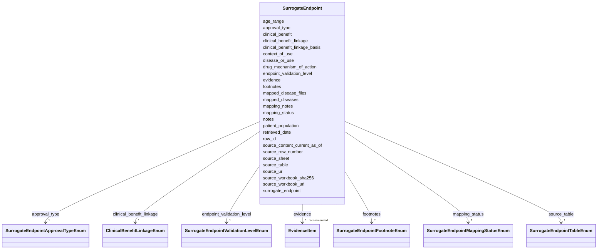

# Class: SurrogateEndpoint 


_A regulatory surrogate endpoint assertion curated from FDA's surrogate endpoint table or a similar authoritative source. This captures an endpoint used as a substitute for direct clinical benefit in a specified disease/use, patient population, approval-pathway, and therapeutic mechanism context._


URI: [dismech:class/SurrogateEndpoint](https://w3id.org/monarch-initiative/dismech/class/SurrogateEndpoint)





<!-- no inheritance hierarchy -->

## Slots

| Name | Cardinality and Range | Description | Inheritance |
| ---  | --- | --- | --- |
| [row_id](../slots/row_id.md) | 1 <br/> [String](../types/String.md) | Stable row identifier assigned during source-table curation | direct |
| [source_table](../slots/source_table.md) | 1 <br/> [SurrogateEndpointTableEnum](../enums/SurrogateEndpointTableEnum.md) | FDA surrogate endpoint table section from which the row was curated | direct |
| [source_sheet](../slots/source_sheet.md) | 1 <br/> [String](../types/String.md) | Spreadsheet worksheet name or source table label | direct |
| [source_row_number](../slots/source_row_number.md) | 1 <br/> [Integer](../types/Integer.md) | Row number in the source spreadsheet worksheet | direct |
| [disease_or_use](../slots/disease_or_use.md) | 1 <br/> [String](../types/String.md) | FDA disease or use text for a surrogate endpoint row | direct |
| [patient_population](../slots/patient_population.md) | 1 <br/> [String](../types/String.md) | FDA patient population text for a surrogate endpoint row | direct |
| [surrogate_endpoint](../slots/surrogate_endpoint.md) | 1 <br/> [String](../types/String.md) | Surrogate endpoint text from the FDA surrogate endpoint table | direct |
| [approval_type](../slots/approval_type.md) | 1 <br/> [SurrogateEndpointApprovalTypeEnum](../enums/SurrogateEndpointApprovalTypeEnum.md) | FDA approval pathway context for the surrogate endpoint row | direct |
| [drug_mechanism_of_action](../slots/drug_mechanism_of_action.md) | 0..1 <br/> [String](../types/String.md) | FDA drug mechanism-of-action context for the surrogate endpoint row | direct |
| [age_range](../slots/age_range.md) | 0..1 <br/> [String](../types/String.md) | Age range or stratification, if applicable | direct |
| [endpoint_validation_level](../slots/endpoint_validation_level.md) | 1 <br/> [SurrogateEndpointValidationLevelEnum](../enums/SurrogateEndpointValidationLevelEnum.md) | BEST-aligned level | direct |
| [clinical_benefit_linkage](../slots/clinical_benefit_linkage.md) | 1 <br/> [ClinicalBenefitLinkageEnum](../enums/ClinicalBenefitLinkageEnum.md) | BEST-aligned relationship to clinical benefit | direct |
| [clinical_benefit](../slots/clinical_benefit.md) | 0..1 <br/> [String](../types/String.md) | Specific clinical benefit or clinical outcome predicted by the surrogate endp... | direct |
| [clinical_benefit_linkage_basis](../slots/clinical_benefit_linkage_basis.md) | 0..1 <br/> [String](../types/String.md) | Explanation of how the clinical-benefit linkage was inferred or curated | direct |
| [footnotes](../slots/footnotes.md) | * <br/> [SurrogateEndpointFootnoteEnum](../enums/SurrogateEndpointFootnoteEnum.md) | FDA workbook footnote semantics attached to the source row | direct |
| [context_of_use](../slots/context_of_use.md) | 0..1 <br/> [String](../types/String.md) | Concise context-of-use statement combining disease/use, population, endpoint,... | direct |
| [mapping_status](../slots/mapping_status.md) | 1 <br/> [SurrogateEndpointMappingStatusEnum](../enums/SurrogateEndpointMappingStatusEnum.md) | Status of mapping the FDA disease/use row to dismech disease entries | direct |
| [mapped_diseases](../slots/mapped_diseases.md) | * <br/> [String](../types/String.md) | Names of dismech disease entries mapped or candidate-mapped to this FDA row | direct |
| [mapped_disease_files](../slots/mapped_disease_files.md) | * <br/> [String](../types/String.md) | Relative paths of dismech disease YAML files mapped or candidate-mapped to th... | direct |
| [mapping_notes](../slots/mapping_notes.md) | 0..1 <br/> [String](../types/String.md) | Notes on code-to-concept mapping decisions for this signal | direct |
| [source_url](../slots/source_url.md) | 0..1 <br/> [Uri](../types/Uri.md) | URL of the source page for a curated assertion or source collection | direct |
| [source_workbook_url](../slots/source_workbook_url.md) | 0..1 <br/> [Uri](../types/Uri.md) | URL of the source workbook or downloadable data file | direct |
| [source_workbook_sha256](../slots/source_workbook_sha256.md) | 0..1 <br/> [String](../types/String.md) | SHA-256 checksum of the downloaded source workbook used for import | direct |
| [source_content_current_as_of](../slots/source_content_current_as_of.md) | 0..1 <br/> [Date](../types/Date.md) | Date shown by the source as the content-current-as-of date | direct |
| [retrieved_date](../slots/retrieved_date.md) | 0..1 <br/> [Date](../types/Date.md) | Date on which the source was retrieved for curation | direct |
| [evidence](../slots/evidence.md) | * _recommended_ <br/> [EvidenceItem](../classes/EvidenceItem.md) |  | direct |
| [notes](../slots/notes.md) | 0..1 <br/> [String](../types/String.md) |  | direct |


## Usages

| used by | used in | type | used |
| ---  | --- | --- | --- |
| [SurrogateEndpointCollection](../classes/SurrogateEndpointCollection.md) | [surrogate_endpoints](../slots/surrogate_endpoints.md) | range | [SurrogateEndpoint](../classes/SurrogateEndpoint.md) |
| [Disease](../classes/Disease.md) | [surrogate_endpoints](../slots/surrogate_endpoints.md) | range | [SurrogateEndpoint](../classes/SurrogateEndpoint.md) |
| [FDASurrogateEndpointCollection](../classes/FDASurrogateEndpointCollection.md) | [surrogate_endpoints](../slots/surrogate_endpoints.md) | range | [SurrogateEndpoint](../classes/SurrogateEndpoint.md) |


## Identifier and Mapping Information


### Schema Source


* from schema: https://w3id.org/monarch-initiative/dismech


## Mappings

| Mapping Type | Mapped Value |
| ---  | ---  |
| self | dismech:SurrogateEndpoint |
| native | dismech:SurrogateEndpoint |


## LinkML Source

<!-- TODO: investigate https://stackoverflow.com/questions/37606292/how-to-create-tabbed-code-blocks-in-mkdocs-or-sphinx -->

### Direct

<details>
```yaml
name: SurrogateEndpoint
description: A regulatory surrogate endpoint assertion curated from FDA's surrogate
  endpoint table or a similar authoritative source. This captures an endpoint used
  as a substitute for direct clinical benefit in a specified disease/use, patient
  population, approval-pathway, and therapeutic mechanism context.
from_schema: https://w3id.org/monarch-initiative/dismech
slots:
- row_id
- source_table
- source_sheet
- source_row_number
- disease_or_use
- patient_population
- surrogate_endpoint
- approval_type
- drug_mechanism_of_action
- age_range
- endpoint_validation_level
- clinical_benefit_linkage
- clinical_benefit
- clinical_benefit_linkage_basis
- footnotes
- context_of_use
- mapping_status
- mapped_diseases
- mapped_disease_files
- mapping_notes
- source_url
- source_workbook_url
- source_workbook_sha256
- source_content_current_as_of
- retrieved_date
- evidence
- notes
slot_usage:
  row_id:
    name: row_id
    required: true
  source_table:
    name: source_table
    required: true
  source_sheet:
    name: source_sheet
    required: true
  source_row_number:
    name: source_row_number
    required: true
  disease_or_use:
    name: disease_or_use
    required: true
  patient_population:
    name: patient_population
    required: true
  surrogate_endpoint:
    name: surrogate_endpoint
    required: true
  approval_type:
    name: approval_type
    required: true
  endpoint_validation_level:
    name: endpoint_validation_level
    description: BEST-aligned level. For FDA-table rows this is derived from approval
      type unless a curator overrides it with more specific evidence.
    required: true
  clinical_benefit_linkage:
    name: clinical_benefit_linkage
    description: BEST-aligned relationship to clinical benefit. FDA table rows usually
      imply this via the approval pathway rather than naming a specific clinical outcome.
    required: true
  clinical_benefit:
    name: clinical_benefit
    description: Specific clinical benefit or clinical outcome predicted by the surrogate
      endpoint, when curated. FDA table rows may leave this blank.
  mapping_status:
    name: mapping_status
    required: true

```
</details>

### Induced

<details>
```yaml
name: SurrogateEndpoint
description: A regulatory surrogate endpoint assertion curated from FDA's surrogate
  endpoint table or a similar authoritative source. This captures an endpoint used
  as a substitute for direct clinical benefit in a specified disease/use, patient
  population, approval-pathway, and therapeutic mechanism context.
from_schema: https://w3id.org/monarch-initiative/dismech
slot_usage:
  row_id:
    name: row_id
    required: true
  source_table:
    name: source_table
    required: true
  source_sheet:
    name: source_sheet
    required: true
  source_row_number:
    name: source_row_number
    required: true
  disease_or_use:
    name: disease_or_use
    required: true
  patient_population:
    name: patient_population
    required: true
  surrogate_endpoint:
    name: surrogate_endpoint
    required: true
  approval_type:
    name: approval_type
    required: true
  endpoint_validation_level:
    name: endpoint_validation_level
    description: BEST-aligned level. For FDA-table rows this is derived from approval
      type unless a curator overrides it with more specific evidence.
    required: true
  clinical_benefit_linkage:
    name: clinical_benefit_linkage
    description: BEST-aligned relationship to clinical benefit. FDA table rows usually
      imply this via the approval pathway rather than naming a specific clinical outcome.
    required: true
  clinical_benefit:
    name: clinical_benefit
    description: Specific clinical benefit or clinical outcome predicted by the surrogate
      endpoint, when curated. FDA table rows may leave this blank.
  mapping_status:
    name: mapping_status
    required: true
attributes:
  row_id:
    name: row_id
    description: Stable row identifier assigned during source-table curation
    from_schema: https://w3id.org/monarch-initiative/dismech
    rank: 1000
    identifier: true
    alias: row_id
    owner: SurrogateEndpoint
    domain_of:
    - SurrogateEndpoint
    range: string
    required: true
  source_table:
    name: source_table
    description: FDA surrogate endpoint table section from which the row was curated
    from_schema: https://w3id.org/monarch-initiative/dismech
    rank: 1000
    alias: source_table
    owner: SurrogateEndpoint
    domain_of:
    - SurrogateEndpoint
    range: SurrogateEndpointTableEnum
    required: true
  source_sheet:
    name: source_sheet
    description: Spreadsheet worksheet name or source table label
    from_schema: https://w3id.org/monarch-initiative/dismech
    rank: 1000
    alias: source_sheet
    owner: SurrogateEndpoint
    domain_of:
    - SurrogateEndpoint
    range: string
    required: true
  source_row_number:
    name: source_row_number
    description: Row number in the source spreadsheet worksheet
    from_schema: https://w3id.org/monarch-initiative/dismech
    rank: 1000
    alias: source_row_number
    owner: SurrogateEndpoint
    domain_of:
    - SurrogateEndpoint
    range: integer
    required: true
  disease_or_use:
    name: disease_or_use
    description: FDA disease or use text for a surrogate endpoint row
    from_schema: https://w3id.org/monarch-initiative/dismech
    rank: 1000
    alias: disease_or_use
    owner: SurrogateEndpoint
    domain_of:
    - SurrogateEndpoint
    range: string
    required: true
  patient_population:
    name: patient_population
    description: FDA patient population text for a surrogate endpoint row
    from_schema: https://w3id.org/monarch-initiative/dismech
    rank: 1000
    alias: patient_population
    owner: SurrogateEndpoint
    domain_of:
    - SurrogateEndpoint
    range: string
    required: true
  surrogate_endpoint:
    name: surrogate_endpoint
    description: Surrogate endpoint text from the FDA surrogate endpoint table
    from_schema: https://w3id.org/monarch-initiative/dismech
    rank: 1000
    alias: surrogate_endpoint
    owner: SurrogateEndpoint
    domain_of:
    - SurrogateEndpoint
    range: string
    required: true
  approval_type:
    name: approval_type
    description: FDA approval pathway context for the surrogate endpoint row
    from_schema: https://w3id.org/monarch-initiative/dismech
    rank: 1000
    alias: approval_type
    owner: SurrogateEndpoint
    domain_of:
    - SurrogateEndpoint
    range: SurrogateEndpointApprovalTypeEnum
    required: true
  drug_mechanism_of_action:
    name: drug_mechanism_of_action
    description: FDA drug mechanism-of-action context for the surrogate endpoint row
    from_schema: https://w3id.org/monarch-initiative/dismech
    rank: 1000
    alias: drug_mechanism_of_action
    owner: SurrogateEndpoint
    domain_of:
    - SurrogateEndpoint
    range: string
  age_range:
    name: age_range
    description: Age range or stratification, if applicable
    examples:
    - value: Childhood-Adolescence
    from_schema: https://w3id.org/monarch-initiative/dismech
    rank: 1000
    alias: age_range
    owner: SurrogateEndpoint
    domain_of:
    - PhenotypeContext
    - SurrogateEndpoint
    - ProgressionInfo
    - Demographics
    range: string
  endpoint_validation_level:
    name: endpoint_validation_level
    description: BEST-aligned level. For FDA-table rows this is derived from approval
      type unless a curator overrides it with more specific evidence.
    from_schema: https://w3id.org/monarch-initiative/dismech
    rank: 1000
    alias: endpoint_validation_level
    owner: SurrogateEndpoint
    domain_of:
    - SurrogateEndpoint
    range: SurrogateEndpointValidationLevelEnum
    required: true
  clinical_benefit_linkage:
    name: clinical_benefit_linkage
    description: BEST-aligned relationship to clinical benefit. FDA table rows usually
      imply this via the approval pathway rather than naming a specific clinical outcome.
    from_schema: https://w3id.org/monarch-initiative/dismech
    rank: 1000
    alias: clinical_benefit_linkage
    owner: SurrogateEndpoint
    domain_of:
    - SurrogateEndpoint
    range: ClinicalBenefitLinkageEnum
    required: true
  clinical_benefit:
    name: clinical_benefit
    description: Specific clinical benefit or clinical outcome predicted by the surrogate
      endpoint, when curated. FDA table rows may leave this blank.
    from_schema: https://w3id.org/monarch-initiative/dismech
    rank: 1000
    alias: clinical_benefit
    owner: SurrogateEndpoint
    domain_of:
    - SurrogateEndpoint
    range: string
  clinical_benefit_linkage_basis:
    name: clinical_benefit_linkage_basis
    description: Explanation of how the clinical-benefit linkage was inferred or curated
    from_schema: https://w3id.org/monarch-initiative/dismech
    rank: 1000
    alias: clinical_benefit_linkage_basis
    owner: SurrogateEndpoint
    domain_of:
    - SurrogateEndpoint
    range: string
  footnotes:
    name: footnotes
    description: FDA workbook footnote semantics attached to the source row
    from_schema: https://w3id.org/monarch-initiative/dismech
    rank: 1000
    alias: footnotes
    owner: SurrogateEndpoint
    domain_of:
    - SurrogateEndpoint
    range: SurrogateEndpointFootnoteEnum
    multivalued: true
  context_of_use:
    name: context_of_use
    description: Concise context-of-use statement combining disease/use, population,
      endpoint, approval type, and therapeutic mechanism
    from_schema: https://w3id.org/monarch-initiative/dismech
    rank: 1000
    alias: context_of_use
    owner: SurrogateEndpoint
    domain_of:
    - SurrogateEndpoint
    range: string
  mapping_status:
    name: mapping_status
    description: Status of mapping the FDA disease/use row to dismech disease entries
    from_schema: https://w3id.org/monarch-initiative/dismech
    rank: 1000
    alias: mapping_status
    owner: SurrogateEndpoint
    domain_of:
    - SurrogateEndpoint
    range: SurrogateEndpointMappingStatusEnum
    required: true
  mapped_diseases:
    name: mapped_diseases
    description: Names of dismech disease entries mapped or candidate-mapped to this
      FDA row
    from_schema: https://w3id.org/monarch-initiative/dismech
    rank: 1000
    alias: mapped_diseases
    owner: SurrogateEndpoint
    domain_of:
    - SurrogateEndpoint
    range: string
    multivalued: true
  mapped_disease_files:
    name: mapped_disease_files
    description: Relative paths of dismech disease YAML files mapped or candidate-mapped
      to this FDA row
    from_schema: https://w3id.org/monarch-initiative/dismech
    rank: 1000
    alias: mapped_disease_files
    owner: SurrogateEndpoint
    domain_of:
    - SurrogateEndpoint
    range: string
    multivalued: true
  mapping_notes:
    name: mapping_notes
    description: Notes on code-to-concept mapping decisions for this signal
    from_schema: https://w3id.org/monarch-initiative/dismech
    rank: 1000
    alias: mapping_notes
    owner: SurrogateEndpoint
    domain_of:
    - SurrogateEndpoint
    - AssociationSignal
    range: string
  source_url:
    name: source_url
    description: URL of the source page for a curated assertion or source collection
    from_schema: https://w3id.org/monarch-initiative/dismech
    rank: 1000
    alias: source_url
    owner: SurrogateEndpoint
    domain_of:
    - SurrogateEndpoint
    - SurrogateEndpointCollection
    range: uri
  source_workbook_url:
    name: source_workbook_url
    description: URL of the source workbook or downloadable data file
    from_schema: https://w3id.org/monarch-initiative/dismech
    rank: 1000
    alias: source_workbook_url
    owner: SurrogateEndpoint
    domain_of:
    - SurrogateEndpoint
    - SurrogateEndpointCollection
    range: uri
  source_workbook_sha256:
    name: source_workbook_sha256
    description: SHA-256 checksum of the downloaded source workbook used for import
    from_schema: https://w3id.org/monarch-initiative/dismech
    rank: 1000
    alias: source_workbook_sha256
    owner: SurrogateEndpoint
    domain_of:
    - SurrogateEndpoint
    - SurrogateEndpointCollection
    range: string
  source_content_current_as_of:
    name: source_content_current_as_of
    description: Date shown by the source as the content-current-as-of date
    from_schema: https://w3id.org/monarch-initiative/dismech
    rank: 1000
    alias: source_content_current_as_of
    owner: SurrogateEndpoint
    domain_of:
    - SurrogateEndpoint
    - SurrogateEndpointCollection
    range: date
  retrieved_date:
    name: retrieved_date
    description: Date on which the source was retrieved for curation
    from_schema: https://w3id.org/monarch-initiative/dismech
    rank: 1000
    alias: retrieved_date
    owner: SurrogateEndpoint
    domain_of:
    - SurrogateEndpoint
    - SurrogateEndpointCollection
    range: date
  evidence:
    name: evidence
    from_schema: https://w3id.org/monarch-initiative/dismech
    rank: 1000
    alias: evidence
    owner: SurrogateEndpoint
    domain_of:
    - PhenotypeContext
    - Dataset
    - ExperimentalModel
    - Experiment
    - ExperimentalPerturbation
    - ExperimentalReadout
    - ExperimentalControl
    - ClinicalTrial
    - ComputationalModel
    - DifferentialDiagnosis
    - Subtype
    - CausalEdge
    - TreatmentMechanismTarget
    - ModelMechanismLink
    - BiomarkerReadout
    - ReferenceRange
    - SurrogateEndpoint
    - ExternalAssertion
    - Finding
    - Prevalence
    - ProgressionInfo
    - EpidemiologyInfo
    - Pathophysiology
    - Phenotype
    - Biochemical
    - HistopathologyFinding
    - Genetic
    - Environmental
    - Stage
    - AgentLifeCycle
    - AgentLifeCycleStage
    - AnimalModel
    - Treatment
    - InfectiousAgent
    - Transmission
    - Diagnosis
    - Inheritance
    - Variant
    - ModelingConsideration
    - ClassificationAssignment
    - Definition
    - CriteriaSet
    - AssociationSignal
    - AssociationStatistics
    - ComorbidityHypothesis
    - UpstreamConditionHypothesis
    - MechanisticHypothesis
    - Discussion
    - GroupingCriteria
    - GroupingMember
    - DifferentiatingMechanism
    range: EvidenceItem
    recommended: true
    multivalued: true
    inlined: true
    inlined_as_list: true
  notes:
    name: notes
    examples:
    - value: Contagious stage where symptoms appear and the bacteria can be spread
        to others.
    from_schema: https://w3id.org/monarch-initiative/dismech
    rank: 1000
    alias: notes
    owner: SurrogateEndpoint
    domain_of:
    - GeneticContext
    - OnsetDescriptor
    - PhenotypeContext
    - Dataset
    - ExperimentalModel
    - Experiment
    - ExperimentalPerturbation
    - ExperimentalReadout
    - ExperimentalControl
    - ClinicalTrial
    - ComputationalModel
    - ModelVariable
    - DifferentialDiagnosis
    - ReferenceRange
    - SurrogateEndpoint
    - SurrogateEndpointCollection
    - ExternalAssertion
    - TrackedIssue
    - Prevalence
    - ProgressionInfo
    - EpidemiologyInfo
    - Pathophysiology
    - Phenotype
    - Biochemical
    - HistopathologyFinding
    - Genetic
    - Environmental
    - Disease
    - Stage
    - AgentLifeCycle
    - AgentLifeCycleStage
    - Treatment
    - Transmission
    - Diagnosis
    - ClassificationAssignment
    - Definition
    - CriteriaSet
    - TermMapping
    - MappingConsistency
    - ComorbidityAssociation
    - AssociationSignal
    - AssociationMetric
    - AssociationStatistics
    - MechanisticHypothesis
    - Discussion
    - Grouping
    - GroupingCriteria
    - GroupingMember
    - DifferentiatingMechanism
    range: string

```
</details>