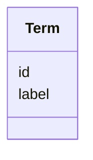

# Class: Term 


_A structured reference to an ontology term_


URI: [dismech:class/Term](https://w3id.org/monarch-initiative/dismech/class/Term)





<!-- no inheritance hierarchy -->


## Slots

| Name | Cardinality and Range | Description | Inheritance |
| ---  | --- | --- | --- |
| [id](../slots/id.md) | 1 <br/> [Uriorcurie](../types/Uriorcurie.md) | Ontology term identifier (CURIE) | direct |
| [label](../slots/label.md) | 0..1 <br/> [String](../types/String.md) | Human-readable label for the ontology term | direct |


## Usages

| used by | used in | type | used |
| ---  | --- | --- | --- |
| [Descriptor](../classes/Descriptor.md) | [term](../slots/term.md) | range | [Term](../classes/Term.md) |
| [CellTypeDescriptor](../classes/CellTypeDescriptor.md) | [term](../slots/term.md) | range | [Term](../classes/Term.md) |
| [BiologicalProcessDescriptor](../classes/BiologicalProcessDescriptor.md) | [term](../slots/term.md) | range | [Term](../classes/Term.md) |
| [AnatomicalEntityDescriptor](../classes/AnatomicalEntityDescriptor.md) | [term](../slots/term.md) | range | [Term](../classes/Term.md) |
| [ChemicalEntityDescriptor](../classes/ChemicalEntityDescriptor.md) | [term](../slots/term.md) | range | [Term](../classes/Term.md) |
| [GeneDescriptor](../classes/GeneDescriptor.md) | [term](../slots/term.md) | range | [Term](../classes/Term.md) |
| [CellularComponentDescriptor](../classes/CellularComponentDescriptor.md) | [term](../slots/term.md) | range | [Term](../classes/Term.md) |
| [ProteinComplexDescriptor](../classes/ProteinComplexDescriptor.md) | [term](../slots/term.md) | range | [Term](../classes/Term.md) |
| [AssayDescriptor](../classes/AssayDescriptor.md) | [term](../slots/term.md) | range | [Term](../classes/Term.md) |
| [TriggerDescriptor](../classes/TriggerDescriptor.md) | [term](../slots/term.md) | range | [Term](../classes/Term.md) |
| [DiseaseDescriptor](../classes/DiseaseDescriptor.md) | [term](../slots/term.md) | range | [Term](../classes/Term.md) |
| [BiomarkerDescriptor](../classes/BiomarkerDescriptor.md) | [term](../slots/term.md) | range | [Term](../classes/Term.md) |
| [GeneProductDescriptor](../classes/GeneProductDescriptor.md) | [term](../slots/term.md) | range | [Term](../classes/Term.md) |
| [HistopathologyFindingDescriptor](../classes/HistopathologyFindingDescriptor.md) | [term](../slots/term.md) | range | [Term](../classes/Term.md) |
| [LifeCycleStageDescriptor](../classes/LifeCycleStageDescriptor.md) | [term](../slots/term.md) | range | [Term](../classes/Term.md) |
| [PhenotypeDescriptor](../classes/PhenotypeDescriptor.md) | [term](../slots/term.md) | range | [Term](../classes/Term.md) |
| [InheritanceDescriptor](../classes/InheritanceDescriptor.md) | [term](../slots/term.md) | range | [Term](../classes/Term.md) |
| [TreatmentDescriptor](../classes/TreatmentDescriptor.md) | [term](../slots/term.md) | range | [Term](../classes/Term.md) |
| [RegimenDescriptor](../classes/RegimenDescriptor.md) | [term](../slots/term.md) | range | [Term](../classes/Term.md) |
| [ExposureDescriptor](../classes/ExposureDescriptor.md) | [term](../slots/term.md) | range | [Term](../classes/Term.md) |
| [EnvironmentDescriptor](../classes/EnvironmentDescriptor.md) | [term](../slots/term.md) | range | [Term](../classes/Term.md) |
| [OrganismDescriptor](../classes/OrganismDescriptor.md) | [term](../slots/term.md) | range | [Term](../classes/Term.md) |
| [HostDescriptor](../classes/HostDescriptor.md) | [term](../slots/term.md) | range | [Term](../classes/Term.md) |
| [SampleTypeDescriptor](../classes/SampleTypeDescriptor.md) | [term](../slots/term.md) | range | [Term](../classes/Term.md) |
| [ModelVariableDescriptor](../classes/ModelVariableDescriptor.md) | [term](../slots/term.md) | range | [Term](../classes/Term.md) |
| [CriteriaItem](../classes/CriteriaItem.md) | [term](../slots/term.md) | range | [Term](../classes/Term.md) |
| [TermMapping](../classes/TermMapping.md) | [term](../slots/term.md) | range | [Term](../classes/Term.md) |
| [ICD10CMMapping](../classes/ICD10CMMapping.md) | [term](../slots/term.md) | range | [Term](../classes/Term.md) |
| [ICD11FMapping](../classes/ICD11FMapping.md) | [term](../slots/term.md) | range | [Term](../classes/Term.md) |
| [MondoMapping](../classes/MondoMapping.md) | [term](../slots/term.md) | range | [Term](../classes/Term.md) |
| [ConditionDescriptor](../classes/ConditionDescriptor.md) | [term](../slots/term.md) | range | [Term](../classes/Term.md) |
| [GOEnrichmentTerm](../classes/GOEnrichmentTerm.md) | [term](../slots/term.md) | range | [Term](../classes/Term.md) |


## Identifier and Mapping Information


### Schema Source


* from schema: https://w3id.org/monarch-initiative/dismech


## Mappings

| Mapping Type | Mapped Value |
| ---  | ---  |
| self | dismech:Term |
| native | dismech:Term |


## LinkML Source

<!-- TODO: investigate https://stackoverflow.com/questions/37606292/how-to-create-tabbed-code-blocks-in-mkdocs-or-sphinx -->

### Direct

<details>
```yaml
name: Term
description: A structured reference to an ontology term
from_schema: https://w3id.org/monarch-initiative/dismech
slots:
- id
- label

```
</details>

### Induced

<details>
```yaml
name: Term
description: A structured reference to an ontology term
from_schema: https://w3id.org/monarch-initiative/dismech
attributes:
  id:
    name: id
    description: Ontology term identifier (CURIE)
    from_schema: https://w3id.org/monarch-initiative/dismech
    rank: 1000
    identifier: true
    alias: id
    owner: Term
    domain_of:
    - Term
    range: uriorcurie
    required: true
  label:
    name: label
    description: Human-readable label for the ontology term
    comments:
    - This is automatically validated by the linkml-term-validator tool.
    from_schema: https://w3id.org/monarch-initiative/dismech
    rank: 1000
    alias: label
    owner: Term
    domain_of:
    - Term
    range: string

```
</details>