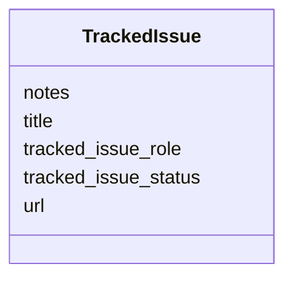

# Class: TrackedIssue 


_Structured pointer to an external tracker issue (typically a GitHub issue) used to record curation provenance. Use this for things like upstream ontology term requests, ontology coverage gaps, schema follow-ups, or any external ticket tied to a dismech object, instead of stashing raw URLs in free-text `notes` fields. Attachable at multiple levels of the model (disease entries, mappings, etc.)._


URI: [dismech:class/TrackedIssue](https://w3id.org/monarch-initiative/dismech/class/TrackedIssue)





<!-- no inheritance hierarchy -->

## Slots

| Name | Cardinality and Range | Description | Inheritance |
| ---  | --- | --- | --- |
| [url](../slots/url.md) | 1 <br/> [Uri](../types/Uri.md) | Canonical URL of the tracked issue | direct |
| [title](../slots/title.md) | 0..1 <br/> [String](../types/String.md) | Short human-readable title of the tracked issue | direct |
| [tracked_issue_role](../slots/tracked_issue_role.md) | 0..1 <br/> [String](../types/String.md) | Role this tracked issue plays relative to the dismech content it is attached ... | direct |
| [tracked_issue_status](../slots/tracked_issue_status.md) | 0..1 <br/> [String](../types/String.md) | Last known status of the tracked issue (e | direct |
| [notes](../slots/notes.md) | 0..1 <br/> [String](../types/String.md) |  | direct |


## Usages

| used by | used in | type | used |
| ---  | --- | --- | --- |
| [SurrogateEndpointCollection](../classes/SurrogateEndpointCollection.md) | [tracked_issues](../slots/tracked_issues.md) | range | [TrackedIssue](../classes/TrackedIssue.md) |
| [Disease](../classes/Disease.md) | [tracked_issues](../slots/tracked_issues.md) | range | [TrackedIssue](../classes/TrackedIssue.md) |
| [TermMapping](../classes/TermMapping.md) | [tracked_issues](../slots/tracked_issues.md) | range | [TrackedIssue](../classes/TrackedIssue.md) |
| [ICD10CMMapping](../classes/ICD10CMMapping.md) | [tracked_issues](../slots/tracked_issues.md) | range | [TrackedIssue](../classes/TrackedIssue.md) |
| [ICD11FMapping](../classes/ICD11FMapping.md) | [tracked_issues](../slots/tracked_issues.md) | range | [TrackedIssue](../classes/TrackedIssue.md) |
| [MondoMapping](../classes/MondoMapping.md) | [tracked_issues](../slots/tracked_issues.md) | range | [TrackedIssue](../classes/TrackedIssue.md) |
| [NCITMapping](../classes/NCITMapping.md) | [tracked_issues](../slots/tracked_issues.md) | range | [TrackedIssue](../classes/TrackedIssue.md) |
| [FDASurrogateEndpointCollection](../classes/FDASurrogateEndpointCollection.md) | [tracked_issues](../slots/tracked_issues.md) | range | [TrackedIssue](../classes/TrackedIssue.md) |


## Identifier and Mapping Information


### Schema Source


* from schema: https://w3id.org/monarch-initiative/dismech


## Mappings

| Mapping Type | Mapped Value |
| ---  | ---  |
| self | dismech:TrackedIssue |
| native | dismech:TrackedIssue |


## LinkML Source

<!-- TODO: investigate https://stackoverflow.com/questions/37606292/how-to-create-tabbed-code-blocks-in-mkdocs-or-sphinx -->

### Direct

<details>
```yaml
name: TrackedIssue
description: Structured pointer to an external tracker issue (typically a GitHub issue)
  used to record curation provenance. Use this for things like upstream ontology term
  requests, ontology coverage gaps, schema follow-ups, or any external ticket tied
  to a dismech object, instead of stashing raw URLs in free-text `notes` fields. Attachable
  at multiple levels of the model (disease entries, mappings, etc.).
from_schema: https://w3id.org/monarch-initiative/dismech
slots:
- url
- title
- tracked_issue_role
- tracked_issue_status
- notes
slot_usage:
  url:
    name: url
    description: Canonical URL of the tracked issue.
    required: true
  title:
    name: title
    description: Short human-readable title of the tracked issue.

```
</details>

### Induced

<details>
```yaml
name: TrackedIssue
description: Structured pointer to an external tracker issue (typically a GitHub issue)
  used to record curation provenance. Use this for things like upstream ontology term
  requests, ontology coverage gaps, schema follow-ups, or any external ticket tied
  to a dismech object, instead of stashing raw URLs in free-text `notes` fields. Attachable
  at multiple levels of the model (disease entries, mappings, etc.).
from_schema: https://w3id.org/monarch-initiative/dismech
slot_usage:
  url:
    name: url
    description: Canonical URL of the tracked issue.
    required: true
  title:
    name: title
    description: Short human-readable title of the tracked issue.
attributes:
  url:
    name: url
    description: Canonical URL of the tracked issue.
    from_schema: https://w3id.org/monarch-initiative/dismech
    rank: 1000
    alias: url
    owner: TrackedIssue
    domain_of:
    - ExternalAssertion
    - TrackedIssue
    range: uri
    required: true
  title:
    name: title
    implements:
    - linkml:title
    description: Short human-readable title of the tracked issue.
    from_schema: https://w3id.org/monarch-initiative/dismech
    rank: 1000
    alias: title
    owner: TrackedIssue
    domain_of:
    - Dataset
    - PublicationReference
    - TrackedIssue
    range: string
  tracked_issue_role:
    name: tracked_issue_role
    description: Role this tracked issue plays relative to the dismech content it
      is attached to. Free-text but common values include "ontology_term_request",
      "ontology_coverage_gap", "schema_followup", "curation_followup", and "external_tracker_link".
    examples:
    - value: ontology_term_request
    - value: schema_followup
    from_schema: https://w3id.org/monarch-initiative/dismech
    rank: 1000
    alias: tracked_issue_role
    owner: TrackedIssue
    domain_of:
    - TrackedIssue
    range: string
  tracked_issue_status:
    name: tracked_issue_status
    description: Last known status of the tracked issue (e.g., "OPEN", "CLOSED", "MERGED").
      This is a curator-recorded snapshot and may drift from the live tracker state.
    examples:
    - value: OPEN
    - value: CLOSED
    from_schema: https://w3id.org/monarch-initiative/dismech
    rank: 1000
    alias: tracked_issue_status
    owner: TrackedIssue
    domain_of:
    - TrackedIssue
    range: string
  notes:
    name: notes
    examples:
    - value: Contagious stage where symptoms appear and the bacteria can be spread
        to others.
    from_schema: https://w3id.org/monarch-initiative/dismech
    rank: 1000
    alias: notes
    owner: TrackedIssue
    domain_of:
    - GeneticContext
    - OnsetDescriptor
    - PhenotypeContext
    - Dataset
    - ExperimentalModel
    - Experiment
    - ExperimentalPerturbation
    - ExperimentalReadout
    - ExperimentalControl
    - ClinicalTrial
    - ComputationalModel
    - ModelVariable
    - DifferentialDiagnosis
    - ReferenceRange
    - SurrogateEndpoint
    - SurrogateEndpointCollection
    - ExternalAssertion
    - TrackedIssue
    - Prevalence
    - ProgressionInfo
    - EpidemiologyInfo
    - Pathophysiology
    - Phenotype
    - Biochemical
    - HistopathologyFinding
    - Genetic
    - Environmental
    - Disease
    - Stage
    - AgentLifeCycle
    - AgentLifeCycleStage
    - Treatment
    - Transmission
    - Diagnosis
    - ClassificationAssignment
    - Definition
    - CriteriaSet
    - TermMapping
    - MappingConsistency
    - ComorbidityAssociation
    - AssociationSignal
    - AssociationMetric
    - AssociationStatistics
    - MechanisticHypothesis
    - Discussion
    - Grouping
    - GroupingCriteria
    - GroupingMember
    - DifferentiatingMechanism
    range: string

```
</details>