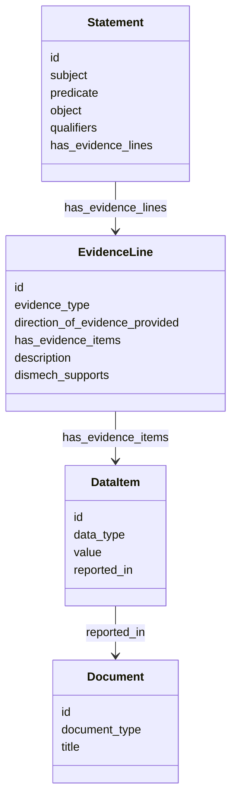

# SEPIO Evidence Export

The KGX export flattens each dismech `EvidenceItem` into two parallel string
lists on a Biolink `Association` — `publications` and `supporting_text`:

```text
[PMID:9922375] [SUPPORT] The cystic fibrosis transmembrane conductance regulator ... --- Explanation: Comprehensive review establishes ...
```

That is lossy. The quoted snippet, the document it came from, the direction of
support, the kind of evidence, and the curator's interpretation of the snippet
all end up concatenated into one opaque blob.

The **SEPIO export** emits the same evidence as a proper graph — one
`Statement` per assertion, with structured `EvidenceLine` → `DataItem` →
`Document` beneath it. It is produced by the *same* Koza transform as the KGX
export, as a sidecar file, so the two join cleanly.

## Running it

```bash
just export-kgx
```

writes three files to `output/kgx/`:

| File | Contents |
|------|----------|
| `kgx_export_nodes.jsonl` | KGX nodes |
| `kgx_export_edges.jsonl` | KGX edges (Biolink `Association`) |
| `kgx_export_sepio.jsonl` | SEPIO statements, one JSON object per line |

The release workflow (`.github/workflows/kgx-release.yaml`) attaches all three
to each published GitHub release as `dismech_nodes.jsonl`,
`dismech_edges.jsonl`, and `dismech_sepio.jsonl`.

## Joining to the KGX edges

A statement that corresponds to a KGX edge **reuses that edge's `id`**, so the
join is on `id`:

```python
import json

edges = {json.loads(line)["id"]: json.loads(line) for line in open("dismech_edges.jsonl")}
for line in open("dismech_sepio.jsonl"):
    statement = json.loads(line)
    edge = edges.get(statement["id"])  # None for statements with no KGX edge
```

Both files are produced by one transform run, so they always agree.

### The join is scoped to one artifact pair

KGX association ids are random `uuid4` values minted as the record is walked, so
**a KGX-joined statement id is only meaningful within the `*_edges.jsonl` /
`*_sepio.jsonl` pair it was released with.** It is not a citable identifier: the
same assertion gets a different id in the next release, and statements produced
by a *separate* walk of the same record — which is what the library function
`dismech.export.statements_from_record()` does — join only to the associations
yielded by that same call, never to an already-written edge file.

The pathophysiology statement ids are the opposite: deterministic UUIDv5 values
minted from the disease and node names (see below), stable across runs and
releases. Those are the ids downstream consumers can cite and link into.

## The model

The SEPIO classes are **not part of the Biolink Model**, so they are not
available from `biolink_model.datamodel.pydanticmodel_v2`. They are defined as a
small hand-written profile of the SEPIO core model in
[`src/dismech/export/sepio_export.py`](https://github.com/monarch-initiative/dismech/blob/main/src/dismech/export/sepio_export.py)
— only the subset dismech needs.



### Field mapping

| dismech | SEPIO | Notes |
|---------|-------|-------|
| the object carrying `evidence` | `Statement` (subject / predicate / object) | the root assertion |
| `evidence[]` | `Statement.has_evidence_lines[]` | one line per evidence item — each snippet is its own interpretation |
| `evidence[].evidence_source` | `EvidenceLine.evidence_type` | `HUMAN_CLINICAL`, `MODEL_ORGANISM`, … |
| `evidence[].supports` | `EvidenceLine.direction_of_evidence_provided` | see mapping below |
| `evidence[].snippet` | `DataItem.value`, with `data_type: TextSpan` | the actual evidence |
| `evidence[].reference` | `Document.id` via `DataItem.reported_in` | |
| `evidence[].reference_title` | `Document.title` | |
| `evidence[].explanation` | `EvidenceLine.description` | SEPIO has no dedicated rationale slot; a `rationale` field would be a natural addition |
| `evidence[].supports` | `EvidenceLine.dismech_supports` | the raw enum value, kept verbatim — see below |
| — | `Document.document_type` | not in dismech; inferred from the reference prefix |

`EvidenceItemSupportEnum` is mostly a direction-of-support enum and passes
through unchanged; the two exceptions are `WRONG_STATEMENT` → `REFUTE` (a
factually wrong claim disputes the assertion) and `NO_EVIDENCE` → `NEUTRAL` (the
reference is silent on the claim, which is not a direction).

Both exceptions are lossy — the schema deliberately separates "contradicts the
claim" (`REFUTE`) from "the claim is factually wrong" (`WRONG_STATEMENT`), and
the SEPIO direction cannot express that. Since the whole point of the sidecar is
to stop flattening evidence, the raw value is carried through unchanged on
`EvidenceLine.dismech_supports`, so the mapping round-trips: consumers that only
want a direction read `direction_of_evidence_provided`, and consumers that need
the dismech distinction read `dismech_supports`.

`document_type` is inferred from the reference CURIE prefix: `PMID:`/`DOI:` →
`PRIMARY_LITERATURE`, `PPR:` → `PREPRINT`, `clinicaltrials:` →
`CLINICAL_TRIAL_RECORD`, the structured-database prefixes (`ORPHA:`, `CGGV:`,
`CGDS:`, `ICEES:`, `NCIT:`, `CIVIC_*:`) → `DATABASE_RECORD`, `GEO:`/
`metabolights:` → `DATASET_RECORD`, `url:` → `WEB_PAGE`. An unrecognized prefix
leaves the field unset rather than guessing.

### dismech provenance fields

Four fields on `Statement`, outside the SEPIO core model, record where a
statement came from (plus `dismech_supports` on `EvidenceLine`, above):

- `source_disease` — the `name` of the KB entry
- `dismech_section` — the section it was derived from (`phenotypes`,
  `pathophysiology.cell_types`, `treatments.therapeutic_agent`, …)
- `hypothesis_groups` — on a causal edge, the mechanistic-hypothesis groups it
  belongs to. A disease may assert two edges between the same pair of nodes
  under competing models (Glutaryl-CoA Dehydrogenase Deficiency asserts both an
  intracerebral and a hepatic origin for the same downstream node); these are
  distinct assertions and get distinct statements.
- `evidence_inherited_from` — see below

## What gets a Statement

**Every KGX association that carries evidence.** An association with no evidence
at all gets no statement: SEPIO's `Statement.hasEvidenceLine` is `1..m`, and a
statement with zero evidence lines would assert nothing that the KGX edge does
not already say.

**Plus two kinds of assertion that have no KGX edge at all:**

1. **Pathophysiology node assertions** — *disease `has_pathophysiology` node*.
   The KGX export has no edge for the node itself; it can only re-attach the
   node's evidence to the node's ontology-bound children (cell types,
   biological processes, …) as indirect supporting text. Those child statements
   carry `evidence_inherited_from`, pointing at the id of the node statement
   that actually owns the evidence — which is what the KGX export flags with its
   `[INDIRECT EVIDENCE]` prefix, but resolvable.
2. **Causal (`downstream`) edges between pathophysiology nodes**, which the KGX
   export drops entirely.

Because pathophysiology nodes are free-text mechanism names with no ontology
term, they get a local identifier of the form
`dismech:<Disease_Name>#<Node_Name>`, and their statement ids are deterministic
UUIDv5 values minted from the disease and node names — stable across runs, so
links into them survive a re-export. If two node names in one disease ever
slugged to the same value, an occurrence counter disambiguates the second (the
same backstop the causal edges use); the first keeps the plain deterministic id,
so `evidence_inherited_from` still resolves.

## Worked example

`kb/disorders/Cystic_Fibrosis.yaml`:

```yaml
pathophysiology:
- name: Airway Surface Liquid Depletion
  evidence:
  - reference: PMID:23878362
    reference_title: "Does epithelial sodium channel hyperactivity contribute to cystic fibrosis lung disease?"
    supports: SUPPORT
    evidence_source: HUMAN_CLINICAL
    snippet: "CF lungs are characterized by viscous, dehydrated mucus, persistent neutrophilia and chronic infections. ENaC is negatively regulated by CFTR and, in patients with CF, the absence of CFTR results in a double hit of reduced Cl-/HCO3- and H2O secretion as well as ENaC hyperactivity and increased Na+ and H2O absorption."
    explanation: Review describes ENaC hyperactivity and dehydration mechanism in CF airways.
```

becomes one line of `kgx_export_sepio.jsonl` (pretty-printed here):

```json
{
  "id": "urn:uuid:0f1fd41f-9ae9-5a0f-8ea9-9ccae342eb5c",
  "type": "Statement",
  "subject": "MONDO:0009061",
  "predicate": "dismech:has_pathophysiology",
  "object": "dismech:Cystic_Fibrosis#Airway_Surface_Liquid_Depletion",
  "subject_label": "Cystic Fibrosis",
  "object_label": "Airway Surface Liquid Depletion",
  "has_evidence_lines": [
    {
      "id": "urn:uuid:5368a1b0-89dc-5f81-95f5-2bab178678e5",
      "type": "EvidenceLine",
      "evidence_type": "HUMAN_CLINICAL",
      "direction_of_evidence_provided": "SUPPORT",
      "has_evidence_items": [
        {
          "id": "urn:uuid:80dc3007-edec-5d7c-aaae-cbe8140ffdf1",
          "type": "DataItem",
          "data_type": "TextSpan",
          "value": "CF lungs are characterized by viscous, dehydrated mucus, persistent neutrophilia and chronic infections. ENaC is negatively regulated by CFTR and, in patients with CF, the absence of CFTR results in a double hit of reduced Cl-/HCO3- and H2O secretion as well as ENaC hyperactivity and increased Na+ and H2O absorption.",
          "reported_in": {
            "id": "PMID:23878362",
            "type": "Document",
            "document_type": "PRIMARY_LITERATURE",
            "title": "Does epithelial sodium channel hyperactivity contribute to cystic fibrosis lung disease?"
          }
        }
      ],
      "description": "Review describes ENaC hyperactivity and dehydration mechanism in CF airways.",
      "dismech_supports": "SUPPORT"
    }
  ],
  "source_disease": "Cystic Fibrosis",
  "dismech_section": "pathophysiology"
}
```

A second snippet on the same node would become a second `EvidenceLine` under the
same statement, since it is a separate interpretation of separate evidence.

## Design notes and known divergences

- **`DataItem.reported_in` is single-valued.** SEPIO allows many source
  documents per evidence item; a dismech `EvidenceItem` always quotes exactly
  one reference.
- **`evidence_type` and `direction_of_evidence_provided` are plain strings, not
  `Coding` objects.** dismech's enums have no ontology bindings to code against
  yet; if they gain ECO or SEPIO term bindings this is where they belong.
- **`DataItem` ids are content-addressed.** A text span's identity is its
  document plus its exact quoted text, so the same snippet cited on two
  assertions resolves to the same `DataItem` id across the whole export.
- **Not everything with an `evidence:` block is exported yet.** Prevalence
  records, definitions, clinical trials, comorbidity association signals, and
  treatment `target_mechanisms` all carry evidence and are not yet emitted;
  the current scope is the KGX associations plus the pathograph
  (pathophysiology node and causal edge) assertions.

See also [Evidence Model](explanation/evidence-model.md) and the evidence
row of the [decision register](explanation/design-decisions.md), which reserves
SEPIO for the export layer rather than the curation schema.
