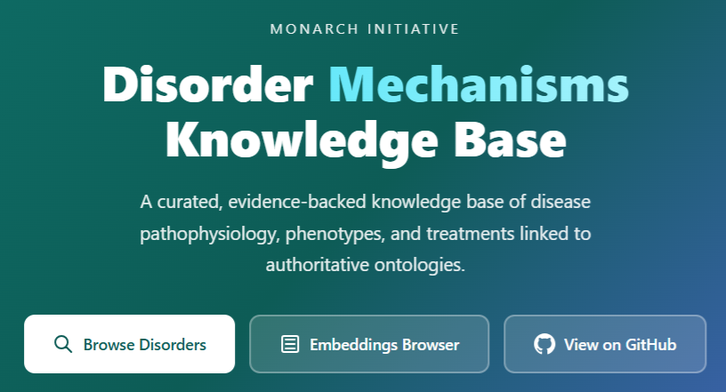
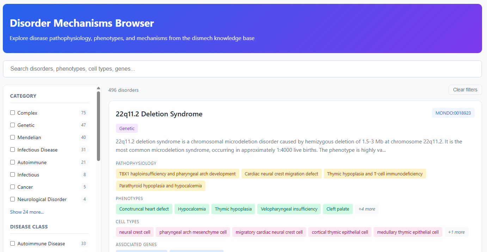
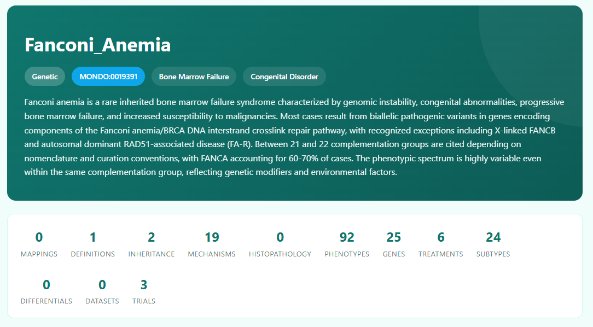
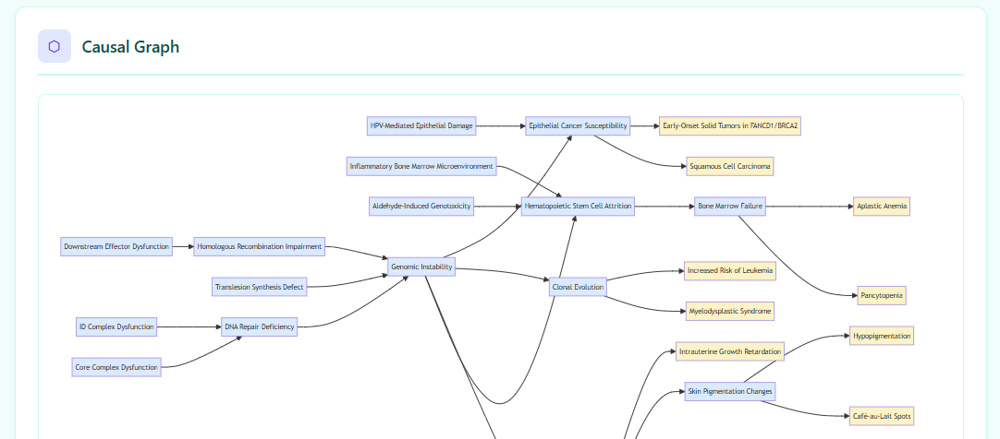
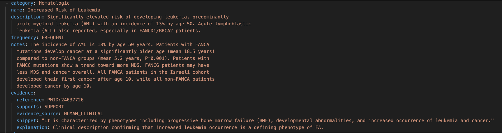
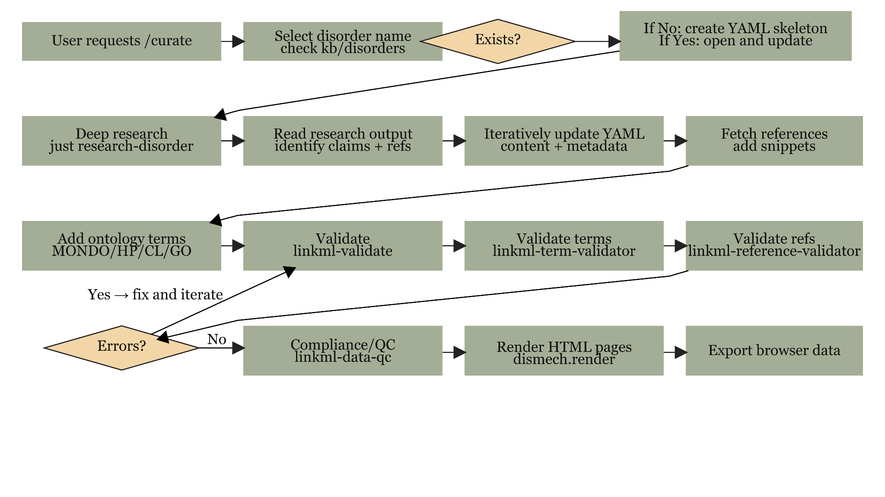
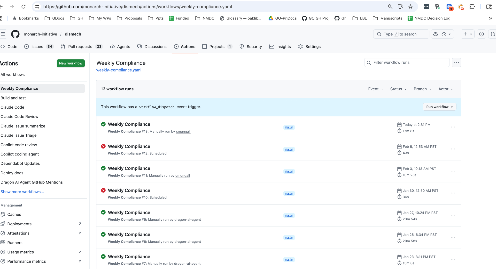
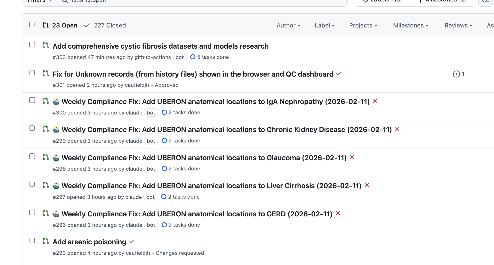
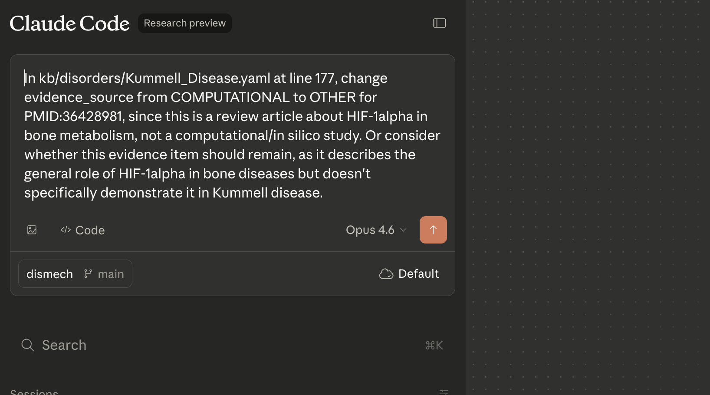

<!-- _class: lead -->
<!-- _backgroundImage: url('images/slide01_img00.jpg') -->
<!-- _backgroundSize: cover -->

# Dismech

## A Disease Mechanisms Knowledge Base Built For and With Agentic AI

**Christopher J. Mungall & Harry Caufield**
Lawrence Berkeley National Laboratory
Monarch Initiative

February 2026

---

## What is Dismech?



- A **Disorder Mechanisms Knowledge Base** with structured, evidence-backed pathophysiology from scientific literature
- A **proof-of-concept** for agentic AI-supported biomedical data curation
- A growing collection of **~500 disorders** with ontology-grounded phenotypes, mechanisms, treatments, and causal graphs
- Built by members of the **Monarch Initiative** -- anyone can curate a new page

**Goal:** Capture *why* diseases present the way they do, not just *what* features they have

---

## The Problem: Mechanism is Missing

Existing resources capture disease-phenotype associations well:

| Resource | Strengths | Gap |
|----------|-----------|-----|
| **HPO/OMIM** | Phenotype annotations | No causal chains |
| **KEGG Disease** | Pathway links | Limited phenotype detail |
| **DisGeNET** | Gene-disease associations | No pathophysiology narrative |
| **ClinVar** | Variant-level evidence | No mechanism context |

**Clinicians and AI systems need to know *why* a mutation leads to a phenotype** -- the intermediate steps matter for diagnosis, treatment selection, and drug discovery.

---

## Browsing Dismech: Faceted Search



496 disorders searchable by category, disease class, cell type, gene, and treatment.

---

## Browsing Dismech: Disorder Detail


Each entry shows pathophysiology, phenotypes, cell types, genes, treatments, and environmental factors at a glance.

---

## Browsing Dismech: Rich Header with Metrics



Summary metrics show curation depth: mappings, definitions, mechanisms, phenotypes, genes, treatments, subtypes, and trials.

---

## Causal Graphs



Interactive DAGs connect upstream molecular defects through intermediate mechanisms to downstream clinical phenotypes. Fanconi Anemia shown above with 19 mechanism nodes.

---

## Objective: Full Provenance for Every Assertion


Each phenotype has:
- **Frequency** (OBLIGATE to VERY_RARE)
- **HPO term** binding
- **Evidence** with PMID + exact snippet
- **Context-specific annotations** varying by genotype

Example: Pancytopenia in FA is VERY_FREQUENT overall, but **excluded** in FANCD1/BRCA2 and FA-S/BRCA1 subtypes.

---

## Evidence: YAML Source with PubMed Provenance



Every assertion in the YAML links to a PMID with an exact quoted snippet. The `evidence_source` field classifies whether the evidence comes from human clinical data, model organisms, in vitro work, or computational analysis.

---

## Anti-Hallucination Validation Stack

Three layers of validation catch AI errors:

| Layer | Tool | What it catches |
|-------|------|----------------|
| **Schema** | `linkml-validate` | Missing fields, wrong types, invalid enums |
| **Terms** | `linkml-term-validator` | Fake ontology IDs, wrong labels, obsolete terms |
| **References** | `linkml-reference-validator` | Fabricated quotes, wrong PMIDs, paraphrased snippets |

```bash
just validate kb/disorders/Fanconi_Anemia.yaml
# Runs all three layers
```

This is critical when AI agents are generating content -- **the validation catches what the model is confident about but wrong**.

---

## The Curation Workflow



A single `/curate` command drives the full pipeline: deep research, YAML generation, reference fetching, three-layer validation, compliance scoring, HTML rendering, and PR submission.

---

## GitHub Actions: Autonomous Curation



Multiple actions run on different triggers:

- **Weekly Compliance** -- identifies low-scoring files, dispatches Claude to fix them
- **PR Review** -- deterministic QC + AI review on every pull request
- **Manual dispatch** -- parameterized by focus area and Claude model

---

## 5 Minutes Later...



Parameterized dispatch (e.g., "anatomical locations using uberon") identifies lowest-compliance files, dispatches Claude Code for each, and opens PRs with validated ontology terms -- all automatically.

---

## AI-Powered PR Review


Claude Code reviews PRs against dismech coding standards:

1. Evidence source classification
2. Treatment term specificity
3. Clinical trial formatting
4. Ontology term validation

Each suggestion includes **location**, **issue**, and **recommendation** with a "Fix it" link.

---

## QC Dashboard


Automated compliance scoring across all ~500 disorder files. Compliance is **weighted** -- mechanisms and evidence are worth more than optional metadata. The dashboard identifies priority curation targets for the weekly bot.

---

## What Have We Learned About Agentic Curation?



- **Agents can support consistent curation** of a knowledge resource at scale
- **Agents can be very confident about their mistakes** -- validation is non-negotiable
- **Skills are effective** for guiding agent activities
- **Exact text evidence is key** for trustworthy knowledge bases
- **Deep research PMIDs can be hallucinated** -- ~15% error rate
  - For ultra-rare diseases, direct PubMed/OMIM is more reliable
- **Humans drive the agent** -- provide guidance, review PRs, give feedback

---

<!-- _class: lead -->

# Applications

## From Knowledge Base to Clinical and Research Tools

---

## Application 1: Phenomatcher -- Case-to-Disease Matching

**Problem:** Given a patient's phenotype profile, which disease best explains the findings?

**Phenomatcher** takes a GA4GH **Phenopacket** and matches it against the dismech knowledge base:

```
Input:  Phenopacket (patient HPO terms)
      + Disease model (dismech YAML)
                |
                v
        [HPO ontology reasoning via OAK]
        [Exact, broader, narrower, related matches]
        [Weighted by disease-model frequency]
                |
                v
Output: MatchingRun with per-phenotype scores
        + pr_is_diagnosis (probability estimate)
        + explanations for non-matches
```

---

<!-- _class: small-text -->

## Phenomatcher: How Matching Works

For each case phenotype vs. each model phenotype, the system computes:

| Match Type | Example | Weight |
|------------|---------|--------|
| **Exact** | Patient has HP:0001876, model has HP:0001876 | Highest |
| **Case is narrower** | Patient: Macrocytic anemia, Model: Anemia | High |
| **Case is broader** | Patient: Anemia, Model: Macrocytic anemia | Moderate |
| **Close (shared parent)** | Patient: Thrombocytopenia, Model: Leukopenia | Low |
| **No match** | Patient phenotype absent from model | Needs explanation |

Model phenotype **frequency** weights the match:
- OBLIGATE (5) > VERY_FREQUENT (4) > FREQUENT (3) > OCCASIONAL (2) > VERY_RARE (1)

`pr_is_diagnosis` = product of per-row explanation probabilities

---

## Phenomatcher: AI-Augmented Explanations

Non-exact matches get **agentic explanation** via Claude:

```yaml
matches:
- case_term_id: HP:0001945      # Fever
  model_term_id: null            # Not in FA model
  exact: false
  explanation_for_no_match:
    explanation_id: INTERCURRENT_INFECTION
    estimated_probability: 0.7
    description: >-
      Fever is not a primary FA phenotype but patients
      with neutropenia are highly susceptible to infections
      that present with fever. This is consistent with the
      bone marrow failure mechanism.
```

The causal graph provides **mechanistic context** for why a phenotype is present or absent.

---

## Application 2: Multi-Space Disease Embeddings


Dismech computes **four separate embedding spaces**:

| Space | Application |
|-------|-------------|
| **Pathophysiology** | Mechanistically similar diseases |
| **Phenotypes** | Clinically similar diseases |
| **Treatments** | Shared treatment targets |
| **Cell types** | Same tissues affected |

Each uses OpenAI embeddings (1536-dim) projected via t-SNE/UMAP.

**Key insight:** Diseases that cluster in phenotype space may diverge in mechanism space -- informative for drug repurposing.

---

## Embeddings: Mechanism-Level Comparison

Beyond disease-level similarity, dismech embeds **individual mechanisms**:

```bash
just embed-mechanisms-all
# Embeds each pathophysiology entry across all 500 disorders
```

This enables:
- Discovering that "Inflammatory Bone Marrow Microenvironment" in Fanconi Anemia clusters with "Chronic Inflammation" in Crohn's Disease
- Finding shared pathophysiology entries across unrelated diseases
- Identifying mechanism modules that recur across disease categories

Interactive browser at: `app/embeddings/mechanisms.html`

---

## Application 3: Comorbidity Discovery

Dismech models **directional comorbidities** with mechanistic evidence:

**Data sources:**
- EHR-based Disease Trajectories (temporal directionality)
- Literature evidence with PMIDs
- GO enrichment showing shared mechanisms
- Genetic overlap (FDR from genetic correlation)

**Example candidates:**
- Male: ~258 strongly directional edges (phase probability >= 0.7)
- Female: ~170 strongly directional edges

Each comorbidity page shows the **mechanistic overlap** -- shared pathophysiology, cell types, and biological processes between disease pairs.

---

## Application 4: Validating Causal Gene-to-Trait Pipelines

**Use case:** Ota et al. (Nature 2025) builds causal graphs from GWAS + Perturb-seq:

```
Gene (regulator) --[beta]--> Program --[effect]--> Trait
```

Dismech serves as a **validation and interpretation layer**:

| Pipeline Output | Dismech Query |
|-----------------|---------------|
| GATA1 --> erythroid program --> MCH | Do blood disorders link GATA1 to erythropoiesis? |
| BCL2 --> apoptosis program --> lymphocyte count | Do immune disorders link BCL2 to apoptosis? |

**Validation levels:**
- **CONFIRMED**: Gene, process, and phenotype all documented with evidence
- **PARTIAL**: Some elements present but incomplete chain
- **NOVEL**: Not in dismech (high-priority curation candidate)
- **CONTRADICTED**: Dismech documents opposite effect

---

## Causal Validation: The Feedback Loop

```
Computational Pipeline (GWAS + Perturb-seq)
     |
     v
  [Gene-Program-Trait relationships]
     |
     v  +--> CONFIRMED (41%) -- known biology
Dismech +--> PARTIAL (25%)   -- incomplete coverage
 Query  +--> NOVEL (29%)     -- curation candidates
        +--> CONTRADICTED (6%) -- needs investigation
     |
     v
  [Novel findings feed back into dismech curation]
  [Gaps in dismech coverage identified and prioritized]
```

Dismech becomes both a **benchmark for pipeline accuracy** and a **beneficiary of pipeline discoveries**.

---

## Application 5: Knowledge Graph Export (KGX)

Dismech exports to **Biolink Model KGX format** for integration with knowledge graphs:

```python
# Each assertion becomes a typed Biolink edge
DiseaseToPhenotypicFeatureAssociation  # phenotypes
GeneToDiseaseAssociation               # genetic factors
ChemicalOrDrugOrTreatmentTo...        # treatments
ExposureEventToOutcomeAssociation      # environmental factors
```

All edges tagged with:
- `primary_knowledge_source: infores:dismech`
- `agent_type: manual_validation_of_automated_agent`
- Frequency qualifiers mapped to HP terms (HP:0040280-0040284)
- Evidence as PMIDs + supporting_text snippets

Enables integration with Monarch KG, Translator, and other Biolink-compatible systems.

---

## Application 6: Tabular Export for Analysis

Dismech flattens to relational tables for SQL/statistical analysis:

```bash
just export-tabular  # Generates TSV + DuckDB database
```

| Table | Content | Rows per disorder |
|-------|---------|-------------------|
| `disorders.tsv` | One row per disorder | 1 |
| `assertions.tsv` | Phenotypes, mechanisms, treatments | 10-100 |
| `descriptors.tsv` | Ontology terms with post-composition | 10-200 |
| `evidence.tsv` | PMIDs, snippets, support status | 20-500 |

**Enables:** Cross-disease queries, frequency analysis, ontology coverage statistics, and ML feature engineering -- all in DuckDB or pandas.

---

<!-- _class: lead -->

# Case Studies

## What We've Curated and What We've Learned

---

## Case Study: Fanconi Anemia (Deep Curation)


The most deeply curated entry:

| Dimension | Coverage |
|-----------|----------|
| Mechanisms | 19 |
| Phenotypes | 92 |
| Genes | 25 |
| Treatments | 6 |
| Clinical trials | 3 |
| Subtypes | 24 |
| Context annotations | Per-genotype |

Demonstrates full schema depth for a complex genetic disease with extensive genotype-phenotype correlations.

---

## Case Study: Lipoylation Disorders (Ultra-Rare)

Three ultra-rare mitochondrial disorders (<20 patients each worldwide):

```
Octanoyl-ACP --[LIPT2]--> Octanoyl-GCSH --[LIAS]--> Lipoyl-GCSH --[LIPT1]--> E2
```

| Feature | LIPT2 (NELABA) | LIAS | LIPT1 |
|---------|----------------|------|-------|
| Complexes affected | All 4 | All 4 | PDH, OGDH, BCKDH only |
| Glycine cleavage | Impaired | Impaired | **Spared** |
| Hyperglycinemia | Yes | Yes | **No** |
| Compliance score | 89.4% | 91.7% | 90.9% |

**Lesson:** For ultra-rare Mendelian disorders, deep research is unreliable (wrong disease returned for LIPT2). Direct PubMed/OMIM-guided curation is the primary driver of quality.

---

## Case Study: NICU Project (Systematic Curation)

Targeted curation of neonatal intensive care conditions:

**Categories:**
- Prematurity/respiratory (RDS, BPD, apnea, PPHN...)
- Neurologic (HIE, IVH, PVL, neonatal seizures)
- GI (NEC, short bowel syndrome)
- Infectious (early/late-onset sepsis, meningitis)
- Metabolic (hyperbilirubinemia, hypoglycemia, IEM)
- Genetic (chromosomal, skeletal dysplasias)

**Progress:** 16+ genetic disorders completed, skeletal dysplasias systematic (Thanatophoric, Achondroplasia, SADDAN).

Demonstrates dismech scaling to **domain-specific curation projects** with clear clinical scope.

---

<!-- _class: lead -->

# Broader Impact

## Clinical AI, Research Applications, and the Curation Model

---

## For Clinical AI Systems

Dismech provides what LLMs lack: **structured, verifiable mechanistic reasoning**

| Clinical AI Need | Dismech Provides |
|------------------|------------------|
| Differential diagnosis | Phenomatcher with quantified match probability |
| Explain phenotype | Causal graph tracing mechanism to presentation |
| Predict complications | Downstream effects in causal chains |
| Genotype-specific counseling | Context-specific annotations (excluded/included phenotypes) |
| Treatment rationale | Mechanism-linked treatments with evidence |

Unlike free-text LLM outputs, every dismech assertion is **traceable to a PMID** and **validated against ontology authorities**.

---

## For AI/ML Researchers

Dismech as a **benchmark and training resource:**

- **Causal reasoning evaluation**: Do LLMs reproduce the mechanism chains?
- **Claim verification benchmark**: Given a PMID, does the snippet support the claim?
- **Ontology grounding evaluation**: Can models correctly assign HP/GO/CL terms?
- **Phenotype prediction**: Given genotype context, predict phenotype inclusions/exclusions
- **Drug repurposing**: Identify shared mechanisms across diseases in embedding space
- **Knowledge graph completion**: Fill gaps in dismech's causal graphs

~500 disorders with machine-readable pathophysiology, each with provenance chains.

---

## For Drug Discovery

Multi-space embeddings reveal therapeutic opportunities:

**Mechanism clustering:**
- Diseases sharing "Inflammatory Bone Marrow Microenvironment" may respond to similar anti-inflammatory agents regardless of primary diagnosis
- "Genomic Instability" mechanisms cluster across FA, Lynch Syndrome, and BRCA-related cancers

**Cross-disease treatment mapping:**
- If Treatment X works for Disease A via Mechanism M, and Disease B shares Mechanism M, Treatment X is a repurposing candidate
- Evidence trail is fully transparent (PMIDs for each link)

**Comorbidity-informed targets:**
- Directional comorbidities suggest shared vulnerabilities for multi-target drug design

---

## The Agentic Curation Model

A new paradigm for biomedical knowledge base maintenance:

**Traditional:** Human curators read papers, fill forms, submit entries
**Dismech:** Human curators direct AI agents that read papers, fill structured YAML, and submit validated PRs

```
Human expertise:  Strategy, review, domain judgment
AI capability:    Literature synthesis, ontology lookup, YAML generation
Validation:       Deterministic (schema, terms, references) -- not AI
Integration:      GitHub Actions for continuous improvement
```

**Result:** A knowledge base that grows faster than human-only curation, with equal or better consistency, and full provenance.

---

## Challenges and Future Directions

**Current challenges:**
- Deep research PMIDs can be hallucinated (~15% error rate)
- Snippets limited to abstracts; full-text requires additional infrastructure
- Schema evolution requires migrating ~500 files
- Tension between coverage breadth and annotation depth

**Active development:**
- **Frequency evidence separation** -- distinguishing D2P evidence from frequency claims
- **FHIR/Phenopackets export** -- interoperability with clinical data standards
- **Monarch KG integration** -- connecting dismech to Monarch's gene-disease-phenotype graph
- **Community curation** -- expanding beyond the core team
- **Computable case definitions** -- OMOP/ATLAS-compatible cohort logic

---

<!-- _class: lead -->
<!-- _backgroundImage: url('images/slide01_img00.jpg') -->
<!-- _backgroundSize: cover -->

# Dismech

### Structured Disease Mechanisms, Built With and For AI

**Browse:** https://monarch-initiative.github.io/dismech/
**Embeddings:** https://monarch-initiative.github.io/dismech/app/embeddings/
**Code:** https://github.com/monarch-initiative/dismech

**Questions?**
Christopher J. Mungall -- cjmungall@lbl.gov
Harry Caufield -- jcaufield@lbl.gov
Lawrence Berkeley National Laboratory | Monarch Initiative

---

## Appendix: Coverage by Category

| Category | Count | Examples |
|----------|-------|---------|
| Complex | 75 | Asthma, Type 2 Diabetes, COPD |
| Genetic | 47 | Fanconi Anemia, Cystic Fibrosis, Marfan |
| Mendelian | 40 | Achondroplasia, PKU, Huntington |
| Infectious Disease | 31 | Tuberculosis, Cholera, Lyme Disease |
| Autoimmune | 21 | Lupus, Rheumatoid Arthritis, MS |
| Cancer | 5+ | ALK+ NSCLC, APL, HCC |
| Neurological | 4+ | Alzheimer, Parkinson, ALS |

377 primary disorder files + 149 history snapshots

---

## Appendix: Key Ontologies Used

| Prefix | Ontology | Used For |
|--------|----------|----------|
| **HP** | Human Phenotype Ontology | Phenotype terms |
| **MONDO** | Mondo Disease Ontology | Disease identifiers |
| **GO** | Gene Ontology | Biological processes |
| **CL** | Cell Ontology | Cell types |
| **UBERON** | Uberon | Anatomical locations |
| **MAXO** | Medical Action Ontology | Treatments |
| **CHEBI** | Chemical Entities of Biological Interest | Chemicals/drugs |
| **GENO** | Genotype Ontology | Inheritance, zygosity |
| **NCIT** | NCI Thesaurus | Cancer concepts |

---

<!-- _class: small-text -->

## Appendix: Schema Structure

```
Disease
  +-- description, category, parents, prevalence, inheritance
  +-- definitions[]  (case definitions with criteria sets)
  +-- pathophysiology[]
  |     +-- name, description, cell_types[], genes[]
  |     +-- biological_processes[], locations[]
  |     +-- downstream[] (causal links to other mechanisms/phenotypes)
  |     +-- evidence[]
  +-- phenotypes[]
  |     +-- name, frequency, onset, severity, diagnostic
  |     +-- phenotype_term (HP ontology binding)
  |     +-- context_specific_annotations[]
  |     |     +-- genetic_context (gene, allele, zygosity, complementation group)
  |     |     +-- sex, population, onset, frequency, severity
  |     |     +-- excluded (boolean -- phenotype NOT present in this context)
  |     +-- evidence[]
  +-- treatments[]  (MAXO-grounded, with evidence)
  +-- clinical_trials[]  (NCT-linked, with target phenotypes)
  +-- subtypes[]  (recursive -- subtypes have their own phenotypes)
  +-- comorbidities[], differentials[], datasets[]
```

---

## Appendix: Phenomatcher Architecture

```
                    +-----------------+
                    |  Phenopacket    |  GA4GH standard patient record
                    |  (HPO terms)    |
                    +--------+--------+
                             |
              +--------------v--------------+
              |   matching.py               |
              |   HPO is-a via OAK/sqlite   |
              |   Frequency-weighted scoring|
              +--------+-------------------+
                       |
            +----------v----------+
            |   MatchingRun.yaml  |  Deterministic matching output
            +----------+----------+
                       |
            +----------v----------+
            |  cyberian_wrapper   |  Agentic explanation loop (Claude)
            |  explain non-matches|
            +----------+----------+
                       |
            +----------v----------+
            |  match_graph.py     |  Mermaid visualization
            |  Augmented DAG      |  Color-coded by match status
            +---------------------+
```

---

## Appendix: Embedding Pipeline

```
kb/disorders/*.yaml
       |
       v
  [Jinja2 templates extract text per space]
  embed_patho.j2  embed_pheno.j2  embed_treat.j2  embed_cells.j2
       |
       v
  [OpenAI text-embedding-ada-002 --> 1536-dim vectors]
  [Cached in DuckDB by text hash]
       |
       v
  [UMAP / t-SNE --> 2D projection]
       |
       v
  app/embeddings/data.js    (disease-level scatter plots)
  app/embeddings/mechanisms_data.js  (mechanism-level comparison)
```

Separate embedding per space enables **multi-dimensional disease similarity analysis** -- diseases similar in phenotype space may differ in mechanism space.
